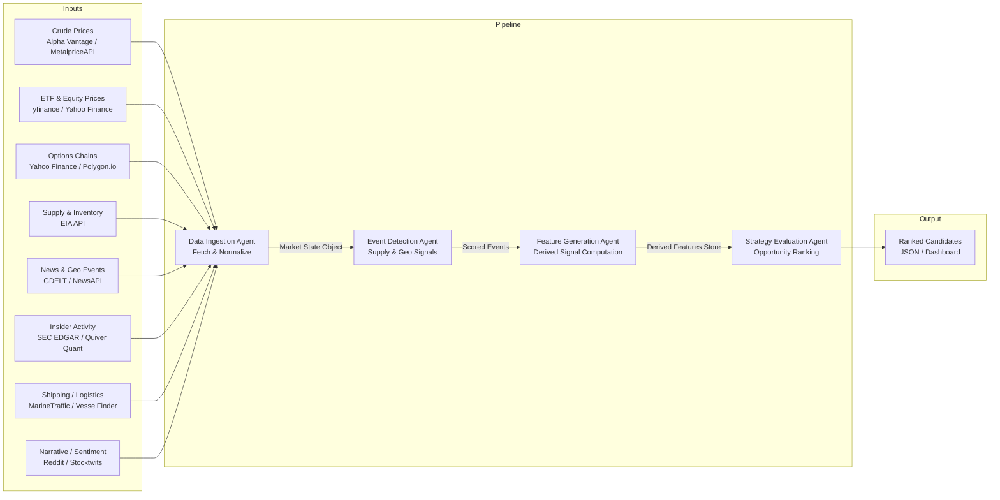
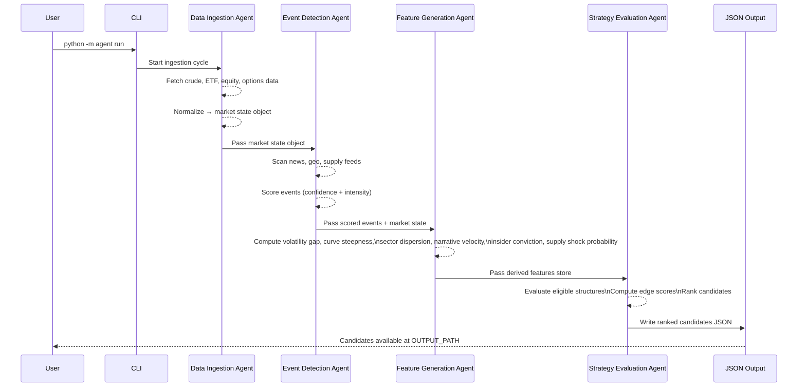

# Energy Options Opportunity Agent — User Guide

> **Version 1.0 • March 2026**
> This guide covers the full pipeline: setup, configuration, execution, output interpretation, and troubleshooting. It assumes familiarity with Python and the command line.

---

## Table of Contents

1. [Overview](#overview)
2. [Prerequisites](#prerequisites)
3. [Setup & Configuration](#setup--configuration)
4. [Running the Pipeline](#running-the-pipeline)
5. [Interpreting the Output](#interpreting-the-output)
6. [Troubleshooting](#troubleshooting)

---

## Overview

The **Energy Options Opportunity Agent** is a modular, autonomous Python pipeline that identifies options trading opportunities driven by oil market instability. It ingests market data, supply signals, news events, and alternative datasets, then surfaces volatility mispricing in oil-related instruments as ranked, explainable candidate strategies.

### Pipeline Architecture

The system is composed of four loosely coupled agents that communicate through a shared **market state object** and a **derived features store**. Data flows strictly in one direction.



### What Each Agent Does

| Agent | Role | Key Outputs |
|---|---|---|
| **Data Ingestion Agent** | Fetch & Normalize | Unified market state object; historical price & options data |
| **Event Detection Agent** | Supply & Geo Signals | Detected events with confidence and intensity scores |
| **Feature Generation Agent** | Derived Signal Computation | Volatility gaps, curve steepness, supply shock probability, narrative velocity, and more |
| **Strategy Evaluation Agent** | Opportunity Ranking | Ranked candidate options strategies with edge scores and signal references |

### In-Scope Instruments & Structures (MVP)

| Category | Instruments |
|---|---|
| Crude Futures | Brent Crude, WTI (`CL=F`) |
| ETFs | USO, XLE |
| Energy Equities | Exxon Mobil (XOM), Chevron (CVX) |

| Options Structure | Enum Value |
|---|---|
| Long Straddle | `long_straddle` |
| Call Spread | `call_spread` |
| Put Spread | `put_spread` |
| Calendar Spread | `calendar_spread` |

> **Advisory only.** The pipeline does not execute trades. All output is informational.

---

## Prerequisites

### System Requirements

| Requirement | Minimum |
|---|---|
| Python | 3.10 or later |
| RAM | 2 GB |
| Disk | 10 GB (for 6–12 months of historical data) |
| OS | Linux, macOS, or Windows (WSL2 recommended on Windows) |
| Deployment target | Local machine, single VM, or container |

### Required Tools

```bash
# Verify Python version
python --version   # must be >= 3.10

# Verify pip
pip --version

# Recommended: use a virtual environment manager
python -m venv --help
```

### API Accounts

Obtain free-tier API keys for the following services before proceeding. All sources are free or low-cost.

| Service | Used By | Sign-up URL | Notes |
|---|---|---|---|
| Alpha Vantage | Crude prices (WTI, Brent) | https://www.alphavantage.co | Free tier; minute-level data |
| MetalpriceAPI | Crude prices (fallback) | https://metalpriceapi.com | Free tier |
| Yahoo Finance / yfinance | ETF, equity, options data | No key required | Accessed via `yfinance` library |
| Polygon.io | Options chains | https://polygon.io | Free tier; daily options data |
| EIA API | Supply & inventory data | https://www.eia.gov/opendata | Free; weekly cadence |
| GDELT | News & geopolitical events | No key required | Free; daily/continuous |
| NewsAPI | News headlines | https://newsapi.org | Free developer tier |
| SEC EDGAR | Insider activity | No key required | Free |
| Quiver Quant | Insider activity (enhanced) | https://www.quiverquant.com | Free/limited tier |
| MarineTraffic | Tanker & shipping data | https://www.marinetraffic.com | Free tier |
| VesselFinder | Tanker & shipping (fallback) | https://www.vesselfinder.com | Free tier |
| Reddit API | Narrative / sentiment | https://www.reddit.com/prefs/apps | Free |
| Stocktwits | Narrative / sentiment | https://api.stocktwits.com | Free |

---

## Setup & Configuration

### 1. Clone the Repository

```bash
git clone https://github.com/your-org/energy-options-agent.git
cd energy-options-agent
```

### 2. Create and Activate a Virtual Environment

```bash
python -m venv .venv

# macOS / Linux
source .venv/bin/activate

# Windows (PowerShell)
.venv\Scripts\Activate.ps1
```

### 3. Install Dependencies

```bash
pip install --upgrade pip
pip install -r requirements.txt
```

### 4. Configure Environment Variables

All sensitive credentials and runtime settings are managed through environment variables. Copy the provided template and populate it with your values.

```bash
cp .env.example .env
```

Open `.env` in your editor and fill in each value:

```bash
# .env
ALPHA_VANTAGE_API_KEY=your_alpha_vantage_key
METALPRICE_API_KEY=your_metalprice_key
POLYGON_API_KEY=your_polygon_key
EIA_API_KEY=your_eia_key
NEWS_API_KEY=your_newsapi_key
QUIVER_QUANT_API_KEY=your_quiverquant_key
MARINE_TRAFFIC_API_KEY=your_marinetraffic_key
REDDIT_CLIENT_ID=your_reddit_client_id
REDDIT_CLIENT_SECRET=your_reddit_client_secret
REDDIT_USER_AGENT=energy-options-agent/1.0

# Storage
HISTORICAL_DATA_PATH=./data/historical
OUTPUT_PATH=./data/output

# Pipeline cadence (minutes)
MARKET_DATA_REFRESH_INTERVAL=5
SLOW_FEED_REFRESH_INTERVAL=1440

# Data retention (days)
HISTORICAL_RETENTION_DAYS=365

# Logging
LOG_LEVEL=INFO
```

#### Full Environment Variable Reference

| Variable | Required | Default | Description |
|---|---|---|---|
| `ALPHA_VANTAGE_API_KEY` | Yes | — | API key for Alpha Vantage crude price feed |
| `METALPRICE_API_KEY` | No | — | Fallback API key for crude prices via MetalpriceAPI |
| `POLYGON_API_KEY` | No | — | API key for Polygon.io options chain data |
| `EIA_API_KEY` | Yes | — | API key for EIA supply and inventory data |
| `NEWS_API_KEY` | Yes | — | API key for NewsAPI headline feed |
| `QUIVER_QUANT_API_KEY` | No | — | API key for Quiver Quant insider activity (enhanced) |
| `MARINE_TRAFFIC_API_KEY` | No | — | API key for MarineTraffic shipping data |
| `REDDIT_CLIENT_ID` | No | — | Reddit app client ID for sentiment ingestion |
| `REDDIT_CLIENT_SECRET` | No | — | Reddit app client secret |
| `REDDIT_USER_AGENT` | No | `energy-options-agent/1.0` | Reddit API user-agent string |
| `HISTORICAL_DATA_PATH` | No | `./data/historical` | Local path for raw and derived historical data |
| `OUTPUT_PATH` | No | `./data/output` | Directory where ranked candidate JSON files are written |
| `MARKET_DATA_REFRESH_INTERVAL` | No | `5` | Refresh cadence for market data feeds, in minutes |
| `SLOW_FEED_REFRESH_INTERVAL` | No | `1440` | Refresh cadence for slow feeds (EIA, EDGAR), in minutes |
| `HISTORICAL_RETENTION_DAYS` | No | `365` | Number of days of historical data to retain on disk |
| `LOG_LEVEL` | No | `INFO` | Logging verbosity: `DEBUG`, `INFO`, `WARNING`, `ERROR` |

> **Resilience note:** The pipeline is designed to tolerate delayed or missing data from any individual source without halting. Optional keys (marked `No` above) can be omitted; the corresponding data layer will be skipped and a warning will be logged.

### 5. Initialise the Data Store

This step creates the required directory structure and seeds the historical database for the first run.

```bash
python -m agent init
```

Expected output:

```
[INFO] Creating data directories at ./data/historical
[INFO] Creating output directory at ./data/output
[INFO] Data store initialised successfully.
```

---

## Running the Pipeline

### Pipeline Execution Flow



### Single Pipeline Run

Execute one complete pass through all four agents and write results to the output directory:

```bash
python -m agent run
```

To write output to a specific file:

```bash
python -m agent run --output ./results/candidates_$(date +%Y%m%d_%H%M%S).json
```

### Continuous Mode

Run the pipeline on a recurring schedule using the configured refresh interval:

```bash
python -m agent run --continuous
```

The pipeline will:
- Refresh market data feeds every `MARKET_DATA_REFRESH_INTERVAL` minutes.
- Refresh slow feeds (EIA, EDGAR) every `SLOW_FEED_REFRESH_INTERVAL` minutes.
- Append new candidate sets to the output directory on each cycle.

To override the interval at runtime:

```bash
python -m agent run --continuous --interval 10   # refresh every 10 minutes
```

### Running Individual Agents

Each agent can be run independently for testing or incremental integration:

```bash
# Run only the Data Ingestion Agent
python -m agent run --agent ingestion

# Run only the Event Detection Agent (requires prior ingestion output)
python -m agent run --agent events

# Run only the Feature Generation Agent
python -m agent run --agent features

# Run only the Strategy Evaluation Agent
python -m agent run --agent strategy
```

### Phased MVP Activation

Development is structured in four phases. Activate only the phases you have configured data sources for:

| Phase | Flag | Description |
|---|---|---|
| Phase 1 | `--phase 1` | Core market signals: WTI/Brent, USO/XLE, options surface, straddles & spreads |
| Phase 2 | `--phase 2` | Adds EIA supply data and event detection via GDELT/NewsAPI |
| Phase 3 | `--phase 3` | Adds insider activity, narrative velocity, and shipping data |
| Phase 4 | `--phase 4` | High-fidelity enhancements (see [Future Considerations](#future-considerations)) |

```bash
# Run Phase 1 only (minimum viable pipeline)
python -m agent run --phase 1

# Run Phases 1 and 2
python -m agent run --phase 2
```

> Each phase is additive. Running `--phase 3` includes all signals from Phases 1 and 2.

### Useful CLI Flags

| Flag | Description |
|---|---|
| `--output <path>` | Override the default output file path |
| `--continuous` | Run on a recurring schedule |
| `--interval <minutes>` | Override `MARKET_DATA_REFRESH_INTERVAL` for this session |
| `--phase <1–4>` | Restrict pipeline to a specific MVP phase |
| `--agent <name>` | Run a single named agent (`ingestion`, `events`, `features`, `strategy`) |
| `--log-level <level>` | Override `LOG_LEVEL` for this session |
| `--dry-run` | Execute pipeline logic but suppress file writes |

---

## Interpreting the Output

### Output Location

By default, ranked candidates are written to:

```
./data/output/candidates_<ISO8601-timestamp>.json
```

### Output Schema

Each file contains a JSON array of candidate objects. Every candidate corresponds to one evaluated options structure on one instrument.

| Field | Type | Description |
|---|---|---|
| `instrument` | `string` | Target instrument (e.g., `USO`, `XLE`, `CL=F`) |
| `structure` | `enum` | Options structure: `long_straddle`, `call_spread`, `put_spread`, `calendar_spread` |
| `expiration` | `integer` | Target expiration in calendar days from the evaluation date |
| `edge_score` | `float [0.0–1.0]` | Composite opportunity score; higher = stronger signal confluence |
| `signals` | `object` | Map of contributing signals and their observed states |
| `generated_at` | `ISO 8601 datetime` | UTC timestamp of candidate generation |

### Example Output

```json
[
  {
    "instrument": "USO",
    "structure": "long_straddle",
    "expiration": 30,
    "edge_score": 0.47,
    "signals": {
      "tanker_disruption_index": "high",
      "volatility_gap": "positive",
      "narrative_velocity": "rising"
    },
    "generated_at": "2026-03-15T14:32:00Z"
  },
  {
    "instrument": "XOM",
    "structure": "call_spread",
    "expiration": 21,
    "edge_score": 0.31,
    "signals": {
      "volatility_gap": "positive",
      "supply_shock_probability": "elevated",
      "insider_conviction":