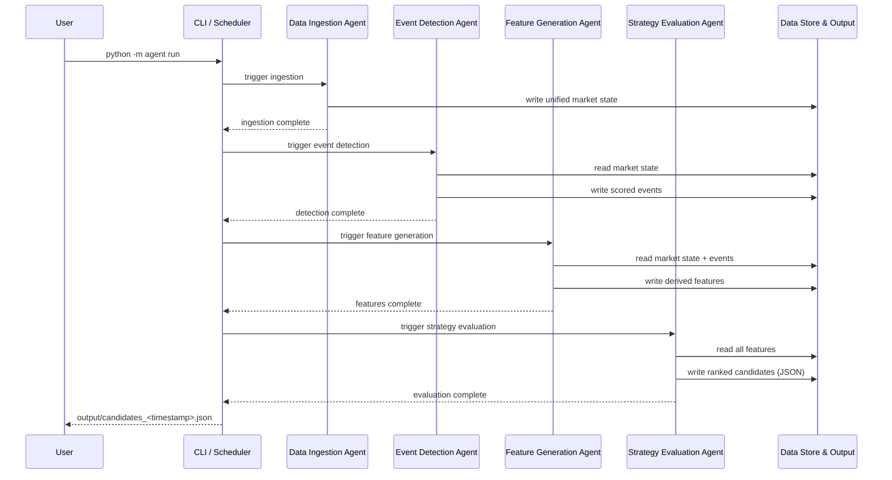

# Energy Options Opportunity Agent — User Guide

> **Version 1.0 · March 2026**
> Advisory-only system. No automated trade execution is performed.

---

## Table of Contents

1. [Overview](#overview)
2. [Prerequisites](#prerequisites)
3. [Setup & Configuration](#setup--configuration)
4. [Running the Pipeline](#running-the-pipeline)
5. [Interpreting the Output](#interpreting-the-output)
6. [Troubleshooting](#troubleshooting)

---

## Overview

The **Energy Options Opportunity Agent** is a modular Python pipeline that identifies options trading opportunities driven by oil market instability. It ingests market data, supply signals, geopolitical news, and alternative datasets, then produces a ranked list of candidate options strategies with full signal explainability.

### What the pipeline does

```mermaid
flowchart LR
    subgraph Inputs
        A1[Crude Prices\nAlpha Vantage / MetalpriceAPI]
        A2[ETF & Equity Prices\nYahoo Finance / yfinance]
        A3[Options Chains\nYahoo Finance / Polygon.io]
        A4[Supply & Inventory\nEIA API]
        A5[News & Geo Events\nGDELT / NewsAPI]
        A6[Insider Activity\nSEC EDGAR / Quiver Quant]
        A7[Shipping & Logistics\nMarineTraffic / VesselFinder]
        A8[Narrative & Sentiment\nReddit / Stocktwits]
    end

    subgraph Pipeline["Four-Agent Pipeline"]
        direction TB
        B[Data Ingestion Agent\nFetch & Normalize]
        C[Event Detection Agent\nSupply & Geo Signals]
        D[Feature Generation Agent\nDerived Signal Computation]
        E[Strategy Evaluation Agent\nOpportunity Ranking]
    end

    subgraph Output
        F[Ranked Candidate JSON\nedge_score · signals · expiration]
    end

    Inputs --> B
    B -->|Unified Market State| C
    C -->|Scored Events| D
    D -->|Derived Features| E
    E --> F
```



### Agent responsibilities at a glance

| Agent | Role | Key outputs |
|---|---|---|
| **Data Ingestion** | Fetch & Normalize | Unified market state object; historical store |
| **Event Detection** | Supply & Geo Signals | Per-event confidence and intensity scores |
| **Feature Generation** | Derived Signal Computation | Volatility gaps, curve steepness, supply shock probability, narrative velocity, and more |
| **Strategy Evaluation** | Opportunity Ranking | Ranked candidates with edge scores and signal references |

### In-scope instruments (MVP)

| Category | Instruments |
|---|---|
| Crude futures | Brent Crude, WTI (`CL=F`) |
| ETFs | USO, XLE |
| Energy equities | Exxon Mobil (XOM), Chevron (CVX) |

### In-scope option structures (MVP)

`long_straddle` · `call_spread` · `put_spread` · `calendar_spread`

> **Out of scope for MVP:** exotic/multi-legged strategies, regional refined product pricing (OPIS), and automated trade execution.

---

## Prerequisites

### System requirements

| Requirement | Minimum |
|---|---|
| Python | 3.10 or later |
| Operating system | Linux, macOS, or Windows (WSL recommended) |
| RAM | 2 GB |
| Disk | 5 GB free (for 6–12 months of historical data) |
| Deployment target | Local machine, single VM, or container |

### Required tools

```bash
# Confirm Python version
python --version   # must be >= 3.10

# Confirm pip is available
pip --version

# (Optional) Confirm Docker if running containerised
docker --version
```

### External API accounts

Register for the following free-tier services before configuring the pipeline. All are free or low-cost.

| Service | Used for | Sign-up URL | Cost |
|---|---|---|---|
| Alpha Vantage | WTI / Brent crude prices | https://www.alphavantage.co | Free |
| Yahoo Finance / yfinance | ETF & equity prices, options chains | No key required (yfinance) | Free |
| Polygon.io | Options chain supplement | https://polygon.io | Free tier |
| EIA API | Supply & inventory data | https://www.eia.gov/opendata | Free |
| GDELT | News & geopolitical events | No key required | Free |
| NewsAPI | News headlines | https://newsapi.org | Free tier |
| SEC EDGAR | Insider activity | No key required | Free |
| Quiver Quant | Insider activity supplement | https://www.quiverquant.com | Free/Limited |
| MarineTraffic | Tanker shipping data | https://www.marinetraffic.com | Free tier |
| Reddit API | Narrative / sentiment | https://www.reddit.com/prefs/apps | Free |
| Stocktwits API | Narrative / sentiment | https://api.stocktwits.com | Free |

> **Note:** yfinance and GDELT require no API key. You may omit keys for optional sources; the pipeline is designed to tolerate missing feeds without failure.

---

## Setup & Configuration

### 1. Clone the repository

```bash
git clone https://github.com/your-org/energy-options-agent.git
cd energy-options-agent
```

### 2. Create and activate a virtual environment

```bash
python -m venv .venv

# Linux / macOS
source .venv/bin/activate

# Windows (PowerShell)
.\.venv\Scripts\Activate.ps1
```

### 3. Install dependencies

```bash
pip install -r requirements.txt
```

### 4. Configure environment variables

Copy the provided template and populate your API keys:

```bash
cp .env.example .env
```

Open `.env` in your editor and fill in the values described in the table below.

#### Environment variable reference

| Variable | Required | Default | Description |
|---|---|---|---|
| `ALPHA_VANTAGE_API_KEY` | Yes | — | API key for crude price feed (WTI, Brent) |
| `POLYGON_API_KEY` | Recommended | — | API key for supplemental options chain data |
| `EIA_API_KEY` | Yes (Phase 2+) | — | API key for EIA supply & inventory feed |
| `NEWS_API_KEY` | Recommended | — | API key for NewsAPI headline feed |
| `QUIVER_QUANT_API_KEY` | Optional | — | API key for insider activity data |
| `MARINETRAFFIC_API_KEY` | Optional | — | API key for tanker/shipping data |
| `REDDIT_CLIENT_ID` | Optional | — | Reddit OAuth client ID for sentiment feed |
| `REDDIT_CLIENT_SECRET` | Optional | — | Reddit OAuth client secret |
| `REDDIT_USER_AGENT` | Optional | `energy-agent/1.0` | Reddit API user-agent string |
| `STOCKTWITS_API_KEY` | Optional | — | Stocktwits API key for sentiment feed |
| `DATA_DIR` | No | `./data` | Local path for raw and derived data storage |
| `OUTPUT_DIR` | No | `./output` | Directory where JSON candidate files are written |
| `HISTORY_DAYS` | No | `180` | Days of historical data to retain (180–365 recommended) |
| `MARKET_DATA_INTERVAL_MINUTES` | No | `5` | Polling cadence for minute-level market data feeds |
| `LOG_LEVEL` | No | `INFO` | Logging verbosity: `DEBUG`, `INFO`, `WARNING`, `ERROR` |

#### Example `.env`

```dotenv
# --- Required ---
ALPHA_VANTAGE_API_KEY=YOUR_ALPHA_VANTAGE_KEY
EIA_API_KEY=YOUR_EIA_KEY

# --- Recommended ---
POLYGON_API_KEY=YOUR_POLYGON_KEY
NEWS_API_KEY=YOUR_NEWS_API_KEY

# --- Optional alternative-data sources ---
QUIVER_QUANT_API_KEY=
MARINETRAFFIC_API_KEY=
REDDIT_CLIENT_ID=
REDDIT_CLIENT_SECRET=
REDDIT_USER_AGENT=energy-agent/1.0
STOCKTWITS_API_KEY=

# --- Storage & runtime ---
DATA_DIR=./data
OUTPUT_DIR=./output
HISTORY_DAYS=180
MARKET_DATA_INTERVAL_MINUTES=5
LOG_LEVEL=INFO
```

### 5. Initialise the data store

Run the one-time initialisation command to create the local data directories and seed the historical data store:

```bash
python -m agent init
```

Expected output:

```
[INFO] Creating data directory: ./data
[INFO] Creating output directory: ./output
[INFO] Seeding historical store — fetching last 180 days of market data...
[INFO] Initialisation complete.
```

> **Tip:** Re-running `python -m agent init` is safe; it will not overwrite existing historical data.

---

## Running the Pipeline

### Pipeline execution flow



### Run modes

#### Full pipeline (recommended)

Executes all four agents in sequence and writes ranked candidates to the output directory:

```bash
python -m agent run
```

#### Run a single agent

You can execute any agent in isolation for debugging or incremental updates:

```bash
# Data Ingestion only
python -m agent run --agent ingestion

# Event Detection only
python -m agent run --agent events

# Feature Generation only
python -m agent run --agent features

# Strategy Evaluation only
python -m agent run --agent strategy
```

#### Scheduled / continuous mode

To run the pipeline on the configured polling cadence, use the `--loop` flag:

```bash
python -m agent run --loop
```

The loop honours `MARKET_DATA_INTERVAL_MINUTES` for market-data-dependent agents and runs slower feeds (EIA, EDGAR) on their native daily/weekly schedules automatically.

#### Docker (optional)

```bash
# Build the image
docker build -t energy-options-agent:latest .

# Run the full pipeline once
docker run --env-file .env energy-options-agent:latest

# Run in continuous loop mode
docker run --env-file .env energy-options-agent:latest python -m agent run --loop
```

### Common CLI flags

| Flag | Description |
|---|---|
| `--agent <name>` | Run only the named agent (`ingestion`, `events`, `features`, `strategy`) |
| `--loop` | Run continuously on the configured cadence |
| `--output-dir <path>` | Override the `OUTPUT_DIR` environment variable for this run |
| `--log-level <level>` | Override `LOG_LEVEL` for this run |
| `--dry-run` | Execute the pipeline but do not write output files |

---

## Interpreting the Output

### Output file location

After each full pipeline run, a timestamped JSON file is written to `OUTPUT_DIR`:

```
output/
└── candidates_2026-03-15T14:32:00Z.json
```

### Output schema

Each file contains an array of candidate objects. The fields for each candidate are:

| Field | Type | Description |
|---|---|---|
| `instrument` | string | Target instrument, e.g. `USO`, `XLE`, `CL=F` |
| `structure` | enum | One of `long_straddle`, `call_spread`, `put_spread`, `calendar_spread` |
| `expiration` | integer (days) | Calendar days from evaluation date to target expiration |
| `edge_score` | float [0.0–1.0] | Composite opportunity score; higher = stronger signal confluence |
| `signals` | object | Map of contributing signals and their current state |
| `generated_at` | ISO 8601 datetime | UTC timestamp of candidate generation |

### Example candidate

```json
{
  "instrument": "USO",
  "structure": "long_straddle",
  "expiration": 30,
  "edge_score": 0.47,
  "signals": {
    "tanker_disruption_index": "high",
    "volatility_gap": "positive",
    "narrative_velocity": "rising"
  },
  "generated_at": "2026-03-15T14:32:00Z"
}
```

### Understanding the edge score

The `edge_score` is a composite float between `0.0` and `1.0` representing the confluence of active signals for a given candidate. It is computed by the Strategy Evaluation Agent from the derived features produced by the Feature Generation Agent.

| Score range | Interpretation |
|---|---|
| `0.70 – 1.00` | Strong signal confluence — high-priority candidate |
| `0.40 – 0.69` | Moderate confluence — worth monitoring |
| `0.00 – 0.39` | Weak or mixed signals — low priority |

> **Important:** The edge score is a relative ranking aid, not a guarantee of profitability. The system is advisory only; no trades are executed automatically.

### Understanding the signals map

The `signals` object lists every derived feature that contributed to the candidate's ranking. Use these references to audit and explain any recommendation.

| Signal key | What it measures |
|---|---|
| `volatility_gap` | Divergence between realised and implied volatility |
| `futures_curve_steepness` | Contango / backwardation degree in the crude futures curve |
| `sector_dispersion` | Spread in returns across energy sub-sectors |
| `insider_conviction_score` | Aggregated signal from recent executive insider trades |
| `narrative_velocity` | Rate of acceleration in energy-related headlines and social posts |
| `supply_shock_probability` | Estimated probability of a near-term supply disruption |
| `tanker_disruption_index` | Aggregated signal from shipping / tanker flow anomalies |

### Downstream consumption

The JSON output is compatible with any JSON-capable dashboard or tool. To load candidates into **thinkorswim** or a custom visualisation:

```python
import json

with open("output/candidates_2026-03-15T14:32:00Z.json") as f:
    candidates = json.load(f)

# Sort by edge score descending
ranked = sorted(candidates, key=lambda c: c["edge_score"], reverse=True)

for c in ranked:
    print(f"{c['instrument']:6s} | {c['structure']:16s} | exp {c['expiration']:3d}d | score {c['edge_score']:.2f}")
```

---

## Troubleshooting

### General diagnostic steps

```bash
# Run the pipeline with verbose logging
python -m agent run --log-level DEBUG

# Validate that all required environment variables are set
python -m agent check-config
```

### Common issues

| Symptom | Likely cause | Resolution |
|---|---|---|
| `KeyError: 'ALPHA_VANTAGE_API_KEY'` | Missing required env variable | Confirm the key is set in `.env` and the file is in the working directory |
| `FileNotFoundError: ./data` | `init` was not run | Run `python -m agent init` before the first pipeline execution |
| Pipeline exits with no candidates written | All signals below ranking threshold or all feeds failed | Check logs for per-agent errors; run individual agents with `--log-level DEBUG` |
| Stale or missing options chain data | Polygon.io free-tier rate limit or