# Energy Options Opportunity Agent — User Guide

> **Version 1.0 • March 2026**
> Advisory only. No automated trade execution is performed by this system.

---

## Table of Contents

1. [Overview](#overview)
2. [Prerequisites](#prerequisites)
3. [Setup & Configuration](#setup--configuration)
4. [Running the Pipeline](#running-the-pipeline)
5. [Interpreting the Output](#interpreting-the-output)
6. [Troubleshooting](#troubleshooting)

---

## Overview

The **Energy Options Opportunity Agent** is a modular, four-agent Python pipeline that identifies options trading opportunities driven by oil market instability. It ingests market data, supply signals, news events, and alternative datasets, then surfaces volatility mispricing in oil-related instruments as a ranked list of candidate options strategies.

### What the pipeline does

| Stage | Agent | What happens |
|---|---|---|
| 1 | **Data Ingestion Agent** | Fetches and normalises crude prices, ETF/equity data, and options chains into a unified market state object |
| 2 | **Event Detection Agent** | Monitors news and geopolitical feeds; scores supply disruptions, refinery outages, and tanker chokepoints |
| 3 | **Feature Generation Agent** | Derives volatility gaps, futures curve steepness, sector dispersion, insider conviction, narrative velocity, and supply shock probability |
| 4 | **Strategy Evaluation Agent** | Evaluates eligible option structures and emits ranked candidates with an `edge_score` and contributing signals |

### Pipeline data flow

```mermaid
flowchart LR
    subgraph Sources["External Data Sources"]
        A1[Alpha Vantage / MetalpriceAPI\nCrude Prices]
        A2[yfinance / Yahoo Finance\nETF & Equity Prices]
        A3[Yahoo Finance / Polygon.io\nOptions Chains]
        A4[EIA API\nInventory & Utilisation]
        A5[GDELT / NewsAPI\nNews & Geo Events]
        A6[SEC EDGAR / Quiver Quant\nInsider Activity]
        A7[MarineTraffic / VesselFinder\nShipping & Logistics]
        A8[Reddit / Stocktwits\nNarrative Sentiment]
    end

    subgraph Pipeline["Agent Pipeline"]
        B1["① Data Ingestion Agent\n(fetch & normalise)"]
        B2["② Event Detection Agent\n(supply & geo signals)"]
        B3["③ Feature Generation Agent\n(derived signals)"]
        B4["④ Strategy Evaluation Agent\n(opportunity ranking)"]
    end

    subgraph Output["Output"]
        C1[market_state object]
        C2[features store]
        C3[ranked_opportunities.json]
    end

    Sources --> B1
    B1 --> C1
    C1 --> B2
    B2 --> B3
    B3 --> C2
    C2 --> B4
    B4 --> C3
```



### In-scope instruments (MVP)

| Type | Instruments |
|---|---|
| Crude futures | Brent Crude, WTI (`CL=F`) |
| ETFs | USO, XLE |
| Energy equities | Exxon Mobil (XOM), Chevron (CVX) |

### In-scope option structures (MVP)

`long_straddle` · `call_spread` · `put_spread` · `calendar_spread`

> **Out of scope for MVP:** exotic/multi-legged strategies, regional refined product pricing (OPIS), automated trade execution.

---

## Prerequisites

### System requirements

| Requirement | Minimum |
|---|---|
| Python | 3.10 or later |
| Operating system | Linux, macOS, or Windows (WSL recommended) |
| RAM | 2 GB |
| Disk | 10 GB free (grows with 6–12 months of historical data) |
| Network | Outbound HTTPS to data source APIs |

### Required Python knowledge

You should be comfortable with:
- Installing packages via `pip` and managing virtual environments
- Editing `.env` files
- Running scripts from the command line

### API accounts

Obtain free-tier credentials for each data source before configuring the pipeline.

| Source | Sign-up URL | Notes |
|---|---|---|
| Alpha Vantage | https://www.alphavantage.co/support/#api-key | Free tier; rate-limited |
| Polygon.io | https://polygon.io | Free tier for options data |
| EIA Open Data | https://www.eia.gov/opendata/ | No account required; register for higher rate limits |
| NewsAPI | https://newsapi.org | Free developer tier |
| GDELT | https://www.gdeltproject.org | No key required |
| SEC EDGAR | https://www.sec.gov/developer | No key required |
| Quiver Quant | https://www.quiverquant.com | Free tier available |
| MarineTraffic | https://www.marinetraffic.com/en/ais-api-services | Free tier available |
| Reddit (PRAW) | https://www.reddit.com/wiki/api | Register an app to get credentials |
| Stocktwits | https://api.stocktwits.com/developers | Free public stream |

---

## Setup & Configuration

### 1. Clone the repository

```bash
git clone https://github.com/your-org/energy-options-agent.git
cd energy-options-agent
```

### 2. Create and activate a virtual environment

```bash
python -m venv .venv

# macOS / Linux
source .venv/bin/activate

# Windows (PowerShell)
.\.venv\Scripts\Activate.ps1
```

### 3. Install dependencies

```bash
pip install --upgrade pip
pip install -r requirements.txt
```

### 4. Configure environment variables

Copy the provided template and populate it with your credentials:

```bash
cp .env.example .env
```

Open `.env` in your editor and set each value described in the table below.

#### Environment variable reference

| Variable | Required | Default | Description |
|---|---|---|---|
| `ALPHA_VANTAGE_API_KEY` | Yes | — | API key for crude spot/futures prices (WTI, Brent) |
| `METALPRICE_API_KEY` | No | — | Alternative crude price feed; used as fallback if Alpha Vantage is unavailable |
| `POLYGON_API_KEY` | Yes | — | Options chain data (strike, expiry, IV, volume) |
| `EIA_API_KEY` | Yes | — | EIA inventory and refinery utilisation data |
| `NEWS_API_KEY` | Yes | — | NewsAPI key for energy disruption headlines |
| `QUIVER_QUANT_API_KEY` | No | — | Insider trade data; EDGAR public feed used as fallback |
| `MARINETRAFFIC_API_KEY` | No | — | Tanker flow data; VesselFinder used as fallback |
| `REDDIT_CLIENT_ID` | No | — | Reddit PRAW client ID for narrative/sentiment ingestion |
| `REDDIT_CLIENT_SECRET` | No | — | Reddit PRAW client secret |
| `REDDIT_USER_AGENT` | No | `energy-agent/1.0` | PRAW user agent string |
| `DATA_DIR` | Yes | `./data` | Root path for persisted raw and derived data |
| `OUTPUT_DIR` | Yes | `./output` | Directory where `ranked_opportunities.json` is written |
| `LOG_LEVEL` | No | `INFO` | Python logging level (`DEBUG`, `INFO`, `WARNING`, `ERROR`) |
| `MARKET_DATA_REFRESH_MINUTES` | No | `5` | Cadence for minute-level market data refresh |
| `SLOW_FEED_REFRESH_HOURS` | No | `24` | Cadence for daily/weekly feeds (EIA, EDGAR) |
| `HISTORY_RETENTION_DAYS` | No | `365` | Days of raw and derived data to retain for backtesting |

> **Tip:** Variables marked **No** are optional. The pipeline gracefully tolerates missing or delayed feeds without failure — missing data sources are logged as warnings and the corresponding signals are omitted from that run's edge score computation.

### 5. Verify configuration

```bash
python -m agent.cli check-config
```

Expected output:

```
[OK] ALPHA_VANTAGE_API_KEY  set
[OK] POLYGON_API_KEY        set
[OK] EIA_API_KEY            set
[OK] NEWS_API_KEY           set
[WARN] QUIVER_QUANT_API_KEY not set — insider signal layer disabled
[WARN] MARINETRAFFIC_API_KEY not set — shipping signal layer disabled
[OK] DATA_DIR               ./data  (exists)
[OK] OUTPUT_DIR             ./output  (exists)
Configuration check complete. 2 optional sources disabled.
```

A non-zero exit code indicates a required variable is missing.

---

## Running the Pipeline

### Single run (all agents, sequential)

Execute the full four-agent pipeline once and write output to `OUTPUT_DIR`:

```bash
python -m agent.cli run
```

This runs each agent in order — ingestion → event detection → feature generation → strategy evaluation — and exits when output has been written.

### Run a specific MVP phase

The pipeline supports phased execution aligned with the MVP roadmap:

```bash
# Phase 1: Core market signals and options surface only
python -m agent.cli run --phase 1

# Phase 2: Adds EIA supply/event layer
python -m agent.cli run --phase 2

# Phase 3: Adds alternative signals (insider, narrative, shipping)
python -m agent.cli run --phase 3
```

| Phase | Label | Agents active | Key additions |
|---|---|---|---|
| 1 | Core Market Signals & Options | Ingestion, Strategy Evaluation | WTI/Brent, USO/XLE prices, IV surface, straddle/spread ranking |
| 2 | Supply & Event Augmentation | + Event Detection | EIA inventory, refinery utilisation, GDELT/NewsAPI scoring |
| 3 | Alternative / Contextual Signals | + Feature Generation (full) | EDGAR insider trades, Reddit/Stocktwits velocity, tanker flows |
| 4 | High-Fidelity Enhancements | All agents | Deferred — see [Future Considerations](#future-considerations) |

### Continuous / scheduled mode

Run the pipeline on a repeating cadence (respects `MARKET_DATA_REFRESH_MINUTES`):

```bash
python -m agent.cli run --watch
```

The `--watch` flag keeps the process alive, re-running ingestion and downstream agents at the configured refresh interval. Use a process supervisor (e.g., `systemd`, `supervisord`, or Docker restart policy) for production deployments.

### Run a single agent in isolation

Each agent can be invoked independently for debugging or incremental development:

```bash
# Data Ingestion only — writes market state to DATA_DIR
python -m agent.cli run --agent ingestion

# Event Detection only — reads existing market state, writes events
python -m agent.cli run --agent event-detection

# Feature Generation only — reads events, writes features store
python -m agent.cli run --agent feature-generation

# Strategy Evaluation only — reads features, writes ranked output
python -m agent.cli run --agent strategy-evaluation
```

> **Note:** Running agents in isolation assumes that the upstream data files already exist in `DATA_DIR`. Run `ingestion` at least once before running downstream agents independently.

### Useful CLI flags

| Flag | Description |
|---|---|
| `--phase N` | Restrict pipeline to MVP phase N (1–3) |
| `--watch` | Continuous mode; re-runs at configured cadence |
| `--agent <name>` | Run a single named agent only |
| `--output-file <path>` | Override the default output file path |
| `--log-level DEBUG` | Override `LOG_LEVEL` for this run |
| `--dry-run` | Validate configuration and data availability without writing output |

---

## Interpreting the Output

### Output file location

By default, each pipeline run writes results to:

```
./output/ranked_opportunities.json
```

The path can be overridden with `--output-file` or the `OUTPUT_DIR` environment variable.

### Output schema

Each element in the JSON array represents one candidate options strategy:

| Field | Type | Description |
|---|---|---|
| `instrument` | string | Target instrument, e.g. `USO`, `XLE`, `CL=F` |
| `structure` | enum string | Options structure: `long_straddle` \| `call_spread` \| `put_spread` \| `calendar_spread` |
| `expiration` | integer (days) | Calendar days from evaluation date to target expiration |
| `edge_score` | float [0.0–1.0] | Composite opportunity score; higher = stronger signal confluence |
| `signals` | object | Map of contributing signals and their qualitative values |
| `generated_at` | ISO 8601 datetime | UTC timestamp of candidate generation |

### Example output record

```json
{
  "instrument": "USO",
  "structure": "long_straddle",
  "expiration": 30,
  "edge_score": 0.47,
  "signals": {
    "tanker_disruption_index": "high",
    "volatility_gap": "positive",
    "narrative_velocity": "rising"
  },
  "generated_at": "2026-03-15T14:32:00Z"
}
```

### Reading the edge score

The `edge_score` is a composite float between 0.0 and 1.0 representing the confluence of active signals for that candidate. Use the following ranges as a starting guide:

| `edge_score` range | Suggested interpretation |
|---|---|
| 0.70 – 1.00 | Strong signal confluence; high-priority candidate for review |
| 0.40 – 0.69 | Moderate confluence; worth monitoring |
| 0.00 – 0.39 | Weak or noisy signal; low priority |

> **Important:** The edge score is an advisory ranking metric, not a guarantee of profitability. Always apply your own risk management and due diligence before entering any position.

### Reading the signals map

Each key in the `signals` object corresponds to a derived feature computed by the Feature Generation Agent. Common signal keys and their meanings:

| Signal key | Source agent | Meaning |
|---|---|---|
| `volatility_gap` | Feature Generation | Relationship between realised and implied volatility; `positive` means IV is elevated relative to realised vol |
| `futures_curve_steepness` | Feature Generation | Contango or backwardation strength in the crude futures curve |
| `sector_dispersion` | Feature Generation | Divergence between energy equities vs. broader sector |
| `insider_conviction_score` | Feature Generation | Aggregated signal from recent SEC EDGAR / Quiver Quant insider trades |
| `narrative_velocity` | Feature Generation | Rate of acceleration in relevant headlines and social sentiment |
| `supply_shock_probability` | Feature Generation | Estimated probability of a near-term supply disruption |
| `tanker_disruption_index` | Event Detection | Aggregated signal from shipping data indicating chokepoint stress |
| `refinery_utilisation` | Event Detection | EIA-sourced refinery utilisation rate signal |
| `geopolitical_event_score` | Event Detection | Confidence-weighted intensity of detected geopolitical events |

### Consuming the output in thinkorswim or other tools

The JSON output is compatible with any tool that can parse a standard JSON array. To load it into thinkorswim's thinkScript environment or a spreadsheet:

```bash
# Pretty-print output for inspection
python -m agent.cli show-output

# Convert to CSV for spreadsheet import
python -m agent.cli export --format csv --output ./output/ranked_opportunities.csv
```

---

## Troubleshooting

### Pipeline fails to start

**Symptom:** `python -m agent.cli run` exits immediately with a non-zero code.

**Resolution:**

```bash
# Check configuration
python -m agent.cli check-config

# Verify your virtual environment is active
which python   # should point to .venv/bin/python

# Check dependencies are installed
pip check
```

---

### Missing or stale data warnings

**Symptom:** Log messages such as:

```
WARNING  ingestion: Alpha Vantage response empty for CL=F — retrying (1/3)
WARNING  ingestion: EIA feed returned 0 records — using cached data