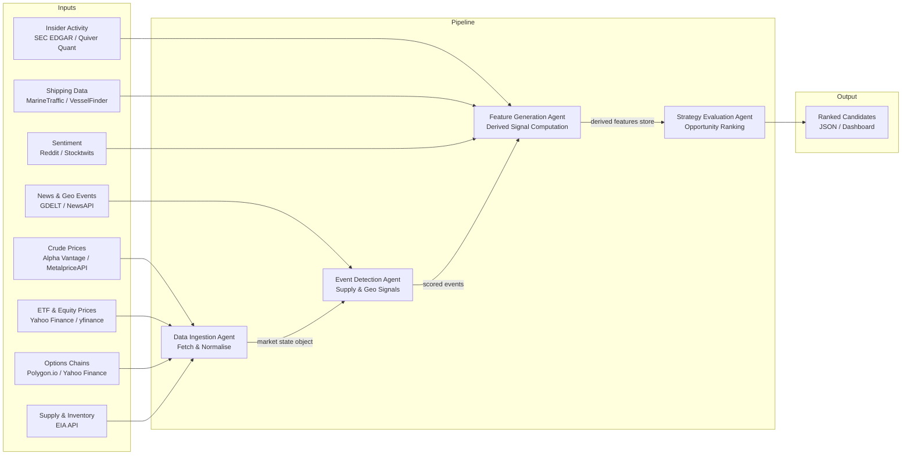

# Energy Options Opportunity Agent — User Guide

> **Version 1.0 · March 2026**
> This guide covers the full pipeline: setup, configuration, execution, output interpretation, and troubleshooting. It assumes you are comfortable with Python and command-line tools but are new to this project.

---

## Table of Contents

1. [Overview](#overview)
2. [Prerequisites](#prerequisites)
3. [Setup & Configuration](#setup--configuration)
4. [Running the Pipeline](#running-the-pipeline)
5. [Interpreting the Output](#interpreting-the-output)
6. [Troubleshooting](#troubleshooting)

---

## Overview

The **Energy Options Opportunity Agent** is a modular, four-agent Python pipeline that detects options trading opportunities driven by oil market instability. It ingests market data, supply signals, geopolitical news, and alternative datasets, then surfaces volatility mispricing in oil-related instruments and ranks candidate strategies by a computed **edge score**.

### What the pipeline does

| Stage | Agent | What happens |
|---|---|---|
| 1 | **Data Ingestion Agent** | Fetches and normalises crude prices, ETF/equity data, and options chains into a unified market state object |
| 2 | **Event Detection Agent** | Monitors news and geopolitical feeds; scores supply disruptions, refinery outages, and tanker chokepoints |
| 3 | **Feature Generation Agent** | Computes volatility gaps, futures curve steepness, sector dispersion, insider conviction, narrative velocity, and supply shock probability |
| 4 | **Strategy Evaluation Agent** | Ranks candidate option structures (long straddles, call/put spreads, calendar spreads) by edge score with full signal attribution |

### Pipeline data flow



### In-scope instruments and structures

**Instruments:** Brent Crude, WTI (`CL=F`), USO, XLE, XOM, CVX

**Option structures (MVP):** `long_straddle` · `call_spread` · `put_spread` · `calendar_spread`

> **Advisory only.** The pipeline produces ranked recommendations. Automated trade execution is explicitly out of scope for the MVP.

---

## Prerequisites

### System requirements

| Requirement | Minimum |
|---|---|
| Operating system | Linux, macOS, or Windows (WSL2 recommended) |
| Python | 3.10 or later |
| Disk space | ~5 GB (for 6–12 months of historical data) |
| Memory | 2 GB RAM |
| Deployment target | Local machine, single VM, or single container |

### External accounts and API keys

All required data sources are free or offer a free tier. Obtain credentials before proceeding.

| Source | Purpose | Where to register |
|---|---|---|
| Alpha Vantage | WTI / Brent spot and futures prices | <https://www.alphavantage.co/support/#api-key> |
| MetalpriceAPI | Commodity price fallback | <https://metalpriceapi.com> |
| Polygon.io | Options chains (strike, expiry, IV, volume) | <https://polygon.io> |
| EIA API | Weekly inventory and refinery utilisation | <https://www.eia.gov/opendata/> |
| NewsAPI | News and geopolitical event feed | <https://newsapi.org> |
| GDELT | Geopolitical event data | No key required (public dataset) |
| SEC EDGAR | Insider trade filings | No key required (public dataset) |
| Quiver Quant | Structured insider activity | <https://www.quiverquant.com> |
| MarineTraffic | Tanker flow data (free tier) | <https://www.marinetraffic.com/en/online-services/plans> |
| Reddit API | Retail sentiment (PRAW) | <https://www.reddit.com/prefs/apps> |
| Stocktwits | Narrative / sentiment velocity | <https://api.stocktwits.com/developers/apps/new> |

> **Tip:** Yahoo Finance / `yfinance` requires no API key and is used for ETF and equity prices as well as an options-data fallback.

### Python dependencies

The project uses a `requirements.txt` file. Core dependencies include:

```
yfinance
requests
pandas
numpy
python-dotenv
schedule
```

Install them after cloning the repository (see [Setup & Configuration](#setup--configuration)).

---

## Setup & Configuration

### 1. Clone the repository

```bash
git clone https://github.com/your-org/energy-options-agent.git
cd energy-options-agent
```

### 2. Create and activate a virtual environment

```bash
python -m venv .venv

# Linux / macOS
source .venv/bin/activate

# Windows (PowerShell)
.venv\Scripts\Activate.ps1
```

### 3. Install dependencies

```bash
pip install --upgrade pip
pip install -r requirements.txt
```

### 4. Configure environment variables

Copy the sample environment file and populate it with your credentials:

```bash
cp .env.example .env
```

Open `.env` in your editor and fill in every value marked `REQUIRED`.

#### Full environment variable reference

| Variable | Required | Description | Example value |
|---|---|---|---|
| `ALPHA_VANTAGE_API_KEY` | ✅ | Crude price feed (WTI, Brent) | `ABC123XYZ` |
| `METALPRICE_API_KEY` | Optional | Fallback commodity price feed | `def456uvw` |
| `POLYGON_API_KEY` | ✅ | Options chains (strike, expiry, IV, volume) | `ghi789rst` |
| `EIA_API_KEY` | ✅ | Weekly supply / inventory data | `jkl012mno` |
| `NEWS_API_KEY` | ✅ | News and geopolitical events | `pqr345stu` |
| `QUIVER_QUANT_API_KEY` | Optional | Structured insider activity data | `vwx678yza` |
| `MARINETRAFFIC_API_KEY` | Optional | Tanker flow / shipping logistics | `bcd901efg` |
| `REDDIT_CLIENT_ID` | Optional | Reddit PRAW app client ID | `hij234klm` |
| `REDDIT_CLIENT_SECRET` | Optional | Reddit PRAW app client secret | `nop567qrs` |
| `REDDIT_USER_AGENT` | Optional | Reddit PRAW user agent string | `energy-agent/1.0` |
| `STOCKTWITS_API_KEY` | Optional | Stocktwits sentiment feed | `tuv890wxy` |
| `DATA_DIR` | ✅ | Path for persisted historical data | `./data` |
| `OUTPUT_DIR` | ✅ | Path for JSON output files | `./output` |
| `LOG_LEVEL` | Optional | Logging verbosity (`DEBUG`, `INFO`, `WARNING`) | `INFO` |
| `MARKET_DATA_INTERVAL_MINUTES` | Optional | Refresh cadence for market data | `5` |
| `HISTORY_RETENTION_DAYS` | Optional | Days of historical data to retain | `365` |
| `EDGE_SCORE_THRESHOLD` | Optional | Minimum edge score to include in output | `0.20` |

> **Optional vs. required:** Variables marked Optional correspond to Phase 2–3 data sources. The pipeline tolerates missing or delayed data without failing (see [Non-Functional Requirements](#non-functional-requirements-summary)). If a key is absent, the corresponding agent module is skipped and a warning is logged.

### 5. Initialise the data directory

```bash
python -m agent.init_storage
```

This creates the `DATA_DIR` and `OUTPUT_DIR` folder structure and verifies write permissions before the first run.

### 6. Verify connectivity

Run the connectivity check to confirm that each configured API key is valid and reachable:

```bash
python -m agent.check_feeds
```

Expected output:

```
[OK]  Alpha Vantage      — crude prices reachable
[OK]  Polygon.io         — options chain reachable
[OK]  EIA API            — inventory feed reachable
[OK]  NewsAPI            — news feed reachable
[SKIP] MarineTraffic     — key not configured, module disabled
[SKIP] Reddit            — key not configured, module disabled
```

---

## Running the Pipeline

### Pipeline execution modes

| Mode | Command | Use case |
|---|---|---|
| Single run | `python -m agent.run --once` | Ad-hoc evaluation; runs all four agents once and exits |
| Scheduled loop | `python -m agent.run` | Continuous operation; market data refreshed on the configured minute cadence |
| Individual agent | `python -m agent.<agent_module>` | Development and debugging of a single stage |

### Single run (recommended for first-time users)

```bash
python -m agent.run --once
```

The pipeline executes the four agents in sequence:

```mermaid
sequenceDiagram
    participant CLI as CLI / Scheduler
    participant DIA as Data Ingestion Agent
    participant EDA as Event Detection Agent
    participant FGA as Feature Generation Agent
    participant SEA as Strategy Evaluation Agent
    participant FS as File System (OUTPUT_DIR)

    CLI->>DIA: trigger run
    DIA->>DIA: fetch crude, ETF, equity, options data
    DIA-->>EDA: market state object
    EDA->>EDA: scan news & geo feeds; score events
    EDA-->>FGA: scored events + market state
    FGA->>FGA: compute volatility gaps, curve steepness,\ndispersion, insider conviction,\nnarrative velocity, shock probability
    FGA-->>SEA: derived features store
    SEA->>SEA: evaluate long straddles, spreads,\ncalendar spreads; rank by edge score
    SEA-->>FS: write ranked_candidates_<timestamp>.json
    FS-->>CLI: run complete; exit 0
```

### Scheduled continuous run

```bash
python -m agent.run
```

- Market data (crude, ETF, equity, options) refreshes every `MARKET_DATA_INTERVAL_MINUTES` minutes.
- Slower feeds (EIA, EDGAR) refresh on a daily or weekly schedule automatically.
- Press `Ctrl+C` to stop. In-progress runs complete before the process exits.

### Running individual agents

Useful when iterating on a single stage without re-fetching all data:

```bash
# Re-run only the Feature Generation Agent against cached market state
python -m agent.feature_generation

# Re-run only the Strategy Evaluation Agent against existing derived features
python -m agent.strategy_evaluation
```

### Useful CLI flags

| Flag | Description |
|---|---|
| `--once` | Execute a single pipeline pass then exit |
| `--dry-run` | Run the full pipeline but do not write output files |
| `--log-level DEBUG` | Override `LOG_LEVEL` for this invocation |
| `--output-dir <path>` | Override `OUTPUT_DIR` for this invocation |
| `--min-edge <float>` | Override `EDGE_SCORE_THRESHOLD` for this invocation |

Example combining flags:

```bash
python -m agent.run --once --log-level DEBUG --min-edge 0.30
```

---

## Interpreting the Output

### Output location

After each pipeline run, one JSON file is written to `OUTPUT_DIR`:

```
output/
└── ranked_candidates_2026-03-15T14:32:00Z.json
```

The filename encodes the UTC timestamp of the evaluation run.

### Output schema

Each file contains a top-level array of strategy candidate objects.

| Field | Type | Description |
|---|---|---|
| `instrument` | string | Target instrument — e.g. `USO`, `XLE`, `CL=F` |
| `structure` | enum | `long_straddle` \| `call_spread` \| `put_spread` \| `calendar_spread` |
| `expiration` | integer (days) | Target expiration in calendar days from the evaluation date |
| `edge_score` | float [0.0–1.0] | Composite opportunity score; higher = stronger signal confluence |
| `signals` | object | Map of contributing signals and their qualitative values |
| `generated_at` | ISO 8601 datetime | UTC timestamp of candidate generation |

### Example output

```json
[
  {
    "instrument": "USO",
    "structure": "long_straddle",
    "expiration": 30,
    "edge_score": 0.47,
    "signals": {
      "tanker_disruption_index": "high",
      "volatility_gap": "positive",
      "narrative_velocity": "rising"
    },
    "generated_at": "2026-03-15T14:32:00Z"
  },
  {
    "instrument": "XLE",
    "structure": "call_spread",
    "expiration": 21,
    "edge_score": 0.34,
    "signals": {
      "volatility_gap": "positive",
      "supply_shock_probability": "elevated",
      "sector_dispersion": "high"
    },
    "generated_at": "2026-03-15T14:32:00Z"
  }
]
```

### Reading the edge score

| Edge score range | Interpretation |
|---|---|
| 0.60 – 1.00 | Strong signal confluence — multiple independent signals aligned |
| 0.40 – 0.59 | Moderate confluence — worth reviewing contributing signals |
| 0.20 – 0.39 | Weak signal — marginal opportunity, high uncertainty |
| 0.00 – 0.19 | Below threshold — filtered out by default (see `EDGE_SCORE_THRESHOLD`) |

> The edge score is a heuristic composite in the MVP. It is designed to be explainable, not predictive in a statistically rigorous sense. Always review the `signals` map before acting on a candidate.

### Reading the signals map

| Signal key | What it measures |
|---|---|
| `volatility_gap` | Spread between realised and implied volatility; `positive` = IV underprices expected moves |
| `futures_curve_steepness` | Contango / backwardation regime of the crude futures curve |
| `sector_dispersion` | Cross-sector correlation breakdown indicating idiosyncratic energy moves |
| `insider_conviction_score` | Aggregated executive trade activity (EDGAR / Quiver Quant) |
| `narrative_velocity` | Acceleration of headline volume on the instrument (Reddit / Stocktwits / NewsAPI) |
| `supply_shock_probability` | Composite probability of a near-term supply disruption |
| `tanker_disruption_index` | Shipping flow anomalies at key chokepoints |

### Consuming output downstream

The JSON format is compatible with any JSON-capable dashboard. To load candidates into a thinkorswim-compatible watchlist, pipe the output through the provided helper:

```bash
python -m agent.export_tos --input output/ranked_candidates_2026-03-15T14:32:00Z.json
```

This writes a `.csv`