# Energy Options Opportunity Agent — User Guide

> **Version 1.0 · March 2026**
> Advisory system only. No automated trade execution is performed.

---

## Table of Contents

1. [Overview](#overview)
2. [Prerequisites](#prerequisites)
3. [Setup & Configuration](#setup--configuration)
4. [Running the Pipeline](#running-the-pipeline)
5. [Interpreting the Output](#interpreting-the-output)
6. [Troubleshooting](#troubleshooting)

---

## Overview

The **Energy Options Opportunity Agent** is a modular, four-agent Python pipeline that identifies options trading opportunities driven by oil market instability. It ingests market data, supply signals, news events, and alternative datasets, then produces structured, ranked candidate options strategies with full signal explainability.

### What the pipeline does

| Stage | Agent | Core output |
|---|---|---|
| 1 — Ingest | Data Ingestion Agent | Unified market state object |
| 2 — Detect | Event Detection Agent | Scored supply/geo events |
| 3 — Derive | Feature Generation Agent | Computed signals (vol gaps, curve steepness, etc.) |
| 4 — Rank | Strategy Evaluation Agent | Ranked opportunities with edge scores |

### In-scope instruments

| Category | Instruments |
|---|---|
| Crude futures | Brent Crude, WTI (`CL=F`) |
| ETFs | USO, XLE |
| Energy equities | Exxon Mobil (XOM), Chevron (CVX) |

### In-scope option structures (MVP)

- Long straddles
- Call / put spreads
- Calendar spreads

> **Out of scope (MVP):** exotic/multi-legged structures, regional refined product pricing (OPIS), and automated trade execution.

### Pipeline architecture

```mermaid
flowchart LR
    subgraph Sources["External Data Sources"]
        S1["Alpha Vantage / MetalpriceAPI\n(Crude prices)"]
        S2["Yahoo Finance / yfinance\n(ETF & Equity)"]
        S3["Yahoo Finance / Polygon.io\n(Options chains)"]
        S4["EIA API\n(Supply/Inventory)"]
        S5["GDELT / NewsAPI\n(News & Geo)"]
        S6["SEC EDGAR / Quiver Quant\n(Insider activity)"]
        S7["MarineTraffic / VesselFinder\n(Shipping)"]
        S8["Reddit / Stocktwits\n(Sentiment)"]
    end

    subgraph Pipeline["Agent Pipeline"]
        A1["🔵 Data Ingestion Agent\nFetch & Normalize"]
        A2["🟡 Event Detection Agent\nSupply & Geo Signals"]
        A3["🟠 Feature Generation Agent\nDerived Signal Computation"]
        A4["🔴 Strategy Evaluation Agent\nOpportunity Ranking"]
    end

    subgraph Output["Output"]
        O1["JSON Candidates\n(instrument, structure,\nedge_score, signals)"]
    end

    Sources --> A1
    A1 -->|"Market State Object"| A2
    A2 -->|"Scored Events"| A3
    A3 -->|"Derived Features"| A4
    A4 --> O1
```



Data flows strictly left-to-right. Each agent is independently deployable; a failure or slow feed in one agent does not halt the pipeline.

---

## Prerequisites

### System requirements

| Requirement | Minimum |
|---|---|
| OS | Linux, macOS, or Windows (WSL2 recommended) |
| Python | 3.10 or later |
| RAM | 2 GB |
| Disk | 10 GB free (for 6–12 months of historical data) |
| Network | Outbound HTTPS to data source APIs |

### Required knowledge

- Python virtual environments (`venv` or `conda`)
- Basic CLI usage
- Familiarity with JSON output and options terminology is helpful but not required to run the pipeline

### Install system dependencies

```bash
# Debian/Ubuntu
sudo apt update && sudo apt install -y python3 python3-pip python3-venv git

# macOS (with Homebrew)
brew install python git
```

### Clone the repository

```bash
git clone https://github.com/your-org/energy-options-agent.git
cd energy-options-agent
```

### Create and activate a virtual environment

```bash
python3 -m venv .venv
source .venv/bin/activate        # Linux / macOS
# .venv\Scripts\activate         # Windows
```

### Install Python dependencies

```bash
pip install --upgrade pip
pip install -r requirements.txt
```

---

## Setup & Configuration

### 1. Copy the environment template

```bash
cp .env.example .env
```

### 2. Populate `.env`

Open `.env` in any editor and supply values for the variables below.

```dotenv
# ── Data Ingestion ─────────────────────────────────────────────
ALPHA_VANTAGE_API_KEY=your_alpha_vantage_key
METALPRICE_API_KEY=your_metalprice_key
POLYGON_API_KEY=your_polygon_key

# ── Event Detection ────────────────────────────────────────────
NEWS_API_KEY=your_newsapi_key
GDELT_ENABLED=true                   # Set false to skip GDELT

# ── Alternative Signals ────────────────────────────────────────
QUIVER_QUANT_API_KEY=your_quiver_key
MARINE_TRAFFIC_API_KEY=your_marinetraffic_key

# ── EIA Supply Data ────────────────────────────────────────────
EIA_API_KEY=your_eia_key

# ── Pipeline Behaviour ─────────────────────────────────────────
DATA_REFRESH_INTERVAL_SECONDS=60     # Minutes-level cadence for market data
SLOW_FEED_REFRESH_INTERVAL_SECONDS=86400  # Daily cadence for EIA, EDGAR
HISTORICAL_RETENTION_DAYS=180        # 180–365 days recommended

# ── Output ─────────────────────────────────────────────────────
OUTPUT_DIR=./output
OUTPUT_FORMAT=json                   # json | dashboard
LOG_LEVEL=INFO                       # DEBUG | INFO | WARNING | ERROR
```

### Environment variable reference

| Variable | Required | Default | Description |
|---|---|---|---|
| `ALPHA_VANTAGE_API_KEY` | Yes | — | WTI and Brent spot/futures via Alpha Vantage |
| `METALPRICE_API_KEY` | No | — | Fallback crude price feed |
| `POLYGON_API_KEY` | No | — | Options chain data (strike, expiry, IV, volume) |
| `NEWS_API_KEY` | Yes | — | Energy-related news and geopolitical events |
| `GDELT_ENABLED` | No | `true` | Enable GDELT continuous event feed |
| `QUIVER_QUANT_API_KEY` | No | — | Insider conviction scores via Quiver Quant |
| `EIA_API_KEY` | Yes | — | Weekly inventory and refinery utilization data |
| `MARINE_TRAFFIC_API_KEY` | No | — | Tanker flow and chokepoint monitoring |
| `DATA_REFRESH_INTERVAL_SECONDS` | No | `60` | Polling interval for market price feeds |
| `SLOW_FEED_REFRESH_INTERVAL_SECONDS` | No | `86400` | Polling interval for EIA and EDGAR |
| `HISTORICAL_RETENTION_DAYS` | No | `180` | Days of raw and derived data to retain |
| `OUTPUT_DIR` | No | `./output` | Directory for JSON output files |
| `OUTPUT_FORMAT` | No | `json` | Output format (`json` or `dashboard`) |
| `LOG_LEVEL` | No | `INFO` | Python logging level |

> **Tip:** API keys marked **No** correspond to Phase 2 and Phase 3 data sources. You can run a reduced pipeline (Phase 1 only) without them; see [Running the Pipeline](#running-the-pipeline) for flags.

### 3. Initialise the local database

The pipeline uses a lightweight local store (SQLite by default) for historical raw and derived data.

```bash
python -m agent.db init
```

Expected output:

```
[INFO] Database initialised at ./data/market_state.db
[INFO] Schema version: 1.0
```

---

## Running the Pipeline

### Full pipeline (all four agents)

```bash
python -m agent.run --all
```

This executes the agents in sequence:

1. **Data Ingestion Agent** — fetches and normalises market data
2. **Event Detection Agent** — scores supply and geopolitical events
3. **Feature Generation Agent** — computes derived signals
4. **Strategy Evaluation Agent** — ranks candidates and writes output

### Run a single phase

Use `--phase` to limit execution to a specific MVP phase:

```bash
python -m agent.run --phase 1   # Core market signals only (no external event/alt data required)
python -m agent.run --phase 2   # Phase 1 + supply & event augmentation
python -m agent.run --phase 3   # Phases 1–2 + alternative/contextual signals
```

### Run individual agents

```bash
python -m agent.run --agent ingestion
python -m agent.run --agent event_detection
python -m agent.run --agent feature_generation
python -m agent.run --agent strategy_evaluation
```

### Continuous (daemon) mode

Reruns the full pipeline on the configured `DATA_REFRESH_INTERVAL_SECONDS` cadence:

```bash
python -m agent.run --all --daemon
```

Stop with `Ctrl+C`. The pipeline tolerates delayed or missing data without exiting — a degraded run produces output based on whatever feeds are available and logs a warning for each missing source.

### Common flags

| Flag | Description |
|---|---|
| `--all` | Run all four agents end-to-end |
| `--phase <1–4>` | Restrict to a specific MVP phase |
| `--agent <name>` | Run a single named agent |
| `--daemon` | Continuous polling mode |
| `--output-dir <path>` | Override `OUTPUT_DIR` from `.env` |
| `--log-level <level>` | Override `LOG_LEVEL` from `.env` |
| `--dry-run` | Validate config and connectivity without writing output |

### Validate configuration before running

```bash
python -m agent.run --dry-run
```

Expected output:

```
[INFO] Config validated.
[INFO] Connectivity check: Alpha Vantage ... OK
[INFO] Connectivity check: EIA API       ... OK
[INFO] Connectivity check: NewsAPI       ... OK
[WARN] Connectivity check: Polygon.io    ... SKIPPED (key not set)
[INFO] Dry run complete. No output written.
```

---

## Interpreting the Output

### Output location

Each pipeline run writes one or more JSON files to `OUTPUT_DIR` (default `./output`):

```
output/
├── candidates_2026-03-15T14:32:00Z.json
└── candidates_latest.json          ← always points to the most recent run
```

### Output schema

Each file contains a JSON array of candidate objects:

```json
[
  {
    "instrument": "USO",
    "structure": "long_straddle",
    "expiration": 30,
    "edge_score": 0.47,
    "signals": {
      "tanker_disruption_index": "high",
      "volatility_gap": "positive",
      "narrative_velocity": "rising"
    },
    "generated_at": "2026-03-15T14:32:00Z"
  }
]
```

### Field reference

| Field | Type | Description |
|---|---|---|
| `instrument` | string | Target instrument (e.g. `USO`, `XLE`, `CL=F`) |
| `structure` | enum | `long_straddle` · `call_spread` · `put_spread` · `calendar_spread` |
| `expiration` | integer (days) | Calendar days from evaluation date to target expiration |
| `edge_score` | float [0.0–1.0] | Composite opportunity score — higher indicates stronger signal confluence |
| `signals` | object | Map of contributing signals and their qualitative values |
| `generated_at` | ISO 8601 UTC | Timestamp of candidate generation |

### Understanding `edge_score`

```
0.0 ──────────────┬───────────────┬──────────────── 1.0
                  │               │
               Weak            Strong
               signal          confluence
               (low priority)  (high priority)
```

The edge score is a composite of all contributing signals weighted by the active pipeline phase. It is **not** a probability of profit; it measures signal strength and confluence. Always review the `signals` object alongside the score to understand what is driving a candidate.

### Contributing signals glossary

| Signal key | What it measures |
|---|---|
| `volatility_gap` | Spread between realised and implied volatility |
| `futures_curve_steepness` | Contango or backwardation in the crude futures curve |
| `sector_dispersion` | Price divergence between energy equities and ETFs |
| `insider_conviction_score` | Aggregated executive trade activity (EDGAR/Quiver) |
| `narrative_velocity` | Acceleration of energy-related headlines (Reddit/Stocktwits) |
| `supply_shock_probability` | Probability of supply disruption from EIA + event data |
| `tanker_disruption_index` | Chokepoint and tanker flow anomaly score |

### Consuming output in thinkorswim

The JSON output is compatible with any thinkorswim scripting or watchlist import workflow that accepts JSON. Point your import script at `candidates_latest.json` and map `instrument → symbol`, `structure → strategy type`, and `edge_score → sort column`.

---

## Troubleshooting

### Pipeline fails to start

```
[ERROR] Missing required environment variable: EIA_API_KEY
```

**Fix:** Ensure all required variables are set in `.env` and the file is present in the project root. Re-run `--dry-run` to identify any remaining gaps.

---

### An agent produces no output

```
[WARN] Feature Generation Agent: no derived features computed — upstream market state is empty.
```

**Cause:** The Data Ingestion Agent ran but returned no data (e.g. market closed, API rate-limited).  
**Fix:**
1. Check `./logs/` for the ingestion agent's error detail.
2. Verify your API keys are valid and have not exceeded free-tier rate limits.
3. Re-run ingestion in isolation: `python -m agent.run --agent ingestion --log-level DEBUG`

---

### Missing optional API key warning

```
[WARN] Connectivity check: MarineTraffic ... SKIPPED (key not set)
```

**This is not an error.** Optional keys for Phase 2/3 sources (Quiver Quant, MarineTraffic, Polygon) can be omitted. The pipeline runs at reduced signal fidelity and logs which signals were excluded from edge scoring.

---

### Database initialisation error

```
[ERROR] Database initialised failed: ./data/ does not exist.
```

**Fix:**

```bash
mkdir -p data
python -m agent.db init
```

---

### Stale `candidates_latest.json`

If the timestamp in `generated_at` is unexpectedly old, the daemon may have silently stopped.

**Fix:**

```bash
# Check if the daemon process is running
ps aux | grep "agent.run"

# Restart in daemon mode
python -m agent.run --all --daemon
```

---

### High memory or disk usage

If historical data grows beyond expected bounds, reduce retention or purge old records:

```bash
# Purge records older than HISTORICAL_RETENTION_DAYS
python -m agent.db purge --older-than 180
```

---

### Common error quick-reference

| Symptom | Likely cause | Action |
|---|---|---|
| `KeyError: 'edge_score'` in output | Strategy Evaluation Agent skipped | Check feature generation logs; ensure at least one signal computed |
| All `edge_score` values are `0.0` | No signals passed threshold | Lower signal threshold in config or verify feed data quality |
| `ConnectionTimeout` on news feed | GDELT/NewsAPI