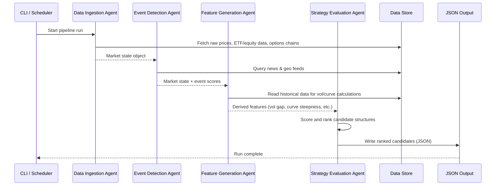

# Energy Options Opportunity Agent — User Guide

> **Version 1.0 · March 2026**
> This guide walks you through installing, configuring, and running the full four-agent pipeline end-to-end. It assumes familiarity with Python (3.10+) and standard CLI tooling.

---

## Table of Contents

1. [Overview](#overview)
2. [Prerequisites](#prerequisites)
3. [Setup & Configuration](#setup--configuration)
4. [Running the Pipeline](#running-the-pipeline)
5. [Interpreting the Output](#interpreting-the-output)
6. [Troubleshooting](#troubleshooting)

---

## Overview

The **Energy Options Opportunity Agent** is a modular, four-agent Python pipeline that detects volatility mispricing in oil-related instruments and surfaces ranked options trading opportunities with full signal explainability.

### Pipeline architecture

```mermaid
flowchart LR
    subgraph Inputs
        A1[Crude Prices\nAlpha Vantage / MetalpriceAPI]
        A2[ETF & Equity Prices\nyfinance / Yahoo Finance]
        A3[Options Chains\nYahoo Finance / Polygon.io]
        A4[Supply & Inventory\nEIA API]
        A5[News & Geo Events\nGDELT / NewsAPI]
        A6[Insider Activity\nSEC EDGAR / Quiver Quant]
        A7[Shipping & Logistics\nMarineTraffic / VesselFinder]
        A8[Narrative & Sentiment\nReddit / Stocktwits]
    end

    subgraph Agent_1 ["① Data Ingestion Agent"]
        B[Fetch & Normalize\nMarket State Object]
    end

    subgraph Agent_2 ["② Event Detection Agent"]
        C[Detect Supply & Geo Events\nConfidence + Intensity Scores]
    end

    subgraph Agent_3 ["③ Feature Generation Agent"]
        D[Compute Derived Signals\nVol Gap · Curve · Dispersion\nInsider · Narrative · Shock Prob]
    end

    subgraph Agent_4 ["④ Strategy Evaluation Agent"]
        E[Rank Candidate Strategies\nEdge Score + Explainability]
    end

    F[(JSON Output /\nDashboard)]

    Inputs --> Agent_1
    Agent_1 --> Agent_2
    Agent_2 --> Agent_3
    Agent_3 --> Agent_4
    Agent_4 --> F
```



Data flows **unidirectionally** through the four agents. Each agent can be deployed and updated independently without disrupting the rest of the pipeline.

### In-scope instruments and structures

| Category | Items |
|---|---|
| **Crude futures** | Brent Crude, WTI (`CL=F`) |
| **ETFs** | USO, XLE |
| **Energy equities** | Exxon Mobil (XOM), Chevron (CVX) |
| **Option structures (MVP)** | Long straddles, call/put spreads, calendar spreads |

> **Advisory only.** The pipeline produces ranked recommendations. Automated trade execution is explicitly out of scope in the current version.

---

## Prerequisites

### System requirements

| Requirement | Minimum |
|---|---|
| Python | 3.10 or later |
| Operating system | Linux, macOS, or Windows (WSL2 recommended) |
| RAM | 2 GB |
| Disk (data retention) | 10 GB (supports 6–12 months of historical data) |
| Deployment target | Local machine, single VM, or single container |

### Required tools

```bash
# Verify Python version
python --version   # must be >= 3.10

# Verify pip
pip --version

# (Recommended) Verify that venv is available
python -m venv --help
```

### External API accounts

You must register for free-tier accounts with the following services before running the pipeline. All are free or have a usable free tier.

| Service | Used by | Sign-up URL |
|---|---|---|
| Alpha Vantage | Crude prices (WTI, Brent) | <https://www.alphavantage.co/support/#api-key> |
| Yahoo Finance / yfinance | ETF, equity, and options data | No key required (public) |
| Polygon.io *(optional)* | Options chains — richer data | <https://polygon.io/> |
| EIA API | Supply & inventory data | <https://www.eia.gov/opendata/register.php> |
| NewsAPI | News and geopolitical events | <https://newsapi.org/register> |
| GDELT *(optional)* | Geopolitical event stream | No key required (public) |
| SEC EDGAR | Insider activity | No key required (public) |
| Quiver Quant *(optional)* | Insider activity — enriched | <https://www.quiverquant.com/> |
| MarineTraffic *(optional)* | Tanker / shipping flows | <https://www.marinetraffic.com/en/register> |
| Reddit API | Narrative / sentiment velocity | <https://www.reddit.com/prefs/apps> |

> **Optional** sources are used in Phase 2 and later. The Phase 1 MVP runs without them — see [MVP Phasing](#mvp-phasing-and-optional-agents) below.

---

## Setup & Configuration

### 1. Clone the repository

```bash
git clone https://github.com/your-org/energy-options-agent.git
cd energy-options-agent
```

### 2. Create and activate a virtual environment

```bash
python -m venv .venv

# Linux / macOS
source .venv/bin/activate

# Windows (PowerShell)
.\.venv\Scripts\Activate.ps1
```

### 3. Install dependencies

```bash
pip install --upgrade pip
pip install -r requirements.txt
```

### 4. Configure environment variables

The pipeline is configured entirely through environment variables. Copy the provided template and populate your values:

```bash
cp .env.example .env
# Edit .env with your preferred editor
```

#### Full environment variable reference

| Variable | Agent | Required | Description |
|---|---|---|---|
| `ALPHA_VANTAGE_API_KEY` | Data Ingestion | ✅ Yes | API key for crude spot/futures prices (WTI, Brent) |
| `EIA_API_KEY` | Data Ingestion | ✅ Yes (Phase 2+) | API key for EIA supply and inventory data |
| `NEWS_API_KEY` | Event Detection | ✅ Yes (Phase 2+) | API key for NewsAPI news and geopolitical events |
| `POLYGON_API_KEY` | Data Ingestion | ⬜ Optional | Polygon.io key for richer options chain data |
| `QUIVER_QUANT_API_KEY` | Feature Generation | ⬜ Optional | Quiver Quant key for enriched insider activity |
| `MARINE_TRAFFIC_API_KEY` | Feature Generation | ⬜ Optional | MarineTraffic key for tanker flow data |
| `REDDIT_CLIENT_ID` | Feature Generation | ⬜ Optional | Reddit app client ID for sentiment feeds |
| `REDDIT_CLIENT_SECRET` | Feature Generation | ⬜ Optional | Reddit app client secret |
| `REDDIT_USER_AGENT` | Feature Generation | ⬜ Optional | Reddit API user-agent string |
| `INSTRUMENTS` | All agents | ⬜ Optional | Comma-separated override of target instruments (default: `CL=F,BZ=F,USO,XLE,XOM,CVX`) |
| `OPTIONS_EXPIRY_WINDOW_DAYS` | Strategy Evaluation | ⬜ Optional | Maximum expiration horizon to consider in days (default: `90`) |
| `EDGE_SCORE_THRESHOLD` | Strategy Evaluation | ⬜ Optional | Minimum edge score to include in output (default: `0.1`) |
| `DATA_REFRESH_INTERVAL_MINUTES` | Data Ingestion | ⬜ Optional | Market data polling cadence in minutes (default: `5`) |
| `HISTORY_RETENTION_DAYS` | Data Ingestion | ⬜ Optional | Days of historical data to retain (default: `365`) |
| `OUTPUT_PATH` | Strategy Evaluation | ⬜ Optional | File path for JSON output (default: `./output/candidates.json`) |
| `LOG_LEVEL` | All agents | ⬜ Optional | Logging verbosity: `DEBUG`, `INFO`, `WARNING`, `ERROR` (default: `INFO`) |

#### Example `.env` file

```dotenv
# --- Required ---
ALPHA_VANTAGE_API_KEY=your_alpha_vantage_key_here
EIA_API_KEY=your_eia_key_here
NEWS_API_KEY=your_newsapi_key_here

# --- Optional: enriched data sources ---
POLYGON_API_KEY=
QUIVER_QUANT_API_KEY=
MARINE_TRAFFIC_API_KEY=
REDDIT_CLIENT_ID=
REDDIT_CLIENT_SECRET=
REDDIT_USER_AGENT=energy-options-agent/1.0

# --- Pipeline behaviour ---
INSTRUMENTS=CL=F,BZ=F,USO,XLE,XOM,CVX
OPTIONS_EXPIRY_WINDOW_DAYS=90
EDGE_SCORE_THRESHOLD=0.1
DATA_REFRESH_INTERVAL_MINUTES=5
HISTORY_RETENTION_DAYS=365

# --- Output ---
OUTPUT_PATH=./output/candidates.json
LOG_LEVEL=INFO
```

### 5. Initialise the data store

Run the initialisation command once before the first pipeline execution. This creates the local historical data store and verifies connectivity to all configured data sources.

```bash
python -m agent init
```

Expected output:

```
[INFO]  Initialising data store at ./data ...
[INFO]  Checking Alpha Vantage connectivity ... OK
[INFO]  Checking EIA API connectivity ... OK
[INFO]  Checking Yahoo Finance (yfinance) connectivity ... OK
[INFO]  Checking NewsAPI connectivity ... OK
[INFO]  Data store initialised. Ready to run.
```

> If an optional source is not configured, you will see `SKIPPED` instead of `OK`. This is not an error.

---

## Running the Pipeline

### Pipeline sequence



### Single run (one-shot)

Execute one full pipeline cycle — ingest, detect, generate features, evaluate strategies — and write the output file:

```bash
python -m agent run
```

Sample console output:

```
[INFO]  [DataIngestionAgent]    Fetching crude prices (WTI, Brent) ...
[INFO]  [DataIngestionAgent]    Fetching ETF/equity prices (USO, XLE, XOM, CVX) ...
[INFO]  [DataIngestionAgent]    Fetching options chains ...
[INFO]  [EventDetectionAgent]   Scanning news feeds (GDELT, NewsAPI) ...
[INFO]  [EventDetectionAgent]   3 events detected. Max intensity: 0.72 (tanker_chokepoint)
[INFO]  [FeatureGenerationAgent] Computing volatility gaps ...
[INFO]  [FeatureGenerationAgent] Computing futures curve steepness ...
[INFO]  [FeatureGenerationAgent] Computing supply shock probability ...
[INFO]  [StrategyEvaluationAgent] Evaluating candidate structures ...
[INFO]  [StrategyEvaluationAgent] 5 candidates generated. Top edge_score: 0.61
[INFO]  Output written to ./output/candidates.json
[INFO]  Pipeline run complete in 14.3 s
```

### Continuous mode (polling)

Run the pipeline on a repeating cadence driven by `DATA_REFRESH_INTERVAL_MINUTES`:

```bash
python -m agent run --continuous
```

Press `Ctrl+C` to stop.

### Run a single agent in isolation

Each agent can be invoked independently for testing or incremental development:

```bash
# Data Ingestion only
python -m agent run --agent ingestion

# Event Detection only (requires a market state object from a prior ingestion run)
python -m agent run --agent events

# Feature Generation only
python -m agent run --agent features

# Strategy Evaluation only
python -m agent run --agent strategy
```

### Dry run (no output written)

Validate configuration and connectivity without writing any output files:

```bash
python -m agent run --dry-run
```

### MVP phasing and optional agents

The pipeline is designed for incremental activation. Use the `--phase` flag to restrict which data sources and signals are active:

| Flag | Active phases | What runs |
|---|---|---|
| `--phase 1` | Phase 1 only | Crude benchmarks, USO/XLE, options surface, long straddles & spreads |
| `--phase 2` | Phases 1–2 | Adds EIA inventory, event detection (GDELT/NewsAPI), supply disruption indices |
| `--phase 3` | Phases 1–3 | Adds insider trades, narrative velocity, shipping data, full edge scoring |
| *(default)* | All configured phases | Runs every agent for which API keys are present |

```bash
# Start with Phase 1 only (no EIA or news keys required)
python -m agent run --phase 1
```

---

## Interpreting the Output

### Output file location

By default, results are written to:

```
./output/candidates.json
```

Override this with the `OUTPUT_PATH` environment variable.

### Output schema

Each pipeline run appends to (or replaces) a JSON array of **strategy candidate objects**. Each object has the following fields:

| Field | Type | Description |
|---|---|---|
| `instrument` | `string` | Target instrument, e.g. `USO`, `XLE`, `CL=F` |
| `structure` | `enum` | `long_straddle` · `call_spread` · `put_spread` · `calendar_spread` |
| `expiration` | `integer` (days) | Calendar days from evaluation date to target expiration |
| `edge_score` | `float` [0.0–1.0] | Composite opportunity score — higher means stronger signal confluence |
| `signals` | `object` | Map of contributing signals and their qualitative values |
| `generated_at` | ISO 8601 datetime | UTC timestamp of candidate generation |

### Example output

```json
[
  {
    "instrument": "USO",
    "structure": "long_straddle",
    "expiration": 30,
    "edge_score": 0.61,
    "signals": {
      "tanker_disruption_index": "high",
      "volatility_gap": "positive",
      "narrative_velocity": "rising"
    },
    "generated_at": "2026-03-15T14:32:07Z"
  },
  {
    "instrument": "XLE",
    "structure": "call_spread",
    "expiration": 45,
    "edge_score": 0.47,
    "signals": {
      "supply_shock_probability": "elevated",
      "futures_curve_steepness": "contango_widening",
      "sector_dispersion": "high"
    },
    "generated_at": "2026-03-15T14:32:07Z"
  }
]
```

### Understanding the edge score

The `edge_score` is a composite float in `[0.0, 1.0]` that reflects the degree of signal confluence pointing toward a volatility mispricing opportunity. Use the following bands as a