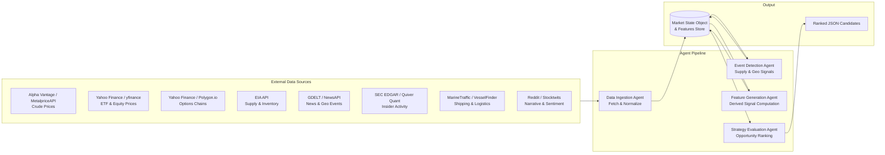
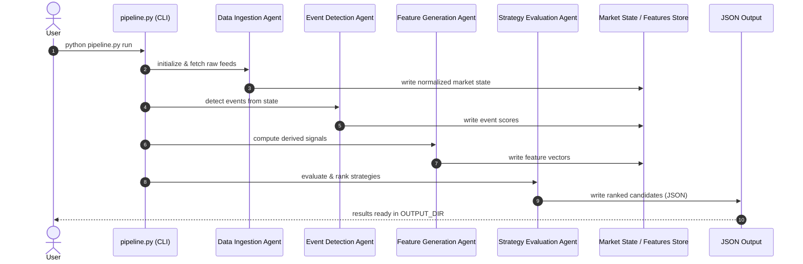

# Energy Options Opportunity Agent — User Guide

> **Version 1.0 • March 2026**
> This guide walks you through setting up, configuring, and running the full pipeline end-to-end. It assumes you are comfortable with Python and command-line tools but are new to this project.

---

## Table of Contents

1. [Overview](#overview)
2. [Prerequisites](#prerequisites)
3. [Setup & Configuration](#setup--configuration)
4. [Running the Pipeline](#running-the-pipeline)
5. [Interpreting the Output](#interpreting-the-output)
6. [Troubleshooting](#troubleshooting)

---

## Overview

The **Energy Options Opportunity Agent** is an autonomous, modular Python pipeline that identifies options trading opportunities driven by oil market instability. It monitors crude prices, supply signals, geopolitical news, and alternative datasets, then surfaces volatility mispricing and ranks candidate options strategies by a computed **edge score**.

### Pipeline Architecture

The system is composed of four loosely coupled agents that communicate via a shared **market state object** and a **derived features store**. Data flows strictly in one direction — from raw ingestion through to ranked output.



### In-Scope Instruments (MVP)

| Category | Instruments |
|---|---|
| Crude Futures | Brent Crude, WTI (`CL=F`) |
| ETFs | USO, XLE |
| Energy Equities | Exxon Mobil (XOM), Chevron (CVX) |

### In-Scope Option Structures (MVP)

| Structure | Enum Value |
|---|---|
| Long Straddle | `long_straddle` |
| Call Spread | `call_spread` |
| Put Spread | `put_spread` |
| Calendar Spread | `calendar_spread` |

> **Note:** Automated trade execution is explicitly out of scope. The system is **advisory only**.

---

## Prerequisites

### System Requirements

| Requirement | Minimum |
|---|---|
| Python | 3.10 or later |
| Operating System | Linux, macOS, or Windows (WSL recommended) |
| RAM | 2 GB |
| Disk | 5 GB free (for 6–12 months of historical data) |
| Deployment target | Local machine, single VM, or Docker container |

### Required Tools

- `git` — to clone the repository
- `python3` and `pip` — to install dependencies
- (Optional) `docker` — if running in a container
- (Optional) A thinkorswim installation or any JSON-capable dashboard for output visualization

### API Accounts

Register for the following free-tier services before configuring the pipeline. All sources are free or low-cost.

| Data Layer | Service | Sign-up URL | Notes |
|---|---|---|---|
| Crude Prices | Alpha Vantage | https://www.alphavantage.co | Free tier; minutes cadence |
| Crude Prices (alt) | MetalpriceAPI | https://metalpriceapi.com | Free tier |
| Options / Equity | Polygon.io | https://polygon.io | Free tier; daily options data |
| Supply / Inventory | EIA API | https://www.eia.gov/opendata | Free; weekly updates |
| News & Geo Events | NewsAPI | https://newsapi.org | Free tier; daily |
| News & Geo Events (alt) | GDELT | https://www.gdeltproject.org | Free; continuous |
| Insider Activity | Quiver Quant | https://www.quiverquant.com | Free/limited tier |
| Shipping | MarineTraffic | https://www.marinetraffic.com | Free tier |
| Sentiment | Reddit API | https://www.reddit.com/prefs/apps | Free |

> `yfinance`, SEC EDGAR, GDELT, VesselFinder, and Stocktwits do not require API keys at the free tier.

---

## Setup & Configuration

### 1. Clone the Repository

```bash
git clone https://github.com/your-org/energy-options-agent.git
cd energy-options-agent
```

### 2. Create and Activate a Virtual Environment

```bash
python3 -m venv .venv
source .venv/bin/activate        # Linux / macOS
# .venv\Scripts\activate         # Windows
```

### 3. Install Dependencies

```bash
pip install --upgrade pip
pip install -r requirements.txt
```

### 4. Configure Environment Variables

Copy the provided template and fill in your API keys:

```bash
cp .env.example .env
```

Open `.env` in your editor and populate all required values. The full set of environment variables is described in the table below.

#### Environment Variables Reference

| Variable | Required | Default | Description |
|---|---|---|---|
| `ALPHA_VANTAGE_API_KEY` | Yes | — | API key for Alpha Vantage crude price feed |
| `METALPRICE_API_KEY` | Optional | — | API key for MetalpriceAPI (fallback crude feed) |
| `POLYGON_API_KEY` | Yes | — | API key for Polygon.io options chain data |
| `EIA_API_KEY` | Yes | — | API key for EIA supply/inventory data |
| `NEWSAPI_KEY` | Yes | — | API key for NewsAPI geopolitical/energy events |
| `QUIVER_API_KEY` | Optional | — | API key for Quiver Quant insider activity |
| `MARINETRAFFIC_API_KEY` | Optional | — | API key for MarineTraffic tanker data |
| `REDDIT_CLIENT_ID` | Optional | — | Reddit OAuth client ID for sentiment feed |
| `REDDIT_CLIENT_SECRET` | Optional | — | Reddit OAuth client secret |
| `REDDIT_USER_AGENT` | Optional | `energy-agent/1.0` | Reddit API user-agent string |
| `OUTPUT_DIR` | No | `./output` | Directory where JSON output files are written |
| `HISTORICAL_DATA_DIR` | No | `./data/historical` | Directory for persisted raw and derived data |
| `RETENTION_DAYS` | No | `365` | Days of historical data to retain (180–365 recommended) |
| `MARKET_DATA_INTERVAL_MINUTES` | No | `5` | Polling cadence for market price feeds (minutes) |
| `LOG_LEVEL` | No | `INFO` | Logging verbosity: `DEBUG`, `INFO`, `WARNING`, `ERROR` |
| `ENABLE_SHIPPING_SIGNALS` | No | `false` | Set to `true` to activate MarineTraffic tanker data |
| `ENABLE_INSIDER_SIGNALS` | No | `false` | Set to `true` to activate EDGAR/Quiver insider data |
| `ENABLE_NARRATIVE_SIGNALS` | No | `false` | Set to `true` to activate Reddit/Stocktwits sentiment |

**Example `.env` file:**

```dotenv
# --- Required ---
ALPHA_VANTAGE_API_KEY=your_alpha_vantage_key
POLYGON_API_KEY=your_polygon_key
EIA_API_KEY=your_eia_key
NEWSAPI_KEY=your_newsapi_key

# --- Optional alternative / enrichment feeds ---
METALPRICE_API_KEY=
QUIVER_API_KEY=
MARINETRAFFIC_API_KEY=
REDDIT_CLIENT_ID=
REDDIT_CLIENT_SECRET=
REDDIT_USER_AGENT=energy-agent/1.0

# --- Storage ---
OUTPUT_DIR=./output
HISTORICAL_DATA_DIR=./data/historical
RETENTION_DAYS=365

# --- Behaviour ---
MARKET_DATA_INTERVAL_MINUTES=5
LOG_LEVEL=INFO
ENABLE_SHIPPING_SIGNALS=false
ENABLE_INSIDER_SIGNALS=false
ENABLE_NARRATIVE_SIGNALS=false
```

> **Tip:** Optional signals map to Phase 2 and Phase 3 features. Leave them disabled for an initial Phase 1 run. Enable them incrementally as you obtain the corresponding API credentials.

### 5. Initialize the Data Directories

```bash
python scripts/init_storage.py
```

This creates the `OUTPUT_DIR` and `HISTORICAL_DATA_DIR` paths and validates write permissions before the first pipeline run.

---

## Running the Pipeline

### Pipeline Execution Flow



### Single Run (On-Demand)

Execute one complete pass through all four agents:

```bash
python pipeline.py run
```

The pipeline will:

1. Ingest and normalize crude prices, ETF/equity data, and options chains.
2. Detect and score supply disruptions, refinery outages, and geopolitical events.
3. Compute derived signals (volatility gap, curve steepness, narrative velocity, etc.).
4. Evaluate eligible option structures and emit ranked candidates to `OUTPUT_DIR`.

### Continuous Mode (Scheduled Polling)

Run the pipeline on a repeating cadence driven by `MARKET_DATA_INTERVAL_MINUTES`:

```bash
python pipeline.py run --continuous
```

Press `Ctrl+C` to stop. Slower feeds (EIA, EDGAR) respect their own internal schedules (daily/weekly) and will not be re-fetched on every market-data tick.

### Run a Single Agent

Each agent can be invoked independently for development or debugging:

```bash
# Data Ingestion only
python pipeline.py run --agent ingestion

# Event Detection only (requires existing market state in store)
python pipeline.py run --agent event_detection

# Feature Generation only
python pipeline.py run --agent feature_generation

# Strategy Evaluation only
python pipeline.py run --agent strategy_evaluation
```

### Common CLI Flags

| Flag | Description |
|---|---|
| `--continuous` | Poll indefinitely at `MARKET_DATA_INTERVAL_MINUTES` cadence |
| `--agent <name>` | Run a single named agent instead of the full pipeline |
| `--output-dir <path>` | Override `OUTPUT_DIR` for this run |
| `--log-level <level>` | Override `LOG_LEVEL` for this run (`DEBUG`, `INFO`, etc.) |
| `--dry-run` | Execute all agents but suppress file writes to `OUTPUT_DIR` |

**Example — debug a single run with verbose output:**

```bash
python pipeline.py run --log-level DEBUG --dry-run
```

### Docker (Optional)

```bash
# Build the image
docker build -t energy-options-agent:1.0 .

# Run a single pass (mount your .env and output directory)
docker run --rm \
  --env-file .env \
  -v "$(pwd)/output:/app/output" \
  -v "$(pwd)/data:/app/data" \
  energy-options-agent:1.0 python pipeline.py run
```

---

## Interpreting the Output

### Output Location

After each run, ranked candidates are written to `OUTPUT_DIR` as a JSON file named by UTC timestamp:

```
output/
└── candidates_2026-03-15T14-32-00Z.json
```

A symlink `output/candidates_latest.json` always points to the most recent file.

### Output Schema

Each file contains a JSON array of candidate objects. Every candidate has the following fields:

| Field | Type | Description |
|---|---|---|
| `instrument` | `string` | Target instrument, e.g. `USO`, `XLE`, `CL=F` |
| `structure` | `enum` | `long_straddle` \| `call_spread` \| `put_spread` \| `calendar_spread` |
| `expiration` | `integer` | Target expiration in calendar days from evaluation date |
| `edge_score` | `float [0.0–1.0]` | Composite opportunity score; **higher = stronger signal confluence** |
| `signals` | `object` | Map of contributing signals and their qualitative values |
| `generated_at` | `ISO 8601 datetime` | UTC timestamp of candidate generation |

### Example Output

```json
[
  {
    "instrument": "USO",
    "structure": "long_straddle",
    "expiration": 30,
    "edge_score": 0.47,
    "signals": {
      "tanker_disruption_index": "high",
      "volatility_gap": "positive",
      "narrative_velocity": "rising"
    },
    "generated_at": "2026-03-15T14:32:00Z"
  },
  {
    "instrument": "XOM",
    "structure": "call_spread",
    "expiration": 45,
    "edge_score": 0.31,
    "signals": {
      "volatility_gap": "positive",
      "supply_shock_probability": "elevated",
      "futures_curve_steepness": "backwardated"
    },
    "generated_at": "2026-03-15T14:32:00Z"
  }
]
```

### Reading the Edge Score

| Edge Score Range | Interpretation |
|---|---|
| `0.70 – 1.00` | Strong signal confluence — multiple independent signals aligned |
| `0.40 – 0.69` | Moderate confluence — worth monitoring; validate contributing signals |
| `0.20 – 0.39` | Weak confluence — low conviction; consider as background noise |
| `0.00 – 0.19` | Negligible — insufficient signal agreement |

> The edge score is a **heuristic composite**, not a probability of profit. Always review the `signals` map to understand *why* a candidate was surfaced before acting on it.

### Reading the `signals` Map

Each key in the `signals` object corresponds to a derived feature computed by the Feature Generation Agent. Common signal keys and their qualitative values:

| Signal Key | Possible Values | What It Means |
|---|---|---|
| `volatility_gap` | `positive`, `negative`, `neutral` | `positive` = realized vol exceeding implied vol (options potentially cheap) |
| `futures_curve_steepness` | `backwardated`, `contango`, `flat` | Shape of the crude futures curve |
| `supply_shock_probability` | `low`, `elevated`, `high` | Likelihood of near-term supply disruption based on EIA + event data |
| `tanker_disruption_index` | `low`, `medium`, `high` | Severity of shipping/logistics disruption at key chokepoints |
| `narrative_velocity` | `stable`, `rising`, `accelerating` | Rate of change in energy-related headline volume |
| `sector_dispersion`