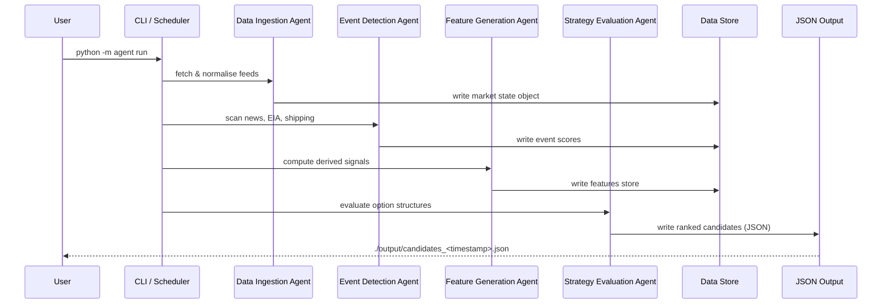

# Energy Options Opportunity Agent — User Guide

> **Version 1.0 · March 2026**
> This guide covers the full pipeline: setup, configuration, execution, output interpretation, and troubleshooting.

---

## Table of Contents

1. [Overview](#overview)
2. [Prerequisites](#prerequisites)
3. [Setup & Configuration](#setup--configuration)
4. [Running the Pipeline](#running-the-pipeline)
5. [Interpreting the Output](#interpreting-the-output)
6. [Troubleshooting](#troubleshooting)

---

## Overview

The **Energy Options Opportunity Agent** is a modular, four-agent Python pipeline that identifies options trading opportunities driven by oil market instability. It ingests market data, supply signals, news events, and alternative datasets, then surfaces volatility mispricing in oil-related instruments and ranks candidate strategies by a computed **edge score**.

The pipeline is **advisory only** — it produces ranked recommendations but does not execute trades.

### Pipeline Architecture

```mermaid
flowchart LR
    subgraph Ingestion["① Data Ingestion Agent"]
        A1[Crude Prices\nAlpha Vantage / MetalpriceAPI]
        A2[ETF & Equity Prices\nyfinance / Yahoo Finance]
        A3[Options Chains\nYahoo Finance / Polygon.io]
    end

    subgraph Events["② Event Detection Agent"]
        B1[News & Geo Events\nGDELT / NewsAPI]
        B2[Supply & Inventory\nEIA API]
        B3[Shipping / Logistics\nMarineTraffic / VesselFinder]
    end

    subgraph Features["③ Feature Generation Agent"]
        C1[Volatility Gap\nRealized vs Implied]
        C2[Futures Curve Steepness]
        C3[Sector Dispersion]
        C4[Insider Conviction Score\nSEC EDGAR / Quiver Quant]
        C5[Narrative Velocity\nReddit / Stocktwits]
        C6[Supply Shock Probability]
    end

    subgraph Strategy["④ Strategy Evaluation Agent"]
        D1[Evaluate Option Structures]
        D2[Compute Edge Scores]
        D3[Ranked Candidates + Signals]
    end

    MS[(Shared Market\nState Object)]
    FS[(Derived\nFeatures Store)]
    OUT[📄 JSON Output]

    Ingestion --> MS
    Events --> MS
    MS --> Features
    Features --> FS
    FS --> Strategy
    Strategy --> OUT
```



### In-Scope Instruments

| Category | Instruments |
|---|---|
| Crude Futures | Brent Crude, WTI (`CL=F`) |
| ETFs | USO, XLE |
| Energy Equities | Exxon Mobil (XOM), Chevron (CVX) |

### In-Scope Option Structures (MVP)

| Structure | Enum Value |
|---|---|
| Long Straddle | `long_straddle` |
| Call Spread | `call_spread` |
| Put Spread | `put_spread` |
| Calendar Spread | `calendar_spread` |

> **Out of scope for MVP:** exotic/multi-legged structures, regional refined product pricing (OPIS), automated trade execution.

---

## Prerequisites

### System Requirements

| Requirement | Minimum |
|---|---|
| Python | 3.10+ |
| OS | Linux, macOS, or Windows (WSL2 recommended) |
| RAM | 2 GB |
| Disk | 5 GB (for 6–12 months of historical data) |
| Deployment target | Local machine, single VM, or container |

### Software Dependencies

Ensure the following are installed before proceeding:

```bash
# Verify Python version
python --version   # Expected: Python 3.10.x or higher

# Verify pip
pip --version

# Verify git
git --version
```

### API Accounts

Register for the following free or low-cost data sources before configuring the pipeline. All are free-tier unless noted.

| Data Layer | Source | Sign-up URL | Cost |
|---|---|---|---|
| Crude Prices | Alpha Vantage | https://www.alphavantage.co | Free |
| Crude Prices (alt) | MetalpriceAPI | https://metalpriceapi.com | Free |
| ETF / Equity Prices | yfinance (Yahoo Finance) | No key required | Free |
| Options Data | Polygon.io | https://polygon.io | Free / Limited |
| Supply & Inventory | EIA API | https://www.eia.gov/opendata | Free |
| News & Geo Events | GDELT | No key required | Free |
| News & Geo Events (alt) | NewsAPI | https://newsapi.org | Free |
| Insider Activity | SEC EDGAR | No key required | Free |
| Insider Activity (alt) | Quiver Quant | https://www.quiverquant.com | Free / Limited |
| Shipping / Logistics | MarineTraffic | https://www.marinetraffic.com | Free tier |
| Narrative / Sentiment | Reddit (PRAW) | https://www.reddit.com/prefs/apps | Free |
| Narrative / Sentiment | Stocktwits | https://api.stocktwits.com | Free |

---

## Setup & Configuration

### 1. Clone the Repository

```bash
git clone https://github.com/your-org/energy-options-agent.git
cd energy-options-agent
```

### 2. Create and Activate a Virtual Environment

```bash
python -m venv .venv

# macOS / Linux
source .venv/bin/activate

# Windows (PowerShell)
.venv\Scripts\Activate.ps1
```

### 3. Install Dependencies

```bash
pip install --upgrade pip
pip install -r requirements.txt
```

### 4. Configure Environment Variables

Copy the provided template and populate it with your API credentials:

```bash
cp .env.example .env
```

Open `.env` in your editor and fill in every value. The full set of supported environment variables is documented in the table below.

#### Environment Variable Reference

| Variable | Required | Default | Description |
|---|---|---|---|
| `ALPHA_VANTAGE_API_KEY` | Yes | — | API key for Alpha Vantage crude price feed |
| `METALPRICE_API_KEY` | Optional | — | Fallback API key for MetalpriceAPI crude feed |
| `POLYGON_API_KEY` | Optional | — | API key for Polygon.io options chain data |
| `EIA_API_KEY` | Yes | — | API key for EIA supply/inventory data |
| `NEWSAPI_KEY` | Optional | — | API key for NewsAPI news/geo-event feed |
| `REDDIT_CLIENT_ID` | Optional | — | Reddit OAuth client ID (PRAW) |
| `REDDIT_CLIENT_SECRET` | Optional | — | Reddit OAuth client secret (PRAW) |
| `REDDIT_USER_AGENT` | Optional | `energy-agent/1.0` | Reddit PRAW user-agent string |
| `QUIVER_API_KEY` | Optional | — | API key for Quiver Quant insider data |
| `MARINE_TRAFFIC_API_KEY` | Optional | — | API key for MarineTraffic shipping data |
| `DATA_DIR` | No | `./data` | Root directory for persisted raw and derived data |
| `OUTPUT_DIR` | No | `./output` | Directory where JSON output files are written |
| `LOG_LEVEL` | No | `INFO` | Logging verbosity: `DEBUG`, `INFO`, `WARNING`, `ERROR` |
| `HISTORY_MONTHS` | No | `12` | Months of historical data to retain (minimum: `6`) |
| `MARKET_DATA_INTERVAL_MINUTES` | No | `5` | Polling cadence for market price feeds (minutes) |
| `PIPELINE_MODE` | No | `full` | Run mode: `full` \| `ingest_only` \| `features_only` \| `strategy_only` |

> **Tip:** Optional variables activate specific data layers. The pipeline tolerates missing feeds and continues without them; however, edge score completeness depends on how many layers are active. See [Troubleshooting](#troubleshooting) for degraded-mode behaviour.

#### Example `.env` File

```dotenv
# --- Required ---
ALPHA_VANTAGE_API_KEY=YOUR_AV_KEY_HERE
EIA_API_KEY=YOUR_EIA_KEY_HERE

# --- Optional: enriches options data ---
POLYGON_API_KEY=YOUR_POLYGON_KEY_HERE

# --- Optional: news & geo-event layer ---
NEWSAPI_KEY=YOUR_NEWSAPI_KEY_HERE

# --- Optional: narrative velocity layer ---
REDDIT_CLIENT_ID=YOUR_REDDIT_CLIENT_ID
REDDIT_CLIENT_SECRET=YOUR_REDDIT_CLIENT_SECRET
REDDIT_USER_AGENT=energy-agent/1.0

# --- Optional: insider activity layer ---
QUIVER_API_KEY=YOUR_QUIVER_KEY_HERE

# --- Optional: shipping/logistics layer ---
MARINE_TRAFFIC_API_KEY=YOUR_MT_KEY_HERE

# --- Pipeline settings ---
DATA_DIR=./data
OUTPUT_DIR=./output
LOG_LEVEL=INFO
HISTORY_MONTHS=12
MARKET_DATA_INTERVAL_MINUTES=5
PIPELINE_MODE=full
```

### 5. Initialise the Data Store

Run the initialisation command to create the required directory structure and seed the historical data store for the configured retention window:

```bash
python -m agent init
```

Expected output:

```
[INFO] Initialising data store at ./data
[INFO] Creating directories: raw/, derived/, options/
[INFO] Seeding historical data (12 months)... done
[INFO] Data store ready.
```

---

## Running the Pipeline

### Pipeline Execution Flow



### Running a Full Pipeline Cycle

```bash
python -m agent run
```

This executes all four agents in sequence: Data Ingestion → Event Detection → Feature Generation → Strategy Evaluation.

### Running Individual Agents

Each agent is independently deployable and can be invoked in isolation:

```bash
# Data Ingestion Agent only
python -m agent run --mode ingest_only

# Event Detection Agent only
python -m agent run --mode events_only

# Feature Generation Agent only
python -m agent run --mode features_only

# Strategy Evaluation Agent only
python -m agent run --mode strategy_only
```

### Scheduling Continuous Execution

For continuous operation, use `cron` (Linux/macOS) or Task Scheduler (Windows). The recommended cadence matches the `MARKET_DATA_INTERVAL_MINUTES` setting.

**Example cron entry (every 5 minutes):**

```cron
*/5 * * * * /path/to/.venv/bin/python -m agent run >> /var/log/energy-agent.log 2>&1
```

**Using the built-in scheduler loop:**

```bash
python -m agent run --loop --interval 5
```

> **Note:** EIA and EDGAR feeds operate on daily/weekly schedules. The pipeline fetches these on a slower internal timer regardless of the market data cadence.

### Command-Line Reference

| Flag | Type | Default | Description |
|---|---|---|---|
| `--mode` | string | `full` | Execution mode (see table in Configuration) |
| `--loop` | flag | off | Run continuously on a timer |
| `--interval` | int (minutes) | `5` | Polling interval when `--loop` is set |
| `--output-dir` | path | `$OUTPUT_DIR` | Override output directory for this run |
| `--log-level` | string | `$LOG_LEVEL` | Override log level for this run |
| `--dry-run` | flag | off | Execute all agents but suppress file output |

```bash
# Example: run once in debug mode with a custom output directory
python -m agent run --log-level DEBUG --output-dir ./debug_output
```

---

## Interpreting the Output

### Output File

Each pipeline cycle writes one JSON file to `OUTPUT_DIR`:

```
./output/candidates_2026-03-15T14:32:00Z.json
```

The file contains an array of ranked strategy candidate objects, ordered from highest to lowest `edge_score`.

### Output Schema

| Field | Type | Description |
|---|---|---|
| `instrument` | `string` | Target instrument, e.g. `USO`, `XLE`, `CL=F` |
| `structure` | `enum` | `long_straddle` \| `call_spread` \| `put_spread` \| `calendar_spread` |
| `expiration` | `integer` (days) | Target expiration in calendar days from evaluation date |
| `edge_score` | `float [0.0–1.0]` | Composite opportunity score; higher = stronger signal confluence |
| `signals` | `object` | Map of contributing signals and their qualitative state |
| `generated_at` | `ISO 8601 datetime` | UTC timestamp of candidate generation |

### Annotated Example Candidate

```json
{
  "instrument": "USO",
  "structure": "long_straddle",
  "expiration": 30,
  "edge_score": 0.47,
  "signals": {
    "tanker_disruption_index": "high",
    "volatility_gap": "positive",
    "narrative_velocity": "rising"
  },
  "generated_at": "2026-03-15T14:32:00Z"
}
```

**Reading this candidate:**

- **`instrument: "USO"`** — The opportunity is on the USO crude oil ETF.
- **`structure: "long_straddle"`** — The system recommends a long straddle, appropriate when a large move is expected in either direction.
- **`expiration: 30`** — Target options expiring approximately 30 calendar days out.
- **`edge_score: 0.47`** — Moderate signal confluence. Scores closer to `1.0` indicate stronger agreement across more layers.
- **`signals`** — Three signals contributed to this candidate. `volatility_gap: "positive"` means realised volatility is running above implied volatility (options may be underpriced). `tanker_disruption_index: "high"` and `narrative_velocity: "rising"` indicate an active geopolitical catalyst.

### Signal Reference

The `signals` object may contain any of the following keys, depending on which data layers are active:

| Signal Key | Source Layer | Possible Values |
|---|---|---|
| `volatility_gap` | Feature Generation | `positive`, `negative`, `neutral` |
| `futures_curve_steepness` | Feature Generation | `contango`, `backwardation`, `flat` |
| `sector_dispersion` | Feature Generation | `high`, `moderate`, `low` |
| `insider_conviction_score` | Feature Generation (EDGAR) | `high`, `moderate`, `low` |
| `narrative_velocity` | Feature Generation (Reddit/Stocktwits) | `rising`, `stable`, `falling` |
| `supply_shock_probability` | Feature Generation (EIA) | `high`, `moderate`, `low` |
| `tanker_disruption_index` | Event Detection (MarineTraffic) | `high`, `moderate`, `low` |
| `geo_event_confidence` | Event Detection (GDELT/NewsAPI) | `high`, `moderate`, `low` |
| `refinery_outage_flag` | Event Detection (EIA/NewsAPI) | `true`, `false` |

### Edge Score Interpretation

| Edge Score Range | Interpretation | Suggested Action |
|---|---|---|
| `0.75 – 1.00` | Strong signal confluence | High-priority candidate