# Energy Options Opportunity Agent — User Guide

> **Version 1.0 · March 2026**
> This guide walks a developer through setting up, configuring, and running the full pipeline end-to-end, and interpreting its output.

---

## Table of Contents

1. [Overview](#overview)
2. [Prerequisites](#prerequisites)
3. [Setup & Configuration](#setup--configuration)
4. [Running the Pipeline](#running-the-pipeline)
5. [Interpreting the Output](#interpreting-the-output)
6. [Troubleshooting](#troubleshooting)

---

## Overview

The **Energy Options Opportunity Agent** is an autonomous, modular Python pipeline that identifies options trading opportunities driven by oil market instability. It ingests market data, supply signals, news events, and alternative datasets to produce structured, ranked candidate options strategies.

The system is **advisory only** — it surfaces volatility mispricing and ranks opportunities; it does not execute trades.

### Four-Agent Pipeline

Data flows unidirectionally through four loosely coupled agents that communicate via a shared market state object and a derived features store.

```mermaid
flowchart LR
    subgraph Ingestion["① Data Ingestion Agent"]
        A1[Crude Prices\nWTI · Brent]
        A2[ETF / Equity Prices\nUSO · XLE · XOM · CVX]
        A3[Options Chains\nStrike · IV · Volume]
    end

    subgraph Events["② Event Detection Agent"]
        B1[News & Geo Feeds\nGDELT · NewsAPI]
        B2[Supply Signals\nEIA Inventory]
        B3[Shipping\nMarineTraffic]
    end

    subgraph Features["③ Feature Generation Agent"]
        C1[Volatility Gap\nRealised vs. Implied]
        C2[Futures Curve\nSteepness]
        C3[Sector Dispersion]
        C4[Insider Conviction]
        C5[Narrative Velocity]
        C6[Supply Shock Probability]
    end

    subgraph Strategy["④ Strategy Evaluation Agent"]
        D1[Eligible Structures\nStraddles · Spreads]
        D2[Edge Score Computation]
        D3[Ranked Candidates\nJSON Output]
    end

    Ingestion -->|Unified Market\nState Object| Events
    Events    -->|Scored Events| Features
    Features  -->|Derived Signal Map| Strategy
    Strategy  -->|candidates.json| Output[(Output /\nDashboard)]
```



### In-Scope Instruments (MVP)

| Category | Instruments |
|---|---|
| Crude futures | Brent Crude, WTI (`CL=F`) |
| ETFs | USO, XLE |
| Energy equities | Exxon Mobil (XOM), Chevron (CVX) |

### In-Scope Option Structures (MVP)

| Structure | Enum value |
|---|---|
| Long straddle | `long_straddle` |
| Call spread | `call_spread` |
| Put spread | `put_spread` |
| Calendar spread | `calendar_spread` |

---

## Prerequisites

### System Requirements

| Requirement | Minimum |
|---|---|
| Python | 3.10+ |
| OS | Linux, macOS, or Windows (WSL recommended) |
| RAM | 2 GB |
| Disk | 10 GB (for 6–12 months historical data) |
| Network | Outbound HTTPS to data providers |

### External Accounts

The following free or low-cost accounts are required before configuration. Register and obtain API keys at the URLs listed.

| Service | Used by | Tier | URL |
|---|---|---|---|
| Alpha Vantage | Crude prices | Free | https://www.alphavantage.co |
| yfinance / Yahoo Finance | ETF · equity · options data | Free | No key required |
| Polygon.io | Options chains (supplemental) | Free / Limited | https://polygon.io |
| EIA Open Data | Supply & inventory | Free | https://www.eia.gov/opendata |
| GDELT Project | News & geopolitical events | Free | No key required |
| NewsAPI | News headlines | Free | https://newsapi.org |
| SEC EDGAR | Insider activity | Free | No key required |
| Quiver Quant | Insider activity (supplemental) | Free / Limited | https://www.quiverquant.com |
| MarineTraffic | Tanker / shipping flows | Free tier | https://www.marinetraffic.com |
| Stocktwits | Narrative / sentiment | Free | https://api.stocktwits.com |

> **Note:** `yfinance`, `GDELT`, and `SEC EDGAR` require no API key. All other services require registration.

### Python Dependencies

```bash
pip install -r requirements.txt
```

A minimal `requirements.txt` includes:

```text
yfinance>=0.2
requests>=2.31
pandas>=2.0
numpy>=1.26
python-dotenv>=1.0
schedule>=1.2
```

---

## Setup & Configuration

### 1. Clone the Repository

```bash
git clone https://github.com/your-org/energy-options-agent.git
cd energy-options-agent
```

### 2. Create a Virtual Environment

```bash
python -m venv .venv
source .venv/bin/activate        # Linux / macOS
# .venv\Scripts\activate          # Windows PowerShell
```

### 3. Install Dependencies

```bash
pip install --upgrade pip
pip install -r requirements.txt
```

### 4. Configure Environment Variables

Copy the example environment file and fill in your credentials:

```bash
cp .env.example .env
```

Open `.env` in your editor and set each value. The full list of environment variables is documented in the table below.

#### Environment Variable Reference

| Variable | Required | Default | Description |
|---|---|---|---|
| `ALPHA_VANTAGE_API_KEY` | ✅ | — | API key for Alpha Vantage crude price feed |
| `POLYGON_API_KEY` | Optional | — | API key for Polygon.io options chain supplement |
| `EIA_API_KEY` | ✅ | — | API key for EIA Open Data (supply & inventory) |
| `NEWSAPI_KEY` | ✅ | — | API key for NewsAPI headline feed |
| `QUIVER_API_KEY` | Optional | — | API key for Quiver Quant insider data |
| `MARINETRAFFIC_API_KEY` | Optional | — | API key for MarineTraffic shipping feed |
| `GDELT_ENABLED` | Optional | `true` | Set to `false` to disable GDELT ingestion |
| `STOCKTWITS_ENABLED` | Optional | `true` | Set to `false` to disable Stocktwits sentiment |
| `DATA_DIR` | Optional | `./data` | Local path for raw and derived data storage |
| `OUTPUT_DIR` | Optional | `./output` | Directory where `candidates.json` is written |
| `HISTORICAL_RETENTION_DAYS` | Optional | `180` | Days of historical data to retain (180–365) |
| `MARKET_DATA_INTERVAL_SECONDS` | Optional | `60` | Polling cadence for minute-level market feeds |
| `SLOW_FEED_INTERVAL_HOURS` | Optional | `24` | Polling cadence for daily/weekly feeds (EIA, EDGAR) |
| `LOG_LEVEL` | Optional | `INFO` | Logging verbosity: `DEBUG`, `INFO`, `WARNING`, `ERROR` |
| `EDGE_SCORE_THRESHOLD` | Optional | `0.0` | Minimum edge score to include in output (0.0–1.0) |

Example populated `.env`:

```dotenv
ALPHA_VANTAGE_API_KEY=YOUR_AV_KEY_HERE
EIA_API_KEY=YOUR_EIA_KEY_HERE
NEWSAPI_KEY=YOUR_NEWSAPI_KEY_HERE
DATA_DIR=./data
OUTPUT_DIR=./output
HISTORICAL_RETENTION_DAYS=180
MARKET_DATA_INTERVAL_SECONDS=60
LOG_LEVEL=INFO
EDGE_SCORE_THRESHOLD=0.2
```

### 5. Initialise the Data Directory

Creates the required directory structure and verifies write access:

```bash
python -m agent init
```

Expected output:

```
[INFO] Data directory   : ./data  ✓
[INFO] Output directory : ./output  ✓
[INFO] Initialisation complete.
```

### 6. Verify API Connectivity

Run the connectivity check to validate each configured credential before starting the full pipeline:

```bash
python -m agent check-connections
```

Expected output:

```
[INFO] Alpha Vantage    : OK
[INFO] yfinance         : OK
[INFO] EIA              : OK
[INFO] NewsAPI          : OK
[INFO] GDELT            : OK (no key required)
[INFO] SEC EDGAR        : OK (no key required)
[WARN] Polygon.io       : SKIPPED (no key set)
[WARN] Quiver Quant     : SKIPPED (no key set)
[WARN] MarineTraffic    : SKIPPED (no key set)
[INFO] All required connections healthy.
```

> **Tip:** Optional sources that are skipped will not cause pipeline failure. The pipeline is designed to tolerate missing or delayed data feeds gracefully.

---

## Running the Pipeline

### Pipeline Execution Modes

| Mode | Command | Description |
|---|---|---|
| Single run | `python -m agent run --once` | Execute all four agents once and exit |
| Continuous | `python -m agent run` | Run on the configured polling schedule |
| Single agent | `python -m agent run --agent <name>` | Run one agent in isolation (see below) |
| Dry run | `python -m agent run --once --dry-run` | Execute without writing output files |

### Run All Agents Once

```bash
python -m agent run --once
```

Console output will show each agent stage:

```
[INFO] ── Stage 1/4: Data Ingestion Agent ──────────────────────────
[INFO]   Fetching WTI spot price          (Alpha Vantage) ... OK
[INFO]   Fetching Brent spot price        (Alpha Vantage) ... OK
[INFO]   Fetching USO, XLE, XOM, CVX     (yfinance)      ... OK
[INFO]   Fetching options chains          (yfinance)      ... OK
[INFO]   Market state object written to   ./data/market_state.json

[INFO] ── Stage 2/4: Event Detection Agent ─────────────────────────
[INFO]   Fetching EIA inventory data      (EIA API)       ... OK
[INFO]   Fetching news events             (GDELT)         ... OK
[INFO]   Fetching news headlines          (NewsAPI)       ... OK
[INFO]   3 events detected; scored and stored.

[INFO] ── Stage 3/4: Feature Generation Agent ──────────────────────
[INFO]   Computed: volatility_gap, curve_steepness, sector_dispersion
[INFO]   Computed: insider_conviction, narrative_velocity, supply_shock_prob
[INFO]   Derived features written to ./data/features.json

[INFO] ── Stage 4/4: Strategy Evaluation Agent ─────────────────────
[INFO]   Evaluating structures: long_straddle, call_spread, put_spread, calendar_spread
[INFO]   7 candidates generated; 5 above threshold (edge_score >= 0.20)
[INFO]   Output written to ./output/candidates.json

[INFO] Pipeline complete. Runtime: 14.2s
```

### Run in Continuous Mode

In continuous mode the pipeline respects two scheduling tiers configured via environment variables:

- **Minute-level feeds** (prices, options): every `MARKET_DATA_INTERVAL_SECONDS`
- **Slow feeds** (EIA, EDGAR): every `SLOW_FEED_INTERVAL_HOURS`

```bash
python -m agent run
```

Stop with `Ctrl+C`. The pipeline will finish the current cycle before exiting.

### Run a Single Agent

Useful for development, debugging, or incremental data refresh:

```bash
# Agent names: ingestion | events | features | strategy
python -m agent run --agent ingestion
python -m agent run --agent events
python -m agent run --agent features
python -m agent run --agent strategy
```

> **Note:** Each agent reads its inputs from the files written by the preceding stage. Running `--agent strategy` without up-to-date `features.json` will use whatever data is already on disk.

### Run with Verbose Logging

```bash
LOG_LEVEL=DEBUG python -m agent run --once
```

Or set `LOG_LEVEL=DEBUG` in `.env` permanently.

### Deployment on a VM or Container

For lightweight cloud or local daemon use:

```bash
# Daemonise with nohup
nohup python -m agent run > ./logs/agent.log 2>&1 &

# Or with Docker (if a Dockerfile is provided)
docker build -t energy-options-agent .
docker run -d \
  --env-file .env \
  -v $(pwd)/data:/app/data \
  -v $(pwd)/output:/app/output \
  energy-options-agent
```

---

## Interpreting the Output

### Output File Location

On each successful pipeline run the Strategy Evaluation Agent writes:

```
./output/candidates.json
```

### Output Schema

Each element in the `candidates` array represents one ranked strategy opportunity.

| Field | Type | Description |
|---|---|---|
| `instrument` | `string` | Target instrument, e.g. `"USO"`, `"XLE"`, `"CL=F"` |
| `structure` | `enum` | `long_straddle` · `call_spread` · `put_spread` · `calendar_spread` |
| `expiration` | `integer` (days) | Target expiration in calendar days from evaluation date |
| `edge_score` | `float` [0.0–1.0] | Composite opportunity score; higher = stronger signal confluence |
| `signals` | `object` | Map of contributing signals and their qualitative levels |
| `generated_at` | ISO 8601 datetime | UTC timestamp of candidate generation |

### Example Output

```json
{
  "generated_at": "2026-03-15T14:32:00Z",
  "candidates": [
    {
      "instrument": "USO",
      "structure": "long_straddle",
      "expiration": 30,
      "edge_score": 0.74,
      "signals": {
        "tanker_disruption_index": "high",
        "volatility_gap": "positive",
        "narrative_velocity": "rising",
        "supply_shock_probability": "elevated"
      },
      "generated_at": "2026-03-15T14:32:00Z"
    },
    {
      "instrument": "XLE",
      "structure": "call_spread",
      "expiration": 45,
      "edge_score": 0.47,
      "signals": {
        "volatility_gap": "positive",
        "sector_dispersion": "high",
        "insider_conviction": "moderate"
      },
      "generated_at": "2026-03-15T14:32:00Z"
    }
  ]
}
```

### Reading the Edge Score

| Edge Score Range | Interpretation |
|---|---|
| 0.75 – 1.00 | Strong signal confluence — multiple independent signals aligned |
| 0.50 – 0.74 | Moderate opportunity — directional but not fully corroborated |
| 0.25 – 0.49 | Weak signal — early or mixed evidence; monitor for confirmation |
| 0.00 – 0.24 | Noise level — typically filtered by `EDGE_SCORE_THRESHOLD` |

### Reading the Signals Map

Each key in the `signals` object identifies a contributing derived feature. The values are qualitative severity levels emitted by the Feature Generation Agent.

| Signal Key | Source Feature | Typical Values |
|---|---|---|
| `volatility_gap` | Realised vs. implied vol spread | `positive` · `negative` · `neutral` |
| `tanker_disruption_index` | MarineTraffic shipping flows | `low` · `moderate` · `high` |
| `narrative_velocity` | Reddit / Stocktw