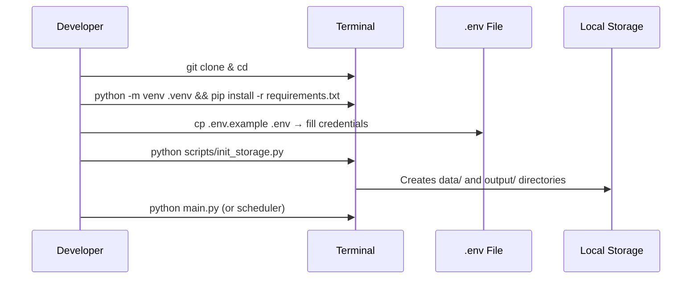

# Energy Options Opportunity Agent — User Guide

> **Version 1.0 · March 2026**
> This guide covers the full four-agent pipeline: from environment setup through running a complete cycle to interpreting ranked strategy candidates.

---

## Table of Contents

1. [Overview](#overview)
2. [Prerequisites](#prerequisites)
3. [Setup & Configuration](#setup--configuration)
4. [Running the Pipeline](#running-the-pipeline)
5. [Interpreting the Output](#interpreting-the-output)
6. [Troubleshooting](#troubleshooting)

---

## Overview

The **Energy Options Opportunity Agent** is a modular Python pipeline that identifies options trading opportunities driven by oil market instability. It ingests market data, supply signals, news events, and alternative datasets, then surfaces volatility mispricing in oil-related instruments and ranks candidate strategies by a computed edge score.

> ⚠️ **Advisory only.** The system produces recommendations; it does not execute trades automatically.

### Pipeline Architecture

Data flows unidirectionally through four loosely coupled agents that share a common market state object and a derived features store.

```mermaid
flowchart LR
    subgraph Inputs
        A1[Crude Prices\nAlpha Vantage / MetalpriceAPI]
        A2[ETF & Equity Prices\nyfinance / Yahoo Finance]
        A3[Options Chains\nYahoo Finance / Polygon.io]
        A4[Supply & Inventory\nEIA API]
        A5[News & Geo Events\nGDELT / NewsAPI]
        A6[Insider Activity\nSEC EDGAR / Quiver Quant]
        A7[Shipping / Logistics\nMarineTraffic / VesselFinder]
        A8[Narrative Sentiment\nReddit / Stocktwits]
    end

    subgraph Pipeline
        direction TB
        B[Data Ingestion Agent\nFetch & Normalize]
        C[Event Detection Agent\nSupply & Geo Signals]
        D[Feature Generation Agent\nDerived Signal Computation]
        E[Strategy Evaluation Agent\nOpportunity Ranking]
    end

    subgraph Output
        F[Ranked Candidates\nJSON / Dashboard]
    end

    Inputs --> B
    B -->|Unified Market State| C
    C -->|Scored Events| D
    D -->|Derived Features| E
    E --> F
```



### In-Scope Instruments

| Category | Instruments |
|---|---|
| Crude Futures | Brent Crude, WTI (`CL=F`) |
| ETFs | USO, XLE |
| Energy Equities | Exxon Mobil (XOM), Chevron (CVX) |

### Supported Option Structures (MVP)

| Structure | Enum Value |
|---|---|
| Long Straddle | `long_straddle` |
| Call Spread | `call_spread` |
| Put Spread | `put_spread` |
| Calendar Spread | `calendar_spread` |

---

## Prerequisites

### System Requirements

| Requirement | Minimum |
|---|---|
| Python | 3.10+ |
| RAM | 2 GB |
| Disk | 10 GB (6–12 months of historical data) |
| OS | Linux, macOS, or Windows (WSL2 recommended) |
| Deployment | Local machine, single VM, or container |

### Required Knowledge

- Comfortable with Python and a command-line interface.
- Familiarity with options terminology (implied volatility, strikes, expirations) is helpful but not strictly required to operate the pipeline.

### Python Dependencies

Install all dependencies from the project root:

```bash
pip install -r requirements.txt
```

Key libraries used by the pipeline include:

| Library | Purpose |
|---|---|
| `yfinance` | ETF, equity, and options data |
| `requests` | REST calls to EIA, GDELT, NewsAPI, EDGAR |
| `pandas` / `numpy` | Data normalization and feature computation |
| `scipy` | Volatility calculations |
| `gdeltdoc` | GDELT event feeds |
| `praw` | Reddit sentiment |
| `schedule` | Cadence-based refresh loops |
| `python-dotenv` | Environment variable management |

### API Accounts

Obtain free-tier credentials for the following services before configuring the pipeline:

| Service | Sign-up URL | Notes |
|---|---|---|
| Alpha Vantage | https://www.alphavantage.co/support/#api-key | Free tier; WTI/Brent spot |
| EIA | https://www.eia.gov/opendata/ | Free; weekly inventory data |
| NewsAPI | https://newsapi.org/register | Free tier; 100 req/day |
| Polygon.io | https://polygon.io/ | Free tier; options chains |
| Quiver Quant | https://www.quiverquant.com/ | Free/limited; insider trades |
| Reddit (PRAW) | https://www.reddit.com/prefs/apps | Free; create a "script" app |

> MarineTraffic, VesselFinder, GDELT, SEC EDGAR, Yahoo Finance (via `yfinance`), and Stocktwits do not require API keys on their free tiers.

---

## Setup & Configuration

### 1. Clone the Repository

```bash
git clone https://github.com/your-org/energy-options-agent.git
cd energy-options-agent
```

### 2. Create a Virtual Environment

```bash
python -m venv .venv
source .venv/bin/activate        # macOS / Linux
# .venv\Scripts\activate         # Windows
```

### 3. Install Dependencies

```bash
pip install -r requirements.txt
```

### 4. Configure Environment Variables

Copy the provided template and populate your credentials:

```bash
cp .env.example .env
```

Open `.env` in your editor and fill in each value. The full set of supported variables is listed below.

#### Environment Variable Reference

| Variable | Required | Default | Description |
|---|---|---|---|
| `ALPHA_VANTAGE_API_KEY` | ✅ | — | API key for crude price feeds (WTI, Brent) |
| `EIA_API_KEY` | ✅ | — | API key for EIA inventory and refinery utilization data |
| `NEWSAPI_KEY` | ✅ | — | API key for NewsAPI energy/geo event headlines |
| `POLYGON_API_KEY` | ⬜ | — | API key for Polygon.io options chain data (fallback: yfinance) |
| `QUIVER_QUANT_API_KEY` | ⬜ | — | API key for Quiver Quant insider trade data |
| `REDDIT_CLIENT_ID` | ⬜ | — | Reddit app client ID (PRAW) for sentiment feeds |
| `REDDIT_CLIENT_SECRET` | ⬜ | — | Reddit app client secret (PRAW) |
| `REDDIT_USER_AGENT` | ⬜ | `energy-agent/1.0` | Reddit user-agent string |
| `DATA_DIR` | ⬜ | `./data` | Root path for persisted raw and derived data |
| `OUTPUT_DIR` | ⬜ | `./output` | Directory where JSON candidate files are written |
| `LOG_LEVEL` | ⬜ | `INFO` | Logging verbosity: `DEBUG`, `INFO`, `WARNING`, `ERROR` |
| `MARKET_REFRESH_INTERVAL_SECONDS` | ⬜ | `300` | Cadence for market data refresh (minutes-level) |
| `EIA_REFRESH_INTERVAL_HOURS` | ⬜ | `24` | Cadence for EIA/EDGAR slow-feed refresh |
| `HISTORICAL_RETENTION_DAYS` | ⬜ | `365` | Days of raw and derived data to retain for backtesting |
| `MIN_EDGE_SCORE` | ⬜ | `0.20` | Minimum edge score threshold; candidates below this are suppressed |
| `MAX_CANDIDATES` | ⬜ | `10` | Maximum number of ranked candidates emitted per cycle |
| `PHASE` | ⬜ | `1` | Active MVP phase (`1`–`3`). Controls which agents and signals are enabled |

**Example `.env`:**

```dotenv
ALPHA_VANTAGE_API_KEY=YOUR_KEY_HERE
EIA_API_KEY=YOUR_KEY_HERE
NEWSAPI_KEY=YOUR_KEY_HERE
POLYGON_API_KEY=YOUR_KEY_HERE        # optional
QUIVER_QUANT_API_KEY=YOUR_KEY_HERE   # optional

DATA_DIR=./data
OUTPUT_DIR=./output
LOG_LEVEL=INFO

MARKET_REFRESH_INTERVAL_SECONDS=300
EIA_REFRESH_INTERVAL_HOURS=24
HISTORICAL_RETENTION_DAYS=365

MIN_EDGE_SCORE=0.20
MAX_CANDIDATES=10
PHASE=1
```

### 5. Initialise the Data Directory

Run the initialisation script to create the storage layout expected by all agents:

```bash
python scripts/init_storage.py
```

Expected output:

```
[INFO] Created data/raw/prices
[INFO] Created data/raw/options
[INFO] Created data/raw/events
[INFO] Created data/derived
[INFO] Created output/
[INFO] Storage initialised successfully.
```

### Setup Sequence (Summary)



---

## Running the Pipeline

### Single-Cycle Run (Recommended for First Use)

Execute one full pipeline cycle — ingest → detect → generate → evaluate — and write candidates to the output directory:

```bash
python main.py --once
```

This is the safest first run. It fetches current data, processes all enabled agents in sequence, and exits cleanly.

**Sample console output:**

```
[INFO]  [DataIngestionAgent]    Fetching WTI spot price ...  OK (52.31 USD)
[INFO]  [DataIngestionAgent]    Fetching USO options chain ... OK (142 contracts)
[INFO]  [EventDetectionAgent]   Scanning GDELT for energy disruptions ... 3 events detected
[INFO]  [EventDetectionAgent]   tanker_disruption: confidence=0.82, intensity=high
[INFO]  [FeatureGenerationAgent] volatility_gap=positive  curve_steepness=0.031
[INFO]  [FeatureGenerationAgent] narrative_velocity=rising supply_shock_prob=0.61
[INFO]  [StrategyEvaluationAgent] 5 candidates generated; 3 above MIN_EDGE_SCORE
[INFO]  Output written → output/candidates_20260315T143022Z.json
```

### Continuous Scheduled Run

To run the pipeline on its configured refresh cadence (market data every `MARKET_REFRESH_INTERVAL_SECONDS`, slow feeds every `EIA_REFRESH_INTERVAL_HOURS`):

```bash
python main.py
```

Stop with `Ctrl+C`. The scheduler is non-blocking; market and slow-feed refresh loops run independently.

### Running Individual Agents

Each agent can be invoked independently for development or debugging:

```bash
# Data ingestion only
python -m agents.ingestion --once

# Event detection only (requires an existing market state snapshot)
python -m agents.event_detection --once

# Feature generation only
python -m agents.feature_generation --once

# Strategy evaluation only
python -m agents.strategy_evaluation --once
```

### Running in a Container

A minimal `Dockerfile` is provided at the project root:

```bash
docker build -t energy-options-agent .
docker run --env-file .env -v $(pwd)/data:/app/data -v $(pwd)/output:/app/output \
  energy-options-agent python main.py
```

### Phase Selection

Enable additional signal layers by setting the `PHASE` variable in `.env` or passing it on the command line:

```bash
# Phase 2: adds EIA supply signals and event-driven edge scoring
PHASE=2 python main.py --once

# Phase 3: adds insider activity, narrative velocity, and shipping data
PHASE=3 python main.py --once
```

| Phase | Additional Capabilities |
|---|---|
| `1` | Core market signals — crude prices, ETF/equity, IV surface, long straddles, call/put spreads |
| `2` | EIA inventory, refinery utilization, GDELT/NewsAPI event detection, supply disruption indices |
| `3` | EDGAR/Quiver insider trades, Reddit/Stocktwits narrative velocity, MarineTraffic shipping data, calendar spreads |

Phase 4 (exotic structures, OPIS pricing, automated execution) is out of scope for the current MVP.

---

## Interpreting the Output

### Output File Location

Each completed pipeline cycle writes a timestamped JSON file:

```
output/candidates_<ISO8601_UTC>.json
```

Example path: `output/candidates_20260315T143022Z.json`

### Output Schema

Each file contains an array of candidate objects. All fields are described below.

| Field | Type | Description |
|---|---|---|
| `instrument` | `string` | Target instrument symbol, e.g. `USO`, `XLE`, `CL=F` |
| `structure` | `enum` | `long_straddle` \| `call_spread` \| `put_spread` \| `calendar_spread` |
| `expiration` | `integer` | Target expiration in calendar days from the evaluation date |
| `edge_score` | `float [0.0–1.0]` | Composite opportunity score; higher = stronger signal confluence |
| `signals` | `object` | Map of contributing signals and their qualitative values |
| `generated_at` | `ISO 8601 datetime` | UTC timestamp of candidate generation |

### Example Candidate

```json
{
  "instrument": "USO",
  "structure": "long_straddle",
  "expiration": 30,
  "edge_score": 0.47,
  "signals": {
    "tanker_disruption_index": "high",
    "volatility_gap": "positive",
    "narrative_velocity": "rising"
  },
  "generated_at": "2026-03-15T14:30:22Z"
}
```

### Reading the Edge Score

| Edge Score Range | Interpretation |
|---|---|
| `0.70 – 1.00` | Strong confluence — multiple independent signals aligned |
| `0.40 – 0.69` | Moderate confluence — worth monitoring; validate manually |
| `0.20 – 0.39` | Weak signal — low conviction; treat as background noise |
| `< 0.20` | Below threshold — suppressed by default (`MIN_EDGE_SCORE`) |

> The edge score is a composite heuristic, not a probability of profit. Always apply independent judgment before acting on any candidate.

### Reading the Signals Map

The `signals` object references the derived features that contributed most to the edge score for that candidate. Common signal keys and their meanings:

| Signal Key | Description |
|---|---|
| `volatility_gap` | `positive` = implied vol exceeds realized vol (expensive options); `negative` = realized exceeds implied (cheap options relative to movement) |
| `tanker_disruption_index` | Severity of detected shipping/logistics disruptions (`low` / `medium` / `high`) |
| `narrative_velocity` | Rate of acceleration in energy-related news and social mentions (`falling` / `neutral` / `rising`) |
| `supply_shock_probability` | Estimated likelihood of a near-term supply disruption event (`[0.0–1.0]`) |
| `curve_steepness` | Degree of contango or backwardation in the WTI/Brent futures curve |
| `sector_dispersion` | Spread between XOM/CVX and USO/XLE returns; elevated = differentiated opportunity |
| `insider_conviction_score` | Aggregated directional signal from recent EDGAR/Quiver