# Energy Options Opportunity Agent — User Guide

> **Version 1.0 • March 2026**
> This guide walks you through installing, configuring, and running the full pipeline end-to-end, and explains how to interpret the ranked output it produces.

---

## Table of Contents

1. [Overview](#overview)
2. [Prerequisites](#prerequisites)
3. [Setup & Configuration](#setup--configuration)
4. [Running the Pipeline](#running-the-pipeline)
5. [Interpreting the Output](#interpreting-the-output)
6. [Troubleshooting](#troubleshooting)

---

## Overview

The **Energy Options Opportunity Agent** is a four-stage autonomous pipeline that identifies options trading opportunities driven by oil market instability. It ingests raw market and alternative data, detects geopolitical and supply events, derives quantitative signals, and ranks candidate options strategies by a computed **edge score**.

The system is:

- **Advisory only** — no automated trade execution.
- **Modular** — each agent runs and deploys independently.
- **Low-cost** — built exclusively on free or low-cost data feeds.
- **Explainable** — every recommendation references the signals that drove it.

### Pipeline Architecture

```mermaid
flowchart LR
    subgraph Ingestion ["① Data Ingestion Agent"]
        A1[Crude Prices\nAlpha Vantage / MetalpriceAPI]
        A2[ETF & Equity Prices\nyfinance / Yahoo Finance]
        A3[Options Chains\nYahoo Finance / Polygon.io]
        A4[EIA Supply & Inventory]
    end

    subgraph Events ["② Event Detection Agent"]
        B1[News & Geo Feeds\nGDELT / NewsAPI]
        B2[Shipping & Tanker Flows\nMarineTraffic / VesselFinder]
        B3[Confidence & Intensity Scoring]
    end

    subgraph Features ["③ Feature Generation Agent"]
        C1[Volatility Gap\nRealised vs Implied]
        C2[Futures Curve Steepness]
        C3[Sector Dispersion]
        C4[Insider Conviction Score\nEDGAR / Quiver Quant]
        C5[Narrative Velocity\nReddit / Stocktwits]
        C6[Supply Shock Probability]
    end

    subgraph Strategy ["④ Strategy Evaluation Agent"]
        D1[Evaluate Eligible Structures]
        D2[Compute Edge Scores]
        D3[Ranked JSON Output]
    end

    MS[(Market State\nObject)]
    FS[(Derived Features\nStore)]

    Ingestion --> MS
    MS --> Events
    Events --> MS
    MS --> Features
    Features --> FS
    FS --> Strategy
    Strategy --> D3
```



Data flows **unidirectionally** — raw feeds are normalised into a shared market state object, events are scored and appended, features are derived into the features store, and finally strategies are evaluated and ranked.

### In-Scope Instruments & Structures

| Category | Items |
|---|---|
| **Crude Futures** | Brent Crude, WTI (`CL=F`) |
| **ETFs** | USO, XLE |
| **Energy Equities** | Exxon Mobil (XOM), Chevron (CVX) |
| **Option Structures (MVP)** | Long straddle, call spread, put spread, calendar spread |

---

## Prerequisites

### System Requirements

| Requirement | Minimum |
|---|---|
| Python | 3.10 or later |
| OS | Linux, macOS, or Windows (WSL2 recommended) |
| RAM | 2 GB |
| Disk | 10 GB free (for 6–12 months of historical data) |
| Deployment target | Local machine, single VM, or single container |

### Required Knowledge

- Comfortable running commands in a terminal.
- Basic familiarity with Python virtual environments and `pip`.
- Familiarity with JSON output format.
- No prior options trading knowledge is required to run the pipeline, though it helps when interpreting results.

### API Accounts

Register for the following free-tier accounts before proceeding. All are free unless noted.

| Service | Used For | Sign-up URL | Notes |
|---|---|---|---|
| Alpha Vantage | WTI / Brent spot & futures | `alphavantage.co` | Free tier; 25 req/day |
| Yahoo Finance (`yfinance`) | ETF, equity, options chain data | No account required | Rate-limited |
| Polygon.io | Options chain supplement | `polygon.io` | Free tier available |
| EIA Open Data | Supply & inventory | `eia.gov/opendata` | Free government API |
| GDELT Project | Geopolitical news events | No account required | Public dataset |
| NewsAPI | News headlines | `newsapi.org` | Free developer tier |
| SEC EDGAR | Insider trade filings | No account required | Public |
| Quiver Quant | Parsed insider data | `quiverquant.com` | Free tier limited |
| MarineTraffic | Tanker / shipping flows | `marinetraffic.com` | Free tier limited |
| Reddit API | Narrative / sentiment | `reddit.com/prefs/apps` | Free |
| Stocktwits API | Retail sentiment | `api.stocktwits.com` | Free |

> **Phase note:** Not all sources are required for every phase. Phases 1 and 2 require only Alpha Vantage, yfinance/Polygon.io, and the EIA API. Alternative data sources (EDGAR, MarineTraffic, Reddit, Stocktwits) are consumed in Phase 3. See [MVP Phasing](#mvp-phasing) below.

---

## Setup & Configuration

### 1. Clone the Repository

```bash
git clone https://github.com/your-org/energy-options-agent.git
cd energy-options-agent
```

### 2. Create a Virtual Environment

```bash
python3 -m venv .venv
source .venv/bin/activate        # Linux / macOS
# .venv\Scripts\activate         # Windows
```

### 3. Install Dependencies

```bash
pip install --upgrade pip
pip install -r requirements.txt
```

### 4. Configure Environment Variables

The pipeline is configured entirely through environment variables. Copy the provided template and populate it with your API keys and runtime preferences.

```bash
cp .env.example .env
```

Open `.env` in your editor and fill in each value. The full set of supported variables is described in the table below.

#### Environment Variable Reference

| Variable | Required | Default | Description |
|---|---|---|---|
| `ALPHA_VANTAGE_API_KEY` | Yes | — | API key for Alpha Vantage crude price feed |
| `POLYGON_API_KEY` | No | — | API key for Polygon.io options chain data |
| `EIA_API_KEY` | Yes | — | API key for EIA supply & inventory data |
| `NEWSAPI_KEY` | No | — | API key for NewsAPI headline feed |
| `QUIVER_QUANT_API_KEY` | No | — | API key for Quiver Quant insider data |
| `MARINE_TRAFFIC_API_KEY` | No | — | API key for MarineTraffic tanker feed |
| `REDDIT_CLIENT_ID` | No | — | Reddit OAuth client ID |
| `REDDIT_CLIENT_SECRET` | No | — | Reddit OAuth client secret |
| `REDDIT_USER_AGENT` | No | `energy-agent/1.0` | Reddit API user-agent string |
| `STOCKTWITS_ACCESS_TOKEN` | No | — | Stocktwits API access token |
| `PIPELINE_PHASE` | Yes | `1` | Active MVP phase: `1`, `2`, or `3` |
| `INSTRUMENTS` | No | `USO,XLE,XOM,CVX,CL=F` | Comma-separated list of instruments to evaluate |
| `OUTPUT_PATH` | No | `./output/candidates.json` | File path for ranked JSON output |
| `HISTORY_DAYS` | No | `180` | Days of historical data to retain (180–365 recommended) |
| `MARKET_DATA_INTERVAL_MINUTES` | No | `5` | Polling cadence for market data feeds (minutes) |
| `LOG_LEVEL` | No | `INFO` | Logging verbosity: `DEBUG`, `INFO`, `WARNING`, `ERROR` |
| `DB_PATH` | No | `./data/market_state.db` | Path to the local SQLite store for market state and features |

> **Security:** Never commit `.env` to version control. The `.gitignore` included in the repository already excludes it.

#### Minimal `.env` for Phase 1

```dotenv
ALPHA_VANTAGE_API_KEY=your_alpha_vantage_key
EIA_API_KEY=your_eia_key
PIPELINE_PHASE=1
OUTPUT_PATH=./output/candidates.json
LOG_LEVEL=INFO
```

### 5. Initialise the Data Store

Run the database initialisation script once before the first pipeline execution. This creates the SQLite schema for the market state object, derived features store, and output tables.

```bash
python scripts/init_db.py
```

Expected output:

```
[INFO] Creating tables: market_state, events, features, candidates ...
[INFO] Database initialised at ./data/market_state.db
```

### MVP Phasing

Enable only the agents you need for your current development phase by setting `PIPELINE_PHASE`.

| Phase | Name | Active Agents / Sources |
|---|---|---|
| `1` | Core Market Signals & Options | Alpha Vantage, yfinance/Polygon.io — long straddles, call/put spreads |
| `2` | Supply & Event Augmentation | Phase 1 + EIA inventory, GDELT/NewsAPI event detection |
| `3` | Alternative / Contextual Signals | Phase 2 + EDGAR/Quiver Quant, Reddit/Stocktwits, MarineTraffic |
| `4` | High-Fidelity Enhancements | Deferred — see [Future Considerations](#future-considerations) |

---

## Running the Pipeline

### Single Run (On-Demand)

To execute a single full pipeline pass — ingest, detect, compute features, evaluate strategies, and write output:

```bash
python -m agent.pipeline run
```

The four agents execute in sequence:

```
[INFO] [1/4] DataIngestionAgent     starting ...
[INFO] [1/4] DataIngestionAgent     complete — market state updated
[INFO] [2/4] EventDetectionAgent    starting ...
[INFO] [2/4] EventDetectionAgent    complete — 3 events detected
[INFO] [3/4] FeatureGenerationAgent starting ...
[INFO] [3/4] FeatureGenerationAgent complete — 6 features computed
[INFO] [4/4] StrategyEvaluationAgent starting ...
[INFO] [4/4] StrategyEvaluationAgent complete — 5 candidates ranked
[INFO] Output written to ./output/candidates.json
```

### Continuous / Scheduled Mode

For continuous operation with automatic refresh at the configured cadence:

```bash
python -m agent.pipeline run --continuous
```

- **Market data** refreshes on the `MARKET_DATA_INTERVAL_MINUTES` cadence (default: every 5 minutes).
- **Slow feeds** (EIA, EDGAR) refresh on their native daily or weekly schedule and are cached locally between updates.
- The process runs until interrupted with `Ctrl+C`.

### Running Individual Agents

Each agent can be invoked independently for development, debugging, or incremental testing.

```bash
# Run only the Data Ingestion Agent
python -m agent.ingestion run

# Run only the Event Detection Agent
python -m agent.events run

# Run only the Feature Generation Agent
python -m agent.features run

# Run only the Strategy Evaluation Agent
python -m agent.strategy run
```

> **Note:** Each agent reads from the shared data store. Running agents out of order will use whatever data was most recently persisted.

### Running with Docker

A `Dockerfile` and `docker-compose.yml` are provided for containerised deployment.

```bash
# Build the image
docker build -t energy-options-agent:latest .

# Run a single pass using your local .env file
docker run --env-file .env energy-options-agent:latest

# Run in continuous mode
docker run --env-file .env energy-options-agent:latest python -m agent.pipeline run --continuous
```

### Common CLI Flags

| Flag | Description |
|---|---|
| `--phase N` | Override `PIPELINE_PHASE` for this run only |
| `--instruments USO,XOM` | Override `INSTRUMENTS` for this run only |
| `--output path/to/file.json` | Override `OUTPUT_PATH` for this run only |
| `--dry-run` | Execute all agents but do not write output to disk |
| `--verbose` | Equivalent to `LOG_LEVEL=DEBUG` for this run only |

Example:

```bash
python -m agent.pipeline run --phase 2 --instruments USO,XLE --verbose
```

---

## Interpreting the Output

### Output File Location

By default, ranked candidates are written to `./output/candidates.json` after every pipeline run. The path is configurable via `OUTPUT_PATH`.

### Output Schema

Each element of the output array is a **strategy candidate** with the following fields:

| Field | Type | Description |
|---|---|---|
| `instrument` | `string` | Target instrument, e.g. `"USO"`, `"XLE"`, `"CL=F"` |
| `structure` | `enum` | Options structure: `long_straddle` \| `call_spread` \| `put_spread` \| `calendar_spread` |
| `expiration` | `integer` | Target expiration in calendar days from the evaluation date |
| `edge_score` | `float [0.0–1.0]` | Composite opportunity score — higher values indicate stronger signal confluence |
| `signals` | `object` | Map of contributing signals and their current states |
| `generated_at` | ISO 8601 datetime | UTC timestamp of candidate generation |

### Example Output

```json
[
  {
    "instrument": "USO",
    "structure": "long_straddle",
    "expiration": 30,
    "edge_score": 0.47,
    "signals": {
      "tanker_disruption_index": "high",
      "volatility_gap": "positive",
      "narrative_velocity": "rising"
    },
    "generated_at": "2026-03-15T14:32:00Z"
  },
  {
    "instrument": "XLE",
    "structure": "call_spread",
    "expiration": 21,
    "edge_score": 0.31,
    "signals": {
      "volatility_gap": "positive",
      "supply_shock_probability": "elevated",
      "sector_dispersion": "widening"
    },
    "generated_at": "2026-03-15T14:32:00Z"
  }
]
```

### Reading the Edge Score

The `edge_score` is a composite float between `0.0` and `1.0` that reflects the degree of signal confluence supporting a candidate trade.

| Edge Score Range | Interpretation |
|---|---|
| `0.70 – 1.00` | Strong confluence — multiple high-conviction signals align |
| `0.40 – 0.69` | Moderate confluence — worth monitoring; corroborate with additional context |
| `0.10 – 0.39` | Weak confluence — signals are present but sparse or conflicting |
| `0.00 – 0.09` | Noise — candidate surfaced by minimal signal overlap; low confidence |

> **Important:** The edge score is an opportunity indicator, not a profit prediction. The system is **advisory only** — no automated execution occurs. Always apply your own risk management before acting on any candidate.

### Understanding the Signals Map

The `signals` object tells you **why** a candidate was generated. Each key is a named derived feature; each value is its qualitative state at evaluation time.

| Signal Key | Derived By | Possible Values |
|---|---|---|
| `volatility_gap` | Feature Generation Agent | `positive`, `negative`, `neutral` |
| `futures_curve_steepness` | Feature Generation Agent | `steep`, `flat`, `inverted` |
| `sector_dispersion` | Feature Generation Agent | `widening`, `stable`, `narrowing` |
| `insider_conviction