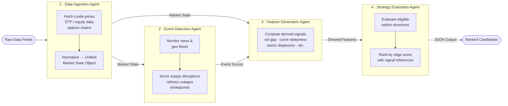

# Energy Options Opportunity Agent — User Guide

> **Version 1.0 • March 2026**
> This guide covers the full pipeline: setup, configuration, execution, output interpretation, and troubleshooting.

---

## Table of Contents

1. [Overview](#overview)
2. [Prerequisites](#prerequisites)
3. [Setup & Configuration](#setup--configuration)
4. [Running the Pipeline](#running-the-pipeline)
5. [Interpreting the Output](#interpreting-the-output)
6. [Troubleshooting](#troubleshooting)

---

## Overview

The **Energy Options Opportunity Agent** is an autonomous, modular Python pipeline that identifies options trading opportunities driven by oil market instability. It ingests market data, supply signals, news events, and alternative datasets to produce structured, ranked candidate options strategies.

The system is composed of **four loosely coupled agents** that communicate via a shared market state object and a derived features store:



### What the pipeline produces

For each candidate opportunity the pipeline emits a JSON object containing:

| Field | Description |
|---|---|
| `instrument` | Target instrument (e.g. `USO`, `XLE`, `CL=F`) |
| `structure` | Options structure type |
| `expiration` | Days to target expiration |
| `edge_score` | Composite opportunity score `[0.0 – 1.0]` |
| `signals` | Map of contributing signals and their states |
| `generated_at` | UTC ISO 8601 timestamp |

> **Advisory only.** The system does **not** execute trades. All output is informational.

---

## Prerequisites

### System requirements

| Requirement | Minimum |
|---|---|
| Python | 3.10 or later |
| OS | Linux, macOS, or Windows (WSL2 recommended) |
| RAM | 2 GB |
| Disk | 10 GB free (for 6–12 months of historical data) |
| Network | Outbound HTTPS access to all data sources |

### External accounts and API keys

All sources are free or free-tier. Register for each before running the pipeline.

| Service | Used by | Registration URL |
|---|---|---|
| Alpha Vantage | Crude prices (WTI, Brent) | https://www.alphavantage.co/support/#api-key |
| Yahoo Finance / yfinance | ETF, equity, options data | No key required (library-based) |
| Polygon.io | Options chains (optional upgrade) | https://polygon.io/dashboard/signup |
| EIA API | Supply/inventory data | https://www.eia.gov/opendata/register.php |
| GDELT | News & geopolitical events | No key required |
| NewsAPI | News events | https://newsapi.org/register |
| SEC EDGAR | Insider activity | No key required |
| Quiver Quant | Insider activity (enhanced) | https://www.quiverquant.com/signup |
| MarineTraffic | Tanker/shipping data | https://www.marinetraffic.com/en/p/register |
| Reddit API | Narrative/sentiment | https://www.reddit.com/prefs/apps |

> **Phase 1 minimum.** For an initial MVP (Phase 1), you only need **Alpha Vantage** and **yfinance**. Additional keys become required as you enable later phases.

### Python dependencies

```bash
pip install -r requirements.txt
```

A representative `requirements.txt` includes:

```text
yfinance>=0.2
requests>=2.31
pandas>=2.0
numpy>=1.26
pydantic>=2.0
python-dotenv>=1.0
schedule>=1.2
```

---

## Setup & Configuration

### 1. Clone the repository

```bash
git clone https://github.com/your-org/energy-options-agent.git
cd energy-options-agent
```

### 2. Create a virtual environment

```bash
python -m venv .venv
source .venv/bin/activate        # Linux / macOS
# .venv\Scripts\activate.bat     # Windows CMD
# .venv\Scripts\Activate.ps1     # Windows PowerShell
```

### 3. Install dependencies

```bash
pip install --upgrade pip
pip install -r requirements.txt
```

### 4. Configure environment variables

Copy the provided template and populate your keys:

```bash
cp .env.example .env
```

Then edit `.env`. The table below documents every supported variable.

#### Environment variable reference

| Variable | Required | Default | Description |
|---|---|---|---|
| `ALPHA_VANTAGE_API_KEY` | Yes (Phase 1+) | — | API key for crude price feeds (WTI, Brent) |
| `EIA_API_KEY` | Yes (Phase 2+) | — | API key for EIA inventory and refinery utilization data |
| `NEWS_API_KEY` | Yes (Phase 2+) | — | API key for NewsAPI news/geo event feed |
| `POLYGON_API_KEY` | No | — | Polygon.io key for enhanced options chain data |
| `QUIVER_QUANT_API_KEY` | No | — | Quiver Quant key for insider conviction signals |
| `MARINE_TRAFFIC_API_KEY` | No | — | MarineTraffic key for tanker flow data |
| `REDDIT_CLIENT_ID` | No | — | Reddit OAuth client ID for sentiment feed |
| `REDDIT_CLIENT_SECRET` | No | — | Reddit OAuth client secret |
| `REDDIT_USER_AGENT` | No | `energy-agent/1.0` | Reddit API user-agent string |
| `OUTPUT_DIR` | No | `./output` | Directory where JSON output files are written |
| `HISTORICAL_DATA_DIR` | No | `./data/historical` | Directory for persisted raw and derived data |
| `RETENTION_DAYS` | No | `365` | Days of historical data to retain (180–365 recommended) |
| `PIPELINE_PHASE` | No | `1` | Active feature phase: `1`, `2`, or `3` |
| `REFRESH_INTERVAL_MINUTES` | No | `5` | Cadence for market data refresh (minutes-level feeds) |
| `LOG_LEVEL` | No | `INFO` | Logging verbosity: `DEBUG`, `INFO`, `WARNING`, `ERROR` |
| `EDGE_SCORE_THRESHOLD` | No | `0.30` | Minimum edge score for a candidate to appear in output |

#### Example `.env` file

```dotenv
# --- Required (Phase 1) ---
ALPHA_VANTAGE_API_KEY=YOUR_AV_KEY_HERE

# --- Required (Phase 2) ---
EIA_API_KEY=YOUR_EIA_KEY_HERE
NEWS_API_KEY=YOUR_NEWSAPI_KEY_HERE

# --- Optional enhancements ---
POLYGON_API_KEY=
QUIVER_QUANT_API_KEY=
MARINE_TRAFFIC_API_KEY=
REDDIT_CLIENT_ID=
REDDIT_CLIENT_SECRET=
REDDIT_USER_AGENT=energy-agent/1.0

# --- Pipeline behaviour ---
PIPELINE_PHASE=1
REFRESH_INTERVAL_MINUTES=5
OUTPUT_DIR=./output
HISTORICAL_DATA_DIR=./data/historical
RETENTION_DAYS=365
EDGE_SCORE_THRESHOLD=0.30
LOG_LEVEL=INFO
```

### 5. Initialise the data directories

```bash
python scripts/init_storage.py
```

This creates the `OUTPUT_DIR` and `HISTORICAL_DATA_DIR` directories and validates that required API keys for the configured `PIPELINE_PHASE` are present.

---

## Running the Pipeline

### Pipeline execution modes

| Mode | Command | Use case |
|---|---|---|
| Single run | `python run_pipeline.py --once` | Ad-hoc evaluation; CI/testing |
| Scheduled loop | `python run_pipeline.py` | Continuous operation at `REFRESH_INTERVAL_MINUTES` cadence |
| Individual agent | `python run_agent.py <agent_name>` | Debug or develop a single agent in isolation |

### Single run

```bash
python run_pipeline.py --once
```

The pipeline will:

1. Invoke the **Data Ingestion Agent** to fetch and normalize all configured feeds.
2. Invoke the **Event Detection Agent** to score supply and geopolitical signals.
3. Invoke the **Feature Generation Agent** to compute derived signals.
4. Invoke the **Strategy Evaluation Agent** to rank and emit candidate opportunities.
5. Write results to `OUTPUT_DIR/candidates_<ISO8601_timestamp>.json`.

### Continuous scheduled run

```bash
python run_pipeline.py
```

The scheduler wakes every `REFRESH_INTERVAL_MINUTES` minutes for market data. Slower feeds (EIA, EDGAR) are refreshed on their own daily/weekly schedules automatically.

```
[2026-03-15 09:00:00 UTC] INFO  Pipeline started. Phase=1, Interval=5min
[2026-03-15 09:00:02 UTC] INFO  [DataIngestion] Fetched WTI: 82.14, Brent: 85.30
[2026-03-15 09:00:04 UTC] INFO  [DataIngestion] Fetched USO, XLE, XOM, CVX options chains
[2026-03-15 09:00:05 UTC] INFO  [EventDetection] 0 supply disruption events detected
[2026-03-15 09:00:06 UTC] INFO  [FeatureGen] vol_gap=+0.04, curve_steepness=contango
[2026-03-15 09:00:07 UTC] INFO  [StrategyEval] 3 candidates above threshold (0.30)
[2026-03-15 09:00:07 UTC] INFO  Output written → ./output/candidates_2026-03-15T090007Z.json
```

### Running an individual agent

Use this for development, debugging, or incremental integration:

```bash
python run_agent.py data_ingestion
python run_agent.py event_detection
python run_agent.py feature_generation
python run_agent.py strategy_evaluation
```

Each agent reads its expected inputs from the shared state store on disk and writes its outputs back to the same store.

### Activating pipeline phases

Set `PIPELINE_PHASE` in `.env` to enable progressively richer signals:

| Phase | Agents active | New data sources enabled |
|---|---|---|
| `1` | All four (core only) | Alpha Vantage, yfinance |
| `2` | All four + event scoring | EIA API, GDELT, NewsAPI |
| `3` | All four + alt signals | EDGAR, Quiver Quant, MarineTraffic, Reddit/Stocktwits |

```bash
# Switch to Phase 2
echo "PIPELINE_PHASE=2" >> .env
python run_pipeline.py --once
```

---

## Interpreting the Output

### Output file location

```
output/
└── candidates_2026-03-15T090007Z.json
```

Each run produces a timestamped file. The scheduler does not overwrite prior runs, supporting audit trails and backtesting.

### Output schema

```json
[
  {
    "instrument":   "USO",
    "structure":    "long_straddle",
    "expiration":   30,
    "edge_score":   0.47,
    "signals": {
      "tanker_disruption_index": "high",
      "volatility_gap":          "positive",
      "narrative_velocity":      "rising"
    },
    "generated_at": "2026-03-15T09:00:07Z"
  }
]
```

### Field-by-field reference

| Field | Type | Notes |
|---|---|---|
| `instrument` | string | One of: `USO`, `XLE`, `XOM`, `CVX`, `CL=F` (WTI), `BZ=F` (Brent) |
| `structure` | enum | `long_straddle`, `call_spread`, `put_spread`, `calendar_spread` |
| `expiration` | integer | Calendar days from the evaluation date to the target expiration |
| `edge_score` | float `[0.0–1.0]` | Higher = stronger signal confluence; candidates below `EDGE_SCORE_THRESHOLD` are suppressed |
| `signals` | object | Key–value map of the signals that contributed to this candidate's score |
| `generated_at` | ISO 8601 UTC | Timestamp of candidate generation |

### Signal values

| Signal key | Possible values | What it means |
|---|---|---|
| `volatility_gap` | `positive`, `negative`, `neutral` | Realized vol minus implied vol; `positive` = IV may be underpriced |
| `curve_steepness` | `contango`, `backwardation`, `flat` | Shape of the WTI/Brent futures curve |
| `supply_shock_probability` | `low`, `medium`, `high` | Probability score from supply disruption model |
| `tanker_disruption_index` | `low`, `medium`, `high` | Derived from shipping/logistics feed (Phase 3) |
| `narrative_velocity` | `falling`, `stable`, `rising` | Rate of change of energy-related headline volume |
| `insider_conviction` | `low`, `medium`, `high` | Aggregated insider trade signal (Phase 3) |
| `sector_dispersion` | `low`, `medium`, `high` | Cross-sector correlation divergence indicator |

### Ranking and acting on candidates

- Candidates are ordered **descending by `edge_score`**.
- A score above **0.50** indicates strong multi-signal confluence; treat with higher priority.
- Always cross-reference the `signals` map to understand *why* a candidate scored highly before considering any position.
- The output is designed to be consumed directly in **thinkorswim** or any JSON-capable dashboard.

### Loading output in Python

```python
import json
from pathlib import Path

latest = sorted(Path("output").glob("candidates_*.json"))[-1]
candidates = json.loads(latest.read_text())

for c in sorted(candidates, key=lambda x: x["edge_score"], reverse=True):
    print(f"{c['edge_score']:.2f}  {c['instrument']:6s}  {c['structure']}")
```

---

## Troubleshooting

### Common issues

| Symptom | Likely cause | Resolution |
|---|---|---|
| `KeyError: ALPHA_VANTAGE_API_KEY` | Missing key in `.env` | Add the key and re-run `init_storage.py` to validate |
| `No candidates above threshold` | `EDGE_SCORE_THRESHOLD` too high, or low-signal market conditions | Lower `EDGE_SCORE_THRESHOLD` temporarily, or inspect feature output with `LOG_LEVEL=DEBUG` |
| `Rate limit exceeded` (Alpha Vantage) | Free tier allows 5 req/min, 500 req/day | Increase `REFRESH_INTERVAL_MINUTES` to `≥ 15` |
| `yfinance returned empty options chain` | Options data not yet available for the trading session | Run after market open; options chains update once daily |
| Agent exits with `ConnectionError` | Transient network issue | The pipeline is designed to tolerate missing data; re-run