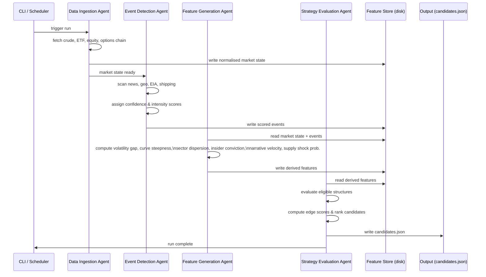

# Energy Options Opportunity Agent — User Guide

> **Version 1.0 • March 2026**
> Advisory only. The system surfaces ranked options candidates; it does **not** execute trades.

---

## Table of Contents

1. [Overview](#overview)
2. [Prerequisites](#prerequisites)
3. [Setup & Configuration](#setup--configuration)
4. [Running the Pipeline](#running-the-pipeline)
5. [Interpreting the Output](#interpreting-the-output)
6. [Troubleshooting](#troubleshooting)

---

## Overview

The **Energy Options Opportunity Agent** is a modular Python pipeline that detects volatility mispricing in oil-related instruments and surfaces ranked options trading candidates. It is designed for a single developer running on local hardware or a low-cost cloud VM.

The pipeline is composed of four loosely coupled agents that execute in sequence:

```mermaid
flowchart LR
    subgraph Ingestion["1 · Data Ingestion Agent"]
        A1[Crude Prices\nWTI · Brent]
        A2[ETF / Equity\nUSO · XLE · XOM · CVX]
        A3[Options Chains\nIV · Strike · Volume]
    end

    subgraph Events["2 · Event Detection Agent"]
        B1[News & Geo\nGDELT · NewsAPI]
        B2[Supply / Inventory\nEIA API]
        B3[Shipping\nMarineTraffic]
        B4[Confidence &\nIntensity Scores]
    end

    subgraph Features["3 · Feature Generation Agent"]
        C1[Volatility Gap\nRealised vs Implied]
        C2[Futures Curve\nSteepness]
        C3[Supply Shock\nProbability]
        C4[Narrative Velocity\nInsider Conviction]
    end

    subgraph Strategy["4 · Strategy Evaluation Agent"]
        D1[Eligible Structures\nStraddle · Spreads]
        D2[Edge Score\n0.0 – 1.0]
        D3[Ranked Candidates\nJSON Output]
    end

    Ingestion -->|market state object| Events
    Events    -->|scored events| Features
    Features  -->|derived signals| Strategy
    Strategy  -->|candidates.json| Output[(Output\nJSON / Dashboard)]
```



### In-scope instruments

| Category | Instruments |
|---|---|
| Crude futures | Brent Crude, WTI (`CL=F`) |
| ETFs | USO, XLE |
| Energy equities | Exxon Mobil (XOM), Chevron (CVX) |

### In-scope option structures (MVP)

| Structure | Enum value |
|---|---|
| Long straddle | `long_straddle` |
| Call spread | `call_spread` |
| Put spread | `put_spread` |
| Calendar spread | `calendar_spread` |

> **Out of scope (Phase 4 / future):** exotic or multi-legged strategies, regional refined product pricing (OPIS), automated trade execution.

---

## Prerequisites

### System requirements

| Requirement | Minimum |
|---|---|
| Python | 3.10 or later |
| Operating system | Linux, macOS, or Windows (WSL recommended) |
| RAM | 2 GB |
| Disk | 5 GB free (6–12 months of historical data) |
| Network | Outbound HTTPS to API endpoints |

### Required tools

```bash
# Verify Python version
python --version          # must be >= 3.10

# Verify pip
pip --version

# Verify git
git --version
```

### API accounts

The following free or freemium accounts are required. Register before proceeding.

| Service | Used by | Tier needed | Sign-up URL |
|---|---|---|---|
| Alpha Vantage | Data Ingestion (crude prices) | Free | https://www.alphavantage.co |
| Yahoo Finance / yfinance | Data Ingestion (ETF, equity, options) | Free (no key needed) | — |
| Polygon.io | Data Ingestion (options chains, fallback) | Free / Limited | https://polygon.io |
| EIA API | Event Detection (supply / inventory) | Free | https://www.eia.gov/opendata |
| GDELT | Event Detection (news / geo) | Free (no key needed) | — |
| NewsAPI | Event Detection (news headlines) | Free | https://newsapi.org |
| SEC EDGAR | Feature Generation (insider activity) | Free (no key needed) | — |
| Quiver Quant | Feature Generation (insider conviction) | Free / Limited | https://www.quiverquant.com |
| MarineTraffic | Feature Generation (shipping / tanker flows) | Free tier | https://www.marinetraffic.com |
| Reddit API | Feature Generation (narrative sentiment) | Free | https://www.reddit.com/wiki/api |

---

## Setup & Configuration

### 1. Clone the repository

```bash
git clone https://github.com/your-org/energy-options-agent.git
cd energy-options-agent
```

### 2. Create and activate a virtual environment

```bash
python -m venv .venv

# Linux / macOS
source .venv/bin/activate

# Windows (PowerShell)
.venv\Scripts\Activate.ps1
```

### 3. Install dependencies

```bash
pip install --upgrade pip
pip install -r requirements.txt
```

### 4. Configure environment variables

Copy the provided template and populate your credentials:

```bash
cp .env.example .env
```

Open `.env` in your editor and fill in every value marked `REQUIRED`.

#### Complete environment variable reference

| Variable | Required | Default | Description |
|---|---|---|---|
| `ALPHA_VANTAGE_API_KEY` | ✅ | — | API key for Alpha Vantage crude price feed |
| `POLYGON_API_KEY` | ✅ | — | API key for Polygon.io options chain data |
| `EIA_API_KEY` | ✅ | — | API key for EIA supply / inventory data |
| `NEWS_API_KEY` | ✅ | — | API key for NewsAPI headline feed |
| `QUIVER_QUANT_API_KEY` | ⬜ | — | API key for Quiver Quant insider data (Phase 3) |
| `MARINE_TRAFFIC_API_KEY` | ⬜ | — | API key for MarineTraffic tanker flow data (Phase 3) |
| `REDDIT_CLIENT_ID` | ⬜ | — | Reddit app client ID for sentiment feed (Phase 3) |
| `REDDIT_CLIENT_SECRET` | ⬜ | — | Reddit app client secret (Phase 3) |
| `REDDIT_USER_AGENT` | ⬜ | `energy-agent/1.0` | Reddit API user-agent string (Phase 3) |
| `DATA_DIR` | ⬜ | `./data` | Root directory for raw and derived data storage |
| `OUTPUT_DIR` | ⬜ | `./output` | Directory where `candidates.json` is written |
| `LOG_LEVEL` | ⬜ | `INFO` | Python logging level (`DEBUG`, `INFO`, `WARNING`, `ERROR`) |
| `MARKET_DATA_INTERVAL_MINUTES` | ⬜ | `5` | Polling cadence for minute-level market data feeds |
| `HISTORY_RETENTION_DAYS` | ⬜ | `365` | Days of historical data to retain on disk |
| `PIPELINE_PHASE` | ⬜ | `1` | Active MVP phase (`1`–`3`); gates which agents are enabled |
| `EDGE_SCORE_THRESHOLD` | ⬜ | `0.30` | Minimum edge score for a candidate to appear in output |
| `TZ` | ⬜ | `UTC` | Timezone for all timestamps; strongly recommended to leave as `UTC` |

> **Security note:** Never commit `.env` to version control. The repository's `.gitignore` already excludes it.

#### Example `.env` (Phase 1)

```dotenv
# --- Required ---
ALPHA_VANTAGE_API_KEY=your_alpha_vantage_key_here
POLYGON_API_KEY=your_polygon_key_here
EIA_API_KEY=your_eia_key_here
NEWS_API_KEY=your_newsapi_key_here

# --- Optional overrides ---
DATA_DIR=./data
OUTPUT_DIR=./output
LOG_LEVEL=INFO
PIPELINE_PHASE=1
EDGE_SCORE_THRESHOLD=0.30
TZ=UTC
```

### 5. Initialise the data store

Creates the directory structure and seeds the SQLite database used for historical storage:

```bash
python -m agent init
```

Expected output:

```
[INFO] Data directory created at ./data
[INFO] Output directory created at ./output
[INFO] Historical database initialised (retention: 365 days)
[INFO] Initialisation complete.
```

---

## Running the Pipeline

### Pipeline phases

Set `PIPELINE_PHASE` in `.env` to control which agents are active:

| Phase | Name | Active agents / signals |
|---|---|---|
| `1` | Core Market Signals & Options | Data Ingestion, Feature Generation (IV / volatility gap, curve steepness), Strategy Evaluation |
| `2` | Supply & Event Augmentation | Adds Event Detection (EIA inventory, GDELT/NewsAPI), supply disruption indices |
| `3` | Alternative / Contextual Signals | Adds insider conviction (EDGAR/Quiver), narrative velocity (Reddit/Stocktwits), shipping data (MarineTraffic) |

### Single run (one-shot)

Executes the full pipeline once and writes `candidates.json` to `OUTPUT_DIR`:

```bash
python -m agent run
```

### Continuous mode (polling)

Runs the pipeline on the cadence defined by `MARKET_DATA_INTERVAL_MINUTES`:

```bash
python -m agent run --continuous
```

Stop with <kbd>Ctrl</kbd>+<kbd>C</kbd>. The pipeline handles partial or missing data gracefully and will not crash on a failed upstream fetch.

### Run a specific agent only

Each agent can be invoked independently for testing or incremental development:

```bash
# Data Ingestion only
python -m agent run --agent ingestion

# Event Detection only
python -m agent run --agent events

# Feature Generation only
python -m agent run --agent features

# Strategy Evaluation only (reads from cached feature store)
python -m agent run --agent strategy
```

### Override output path

```bash
python -m agent run --output /tmp/my_candidates.json
```

### Dry run (no disk writes)

Runs the full pipeline and prints output to stdout without writing files:

```bash
python -m agent run --dry-run
```

### Pipeline execution flow (sequence)



---

## Interpreting the Output

### Output file location

```
./output/candidates.json
```

The file contains a JSON array. Each element is one ranked strategy candidate.

### Output schema

| Field | Type | Description |
|---|---|---|
| `instrument` | `string` | Target instrument, e.g. `"USO"`, `"XLE"`, `"CL=F"` |
| `structure` | `enum` | `long_straddle` \| `call_spread` \| `put_spread` \| `calendar_spread` |
| `expiration` | `integer` | Calendar days to target expiration from evaluation date |
| `edge_score` | `float [0.0–1.0]` | Composite opportunity score — higher means stronger signal confluence |
| `signals` | `object` | Map of contributing signals and their qualitative values |
| `generated_at` | `ISO 8601 datetime` | UTC timestamp of candidate generation |

### Example output

```json
[
  {
    "instrument": "USO",
    "structure": "long_straddle",
    "expiration": 30,
    "edge_score": 0.47,
    "signals": {
      "tanker_disruption_index": "high",
      "volatility_gap": "positive",
      "narrative_velocity": "rising"
    },
    "generated_at": "2026-03-15T14:32:00Z"
  },
  {
    "instrument": "XLE",
    "structure": "call_spread",
    "expiration": 21,
    "edge_score": 0.38,
    "signals": {
      "volatility_gap": "positive",
      "futures_curve_steepness": "elevated",
      "supply_shock_probability": "moderate"
    },
    "generated_at": "2026-03-15T14:32:00Z"
  }
]
```

### Reading edge scores

| Edge score range | Interpretation | Suggested action |
|---|---|---|
| `0.70 – 1.00` | Strong signal confluence | High-priority candidate — review carefully |
| `0.50 – 0.69` | Moderate confluence | Warrants further analysis |
| `0.30 – 0.49` | Weak / marginal signal | Low confidence — treat as informational |
| `< 0.30` | Below threshold | Filtered out by default (`EDGE_SCORE_THRESHOLD`) |

> The edge score is a heuristic composite; it is not a probability of profit. Always perform your own due diligence before placing a trade.

### Signal reference

| Signal key | Description | Qualitative values |
|---|---|---|
| `volatility_gap` | Realised volatility vs. implied volatility differential | `positive`, `negative`, `neutral` |
| `futures_curve_steepness` | Slope of the oil futures term structure | `elevated`, `flat`, `inverted` |
| `sector_dispersion` | Cross-sector correlation divergence | `high`, `moderate`, `low` |
| `insider_conviction_score` | Aggregated insider trade activity (EDGAR/Quiver) | `high`, `moderate`, `low` |
| `narrative_velocity` | Rate of change of energy-related headline / social volume | `rising`, `stable`, `falling` |
| `supply_shock_probability` | Modelled probability of near-term supply disruption | `high`, `moderate`, `low` |
| `tanker_disruption_index` | Shipping / chokepoint anomaly score | `high`, `moderate`, `low` |

### Visualising output in thinkorswim

The JSON output is designed to be consumed by any JSON-capable dashboard. For thinkorswim, import `candidates.json` via the platform's scripting interface or paste individual candidates into a watchlist notes field.

---

## Troubleshooting

### General diagnostic commands

```bash
# Check environment variable loading
python -m agent config check

# Validate API connectivity for all configured sources
python -m agent config test-connections

# Print the current feature store snapshot
python -m agent debug features

# Print the last N log lines
python -m agent logs --tail 50
```

### Common issues

| Symptom | Likely cause | Resolution |
|---|---|---|
| `candidates.json` is empty | All candidates below `EDGE_SCORE_THRESHOLD` | Lower `EDGE_SCORE_THRESHOLD` in `.env` or check