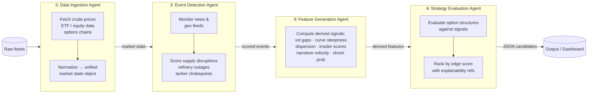
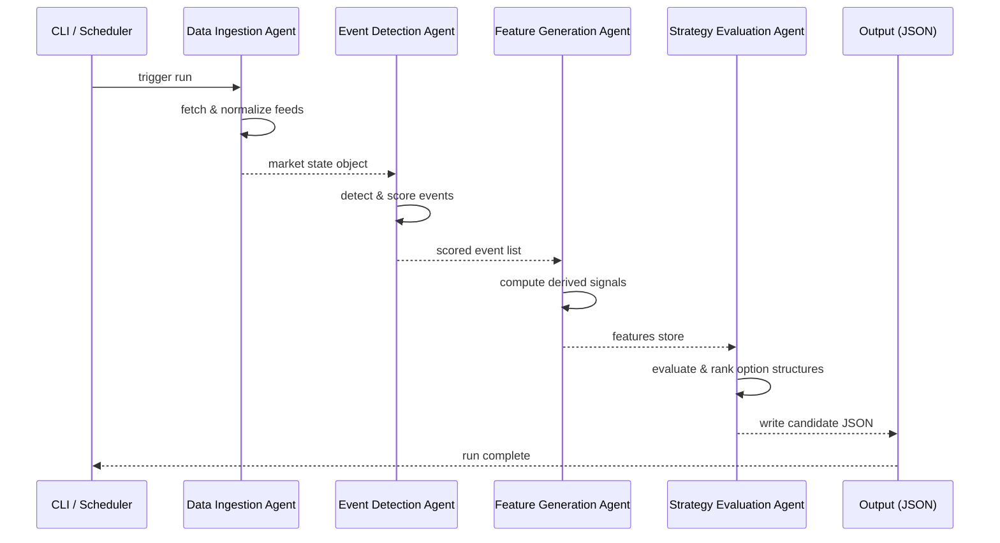

# Energy Options Opportunity Agent — User Guide

> **Version 1.0 • March 2026**
> This guide walks a developer through setting up, configuring, and running the full Energy Options Opportunity Agent pipeline end-to-end.

---

## Table of Contents

1. [Overview](#overview)
2. [Prerequisites](#prerequisites)
3. [Setup & Configuration](#setup--configuration)
4. [Running the Pipeline](#running-the-pipeline)
5. [Interpreting the Output](#interpreting-the-output)
6. [Troubleshooting](#troubleshooting)

---

## Overview

The Energy Options Opportunity Agent is an autonomous, modular Python pipeline that identifies options trading opportunities driven by oil market instability. It ingests market data, supply signals, news events, and alternative datasets, then produces structured, ranked candidate options strategies.

The pipeline is composed of **four loosely coupled agents** that execute in a fixed, unidirectional sequence, communicating through a shared market state object and a derived features store.



### In-Scope Instruments & Structures

| Category | Items |
|---|---|
| **Crude futures** | Brent Crude, WTI (`CL=F`) |
| **ETFs** | USO, XLE |
| **Energy equities** | Exxon Mobil (XOM), Chevron (CVX) |
| **Option structures (MVP)** | Long straddles, call/put spreads, calendar spreads |

> **Advisory only.** The system surfaces ranked opportunities but does **not** execute trades automatically.

---

## Prerequisites

### System Requirements

| Requirement | Minimum |
|---|---|
| Python | 3.10+ |
| RAM | 2 GB |
| Disk | 10 GB (for 6–12 months of historical data) |
| Deployment target | Local machine, single VM, or container |

### External Accounts & API Keys

You must obtain credentials for the following services before running the pipeline. All sources listed below are free or offer a usable free tier.

| Service | Purpose | Sign-up URL |
|---|---|---|
| Alpha Vantage or MetalpriceAPI | WTI / Brent spot & futures prices | alphavantage.co / metalpriceapi.com |
| Yahoo Finance / yfinance | ETF & equity prices, options chains | No key required (yfinance); polygon.io for enhanced options |
| Polygon.io *(optional)* | Enhanced options chain data | polygon.io |
| EIA Open Data API | Inventory & refinery utilization | eia.gov/opendata |
| GDELT Project | Geopolitical & news event feed | gdeltproject.org (no key) |
| NewsAPI | Headline news feed | newsapi.org |
| SEC EDGAR | Insider activity (Form 4) | No key required |
| Quiver Quant *(optional)* | Structured insider signals | quiverquant.com |
| MarineTraffic / VesselFinder | Tanker shipping flows | marinetraffic.com (free tier) |
| Reddit API | Retail sentiment / narrative velocity | reddit.com/dev/api |
| Stocktwits *(optional)* | Retail sentiment | stocktwits.com/developers |

### Python Dependencies

Install all dependencies from the project root:

```bash
pip install -r requirements.txt
```

Key packages include:

```
yfinance
requests
pandas
numpy
python-dotenv
schedule
```

---

## Setup & Configuration

### 1. Clone the Repository

```bash
git clone https://github.com/your-org/energy-options-agent.git
cd energy-options-agent
```

### 2. Create a Virtual Environment

```bash
python -m venv .venv
source .venv/bin/activate        # macOS / Linux
.venv\Scripts\activate           # Windows
```

### 3. Install Dependencies

```bash
pip install -r requirements.txt
```

### 4. Configure Environment Variables

Copy the example environment file and populate it with your credentials:

```bash
cp .env.example .env
```

Open `.env` in your editor and fill in each value. The table below documents every supported variable.

#### Environment Variable Reference

| Variable | Required | Default | Description |
|---|---|---|---|
| `ALPHA_VANTAGE_API_KEY` | Yes* | — | API key for Alpha Vantage crude price feed. *Required if not using MetalpriceAPI. |
| `METALPRICE_API_KEY` | Yes* | — | API key for MetalpriceAPI. *Required if not using Alpha Vantage. |
| `POLYGON_API_KEY` | No | — | Polygon.io key for enhanced options chain data. Falls back to yfinance if absent. |
| `EIA_API_KEY` | Yes | — | EIA Open Data API key for inventory and refinery utilization data. |
| `NEWS_API_KEY` | Yes | — | NewsAPI key for headline ingestion. |
| `REDDIT_CLIENT_ID` | No | — | Reddit OAuth client ID for sentiment feed. |
| `REDDIT_CLIENT_SECRET` | No | — | Reddit OAuth client secret. |
| `REDDIT_USER_AGENT` | No | `energy-options-agent/1.0` | Reddit API user-agent string. |
| `MARINETRAFFIC_API_KEY` | No | — | MarineTraffic free-tier key for tanker flow data. |
| `QUIVER_API_KEY` | No | — | Quiver Quant key for structured insider signals. |
| `OUTPUT_DIR` | No | `./output` | Directory where JSON candidate files are written. |
| `HISTORY_DAYS` | No | `180` | Days of historical data to retain (minimum 180; recommended 365). |
| `MARKET_DATA_INTERVAL_MIN` | No | `5` | Polling interval in minutes for market data (crude, ETF, equity). |
| `SLOW_FEED_INTERVAL_HOURS` | No | `24` | Polling interval in hours for slow feeds (EIA, EDGAR). |
| `LOG_LEVEL` | No | `INFO` | Logging verbosity: `DEBUG`, `INFO`, `WARNING`, `ERROR`. |
| `EDGE_SCORE_THRESHOLD` | No | `0.30` | Minimum edge score `[0.0–1.0]` for a candidate to appear in output. |

> **Tip:** Variables marked *No* are optional but enable additional signal layers (Phase 2–3 features). The pipeline degrades gracefully when optional credentials are absent — it logs a warning and skips that data source rather than failing.

#### Example `.env`

```dotenv
# Required
ALPHA_VANTAGE_API_KEY=YOUR_AV_KEY
EIA_API_KEY=YOUR_EIA_KEY
NEWS_API_KEY=YOUR_NEWSAPI_KEY

# Optional — enhanced options data
POLYGON_API_KEY=YOUR_POLYGON_KEY

# Optional — alternative signals (Phase 2–3)
REDDIT_CLIENT_ID=YOUR_REDDIT_CLIENT_ID
REDDIT_CLIENT_SECRET=YOUR_REDDIT_SECRET
REDDIT_USER_AGENT=energy-options-agent/1.0
MARINETRAFFIC_API_KEY=YOUR_MT_KEY
QUIVER_API_KEY=YOUR_QUIVER_KEY

# Pipeline behaviour
OUTPUT_DIR=./output
HISTORY_DAYS=365
MARKET_DATA_INTERVAL_MIN=5
SLOW_FEED_INTERVAL_HOURS=24
LOG_LEVEL=INFO
EDGE_SCORE_THRESHOLD=0.30
```

### 5. Initialise the Data Store

Run the bootstrap command once to create the local database schema and pull the initial historical window:

```bash
python -m pipeline.bootstrap
```

Expected output:

```
[INFO] Creating data store at ./data/market_state.db
[INFO] Seeding 365 days of historical data for: CL=F, BZ=F, USO, XLE, XOM, CVX
[INFO] Bootstrap complete. Run `python -m pipeline.run` to start the agent.
```

---

## Running the Pipeline

### Pipeline Execution Flow



### Single Run (One-Shot)

Execute one complete pipeline cycle and exit:

```bash
python -m pipeline.run --once
```

Use this for testing, ad-hoc analysis, or running from an external scheduler (cron, Task Scheduler, etc.).

### Continuous Mode (Scheduled)

Run the pipeline on the configured polling schedule (`MARKET_DATA_INTERVAL_MIN` for market data, `SLOW_FEED_INTERVAL_HOURS` for EIA/EDGAR):

```bash
python -m pipeline.run
```

The process loops indefinitely. Use a process manager (e.g., `systemd`, `supervisord`, or Docker) to keep it running in production.

### Run a Single Agent in Isolation

Each agent can be invoked independently for debugging or development:

```bash
# Data Ingestion Agent only
python -m pipeline.agents.ingestion

# Event Detection Agent only
python -m pipeline.agents.event_detection

# Feature Generation Agent only
python -m pipeline.agents.feature_generation

# Strategy Evaluation Agent only
python -m pipeline.agents.strategy_evaluation
```

> **Note:** Running agents in isolation requires that upstream data already exists in the shared data store (i.e., a prior ingestion run has completed).

### Running with Docker

A `Dockerfile` and `docker-compose.yml` are provided for containerised deployment:

```bash
# Build the image
docker build -t energy-options-agent:latest .

# Run with your .env file
docker run --env-file .env -v $(pwd)/output:/app/output energy-options-agent:latest
```

---

## Interpreting the Output

### Output Location

By default, results are written to `./output/` as timestamped JSON files:

```
output/
└── candidates_2026-03-15T14:32:00Z.json
```

The path is controlled by the `OUTPUT_DIR` environment variable.

### Output Schema

Each file contains an array of candidate objects. Every field is described below.

| Field | Type | Description |
|---|---|---|
| `instrument` | `string` | Target instrument, e.g. `USO`, `XLE`, `CL=F` |
| `structure` | `enum` | Option structure: `long_straddle` \| `call_spread` \| `put_spread` \| `calendar_spread` |
| `expiration` | `integer` (days) | Target expiration in calendar days from the evaluation date |
| `edge_score` | `float [0.0–1.0]` | Composite opportunity score — higher values indicate stronger signal confluence |
| `signals` | `object` | Map of contributing signals and their assessed levels |
| `generated_at` | ISO 8601 datetime | UTC timestamp of candidate generation |

### Example Output

```json
[
  {
    "instrument": "USO",
    "structure": "long_straddle",
    "expiration": 30,
    "edge_score": 0.47,
    "signals": {
      "tanker_disruption_index": "high",
      "volatility_gap": "positive",
      "narrative_velocity": "rising"
    },
    "generated_at": "2026-03-15T14:32:00Z"
  },
  {
    "instrument": "XLE",
    "structure": "call_spread",
    "expiration": 21,
    "edge_score": 0.61,
    "signals": {
      "volatility_gap": "positive",
      "supply_shock_probability": "elevated",
      "insider_conviction_score": "high"
    },
    "generated_at": "2026-03-15T14:32:00Z"
  }
]
```

### Reading the Edge Score

| Edge Score Range | Interpretation |
|---|---|
| `0.70 – 1.00` | Strong signal confluence — multiple independent signals aligned |
| `0.50 – 0.69` | Moderate opportunity — meaningful signal overlap, worth monitoring |
| `0.30 – 0.49` | Weak but detectable signal — included at default threshold |
| `< 0.30` | Below threshold — filtered out by default (`EDGE_SCORE_THRESHOLD`) |

Candidates are sorted in descending `edge_score` order within each output file.

### Reading the Signals Map

Each key in the `signals` object corresponds to a derived feature computed by the Feature Generation Agent. Common signal keys and their meanings:

| Signal Key | Source Agent | Meaning |
|---|---|---|
| `volatility_gap` | Feature Generation | Realised IV minus implied IV; `positive` = IV underpriced |
| `futures_curve_steepness` | Feature Generation | Degree of contango or backwardation in the crude curve |
| `sector_dispersion` | Feature Generation | Spread between energy sub-sector returns |
| `insider_conviction_score` | Feature Generation | Aggregated insider buy/sell activity via EDGAR / Quiver Quant |
| `narrative_velocity` | Feature Generation | Acceleration of energy-related headline volume |
| `supply_shock_probability` | Feature Generation | Estimated probability of near-term supply disruption |
| `tanker_disruption_index` | Event Detection | Severity of detected tanker / chokepoint disruptions |
| `refinery_outage_flag` | Event Detection | Binary or scaled signal for active refinery outage events |
| `geopolitical_intensity` | Event Detection | Confidence-weighted score for geopolitical events affecting supply |

### Downstream Consumption

The JSON output is compatible with any JSON-capable dashboard or platform, including thinkorswim. To reload results programmatically:

```python
import json
from pathlib import Path

candidates = json.loads(
    Path("output/candidates_2026-03-15T14:32:00Z.json").read_text()
)

for c in sorted(candidates, key=lambda x: x["edge_score"], reverse=True):
    print(f"{c['instrument']:>6}  {c['structure']:<20}  edge={c['edge_score']:.2f}")
```

---

## Troubleshooting

### Pipeline Fails to Start

| Symptom | Likely Cause | Resolution |
|---|---|---|
| `KeyError: 'EIA_API_KEY'` | Missing required env var | Ensure `.env` is populated and loaded (`python-dotenv` reads it automatically). |
| `ModuleNotFoundError` | Dependencies not installed | Run `pip install -r requirements.txt` inside your active virtual environment. |
| `FileNotFoundError: market_state.db` | Bootstrap not run | Run `python -m pipeline.bootstrap` before the first pipeline run. |

### Data Source Errors

| Symptom | Likely Cause | Resolution |
|---|---|---|
| `[WARNING] Alpha