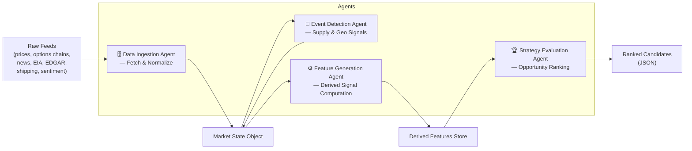

# Energy Options Opportunity Agent — User Guide

> **Version 1.0 · March 2026**
> This guide covers the full pipeline: setup, configuration, execution, output interpretation, and troubleshooting.

---

## Table of Contents

1. [Overview](#overview)
2. [Prerequisites](#prerequisites)
3. [Setup & Configuration](#setup--configuration)
4. [Running the Pipeline](#running-the-pipeline)
5. [Interpreting the Output](#interpreting-the-output)
6. [Troubleshooting](#troubleshooting)

---

## Overview

The **Energy Options Opportunity Agent** is an autonomous, modular Python pipeline that identifies options trading opportunities driven by oil market instability. It ingests market data, supply signals, news events, and alternative datasets, then surfaces volatility mispricing in oil-related instruments as ranked, explainable strategy candidates.

### Pipeline Architecture

The system comprises four loosely coupled agents that communicate via a shared **market state object** and a **derived features store**. Data flows in one direction only — from raw ingestion through to ranked output.



| Agent | Role | Key Outputs |
|---|---|---|
| **Data Ingestion** | Fetch & Normalize | Unified market state object, historical price store |
| **Event Detection** | Supply & Geo Signals | Scored supply disruption events (confidence + intensity) |
| **Feature Generation** | Derived Signal Computation | Volatility gaps, curve steepness, supply shock probability, etc. |
| **Strategy Evaluation** | Opportunity Ranking | Ranked candidates with edge scores and signal references |

### In-Scope Instruments

| Category | Instruments |
|---|---|
| Crude Futures | Brent Crude, WTI (`CL=F`) |
| ETFs | USO, XLE |
| Energy Equities | Exxon Mobil (XOM), Chevron (CVX) |

### In-Scope Option Structures (MVP)

- Long straddles
- Call / put spreads
- Calendar spreads

> **Advisory only.** Automated trade execution is explicitly out of scope. All output is informational.

---

## Prerequisites

### System Requirements

| Requirement | Minimum |
|---|---|
| Python | 3.10 or later |
| Operating System | Linux, macOS, or Windows (WSL recommended) |
| RAM | 2 GB |
| Disk | 10 GB (for 6–12 months of historical data) |
| Deployment target | Local machine, single VM, or container |

### Required Knowledge

This guide assumes you are comfortable with:

- Running commands in a terminal / shell
- Python virtual environments and `pip`
- Editing `.env` files or shell environment variables
- Reading JSON output

### API Accounts

Register for the following free or low-cost services before proceeding. All are free-tier unless noted.

| Service | Used For | Sign-up URL | Cost |
|---|---|---|---|
| Alpha Vantage | WTI / Brent spot and futures prices | https://www.alphavantage.co | Free |
| Yahoo Finance (`yfinance`) | ETF / equity prices, options chains | No registration required | Free |
| Polygon.io | Options chains (alternative/supplement) | https://polygon.io | Free / Limited |
| EIA API | Inventory, refinery utilization | https://www.eia.gov/opendata | Free |
| GDELT | News and geopolitical events | No key required | Free |
| NewsAPI | News headlines | https://newsapi.org | Free |
| SEC EDGAR | Insider trading filings | No key required | Free |
| Quiver Quant | Insider activity enrichment | https://www.quiverquant.com | Free / Limited |
| MarineTraffic | Tanker / shipping flows | https://www.marinetraffic.com | Free tier |
| Reddit API | Narrative / retail sentiment | https://www.reddit.com/prefs/apps | Free |
| Stocktwits | Narrative / retail sentiment | https://api.stocktwits.com | Free |

> **Phase note:** You do not need all API keys immediately. See [MVP Phasing](#mvp-phasing-and-optional-keys) below for which keys are required at each phase.

---

## Setup & Configuration

### 1. Clone the Repository

```bash
git clone https://github.com/your-org/energy-options-agent.git
cd energy-options-agent
```

### 2. Create and Activate a Virtual Environment

```bash
python3 -m venv .venv
source .venv/bin/activate        # Linux / macOS
# .venv\Scripts\activate         # Windows
```

### 3. Install Dependencies

```bash
pip install --upgrade pip
pip install -r requirements.txt
```

### 4. Configure Environment Variables

Copy the example environment file and populate your API keys:

```bash
cp .env.example .env
```

Open `.env` in your editor and set values for each variable listed in the table below.

#### Environment Variable Reference

| Variable | Required | Phase | Description | Example Value |
|---|---|---|---|---|
| `ALPHA_VANTAGE_API_KEY` | Yes | 1 | API key for crude price feeds | `ABC123XYZ` |
| `POLYGON_API_KEY` | Optional | 1 | Polygon.io key for options chain data | `pk_abc123` |
| `EIA_API_KEY` | Yes | 2 | EIA Open Data API key | `eia_abc123` |
| `NEWS_API_KEY` | Yes | 2 | NewsAPI key for headline ingestion | `newsabc123` |
| `QUIVER_API_KEY` | Optional | 3 | Quiver Quant insider activity enrichment | `qv_abc123` |
| `MARINE_TRAFFIC_API_KEY` | Optional | 3 | MarineTraffic free-tier API key | `mt_abc123` |
| `REDDIT_CLIENT_ID` | Optional | 3 | Reddit OAuth client ID | `reddit_id_abc` |
| `REDDIT_CLIENT_SECRET` | Optional | 3 | Reddit OAuth client secret | `reddit_sec_abc` |
| `REDDIT_USER_AGENT` | Optional | 3 | Reddit API user-agent string | `energy-agent/1.0` |
| `STOCKTWITS_API_KEY` | Optional | 3 | Stocktwits API key | `st_abc123` |
| `DATA_DIR` | Yes | 1 | Path to local directory for historical data storage | `./data` |
| `OUTPUT_DIR` | Yes | 1 | Path to directory for ranked candidate JSON output | `./output` |
| `LOG_LEVEL` | No | 1 | Logging verbosity (`DEBUG`, `INFO`, `WARNING`, `ERROR`) | `INFO` |
| `PRICE_REFRESH_INTERVAL_SECONDS` | No | 1 | Cadence for market price polling (minutes-level recommended) | `300` |
| `SLOW_FEED_REFRESH_INTERVAL_SECONDS` | No | 2 | Cadence for EIA / EDGAR polling (daily recommended) | `86400` |
| `HISTORICAL_RETENTION_DAYS` | No | 1 | Days of historical data to retain (180–365 recommended) | `365` |

> **Tip:** Variables marked **Optional** are safe to leave blank. The pipeline will skip the corresponding data source gracefully and log a warning rather than failing.

#### Example `.env` File

```dotenv
# --- Core (Phase 1) ---
ALPHA_VANTAGE_API_KEY=ABC123XYZ
POLYGON_API_KEY=pk_abc123
DATA_DIR=./data
OUTPUT_DIR=./output
LOG_LEVEL=INFO
PRICE_REFRESH_INTERVAL_SECONDS=300
HISTORICAL_RETENTION_DAYS=365

# --- Supply & Events (Phase 2) ---
EIA_API_KEY=eia_abc123
NEWS_API_KEY=newsabc123
SLOW_FEED_REFRESH_INTERVAL_SECONDS=86400

# --- Alternative Signals (Phase 3) ---
QUIVER_API_KEY=
MARINE_TRAFFIC_API_KEY=
REDDIT_CLIENT_ID=
REDDIT_CLIENT_SECRET=
REDDIT_USER_AGENT=energy-agent/1.0
STOCKTWITS_API_KEY=
```

### 5. Initialise the Data Directory

Create the storage directories used by the pipeline:

```bash
mkdir -p ./data ./output
```

### MVP Phasing and Optional Keys

Development is structured in four phases. You can run the pipeline at any phase; later-phase keys extend the signal set without blocking earlier functionality.

| Phase | Name | Minimum Required Keys |
|---|---|---|
| 1 | Core Market Signals & Options | `ALPHA_VANTAGE_API_KEY`, `DATA_DIR`, `OUTPUT_DIR` |
| 2 | Supply & Event Augmentation | Phase 1 + `EIA_API_KEY`, `NEWS_API_KEY` |
| 3 | Alternative / Contextual Signals | Phase 2 + one or more of: `QUIVER_API_KEY`, `MARINE_TRAFFIC_API_KEY`, `REDDIT_*`, `STOCKTWITS_API_KEY` |
| 4 | High-Fidelity Enhancements | Deferred — see [Future Considerations](#future-considerations) |

---

## Running the Pipeline

### Full Pipeline (Single Run)

Execute all four agents in sequence:

```bash
python -m energy_agent.pipeline run
```

This command:

1. Invokes the **Data Ingestion Agent** to fetch and normalize all configured feeds.
2. Passes the market state object to the **Event Detection Agent** for supply/geo signal scoring.
3. Passes the updated state to the **Feature Generation Agent** to compute derived signals.
4. Passes derived features to the **Strategy Evaluation Agent** to produce ranked candidates.
5. Writes structured JSON to `$OUTPUT_DIR/candidates_<timestamp>.json`.

### Continuous / Scheduled Mode

To run the pipeline on a recurring cadence (respecting `PRICE_REFRESH_INTERVAL_SECONDS`):

```bash
python -m energy_agent.pipeline run --continuous
```

Press `Ctrl+C` to stop.

### Running Individual Agents

Each agent is independently deployable. You can run any single stage against an existing state snapshot:

```bash
# Data Ingestion only
python -m energy_agent.pipeline run --agent ingestion

# Event Detection only (requires an existing market state snapshot)
python -m energy_agent.pipeline run --agent events

# Feature Generation only
python -m energy_agent.pipeline run --agent features

# Strategy Evaluation only
python -m energy_agent.pipeline run --agent strategy
```

### Specifying an Output File

```bash
python -m energy_agent.pipeline run --output ./output/my_run.json
```

### Controlling Log Verbosity

Override `LOG_LEVEL` at runtime:

```bash
LOG_LEVEL=DEBUG python -m energy_agent.pipeline run
```

### Pipeline Execution Flow

```mermaid
sequenceDiagram
    participant CLI as CLI / Scheduler
    participant DI as Data Ingestion Agent
    participant ED as Event Detection Agent
    participant FG as Feature Generation Agent
    participant SE as Strategy Evaluation Agent
    participant FS as Filesystem (data/ + output/)

    CLI->>DI: Start pipeline run
    DI->>FS: Write normalized market state snapshot
    DI-->>ED: Pass market state object
    ED->>ED: Score supply disruptions & geo events
    ED-->>FG: Pass enriched market state
    FG->>FG: Compute volatility gaps, curve steepness,\nshock probability, narrative velocity, etc.
    FG->>FS: Write derived features to features store
    FG-->>SE: Pass derived features
    SE->>SE: Evaluate eligible option structures;\ncompute edge scores
    SE->>FS: Write ranked candidates JSON
    SE-->>CLI: Return exit code 0 (success)
```

---

## Interpreting the Output

### Output File Location

On each successful run, a timestamped JSON file is written to `$OUTPUT_DIR`:

```
output/
└── candidates_2026-03-15T14_32_00Z.json
```

### Output Schema

Each file contains an array of strategy candidate objects. Fields are defined as follows:

| Field | Type | Description |
|---|---|---|
| `instrument` | `string` | Target instrument identifier, e.g. `"USO"`, `"XLE"`, `"CL=F"` |
| `structure` | `enum` | Options structure: `long_straddle` \| `call_spread` \| `put_spread` \| `calendar_spread` |
| `expiration` | `integer` | Target expiration in **calendar days** from the evaluation date |
| `edge_score` | `float [0.0–1.0]` | Composite opportunity score; higher values indicate stronger signal confluence |
| `signals` | `object` | Map of contributing signals and their current values; used for explainability |
| `generated_at` | `ISO 8601 datetime` | UTC timestamp of candidate generation |

### Example Output

```json
[
  {
    "instrument": "USO",
    "structure": "long_straddle",
    "expiration": 30,
    "edge_score": 0.47,
    "signals": {
      "tanker_disruption_index": "high",
      "volatility_gap": "positive",
      "narrative_velocity": "rising"
    },
    "generated_at": "2026-03-15T14:32:00Z"
  },
  {
    "instrument": "XOM",
    "structure": "call_spread",
    "expiration": 45,
    "edge_score": 0.31,
    "signals": {
      "volatility_gap": "positive",
      "supply_shock_probability": "elevated",
      "insider_conviction": "moderate"
    },
    "generated_at": "2026-03-15T14:32:00Z"
  }
]
```

### Reading the Edge Score

| Edge Score Range | Interpretation |
|---|---|
| `0.70 – 1.00` | Strong signal confluence — multiple independent signals align |
| `0.40 – 0.69` | Moderate confluence — worth monitoring; validate contributing signals |
| `0.20 – 0.39` | Weak signal — limited alignment; treat with caution |
| `0.00 – 0.19` | Noise threshold — generally not actionable |

> **Important:** Edge scores are advisory. They reflect computed signal confluence, not a guarantee of profitability. No automated execution is performed.

### Signal Reference

| Signal Key | Description | Possible Values |
|---|---|---|
| `volatility_gap` | Realized vs. implied volatility differential | `positive`, `negative`, `neutral` |
| `futures_curve_steepness` | Contango / backwardation level in the futures curve | `steep`, `flat`, `inverted` |
| `sector_dispersion` | Cross-sector correlation spread within energy | `high`, `moderate`, `low` |
| `insider_conviction` | Aggregated insider trading activity score | `high`, `moderate`, `low` |
| `narrative_velocity` | Rate of acceleration of energy-related headlines | `rising`, `stable`, `falling` |
| `supply_shock_probability` | Probability score of a near-term supply disruption | `elevated`, `moderate`, `low` |
| `tanker_disruption_index` | Shipping / logistics disruption indicator | `high`, `moderate`, `low` |

### Consuming Output in thinkorswim or Other Tools

The JSON output is compatible with any dashboard or tool that accepts JSON. To load in thinkorswim or a custom visualisation:

1. Point your tool at the latest file in `$OUTPUT_DIR