# Energy Options Opportunity Agent — User Guide

> **Version 1.0 • March 2026**
> This guide walks you through setting up, configuring, and running the full Energy Options Opportunity Agent pipeline, and interpreting its output.

---

## Table of Contents

1. [Overview](#overview)
2. [Prerequisites](#prerequisites)
3. [Setup & Configuration](#setup--configuration)
4. [Running the Pipeline](#running-the-pipeline)
5. [Interpreting the Output](#interpreting-the-output)
6. [Troubleshooting](#troubleshooting)

---

## Overview

The Energy Options Opportunity Agent is an autonomous, modular Python pipeline that identifies options trading opportunities driven by oil market instability. It ingests market data, supply signals, geopolitical news, and alternative datasets, then produces structured, ranked candidate options strategies with full signal explainability.

### Pipeline Architecture

The pipeline is composed of four loosely coupled agents that pass data through a shared **market state object** and a **derived features store**. Data flows strictly left-to-right — no agent writes back to an upstream agent.

```mermaid
flowchart LR
    subgraph Ingestion["① Data Ingestion Agent"]
        A1[Crude Prices\nAlpha Vantage / MetalpriceAPI]
        A2[ETF & Equity Prices\nYahoo Finance / yfinance]
        A3[Options Chains\nYahoo Finance / Polygon.io]
        A4[Supply & Inventory\nEIA API]
    end

    subgraph Event["② Event Detection Agent"]
        B1[News & Geo Events\nGDELT / NewsAPI]
        B2[Shipping & Logistics\nMarineTraffic / VesselFinder]
        B3[Confidence & Intensity\nScoring]
    end

    subgraph Feature["③ Feature Generation Agent"]
        C1[Volatility Gap\nRealized vs Implied]
        C2[Futures Curve Steepness]
        C3[Sector Dispersion]
        C4[Insider Conviction Score\nSEC EDGAR / Quiver Quant]
        C5[Narrative Velocity\nReddit / Stocktwits]
        C6[Supply Shock Probability]
    end

    subgraph Strategy["④ Strategy Evaluation Agent"]
        D1[Score Option Structures]
        D2[Rank by Edge Score]
        D3[Attach Contributing Signals]
    end

    RAW[(Market State\nObject)] --> Event
    Ingestion --> RAW
    Event --> FEAT[(Derived\nFeatures Store)]
    Feature --> FEAT
    FEAT --> Strategy
    Strategy --> OUT[/JSON Output/]
```



### In-Scope Instruments & Structures

| Category | Items |
|---|---|
| Crude futures | Brent Crude, WTI (`CL=F`) |
| ETFs | USO, XLE |
| Energy equities | Exxon Mobil (XOM), Chevron (CVX) |
| Option structures (MVP) | Long straddle, call spread, put spread, calendar spread |

> **Advisory only.** The pipeline produces ranked recommendations. No automated trade execution occurs in the MVP.

---

## Prerequisites

| Requirement | Minimum version / notes |
|---|---|
| Python | 3.10 or later |
| pip | 22.0 or later |
| Git | Any recent version |
| Docker *(optional)* | 24.0+ — for containerised deployment |
| Disk space | ~5 GB recommended for 6–12 months of historical data |
| OS | Linux, macOS, or Windows (WSL2 recommended on Windows) |

You will also need **API credentials** for the data sources listed in [Setup & Configuration](#setup--configuration). All required tiers are free or low-cost.

---

## Setup & Configuration

### 1. Clone the Repository

```bash
git clone https://github.com/your-org/energy-options-agent.git
cd energy-options-agent
```

### 2. Create and Activate a Virtual Environment

```bash
python -m venv .venv

# macOS / Linux
source .venv/bin/activate

# Windows (PowerShell)
.venv\Scripts\Activate.ps1
```

### 3. Install Dependencies

```bash
pip install --upgrade pip
pip install -r requirements.txt
```

### 4. Configure Environment Variables

Copy the provided template and populate every value before running the pipeline:

```bash
cp .env.example .env
```

Open `.env` in your editor and fill in your credentials. The full set of recognised variables is listed below.

#### Environment Variable Reference

| Variable | Required | Source / Where to obtain | Description |
|---|---|---|---|
| `ALPHA_VANTAGE_API_KEY` | Yes (Phase 1) | [alphavantage.co](https://www.alphavantage.co/support/#api-key) | WTI and Brent spot/futures prices (minutes cadence) |
| `METALPRICE_API_KEY` | Optional | [metalpriceapi.com](https://metalpriceapi.com) | Fallback crude price feed |
| `POLYGON_API_KEY` | Optional | [polygon.io](https://polygon.io) | Options chain data (strike, expiry, IV, volume) |
| `EIA_API_KEY` | Yes (Phase 2) | [eia.gov/opendata](https://www.eia.gov/opendata/) | Weekly inventory and refinery utilisation data |
| `NEWSAPI_KEY` | Yes (Phase 2) | [newsapi.org](https://newsapi.org) | Energy news and geopolitical event headlines |
| `GDELT_ENABLED` | Optional | Set `true` / `false` | Toggle GDELT continuous news feed (no key required) |
| `QUIVER_QUANT_API_KEY` | Optional (Phase 3) | [quiverquant.com](https://www.quiverquant.com) | Insider conviction scores |
| `MARINE_TRAFFIC_API_KEY` | Optional (Phase 3) | [marinetraffic.com](https://www.marinetraffic.com/en/online-services/plans) | Tanker flow data (free tier available) |
| `REDDIT_CLIENT_ID` | Optional (Phase 3) | [reddit.com/prefs/apps](https://www.reddit.com/prefs/apps) | Reddit API app client ID |
| `REDDIT_CLIENT_SECRET` | Optional (Phase 3) | Same as above | Reddit API app client secret |
| `REDDIT_USER_AGENT` | Optional (Phase 3) | Arbitrary string | e.g. `energy-agent/1.0` |
| `STOCKTWITS_ACCESS_TOKEN` | Optional (Phase 3) | [api.stocktwits.com](https://api.stocktwits.com) | Narrative velocity / retail sentiment |
| `OUTPUT_DIR` | Yes | Local path | Directory where JSON output files are written |
| `HISTORY_DAYS` | Yes | Integer | Days of history to retain (180–365 recommended) |
| `LOG_LEVEL` | No | `DEBUG` / `INFO` / `WARNING` | Pipeline log verbosity (default: `INFO`) |
| `PIPELINE_CADENCE_MINUTES` | No | Integer | How often the full pipeline reruns (default: `5`) |

> **Tip:** Variables marked *Optional (Phase N)* are ignored by earlier phases but must be present (even as empty strings) to avoid configuration validation errors.

#### Example `.env` (Redacted)

```dotenv
ALPHA_VANTAGE_API_KEY=YOUR_KEY_HERE
METALPRICE_API_KEY=
POLYGON_API_KEY=YOUR_KEY_HERE
EIA_API_KEY=YOUR_KEY_HERE
NEWSAPI_KEY=YOUR_KEY_HERE
GDELT_ENABLED=true
QUIVER_QUANT_API_KEY=
MARINE_TRAFFIC_API_KEY=
REDDIT_CLIENT_ID=
REDDIT_CLIENT_SECRET=
REDDIT_USER_AGENT=energy-agent/1.0
STOCKTWITS_ACCESS_TOKEN=
OUTPUT_DIR=./output
HISTORY_DAYS=180
LOG_LEVEL=INFO
PIPELINE_CADENCE_MINUTES=5
```

### 5. Initialise the Data Store

Run the initialisation script once before the first pipeline execution. It creates the local SQLite database (or configures the target store) and seeds the schema:

```bash
python scripts/init_store.py
```

Expected output:

```
[INFO] Creating schema: market_state ... OK
[INFO] Creating schema: derived_features ... OK
[INFO] Creating schema: strategy_candidates ... OK
[INFO] Data store initialised at ./data/agent.db
```

---

## Running the Pipeline

### Full Pipeline — Single Run

Execute all four agents in sequence for one evaluation cycle:

```bash
python run_pipeline.py --mode once
```

### Full Pipeline — Continuous Mode

Run the pipeline on a recurring cadence defined by `PIPELINE_CADENCE_MINUTES`:

```bash
python run_pipeline.py --mode continuous
```

Press `Ctrl+C` to stop gracefully. The pipeline completes the current cycle before exiting.

### Run an Individual Agent

You can invoke any agent in isolation for debugging or incremental development:

```bash
# Data Ingestion Agent only
python -m agents.ingestion

# Event Detection Agent only
python -m agents.event_detection

# Feature Generation Agent only
python -m agents.feature_generation

# Strategy Evaluation Agent only
python -m agents.strategy_evaluation
```

> **Note:** Each agent reads from the shared store, so upstream agents must have run at least once before a downstream agent can produce meaningful results.

### Docker (Optional)

Build and run the pipeline inside a container:

```bash
# Build
docker build -t energy-options-agent:latest .

# Run (single cycle)
docker run --env-file .env \
           -v "$(pwd)/output:/app/output" \
           -v "$(pwd)/data:/app/data" \
           energy-options-agent:latest \
           python run_pipeline.py --mode once

# Run (continuous)
docker run --env-file .env \
           -v "$(pwd)/output:/app/output" \
           -v "$(pwd)/data:/app/data" \
           energy-options-agent:latest \
           python run_pipeline.py --mode continuous
```

### CLI Reference

| Flag | Values | Default | Description |
|---|---|---|---|
| `--mode` | `once` \| `continuous` | `once` | Single evaluation cycle or recurring loop |
| `--phase` | `1` \| `2` \| `3` | *(all enabled)* | Restrict pipeline to a specific MVP phase |
| `--output-format` | `json` \| `pretty` | `json` | Output format for strategy candidates |
| `--log-level` | `DEBUG` \| `INFO` \| `WARNING` | From `.env` | Override log verbosity for this run |
| `--dry-run` | *(flag)* | `false` | Execute all agents but suppress file writes |

**Example — Phase 1 only, verbose logging:**

```bash
python run_pipeline.py --mode once --phase 1 --log-level DEBUG
```

---

## Interpreting the Output

### Output Location

Each pipeline run writes one JSON file to `OUTPUT_DIR`:

```
output/
└── candidates_2026-03-15T14:32:07Z.json
```

A symlink `output/latest.json` always points to the most recent file.

### Output Schema

Each strategy candidate in the JSON array conforms to the following schema:

| Field | Type | Description |
|---|---|---|
| `instrument` | `string` | Target instrument, e.g. `USO`, `XLE`, `CL=F` |
| `structure` | `enum` | `long_straddle` \| `call_spread` \| `put_spread` \| `calendar_spread` |
| `expiration` | `integer` | Target expiration in calendar days from evaluation date |
| `edge_score` | `float [0.0–1.0]` | Composite opportunity score — higher means stronger signal confluence |
| `signals` | `object` | Map of contributing signals and their qualitative values |
| `generated_at` | `ISO 8601 datetime` | UTC timestamp of candidate generation |

### Example Candidate

```json
{
  "instrument": "USO",
  "structure": "long_straddle",
  "expiration": 30,
  "edge_score": 0.47,
  "signals": {
    "tanker_disruption_index": "high",
    "volatility_gap": "positive",
    "narrative_velocity": "rising"
  },
  "generated_at": "2026-03-15T14:32:07Z"
}
```

### Reading the Edge Score

The `edge_score` is a composite `[0.0–1.0]` float that reflects how many signals are aligned and how strongly they are aligned for the given instrument and structure.

| Score range | Interpretation |
|---|---|
| `0.70 – 1.00` | Strong signal confluence — multiple high-confidence signals agree |
| `0.45 – 0.69` | Moderate confluence — worth reviewing; verify contributing signals |
| `0.20 – 0.44` | Weak confluence — marginal opportunity; use as a watchlist signal |
| `0.00 – 0.19` | Noise level — insufficient signal alignment; discard or monitor |

> **Important:** A high `edge_score` reflects signal alignment, not a guarantee of profit. Always cross-reference the `signals` map to understand *why* a candidate scored highly before acting on it.

### Reading the Signals Map

Each key in the `signals` object is a derived feature produced by the Feature Generation Agent. Common keys and their qualitative values are listed below:

| Signal key | Possible values | Source layer |
|---|---|---|
| `volatility_gap` | `positive` / `negative` / `neutral` | Realized vs. implied IV comparison |
| `futures_curve_steepness` | `contango` / `backwardation` / `flat` | Futures curve shape |
| `sector_dispersion` | `high` / `moderate` / `low` | Cross-equity correlation spread |
| `insider_conviction_score` | `high` / `moderate` / `low` | SEC EDGAR / Quiver Quant |
| `narrative_velocity` | `rising` / `stable` / `falling` | Reddit / Stocktwits headline acceleration |
| `supply_shock_probability` | `high` / `moderate` / `low` | EIA + event detection composite |
| `tanker_disruption_index` | `high` / `moderate` / `low` | MarineTraffic / VesselFinder flows |

### Consuming Output Downstream

The JSON output is compatible with any JSON-capable dashboard or platform. To load the latest candidates into a Python session:

```python
import json
from pathlib import Path

candidates = json.loads(Path("output/latest.json").read_text())

# Print top 5 by edge score
top5 = sorted(candidates, key=lambda c: c["edge_score"], reverse=True)[:5]
for c in top5:
    print(f"{c['instrument']:6s}  {c['structure']:20s}  edge={c['edge_score']:.2f}  exp={c['expiration']}d")
```

---

## Troubleshooting

### Common Errors

| Symptom | Likely cause | Resolution |
|---|---|---|
| `KeyError: 'ALPHA_VANTAGE_API_KEY'` | `.env` not loaded or variable missing | Confirm `.env` exists in the project root and all required variables are set |
| `DataIngestionError: upstream returned 429` | API rate limit exceeded | Increase `PIPELINE_CADENCE_MINUTES` or switch to the fallback feed (e.g., set `METALPRICE_API_KEY`) |
| `FeatureGenerationError: insufficient history` | `HISTORY_DAYS` too low or store just initialised | Wait for at least one full trading day of data to accumulate, or lower minimum history thresholds in `config/features.yaml` |
| Strategy evaluation produces zero candidates | All edge scores below ranking threshold | Check that Phase 2+ environment variables are configured if running beyond Phase 1; run `--log-level DEBUG` to trace signal values |
| `FileNotFoundError: output/` | `OUTPUT_DIR` path does not exist | Create the directory: `mkdir -p output` |
| `sqlite3.OperationalError: no such table` | `init_store.py` was not run |