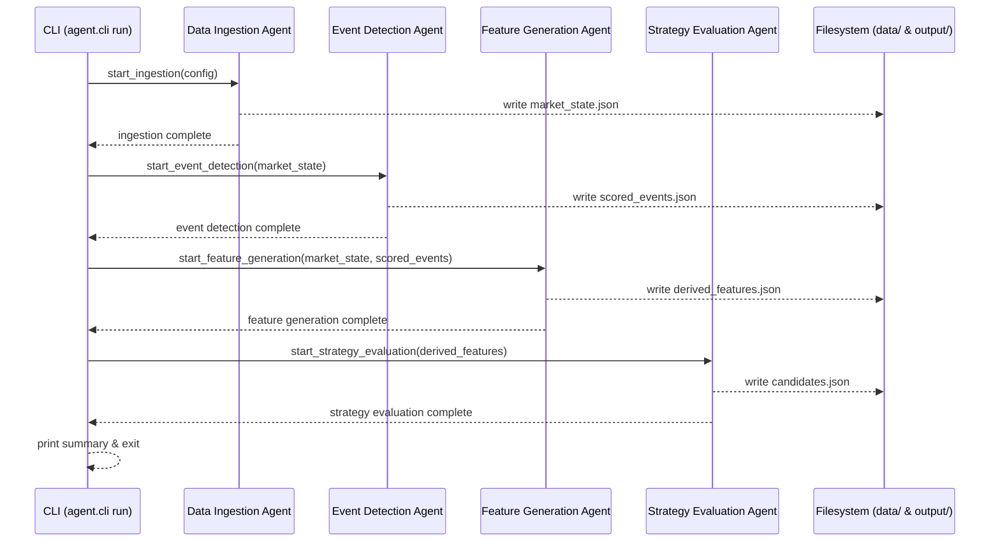

# Energy Options Opportunity Agent — User Guide

> **Version 1.0 · March 2026**
> This guide walks you through installing, configuring, and running the full pipeline end-to-end. It assumes you are comfortable with Python, the command line, and environment variables, but have not worked with this project before.

---

## Table of Contents

1. [Overview](#overview)
2. [Prerequisites](#prerequisites)
3. [Setup & Configuration](#setup--configuration)
4. [Running the Pipeline](#running-the-pipeline)
5. [Interpreting the Output](#interpreting-the-output)
6. [Troubleshooting](#troubleshooting)

---

## Overview

The **Energy Options Opportunity Agent** is a modular, four-agent Python pipeline that identifies options trading opportunities driven by oil market instability. It is advisory only — no orders are placed automatically.

### What the pipeline does

The pipeline runs four loosely coupled agents in sequence, each writing results to a shared state that the next agent consumes:

```mermaid
flowchart LR
    subgraph Ingestion["① Data Ingestion Agent"]
        A1[Crude prices\nWTI · Brent]
        A2[ETF / Equity prices\nUSO · XLE · XOM · CVX]
        A3[Options chains\nstrike · expiry · IV · volume]
    end

    subgraph Events["② Event Detection Agent"]
        B1[News & geo feeds\nGDELT · NewsAPI]
        B2[Supply signals\nEIA · shipping]
        B3[Confidence &\nintensity scoring]
    end

    subgraph Features["③ Feature Generation Agent"]
        C1[Volatility gap\nrealised vs implied]
        C2[Futures curve\nsteepness]
        C3[Supply shock\nprobability]
        C4[Narrative velocity\ninsider conviction]
    end

    subgraph Strategy["④ Strategy Evaluation Agent"]
        D1[Evaluate eligible\nstructures]
        D2[Compute edge score\n0.0 – 1.0]
        D3[Rank &\nexplain candidates]
    end

    Ingestion -->|market state object| Events
    Events    -->|scored events| Features
    Features  -->|derived features store| Strategy
    Strategy  -->|JSON output| E[(candidates.json)]
```



### In-scope instruments & option structures

| Category | Items |
|---|---|
| Crude futures | Brent Crude, WTI (`CL=F`) |
| ETFs | USO, XLE |
| Energy equities | XOM (ExxonMobil), CVX (Chevron) |
| Option structures | Long straddles, call/put spreads, calendar spreads |

> **Out of scope for MVP:** exotic/multi-legged strategies, regional refined product pricing (OPIS), automated trade execution.

---

## Prerequisites

### System requirements

| Requirement | Minimum |
|---|---|
| Python | 3.10 or later |
| Operating system | Linux, macOS, or Windows (WSL recommended) |
| Memory | 2 GB RAM |
| Storage | 5 GB free (for 6–12 months of historical data) |
| Network | Outbound HTTPS on port 443 |

### Required accounts & API keys

All data sources used in the MVP are free or have a free tier. Obtain credentials before running the pipeline.

| Data source | What it provides | Sign-up URL |
|---|---|---|
| Alpha Vantage | WTI / Brent spot & futures prices | https://www.alphavantage.co/support/#api-key |
| Yahoo Finance (`yfinance`) | ETF, equity, and options chain data | *(no key required)* |
| Polygon.io | Options chain supplement (free tier) | https://polygon.io/dashboard/signup |
| EIA API | Weekly inventory & refinery utilisation | https://www.eia.gov/opendata/register.php |
| GDELT | News & geopolitical event stream | *(no key required — HTTP download)* |
| NewsAPI | Headline news feed | https://newsapi.org/register |
| SEC EDGAR | Insider trading filings | *(no key required)* |
| Quiver Quant | Structured insider data (free tier) | https://www.quiverquant.com/signup/ |
| MarineTraffic | Tanker flow data (free tier) | https://www.marinetraffic.com/en/p/register |
| Reddit API (`praw`) | Retail sentiment & narrative velocity | https://www.reddit.com/prefs/apps |
| Stocktwits | Retail sentiment stream | https://api.stocktwits.com/developers/apps/new |

---

## Setup & Configuration

### 1. Clone the repository

```bash
git clone https://github.com/your-org/energy-options-agent.git
cd energy-options-agent
```

### 2. Create and activate a virtual environment

```bash
python -m venv .venv

# Linux / macOS
source .venv/bin/activate

# Windows (PowerShell)
.\.venv\Scripts\Activate.ps1
```

### 3. Install dependencies

```bash
pip install --upgrade pip
pip install -r requirements.txt
```

### 4. Configure environment variables

Copy the provided template and fill in your credentials:

```bash
cp .env.example .env
```

Open `.env` in your editor and supply values for every variable in the table below.

#### Environment variable reference

| Variable | Required | Default | Description |
|---|---|---|---|
| `ALPHA_VANTAGE_API_KEY` | ✅ | — | API key for WTI / Brent crude price feeds |
| `POLYGON_API_KEY` | ✅ | — | Polygon.io key for supplemental options chain data |
| `EIA_API_KEY` | ✅ | — | EIA Open Data key for inventory & refinery utilisation |
| `NEWS_API_KEY` | ✅ | — | NewsAPI key for headline energy news |
| `QUIVER_QUANT_API_KEY` | ⬜ | — | Quiver Quant key for structured insider activity (Phase 3) |
| `MARINE_TRAFFIC_API_KEY` | ⬜ | — | MarineTraffic key for tanker flow data (Phase 3) |
| `REDDIT_CLIENT_ID` | ⬜ | — | Reddit OAuth client ID for PRAW (Phase 3) |
| `REDDIT_CLIENT_SECRET` | ⬜ | — | Reddit OAuth client secret for PRAW (Phase 3) |
| `REDDIT_USER_AGENT` | ⬜ | `energy-agent/1.0` | User-agent string sent with Reddit requests |
| `STOCKTWITS_ACCESS_TOKEN` | ⬜ | — | Stocktwits bearer token for sentiment feed (Phase 3) |
| `DATA_DIR` | ✅ | `./data` | Root directory for raw and derived data storage |
| `OUTPUT_DIR` | ✅ | `./output` | Directory where ranked candidates JSON is written |
| `LOG_LEVEL` | ⬜ | `INFO` | Python logging level (`DEBUG`, `INFO`, `WARNING`, `ERROR`) |
| `HISTORY_DAYS` | ⬜ | `365` | Days of historical data to retain (recommended: 180–365) |
| `PRICE_REFRESH_MINUTES` | ⬜ | `5` | Cadence (minutes) for market data refresh during a run |
| `SLOW_FEED_SCHEDULE` | ⬜ | `daily` | Refresh schedule for EIA / EDGAR feeds (`daily` or `weekly`) |
| `PIPELINE_PHASE` | ⬜ | `1` | MVP phase to activate (`1`, `2`, or `3`); controls which agents and signals are enabled |

> **Required (✅)** variables must be set before any agent will run. Optional (⬜) variables unlock Phase 2 / Phase 3 signals; the pipeline runs in a reduced-signal mode without them.

#### Minimal `.env` for Phase 1

```dotenv
ALPHA_VANTAGE_API_KEY=your_alpha_vantage_key
POLYGON_API_KEY=your_polygon_key
EIA_API_KEY=your_eia_key
NEWS_API_KEY=your_newsapi_key

DATA_DIR=./data
OUTPUT_DIR=./output
PIPELINE_PHASE=1
```

### 5. Initialise the data directory

```bash
python -m agent.cli init
```

This creates the `DATA_DIR` and `OUTPUT_DIR` folder structure and writes a `config.json` derived from your `.env`.

---

## Running the Pipeline

### Pipeline execution modes

| Mode | Command | When to use |
|---|---|---|
| Full pipeline (all agents, once) | `python -m agent.cli run` | On-demand analysis |
| Single agent | `python -m agent.cli run --agent <name>` | Debug or incremental re-run |
| Continuous / scheduled | `python -m agent.cli run --loop` | Live monitoring |
| Dry run (no output written) | `python -m agent.cli run --dry-run` | Validate config without side effects |

### Run the full pipeline once

```bash
python -m agent.cli run
```

Expected console output:

```
[2026-03-15 09:00:01 UTC] INFO  pipeline      Starting full pipeline run (phase=1)
[2026-03-15 09:00:02 UTC] INFO  ingestion     Fetching WTI spot price ... OK (104.32)
[2026-03-15 09:00:03 UTC] INFO  ingestion     Fetching Brent spot price ... OK (107.81)
[2026-03-15 09:00:05 UTC] INFO  ingestion     Fetching options chain: USO ... OK (312 contracts)
[2026-03-15 09:00:08 UTC] INFO  events        Scanning GDELT feed ... 4 energy events detected
[2026-03-15 09:00:09 UTC] INFO  events        Scanning NewsAPI feed ... 2 supply disruption events
[2026-03-15 09:00:10 UTC] INFO  features      Computing volatility gap (USO) ... +0.083
[2026-03-15 09:00:11 UTC] INFO  features      Computing futures curve steepness (WTI) ... contango +1.4%
[2026-03-15 09:00:13 UTC] INFO  strategy      Evaluating long_straddle on USO (30d) ... edge_score=0.47
[2026-03-15 09:00:14 UTC] INFO  strategy      Evaluating call_spread on XLE (45d) ... edge_score=0.31
[2026-03-15 09:00:15 UTC] INFO  pipeline      Run complete. 5 candidates written to ./output/candidates.json
```

### Run a single agent

Useful when you want to re-run only one stage — for example, after receiving an EIA data update — without re-fetching market prices.

```bash
# Agent names: ingestion | events | features | strategy
python -m agent.cli run --agent strategy
```

### Run continuously with automatic refresh

```bash
python -m agent.cli run --loop --interval 300   # refresh every 5 minutes
```

Press `Ctrl+C` to stop. The pipeline tolerates delayed or missing upstream data; individual feed failures are logged as warnings and the run continues with the most recent cached data.

### Activate Phase 2 or Phase 3 signals

Set `PIPELINE_PHASE` in your `.env` (or pass it inline) to unlock additional signal layers:

```bash
# Phase 2: adds EIA supply signals and GDELT/NewsAPI event-driven edge scoring
PIPELINE_PHASE=2 python -m agent.cli run

# Phase 3: additionally adds insider conviction, narrative velocity, and shipping data
PIPELINE_PHASE=3 python -m agent.cli run
```

> Phase 4 features (OPIS pricing, exotic structures, automated execution) are not yet implemented and are reserved for future releases.

### Agent data-flow sequence



---

## Interpreting the Output

### Output file location

```
output/
└── candidates.json          ← ranked list of strategy candidates (latest run)
└── candidates_<timestamp>.json   ← timestamped archive of each run
```

### Output schema

Each element in the `candidates` array conforms to the following schema:

| Field | Type | Description |
|---|---|---|
| `instrument` | `string` | Target instrument — e.g. `"USO"`, `"XLE"`, `"CL=F"` |
| `structure` | `enum` | Options structure: `long_straddle`, `call_spread`, `put_spread`, `calendar_spread` |
| `expiration` | `integer` | Target expiration in calendar days from the evaluation date |
| `edge_score` | `float [0.0–1.0]` | Composite opportunity score; higher = stronger signal confluence |
| `signals` | `object` | Map of contributing signals and their qualitative values |
| `generated_at` | `ISO 8601 datetime` | UTC timestamp of candidate generation |

### Example output

```json
{
  "run_id": "2026-03-15T09:00:15Z",
  "phase": 1,
  "candidates": [
    {
      "instrument": "USO",
      "structure": "long_straddle",
      "expiration": 30,
      "edge_score": 0.47,
      "signals": {
        "tanker_disruption_index": "high",
        "volatility_gap": "positive",
        "narrative_velocity": "rising"
      },
      "generated_at": "2026-03-15T09:00:13Z"
    },
    {
      "instrument": "XLE",
      "structure": "call_spread",
      "expiration": 45,
      "edge_score": 0.31,
      "signals": {
        "volatility_gap": "positive",
        "futures_curve_steepness": "contango"
      },
      "generated_at": "2026-03-15T09:00:14Z"
    }
  ]
}
```

### Reading the edge score

| Edge score range | Interpretation | Suggested action |
|---|---|---|
| `0.70 – 1.00` | Strong signal confluence | High-priority review; examine all contributing signals |
| `0.45 – 0.69` | Moderate confluence | Worth investigating alongside your own analysis |
| `0.20 – 0.44` | Weak / noisy signal | Low confidence; treat as background information |
| `0.00 – 0.19` | Negligible edge | Typically noise; not actionable on its own |

> The edge score reflects signal confluence only. It is **not** a probability of profit and does **not** account for bid/ask spreads, liquidity, or position sizing. The system is **advisory only** — no trades are placed automatically.

### Reading the signals map

Each key in the `signals` object corresponds to a derived feature. Common keys and their meanings:

| Signal key | Possible values | What it means |
|---|---|---|
| `volatility_gap` | `positive`, `negative`, `neutral` | Realised vol is above (`positive`) or below implied vol |
| `futures_curve_steepness` | `contango`, `backwardation