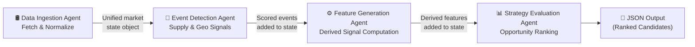
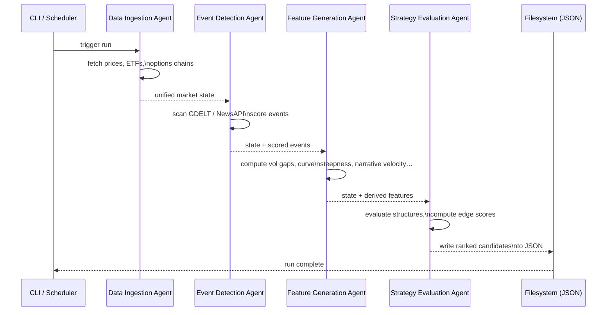

# Energy Options Opportunity Agent — User Guide

> **Version 1.0 • March 2026**
> Advisory only. The system surfaces ranked options candidates; it does not place trades automatically.

---

## Table of Contents

1. [Overview](#overview)
2. [Prerequisites](#prerequisites)
3. [Setup & Configuration](#setup--configuration)
4. [Running the Pipeline](#running-the-pipeline)
5. [Interpreting the Output](#interpreting-the-output)
6. [Troubleshooting](#troubleshooting)

---

## Overview

The **Energy Options Opportunity Agent** is a modular Python pipeline that detects volatility mispricing in oil-related instruments and surfaces ranked options trading candidates. It is designed for a single contributor running on local hardware or a low-cost cloud VM.

The pipeline is composed of four loosely coupled agents that execute in sequence:



| Agent | Role | Key Output |
|---|---|---|
| **Data Ingestion** | Fetch & normalize raw feeds | Unified market state object |
| **Event Detection** | Monitor news & geopolitical feeds | Confidence/intensity-scored events |
| **Feature Generation** | Compute derived signals | Volatility gaps, curve steepness, narrative velocity, etc. |
| **Strategy Evaluation** | Rank option structures | Candidate list with edge scores & signal references |

### In-Scope Instruments (MVP)

| Category | Instruments |
|---|---|
| Crude futures | WTI (`CL=F`), Brent |
| ETFs | `USO`, `XLE` |
| Energy equities | `XOM`, `CVX` |

### In-Scope Option Structures (MVP)

`long_straddle` · `call_spread` · `put_spread` · `calendar_spread`

---

## Prerequisites

### System Requirements

- Python **3.10+**
- 2 GB RAM minimum (4 GB recommended for local runs with 6–12 months of stored data)
- Internet access to reach free-tier data APIs

### Python Dependencies

Install all dependencies from the project root:

```bash
pip install -r requirements.txt
```

Key packages include:

| Package | Purpose |
|---|---|
| `yfinance` | ETF/equity prices, options chains |
| `requests` | Alpha Vantage, EIA, GDELT, NewsAPI calls |
| `pandas` / `numpy` | Data normalization and feature computation |
| `python-dotenv` | Loading environment variables from `.env` |
| `schedule` | Cadenced pipeline execution |

### API Access

All primary sources are free or free-tier. Obtain keys before running the pipeline:

| Source | Where to Register | Required For |
|---|---|---|
| Alpha Vantage | <https://www.alphavantage.co/support/#api-key> | WTI/Brent spot prices |
| EIA API | <https://www.eia.gov/opendata/register.php> | Inventory & refinery data |
| NewsAPI | <https://newsapi.org/register> | Geopolitical/news events |
| Polygon.io | <https://polygon.io/> | Options chains (supplement) |
| SEC EDGAR | No key required | Insider activity (EDGAR XBRL feed) |
| Quiver Quant | <https://www.quiverquant.com/> | Insider conviction scores (optional) |

> **Note:** Yahoo Finance (`yfinance`), GDELT, MarineTraffic free tier, Reddit, and Stocktwits do not require API keys for basic access.

---

## Setup & Configuration

### 1. Clone the Repository

```bash
git clone https://github.com/your-org/energy-options-agent.git
cd energy-options-agent
```

### 2. Create a Virtual Environment

```bash
python -m venv .venv
source .venv/bin/activate        # macOS / Linux
.venv\Scripts\activate           # Windows
```

### 3. Install Dependencies

```bash
pip install -r requirements.txt
```

### 4. Configure Environment Variables

Copy the example file and populate it with your credentials:

```bash
cp .env.example .env
```

Open `.env` in your editor and fill in all required values:

```dotenv
# ── Data Sources ────────────────────────────────────────────
ALPHA_VANTAGE_API_KEY=your_alpha_vantage_key
EIA_API_KEY=your_eia_key
NEWS_API_KEY=your_newsapi_key
POLYGON_API_KEY=your_polygon_key          # optional; enhances options data
QUIVER_QUANT_API_KEY=your_quiver_key      # optional; Phase 3 insider scores

# ── Pipeline Behaviour ───────────────────────────────────────
MARKET_DATA_REFRESH_MINUTES=5             # cadence for price/options fetch
SLOW_FEED_REFRESH_HOURS=24               # cadence for EIA, EDGAR feeds
DATA_RETENTION_DAYS=365                  # 6–12 months (182–365 recommended)

# ── Output ──────────────────────────────────────────────────
OUTPUT_DIR=./output                      # directory for JSON candidate files
LOG_LEVEL=INFO                           # DEBUG | INFO | WARNING | ERROR
```

#### Full Environment Variable Reference

| Variable | Required | Default | Description |
|---|---|---|---|
| `ALPHA_VANTAGE_API_KEY` | ✅ | — | WTI and Brent spot/futures prices |
| `EIA_API_KEY` | ✅ | — | Weekly inventory and refinery utilization |
| `NEWS_API_KEY` | ✅ | — | Geopolitical and supply disruption news |
| `POLYGON_API_KEY` | ⬜ | — | Supplementary options chain data |
| `QUIVER_QUANT_API_KEY` | ⬜ | — | Insider conviction score enrichment (Phase 3) |
| `MARKET_DATA_REFRESH_MINUTES` | ⬜ | `5` | Minutes between price/options refreshes |
| `SLOW_FEED_REFRESH_HOURS` | ⬜ | `24` | Hours between EIA/EDGAR refreshes |
| `DATA_RETENTION_DAYS` | ⬜ | `365` | Days of historical data to retain on disk |
| `OUTPUT_DIR` | ⬜ | `./output` | Directory where JSON output files are written |
| `LOG_LEVEL` | ⬜ | `INFO` | Python logging level for console/file output |

### 5. Verify Configuration

Run the built-in config check to confirm all required keys resolve and external endpoints are reachable:

```bash
python -m agent verify-config
```

Expected output:

```
[OK] ALPHA_VANTAGE_API_KEY   — endpoint reachable
[OK] EIA_API_KEY             — endpoint reachable
[OK] NEWS_API_KEY            — endpoint reachable
[WARN] POLYGON_API_KEY       — not set; falling back to yfinance for options data
[WARN] QUIVER_QUANT_API_KEY  — not set; insider scores will be skipped (Phase 3)
Configuration valid. Ready to run.
```

> Warnings on optional keys are non-blocking. The pipeline will continue with reduced signal coverage.

---

## Running the Pipeline

### Pipeline Execution Sequence



### Single Run (One-Shot)

Execute all four agents in sequence and write output to `OUTPUT_DIR`:

```bash
python -m agent run
```

### Run a Specific Agent Only

You can invoke individual agents during development or debugging:

```bash
python -m agent run --agent ingestion       # Data Ingestion only
python -m agent run --agent events          # Event Detection only
python -m agent run --agent features        # Feature Generation only
python -m agent run --agent strategy        # Strategy Evaluation only
```

> Each agent reads its required inputs from the shared market state store. Run agents in order when executing independently; the state from a previous step must already exist on disk.

### Continuous Scheduled Mode

Run the pipeline on an automated cadence (market data every N minutes; slow feeds daily):

```bash
python -m agent run --mode scheduled
```

The scheduler uses the values of `MARKET_DATA_REFRESH_MINUTES` and `SLOW_FEED_REFRESH_HOURS` from your `.env` file.

To run in the background with logging to a file:

```bash
nohup python -m agent run --mode scheduled > logs/agent.log 2>&1 &
```

### Running in Docker (optional)

A `Dockerfile` is provided for containerised deployment on a single VM:

```bash
# Build the image
docker build -t energy-options-agent:latest .

# Run one-shot
docker run --env-file .env energy-options-agent:latest

# Run scheduled (detached)
docker run -d --env-file .env \
  -v $(pwd)/output:/app/output \
  -v $(pwd)/data:/app/data \
  energy-options-agent:latest --mode scheduled
```

### Common CLI Flags

| Flag | Description |
|---|---|
| `--mode one-shot` | Execute the pipeline once and exit (default) |
| `--mode scheduled` | Run continuously on the configured cadence |
| `--agent <name>` | Run a single named agent only |
| `--dry-run` | Fetch and compute but do not write output files |
| `--output-dir <path>` | Override `OUTPUT_DIR` from the environment |
| `--log-level <level>` | Override `LOG_LEVEL` from the environment |

---

## Interpreting the Output

### Output Location

Each pipeline run writes a timestamped JSON file to `OUTPUT_DIR`:

```
output/
└── candidates_2026-03-15T14:32:00Z.json
```

### Output Schema

Each file contains an array of candidate objects. Every candidate includes:

| Field | Type | Description |
|---|---|---|
| `instrument` | `string` | Target instrument, e.g. `USO`, `XLE`, `CL=F` |
| `structure` | `enum` | `long_straddle` · `call_spread` · `put_spread` · `calendar_spread` |
| `expiration` | `integer` (days) | Calendar days to target expiration from evaluation date |
| `edge_score` | `float` [0.0–1.0] | Composite opportunity score; higher = stronger signal confluence |
| `signals` | `object` | Map of contributing signals and their qualitative state |
| `generated_at` | ISO 8601 datetime | UTC timestamp of candidate generation |

### Example Output

```json
[
  {
    "instrument": "USO",
    "structure": "long_straddle",
    "expiration": 30,
    "edge_score": 0.47,
    "signals": {
      "tanker_disruption_index": "high",
      "volatility_gap": "positive",
      "narrative_velocity": "rising"
    },
    "generated_at": "2026-03-15T14:32:00Z"
  },
  {
    "instrument": "XLE",
    "structure": "call_spread",
    "expiration": 21,
    "edge_score": 0.31,
    "signals": {
      "supply_shock_probability": "elevated",
      "futures_curve_steepness": "contango_widening",
      "insider_conviction_score": "moderate"
    },
    "generated_at": "2026-03-15T14:32:00Z"
  }
]
```

### Reading the Edge Score

The `edge_score` is a composite value in `[0.0, 1.0]` that reflects how many signals are aligned and how strongly they point to a mispricing opportunity.

| Edge Score Range | Interpretation |
|---|---|
| `0.70 – 1.00` | Strong signal confluence — high candidate priority |
| `0.40 – 0.69` | Moderate confluence — worth monitoring |
| `0.00 – 0.39` | Weak or conflicting signals — low priority |

> The scoring function uses static heuristics in the MVP. ML-based weighting is a planned future enhancement.

### Reading the Signals Map

Each key in the `signals` object maps to a derived feature computed by the Feature Generation Agent. Common signals and their meanings:

| Signal Key | Meaning |
|---|---|
| `volatility_gap` | Realized vol vs. implied vol comparison; `positive` = IV underpriced |
| `tanker_disruption_index` | Shipping flow anomaly score from MarineTraffic/VesselFinder |
| `narrative_velocity` | Rate of headline acceleration from Reddit/Stocktwits/NewsAPI |
| `supply_shock_probability` | EIA-derived probability of a near-term supply disruption |
| `futures_curve_steepness` | Contango/backwardation gradient across the WTI/Brent curve |
| `sector_dispersion` | Cross-asset spread between energy equities (XOM, CVX) and ETFs |
| `insider_conviction_score` | Aggregated signal from SEC EDGAR / Quiver Quant executive trades |

### Using Output with thinkorswim

The JSON output is compatible with any thinkorswim script or dashboard that accepts a JSON data feed. Point your thinkorswim custom study or thinkScript data import at `OUTPUT_DIR` and map field names as follows:

```
instrument    → Symbol
structure     → Strategy
expiration    → DTE (days to expiration)
edge_score    → Custom column "Edge"
```

---

## Troubleshooting

### Common Issues

#### Pipeline exits immediately with "Configuration invalid"

Verify that all **required** environment variables are set and non-empty:

```bash
python -m agent verify-config
```

Check that your `.env` file is in the project root and that `python-dotenv` is installed:

```bash
pip show python-dotenv
```

---

#### `KeyError` or empty market state after ingestion

A data source may be unavailable or rate-limited. The pipeline is designed to tolerate missing data without failing, but a completely empty state will produce no candidates.

1. Check logs for `[WARN] feed unavailable` messages.
2. Confirm your API keys are valid by testing directly:

```bash
curl "https://www.alphavantage.co/query?function=TIME_SERIES_INTRADAY\
&symbol=USO&interval=5min&apikey=${ALPHA_VANTAGE_API_KEY}"
```

3. If the free-tier rate limit is hit, reduce `MARKET_DATA_REFRESH_MINUTES` or stagger agent runs.

---

#### No candidates generated (empty output array)

No candidates are emitted when no option structure clears the minimum edge threshold. Possible causes:

| Cause | Resolution |
|---|---|
| All edge scores below threshold | Normal during low-volatility regimes; no action required |
| Feature Generation agent skipped | Run `--agent features` in isolation and inspect logs |
| Options data unavailable | Confirm Polygon.io key is set or that `yfinance` options endpoint is re