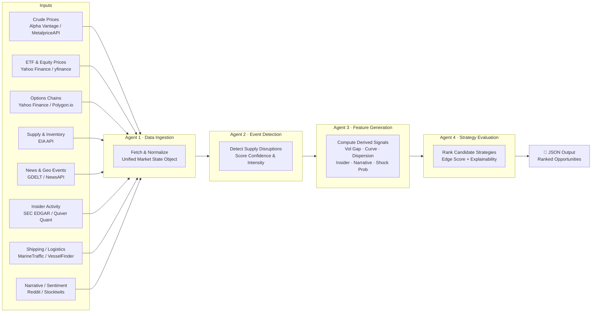

# Energy Options Opportunity Agent — User Guide

> **Version 1.0 · March 2026**
> This guide walks you through installing, configuring, and running the full pipeline from a clean checkout to ranked options candidates.

---

## Table of Contents

1. [Overview](#overview)
2. [Prerequisites](#prerequisites)
3. [Setup & Configuration](#setup--configuration)
4. [Running the Pipeline](#running-the-pipeline)
5. [Interpreting the Output](#interpreting-the-output)
6. [Troubleshooting](#troubleshooting)

---

## Overview

The **Energy Options Opportunity Agent** is a four-stage Python pipeline that identifies options trading opportunities driven by oil market instability. It ingests market data, supply signals, news events, and alternative datasets, then produces structured, ranked candidate strategies — all without automated trade execution.

### Pipeline Architecture



Data flows **unidirectionally**: raw feeds → event scoring → feature derivation → strategy ranking. Each agent is independently deployable; a failure or delay in one does not crash the pipeline.

### In-Scope Instruments (MVP)

| Category | Instruments |
|---|---|
| Crude Futures | Brent Crude, WTI (`CL=F`) |
| ETFs | USO, XLE |
| Energy Equities | Exxon Mobil (XOM), Chevron (CVX) |

### In-Scope Option Structures (MVP)

| Structure | Enum Value |
|---|---|
| Long Straddle | `long_straddle` |
| Call Spread | `call_spread` |
| Put Spread | `put_spread` |
| Calendar Spread | `calendar_spread` |

> **Note:** Automated trade execution, exotic multi-legged strategies, and regional OPIS pricing are explicitly out of scope for MVP.

---

## Prerequisites

### System Requirements

| Requirement | Minimum |
|---|---|
| Python | 3.10 or later |
| OS | Linux, macOS, or Windows (WSL recommended) |
| RAM | 2 GB |
| Disk | 10 GB free (for 6–12 months of historical data) |
| Network | Outbound HTTPS to external data APIs |

### Required Tools

```bash
# Verify Python version
python --version        # must be 3.10+

# Verify pip
pip --version

# Recommended: create and activate a virtual environment
python -m venv .venv
source .venv/bin/activate        # Linux / macOS
.venv\Scripts\activate           # Windows (PowerShell)
```

### API Account Registration

You must register for the following free-tier services before running the pipeline. Paid or premium tiers are optional and improve data fidelity.

| Data Layer | Service | Sign-Up URL | Cost |
|---|---|---|---|
| Crude Prices | Alpha Vantage | https://www.alphavantage.co/support/#api-key | Free |
| Crude Prices (alt) | MetalpriceAPI | https://metalpriceapi.com | Free |
| Options & Equity | Polygon.io | https://polygon.io | Free / Limited |
| Supply & Inventory | EIA API | https://www.eia.gov/opendata/ | Free |
| News & Geo Events | NewsAPI | https://newsapi.org | Free |
| News & Geo Events (alt) | GDELT | No key required | Free |
| Insider Activity | Quiver Quant | https://www.quiverquant.com/home/api | Free / Limited |
| Shipping / Logistics | MarineTraffic | https://www.marinetraffic.com/en/online-services/plans | Free tier |
| Narrative / Sentiment | Reddit API | https://www.reddit.com/prefs/apps | Free |

> **Tip:** `yfinance` (Yahoo Finance) requires no API key and is the default fallback for equity and ETF prices.

---

## Setup & Configuration

### 1. Clone the Repository

```bash
git clone https://github.com/your-org/energy-options-agent.git
cd energy-options-agent
```

### 2. Install Dependencies

```bash
pip install -r requirements.txt
```

### 3. Create the Environment File

Copy the provided template and populate your API keys:

```bash
cp .env.example .env
```

Then open `.env` in your editor and fill in the values described in the table below.

### Environment Variables Reference

All configuration is supplied via environment variables (or a `.env` file loaded at startup). Variables marked **Required** must be set; **Optional** variables activate additional data layers.

| Variable | Required | Default | Description |
|---|---|---|---|
| `ALPHA_VANTAGE_API_KEY` | Optional | — | API key for Alpha Vantage crude price feed |
| `METALPRICE_API_KEY` | Optional | — | API key for MetalpriceAPI crude feed |
| `POLYGON_API_KEY` | Optional | — | API key for Polygon.io options and equity data |
| `EIA_API_KEY` | Required | — | API key for EIA supply/inventory feed |
| `NEWS_API_KEY` | Optional | — | API key for NewsAPI geo/event headlines |
| `QUIVER_QUANT_API_KEY` | Optional | — | API key for Quiver Quant insider activity |
| `MARINE_TRAFFIC_API_KEY` | Optional | — | API key for MarineTraffic tanker flow data |
| `REDDIT_CLIENT_ID` | Optional | — | Reddit application client ID |
| `REDDIT_CLIENT_SECRET` | Optional | — | Reddit application client secret |
| `REDDIT_USER_AGENT` | Optional | `energy-agent/1.0` | Reddit API user-agent string |
| `DATA_DIR` | Required | `./data` | Root directory for persisted raw and derived data |
| `OUTPUT_DIR` | Required | `./output` | Directory where ranked JSON candidates are written |
| `LOG_LEVEL` | Optional | `INFO` | Logging verbosity: `DEBUG`, `INFO`, `WARNING`, `ERROR` |
| `MARKET_DATA_INTERVAL_MINUTES` | Optional | `5` | Polling cadence for minute-level market data feeds |
| `HISTORICAL_RETENTION_DAYS` | Optional | `180` | Days of historical data to retain (180–365 recommended) |
| `EDGE_SCORE_THRESHOLD` | Optional | `0.0` | Minimum edge score for a candidate to appear in output |
| `ENABLE_GDELT` | Optional | `true` | Set to `false` to disable the keyless GDELT news feed |
| `ENABLE_YFINANCE_FALLBACK` | Optional | `true` | Use yfinance when Polygon key is absent or rate-limited |

**Example `.env` file:**

```dotenv
# Required
EIA_API_KEY=your_eia_key_here
DATA_DIR=./data
OUTPUT_DIR=./output

# Optional — crude prices
ALPHA_VANTAGE_API_KEY=your_av_key_here

# Optional — options data
POLYGON_API_KEY=your_polygon_key_here

# Optional — news & events
NEWS_API_KEY=your_newsapi_key_here

# Optional — alternative signals
QUIVER_QUANT_API_KEY=your_quiver_key_here
MARINE_TRAFFIC_API_KEY=your_mt_key_here
REDDIT_CLIENT_ID=your_reddit_client_id
REDDIT_CLIENT_SECRET=your_reddit_client_secret
REDDIT_USER_AGENT=energy-agent/1.0

# Pipeline behaviour
LOG_LEVEL=INFO
MARKET_DATA_INTERVAL_MINUTES=5
HISTORICAL_RETENTION_DAYS=180
EDGE_SCORE_THRESHOLD=0.10
ENABLE_GDELT=true
ENABLE_YFINANCE_FALLBACK=true
```

### 4. Initialise the Data Store

Run the database initialisation script to create the directory structure and schema for historical raw and derived data:

```bash
python -m agent.db init
```

Expected output:

```
[INFO] Creating data directory: ./data
[INFO] Initialising raw store   ✓
[INFO] Initialising feature store ✓
[INFO] Data store ready.
```

---

## Running the Pipeline

### Full Pipeline — Single Run

To execute all four agents in sequence once and write candidates to the output directory:

```bash
python -m agent.pipeline run
```

The pipeline stages execute in this order:

```mermaid
sequenceDiagram
    participant CLI as CLI / Scheduler
    participant DIA as Agent 1: Data Ingestion
    participant EDA as Agent 2: Event Detection
    participant FGA as Agent 3: Feature Generation
    participant SEA as Agent 4: Strategy Evaluation
    participant FS  as File System (output/)

    CLI->>DIA: start ingestion
    DIA-->>DIA: fetch crude, ETF, equity, options chain data
    DIA-->>DIA: normalise → unified market state object
    DIA->>EDA: market state object

    EDA-->>EDA: scan news, GDELT, EIA feeds
    EDA-->>EDA: detect disruptions; assign confidence + intensity scores
    EDA->>FGA: market state + scored events

    FGA-->>FGA: compute vol gap, curve steepness, dispersion
    FGA-->>FGA: compute insider conviction, narrative velocity, shock prob
    FGA->>SEA: derived features store

    SEA-->>SEA: evaluate long_straddle / spreads / calendar_spread
    SEA-->>SEA: compute edge scores; attach contributing signals
    SEA->>FS: write ranked_candidates_<timestamp>.json
    FS-->>CLI: pipeline complete
```

### Run Individual Agents

Each agent can be invoked independently for debugging or incremental updates:

```bash
# Agent 1 — Data Ingestion only
python -m agent.pipeline run --stage ingest

# Agent 2 — Event Detection only (reads existing market state)
python -m agent.pipeline run --stage events

# Agent 3 — Feature Generation only (reads existing market state + events)
python -m agent.pipeline run --stage features

# Agent 4 — Strategy Evaluation only (reads existing feature store)
python -m agent.pipeline run --stage strategy
```

### Continuous / Scheduled Mode

To poll on the cadence defined by `MARKET_DATA_INTERVAL_MINUTES`:

```bash
python -m agent.pipeline run --continuous
```

> **Tip for production:** Use `cron`, `systemd`, or a container restart policy instead of `--continuous` for more robust scheduling. Example cron entry for a 5-minute refresh:
>
> ```cron
> */5 * * * * cd /opt/energy-options-agent && .venv/bin/python -m agent.pipeline run >> logs/pipeline.log 2>&1
> ```

### Filtering Output at Runtime

Pass `--min-edge` to override `EDGE_SCORE_THRESHOLD` for a single run:

```bash
# Only surface candidates with edge score ≥ 0.35
python -m agent.pipeline run --min-edge 0.35
```

Pass `--instrument` to restrict evaluation to specific tickers:

```bash
python -m agent.pipeline run --instrument USO --instrument CL=F
```

### Dry Run (No File Output)

Validate configuration and data-source connectivity without writing any output files:

```bash
python -m agent.pipeline run --dry-run
```

---

## Interpreting the Output

### Output Location

Each run writes one JSON file to `OUTPUT_DIR`:

```
output/
└── ranked_candidates_2026-03-15T14:32:00Z.json
```

### Output Schema

Every element in the output array represents a single ranked strategy candidate:

| Field | Type | Description |
|---|---|---|
| `instrument` | `string` | Target instrument, e.g. `USO`, `XLE`, `CL=F` |
| `structure` | `enum` | `long_straddle` · `call_spread` · `put_spread` · `calendar_spread` |
| `expiration` | `integer` (days) | Calendar days from evaluation date to target expiration |
| `edge_score` | `float` [0.0–1.0] | Composite opportunity score; higher = stronger signal confluence |
| `signals` | `object` | Map of contributing signals and their qualitative state |
| `generated_at` | ISO 8601 datetime | UTC timestamp of candidate generation |

### Example Output File

```json
[
  {
    "instrument": "USO",
    "structure": "long_straddle",
    "expiration": 30,
    "edge_score": 0.47,
    "signals": {
      "tanker_disruption_index": "high",
      "volatility_gap": "positive",
      "narrative_velocity": "rising"
    },
    "generated_at": "2026-03-15T14:32:00Z"
  },
  {
    "instrument": "XLE",
    "structure": "call_spread",
    "expiration": 21,
    "edge_score": 0.31,
    "signals": {
      "volatility_gap": "positive",
      "supply_shock_probability": "elevated",
      "insider_conviction_score": "moderate"
    },
    "generated_at": "2026-03-15T14:32:00Z"
  }
]
```

### Understanding `edge_score`

The `edge_score` is a composite `[0.0–1.0]` float representing the confluence of active signals for a given candidate. Use it as a **relative ranking tool**, not an absolute probability.

| Score Range | Interpretation |
|---|---|
| `0.70 – 1.00` | Strong signal confluence — high-priority candidate |
| `0.40 – 0.69` | Moderate confluence — worth manual review |
| `0.10 – 0.39` | Weak confluence — monitor but low priority |
| `0.00 – 0.09` | Minimal signal — typically filtered by threshold |

### Understanding `signals`

Each key in the `signals` object names the derived feature that contributed to the candidate's score, and each value is a qualitative state label. Common signals:

| Signal Key | Possible Values | Derived From |
|---|---|---|
| `volatility_gap` | `positive` · `negative` · `neutral` | Realized vs. implied volatility comparison |
| `futures_curve_steepness` | `steep_contango` · `backwardated` · `flat` | Futures curve shape |
| `supply_shock_probability` | `low` · `elevated` · `high` | EIA inventory + event detection scores |
| `tanker_disruption_index` | `low` · `moderate` · `