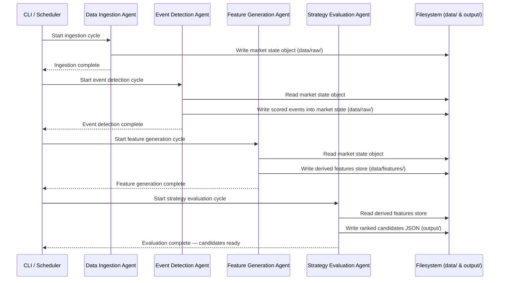

# Energy Options Opportunity Agent — User Guide

> **Version 1.0 · March 2026**
> This guide walks a developer through setting up, configuring, and running the full four-agent pipeline end-to-end.

---

## Table of Contents

1. [Overview](#overview)
2. [Prerequisites](#prerequisites)
3. [Setup & Configuration](#setup--configuration)
4. [Running the Pipeline](#running-the-pipeline)
5. [Interpreting the Output](#interpreting-the-output)
6. [Troubleshooting](#troubleshooting)

---

## Overview

The **Energy Options Opportunity Agent** is an autonomous, modular Python pipeline that identifies options trading opportunities driven by oil market instability. It ingests market data, supply signals, news events, and alternative datasets, then produces structured, ranked candidate options strategies.

The pipeline is composed of four loosely coupled agents that communicate via a shared **market state object** and a **derived features store**:

```mermaid
flowchart LR
    subgraph Ingestion["① Data Ingestion Agent"]
        direction TB
        I1[Crude Prices\nAlpha Vantage / MetalpriceAPI]
        I2[ETF & Equity Prices\nYahoo Finance / yfinance]
        I3[Options Chains\nYahoo Finance / Polygon.io]
    end

    subgraph Event["② Event Detection Agent"]
        direction TB
        E1[News & Geo Events\nGDELT / NewsAPI]
        E2[Supply & Inventory\nEIA API]
        E3[Shipping / Logistics\nMarineTraffic / VesselFinder]
    end

    subgraph Feature["③ Feature Generation Agent"]
        direction TB
        F1[Volatility Gap\nRealized vs Implied]
        F2[Futures Curve Steepness]
        F3[Sector Dispersion]
        F4[Insider Conviction Score\nEDGAR / Quiver Quant]
        F5[Narrative Velocity\nReddit / Stocktwits]
        F6[Supply Shock Probability]
    end

    subgraph Strategy["④ Strategy Evaluation Agent"]
        direction TB
        S1[Long Straddles]
        S2[Call / Put Spreads]
        S3[Calendar Spreads]
    end

    RAW[(Market State\nObject)]
    FEATURES[(Derived\nFeatures Store)]
    OUTPUT[/Ranked Candidates\nJSON Output/]

    Ingestion --> RAW
    Event --> RAW
    RAW --> Feature
    Feature --> FEATURES
    FEATURES --> Strategy
    Strategy --> OUTPUT
```



**Key characteristics:**

| Property | Detail |
|---|---|
| Target instruments | WTI, Brent, USO, XLE, XOM, CVX |
| Option structures (MVP) | Long straddles, call/put spreads, calendar spreads |
| Data refresh cadence | Minutes-level (market data); daily/weekly (EIA, EDGAR) |
| Historical retention | 6–12 months (for backtesting) |
| Execution model | Advisory only — no automated trade execution |
| Deployment target | Single VM or container; runnable on local hardware |

> **Advisory only:** This system surfaces ranked candidates. It does not place trades automatically.

---

## Prerequisites

### System Requirements

| Requirement | Minimum |
|---|---|
| Python | 3.10 or later |
| Operating system | Linux, macOS, or Windows (WSL2 recommended) |
| RAM | 2 GB available |
| Disk | 5 GB free (for 6–12 months of historical data) |
| Network | Outbound HTTPS access to all data source APIs |

### Python Dependencies

Install all dependencies from the project root:

```bash
pip install -r requirements.txt
```

Core packages you should expect to see in `requirements.txt`:

```text
yfinance>=0.2
requests>=2.31
pandas>=2.0
numpy>=1.26
pydantic>=2.0
schedule>=1.2
python-dotenv>=1.0
```

### API Accounts

Register for free accounts at each data source before running the pipeline. All sources listed below have free or free-tier access.

| Agent | Source | Sign-up URL | Notes |
|---|---|---|---|
| Data Ingestion | Alpha Vantage | https://www.alphavantage.co/support/#api-key | Free tier; WTI & Brent |
| Data Ingestion | yfinance | No key required | Yahoo Finance wrapper |
| Data Ingestion | Polygon.io | https://polygon.io | Free tier; options chains |
| Event Detection | EIA API | https://www.eia.gov/opendata/ | Free; weekly inventory data |
| Event Detection | GDELT | No key required | Free; continuous news feed |
| Event Detection | NewsAPI | https://newsapi.org/register | Free tier; daily limit applies |
| Event Detection | MarineTraffic | https://www.marinetraffic.com/en/p/api-services | Free tier; tanker flows |
| Feature Generation | SEC EDGAR | No key required | Free; insider filings |
| Feature Generation | Quiver Quant | https://www.quiverquant.com | Free/limited tier |
| Feature Generation | Reddit API | https://www.reddit.com/prefs/apps | Free; narrative sentiment |
| Feature Generation | Stocktwits | https://api.stocktwits.com/developers | Free; sentiment velocity |

---

## Setup & Configuration

### 1. Clone the Repository

```bash
git clone https://github.com/your-org/energy-options-agent.git
cd energy-options-agent
```

### 2. Create a Virtual Environment

```bash
python -m venv .venv
source .venv/bin/activate        # Linux / macOS
# .venv\Scripts\activate.bat     # Windows CMD
# .venv\Scripts\Activate.ps1     # Windows PowerShell
```

### 3. Install Dependencies

```bash
pip install --upgrade pip
pip install -r requirements.txt
```

### 4. Configure Environment Variables

Copy the example environment file and populate your API keys:

```bash
cp .env.example .env
```

Open `.env` in your editor and fill in every value. The full set of supported variables is documented in the table below.

#### Environment Variable Reference

| Variable | Required | Default | Description |
|---|---|---|---|
| `ALPHA_VANTAGE_API_KEY` | ✅ | — | API key for Alpha Vantage crude price feed |
| `POLYGON_API_KEY` | ✅ | — | API key for Polygon.io options chain data |
| `EIA_API_KEY` | ✅ | — | API key for EIA supply & inventory feed |
| `NEWS_API_KEY` | ✅ | — | API key for NewsAPI geo/energy events |
| `MARINETRAFFIC_API_KEY` | ⬜ | — | API key for MarineTraffic tanker flow data |
| `QUIVER_QUANT_API_KEY` | ⬜ | — | API key for Quiver Quant insider activity |
| `REDDIT_CLIENT_ID` | ⬜ | — | Reddit OAuth2 client ID |
| `REDDIT_CLIENT_SECRET` | ⬜ | — | Reddit OAuth2 client secret |
| `REDDIT_USER_AGENT` | ⬜ | `energy-agent/1.0` | Reddit API user-agent string |
| `STOCKTWITS_ACCESS_TOKEN` | ⬜ | — | Stocktwits API access token |
| `DATA_DIR` | ⬜ | `./data` | Root directory for persisted market state and features |
| `OUTPUT_DIR` | ⬜ | `./output` | Directory for ranked candidate JSON files |
| `LOG_LEVEL` | ⬜ | `INFO` | Logging verbosity: `DEBUG`, `INFO`, `WARNING`, `ERROR` |
| `MARKET_REFRESH_INTERVAL_SECONDS` | ⬜ | `60` | Cadence for market data polling (minutes-level) |
| `HISTORY_RETENTION_DAYS` | ⬜ | `365` | Days of historical data to retain for backtesting |
| `EDGE_SCORE_THRESHOLD` | ⬜ | `0.30` | Minimum edge score to include a candidate in output |

> ✅ = Required for the pipeline to start. ⬜ = Optional; the relevant agent will skip that data source gracefully if omitted.

#### Example `.env`

```dotenv
# --- Required ---
ALPHA_VANTAGE_API_KEY=YOUR_AV_KEY_HERE
POLYGON_API_KEY=YOUR_POLYGON_KEY_HERE
EIA_API_KEY=YOUR_EIA_KEY_HERE
NEWS_API_KEY=YOUR_NEWSAPI_KEY_HERE

# --- Optional: Alternative / Contextual Signals ---
MARINETRAFFIC_API_KEY=
QUIVER_QUANT_API_KEY=
REDDIT_CLIENT_ID=
REDDIT_CLIENT_SECRET=
REDDIT_USER_AGENT=energy-agent/1.0
STOCKTWITS_ACCESS_TOKEN=

# --- Pipeline Behaviour ---
DATA_DIR=./data
OUTPUT_DIR=./output
LOG_LEVEL=INFO
MARKET_REFRESH_INTERVAL_SECONDS=60
HISTORY_RETENTION_DAYS=365
EDGE_SCORE_THRESHOLD=0.30
```

### 5. Initialise the Data Directory

Create the required directory structure before the first run:

```bash
mkdir -p data/raw data/features output
```

---

## Running the Pipeline

### Pipeline Execution Flow



### Running All Four Agents (Full Pipeline)

The recommended entry point runs all agents in sequence for a single evaluation cycle:

```bash
python -m energy_agent.pipeline run
```

To run the pipeline continuously on the configured refresh interval:

```bash
python -m energy_agent.pipeline run --continuous
```

Press `Ctrl+C` to stop the continuous loop gracefully.

### Running Individual Agents

Each agent can be invoked independently for debugging or incremental development:

```bash
# ① Data Ingestion only
python -m energy_agent.pipeline run --agent ingestion

# ② Event Detection only
python -m energy_agent.pipeline run --agent events

# ③ Feature Generation only
python -m energy_agent.pipeline run --agent features

# ④ Strategy Evaluation only
python -m energy_agent.pipeline run --agent strategy
```

> **Note:** Agents depend on upstream outputs. Running `--agent strategy` without a valid features store will raise a `MissingFeaturesError`. Run agents in order, or use the full pipeline entry point.

### Common CLI Flags

| Flag | Description |
|---|---|
| `--continuous` | Loop indefinitely at `MARKET_REFRESH_INTERVAL_SECONDS` cadence |
| `--agent <name>` | Run a single agent: `ingestion`, `events`, `features`, `strategy` |
| `--output-dir <path>` | Override `OUTPUT_DIR` for this run |
| `--log-level <level>` | Override `LOG_LEVEL` for this run |
| `--dry-run` | Execute all logic but do not write output files |

### Example: First Run with Verbose Logging

```bash
python -m energy_agent.pipeline run --log-level DEBUG
```

Expected console output (abbreviated):

```
[2026-03-15 09:00:01] INFO  pipeline        Starting full pipeline cycle
[2026-03-15 09:00:01] INFO  ingestion       Fetching WTI spot price (Alpha Vantage)
[2026-03-15 09:00:03] INFO  ingestion       Fetching USO, XLE, XOM, CVX (yfinance)
[2026-03-15 09:00:06] INFO  ingestion       Fetching options chains (Polygon.io)
[2026-03-15 09:00:09] INFO  ingestion       Market state written → data/raw/market_state_20260315T090009Z.json
[2026-03-15 09:00:09] INFO  events          Polling EIA inventory (weekly; using cached if current)
[2026-03-15 09:00:11] INFO  events          Polling GDELT energy disruption feed
[2026-03-15 09:00:14] INFO  events          3 events detected; confidence scores assigned
[2026-03-15 09:00:14] INFO  features        Computing volatility gap (realized vs implied)
[2026-03-15 09:00:15] INFO  features        Computing futures curve steepness
[2026-03-15 09:00:15] INFO  features        Features written → data/features/features_20260315T090015Z.json
[2026-03-15 09:00:15] INFO  strategy        Evaluating long_straddle candidates
[2026-03-15 09:00:16] INFO  strategy        Evaluating call_spread / put_spread candidates
[2026-03-15 09:00:16] INFO  strategy        Evaluating calendar_spread candidates
[2026-03-15 09:00:16] INFO  strategy        4 candidates above threshold (0.30); writing output
[2026-03-15 09:00:16] INFO  pipeline        Output written → output/candidates_20260315T090016Z.json
[2026-03-15 09:00:16] INFO  pipeline        Cycle complete in 15.2 s
```

---

## Interpreting the Output

### Output File Location

After each pipeline cycle, a timestamped JSON file is written to `OUTPUT_DIR`:

```
output/
└── candidates_20260315T090016Z.json
```

The file contains an array of ranked strategy candidates, ordered from highest to lowest `edge_score`.

### Output Schema

Each candidate object contains the following fields:

| Field | Type | Description |
|---|---|---|
| `instrument` | `string` | Target instrument, e.g. `"USO"`, `"XLE"`, `"CL=F"` |
| `structure` | `enum` | Options structure: `long_straddle`, `call_spread`, `put_spread`, `calendar_spread` |
| `expiration` | `integer` | Target expiration in calendar days from the evaluation date |
| `edge_score` | `float [0.0–1.0]` | Composite opportunity score; higher = stronger signal confluence |
| `signals` | `object` | Map of contributing signals and their observed states |
| `generated_at` | `ISO 8601 datetime` | UTC timestamp of candidate generation |

### Example Output File

```json
[
  {
    "instrument": "USO",
    "structure": "long_straddle",
    "expiration": 30,
    "edge_score": 0.74,
    "signals": {
      "tanker_disruption_index": "high",
      "volatility_gap": "positive",
      "narrative_velocity": "rising",
      "supply_shock_probability": "elevated"
    },
    "generated_at": "2026-03-15T09:00:16Z"
  },
  {
    "instrument": "XLE",
    "structure": "call_spread",
    "expiration": 45,
    "edge_score": 0.51,
    "signals": {
      "volatility_gap":