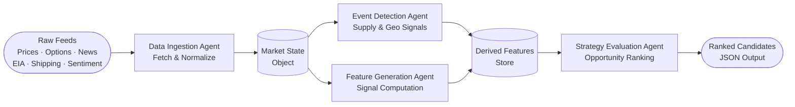
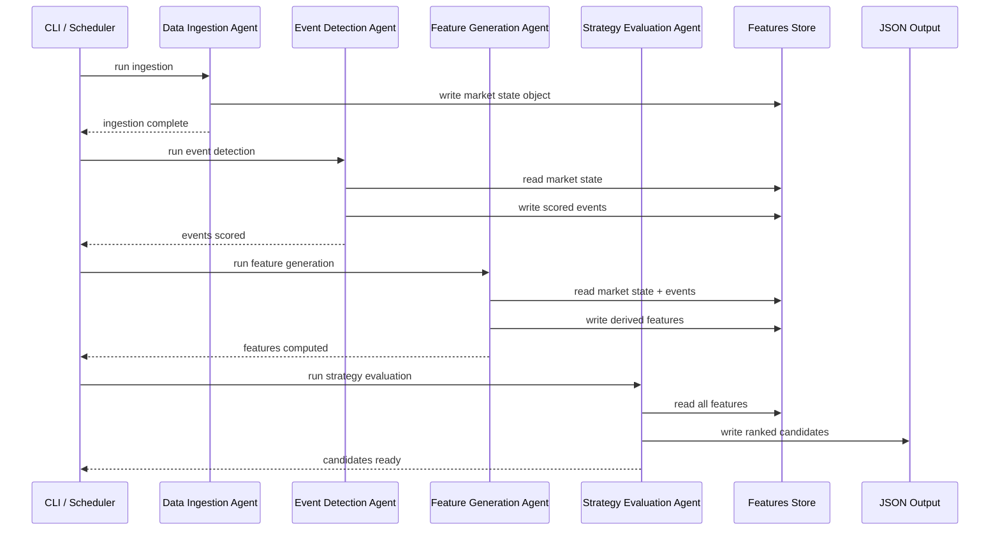

# Energy Options Opportunity Agent — User Guide

> **Version 1.0 · March 2026**
> Advisory system only. No automated trade execution is performed.

---

## Table of Contents

1. [Overview](#overview)
2. [Prerequisites](#prerequisites)
3. [Setup & Configuration](#setup--configuration)
4. [Running the Pipeline](#running-the-pipeline)
5. [Interpreting the Output](#interpreting-the-output)
6. [Troubleshooting](#troubleshooting)

---

## Overview

The **Energy Options Opportunity Agent** is a modular, four-agent Python pipeline that identifies options trading opportunities driven by oil market instability. It ingests market data, supply signals, geopolitical news, and alternative datasets, then produces structured, ranked candidate options strategies with full signal explainability.

### What the pipeline does



Data flows **unidirectionally** through four loosely coupled agents:

| # | Agent | Role | Key Outputs |
|---|-------|------|-------------|
| 1 | **Data Ingestion Agent** | Fetch & Normalize | Unified market state object |
| 2 | **Event Detection Agent** | Supply & Geo Signals | Scored events (confidence + intensity) |
| 3 | **Feature Generation Agent** | Derived Signal Computation | Volatility gaps, curve steepness, narrative velocity, etc. |
| 4 | **Strategy Evaluation Agent** | Opportunity Ranking | Ranked candidates with edge scores |

### In-scope instruments (MVP)

| Category | Instruments |
|----------|-------------|
| Crude futures | Brent Crude, WTI (`CL=F`) |
| ETFs | USO, XLE |
| Energy equities | Exxon Mobil (XOM), Chevron (CVX) |

### In-scope option structures (MVP)

`long_straddle` · `call_spread` · `put_spread` · `calendar_spread`

> **Out of scope (MVP):** exotic/multi-legged strategies, regional refined product pricing (OPIS), automated trade execution.

---

## Prerequisites

### System requirements

| Requirement | Minimum |
|-------------|---------|
| Python | 3.10+ |
| OS | Linux, macOS, or Windows (WSL recommended) |
| RAM | 2 GB |
| Disk | 5 GB free (for 6–12 months of historical data) |
| Deployment target | Local machine, single VM, or container |

### Required external accounts

All data sources are free or low-cost. Obtain API keys before proceeding.

| Source | Used by | Cost | Sign-up URL |
|--------|---------|------|-------------|
| Alpha Vantage | Crude prices | Free | <https://www.alphavantage.co/support/#api-key> |
| Yahoo Finance (`yfinance`) | ETF/equity prices, options chains | Free | No key required |
| Polygon.io | Options chains (fallback) | Free tier | <https://polygon.io/> |
| EIA API | Inventory & refinery data | Free | <https://www.eia.gov/opendata/> |
| GDELT | News & geopolitical events | Free | No key required |
| NewsAPI | News events | Free tier | <https://newsapi.org/> |
| SEC EDGAR | Insider activity | Free | No key required |
| Quiver Quant | Insider activity (enriched) | Free/Limited | <https://www.quiverquant.com/> |
| MarineTraffic | Tanker flows | Free tier | <https://www.marinetraffic.com/> |
| Reddit API | Narrative/sentiment | Free | <https://www.reddit.com/prefs/apps> |
| Stocktwits | Narrative/sentiment | Free | <https://api.stocktwits.com/> |

> **MVP note:** Only Phase 1 sources (Alpha Vantage, yfinance, Polygon.io) are strictly required to run the pipeline in its initial form. Remaining keys enable Phases 2 and 3 signals.

### Python dependencies

```bash
pip install -r requirements.txt
```

Core libraries used by the pipeline:

```
yfinance
requests
pandas
numpy
python-dotenv
polygon-api-client
```

---

## Setup & Configuration

### 1. Clone the repository

```bash
git clone https://github.com/your-org/energy-options-agent.git
cd energy-options-agent
```

### 2. Create and activate a virtual environment

```bash
python -m venv .venv
source .venv/bin/activate        # macOS / Linux
# .venv\Scripts\activate         # Windows PowerShell
```

### 3. Install dependencies

```bash
pip install --upgrade pip
pip install -r requirements.txt
```

### 4. Configure environment variables

Copy the provided template and populate your keys:

```bash
cp .env.example .env
```

Open `.env` in your editor and fill in the values described in the table below.

#### Environment variable reference

| Variable | Required | Description | Example value |
|----------|----------|-------------|---------------|
| `ALPHA_VANTAGE_API_KEY` | ✅ Phase 1 | API key for crude spot/futures prices | `ABC123XYZ` |
| `POLYGON_API_KEY` | ✅ Phase 1 | API key for options chain data (fallback) | `pk_abc123` |
| `EIA_API_KEY` | Phase 2 | API key for EIA inventory data | `eia_abc123` |
| `NEWS_API_KEY` | Phase 2 | API key for NewsAPI news events | `na_abc123` |
| `QUIVER_API_KEY` | Phase 3 | API key for Quiver Quant insider data | `qv_abc123` |
| `MARINE_TRAFFIC_API_KEY` | Phase 3 | API key for tanker flow data | `mt_abc123` |
| `REDDIT_CLIENT_ID` | Phase 3 | Reddit OAuth client ID | `reddit_id` |
| `REDDIT_CLIENT_SECRET` | Phase 3 | Reddit OAuth client secret | `reddit_secret` |
| `REDDIT_USER_AGENT` | Phase 3 | Reddit OAuth user agent string | `energy-agent/1.0` |
| `OUTPUT_DIR` | ✅ | Directory for JSON output files | `./output` |
| `DATA_DIR` | ✅ | Directory for persisted historical data | `./data` |
| `LOG_LEVEL` | Optional | Logging verbosity (`DEBUG`, `INFO`, `WARNING`) | `INFO` |
| `PIPELINE_PHASE` | Optional | Highest phase to activate (`1`–`3`) | `1` |
| `DATA_RETENTION_DAYS` | Optional | Days of historical data to retain (180–365) | `180` |

> **Security:** Never commit `.env` to source control. It is listed in `.gitignore` by default.

### 5. Initialise the data directory

```bash
python -m agent.setup --init
```

This creates `DATA_DIR` and `OUTPUT_DIR` if they do not exist and validates that all required API keys for the configured `PIPELINE_PHASE` are present.

Expected output:

```
[INFO] Data directory created: ./data
[INFO] Output directory created: ./output
[INFO] Phase 1 keys: OK
[INFO] Initialisation complete.
```

---

## Running the Pipeline

### Pipeline execution sequence



### Running the full pipeline (single command)

```bash
python -m agent.pipeline run
```

This executes all four agents in sequence. On success you will see:

```
[INFO] [1/4] Data Ingestion Agent ... done (14 instruments fetched)
[INFO] [2/4] Event Detection Agent ... done (3 events scored)
[INFO] [3/4] Feature Generation Agent ... done (6 signals computed)
[INFO] [4/4] Strategy Evaluation Agent ... done (5 candidates ranked)
[INFO] Output written to ./output/candidates_20260315T143022Z.json
```

### Running individual agents

You can execute each agent independently when iterating or debugging:

```bash
# Step 1 — fetch and normalise market data
python -m agent.ingestion run

# Step 2 — detect and score supply/geo events
python -m agent.events run

# Step 3 — compute derived signals
python -m agent.features run

# Step 4 — evaluate and rank strategies
python -m agent.strategy run
```

> Each agent reads from and writes to the shared features store (`DATA_DIR`). Agents are independently deployable; you can re-run any single step without re-running the full pipeline.

### Scheduling the pipeline

For a minutes-level market data cadence combined with slower daily/weekly feeds, the recommended approach is a simple cron schedule:

```cron
# Run the full pipeline every 15 minutes during market hours
*/15 9-16 * * 1-5  cd /opt/energy-options-agent && .venv/bin/python -m agent.pipeline run

# Run EIA/EDGAR ingestion once daily at 07:00
0 7 * * 1-5        cd /opt/energy-options-agent && .venv/bin/python -m agent.ingestion run --sources eia,edgar
```

Alternatively, use any container-native scheduler (e.g., Kubernetes CronJob, AWS EventBridge) pointing to the same commands.

### CLI flags reference

```bash
python -m agent.pipeline run --help
```

| Flag | Default | Description |
|------|---------|-------------|
| `--phase INT` | Value of `PIPELINE_PHASE` | Override active phase (1–3) |
| `--output-dir PATH` | Value of `OUTPUT_DIR` | Override output directory |
| `--dry-run` | `false` | Run pipeline without writing output |
| `--log-level LEVEL` | Value of `LOG_LEVEL` | Override log verbosity |
| `--instruments LIST` | All in-scope | Comma-separated subset, e.g. `USO,XOM` |

**Example — dry run at debug verbosity, Phase 2 signals only:**

```bash
python -m agent.pipeline run --phase 2 --dry-run --log-level DEBUG
```

---

## Interpreting the Output

### Output file location

Each pipeline run writes a timestamped JSON file:

```
./output/candidates_<ISO8601_UTC>.json
```

### Output schema

Each element in the `candidates` array represents one ranked opportunity:

| Field | Type | Description |
|-------|------|-------------|
| `instrument` | `string` | Target instrument, e.g. `USO`, `XLE`, `CL=F` |
| `structure` | `enum` | `long_straddle` · `call_spread` · `put_spread` · `calendar_spread` |
| `expiration` | `integer` | Target expiration in calendar days from evaluation date |
| `edge_score` | `float [0.0–1.0]` | Composite opportunity score; **higher = stronger signal confluence** |
| `signals` | `object` | Map of contributing signals and their current state |
| `generated_at` | `ISO 8601 datetime` | UTC timestamp of candidate generation |

### Example output file

```json
{
  "generated_at": "2026-03-15T14:30:22Z",
  "pipeline_phase": 2,
  "candidates": [
    {
      "instrument": "USO",
      "structure": "long_straddle",
      "expiration": 30,
      "edge_score": 0.47,
      "signals": {
        "tanker_disruption_index": "high",
        "volatility_gap": "positive",
        "narrative_velocity": "rising"
      },
      "generated_at": "2026-03-15T14:30:22Z"
    },
    {
      "instrument": "XOM",
      "structure": "call_spread",
      "expiration": 21,
      "edge_score": 0.31,
      "signals": {
        "volatility_gap": "positive",
        "supply_shock_probability": "elevated",
        "sector_dispersion": "widening"
      },
      "generated_at": "2026-03-15T14:30:22Z"
    }
  ]
}
```

### Understanding the edge score

The `edge_score` is a composite float in `[0.0, 1.0]` that reflects the confluence of supporting signals. Use it to **prioritise** candidates, not as a standalone trade signal.

| Edge score range | Interpretation |
|-----------------|----------------|
| `0.70 – 1.00` | Strong confluence — multiple high-confidence signals aligned |
| `0.45 – 0.69` | Moderate confluence — worth further manual review |
| `0.20 – 0.44` | Weak signal — monitor but low priority |
| `0.00 – 0.19` | Minimal edge detected |

### Signal keys reference

| Signal key | Source agent | What it measures |
|------------|-------------|-----------------|
| `volatility_gap` | Feature Generation | Realized vs. implied volatility spread |
| `futures_curve_steepness` | Feature Generation | Contango / backwardation strength |
| `sector_dispersion` | Feature Generation | Cross-sector correlation breakdown |
| `insider_conviction_score` | Feature Generation | Executive trade activity intensity |
| `narrative_velocity` | Feature Generation | Headline acceleration / sentiment momentum |
| `supply_shock_probability` | Feature Generation | Probability of near-term supply disruption |
| `tanker_disruption_index` | Event Detection | Shipping chokepoint stress |
| `refinery_outage_score` | Event Detection | Refinery outage confidence × intensity |
| `geopolitical_event_score` | Event Detection | Geopolitical event confidence × intensity |

### Using output with thinkorswim or other tools

The JSON output is designed to be consumed directly by any JSON-capable dashboard or the thinkorswim platform's scripting interface. To convert the latest output to a flat CSV for spreadsheet review:

```bash
python -m agent.tools export-csv \
  --input ./output/candidates_20260315T143022Z.json \
  --output ./output/candidates_20260315.csv
```

---

## Troubleshooting

### Common errors

| Symptom | Likely cause | Resolution |
|---------|-------------|------------|
| `KeyError: ALPHA_VANTAGE_API_KEY` | Missing `.env` value | Verify `.env` contains the key; re-run `python -m agent.setup --init` |
| `HTTP 429 Too Many Requests` | API rate limit exceeded | Reduce polling frequency or upgrade API tier |
| `FileNotFoundError: ./data/market_state.json` | Ingestion agent has not run yet | Run `python -m agent.ingestion run` before downstream agents |
| `No candidates generated` | Insufficient signal confluence or missing data | Check logs; confirm all Phase 1 data sources returned data; lower edge score threshold if evaluating in low-volatility conditions |