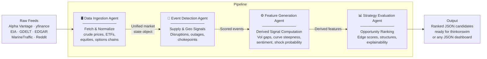
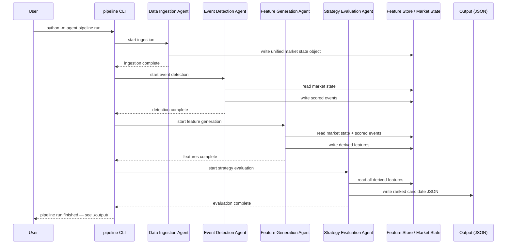

# Energy Options Opportunity Agent — User Guide

> **Version 1.0 · March 2026**
> This guide walks a developer through setting up, configuring, and running the full four-agent pipeline end-to-end.

---

## Table of Contents

1. [Overview](#overview)
2. [Prerequisites](#prerequisites)
3. [Setup & Configuration](#setup--configuration)
4. [Running the Pipeline](#running-the-pipeline)
5. [Interpreting the Output](#interpreting-the-output)
6. [Troubleshooting](#troubleshooting)

---

## Overview

The **Energy Options Opportunity Agent** is a modular Python pipeline that detects options trading opportunities driven by oil market instability. It ingests market data, supply signals, news events, and alternative datasets, then produces a ranked list of candidate options strategies — each with a computed **edge score** and a full set of contributing signals for explainability.

The pipeline is composed of four loosely coupled agents that execute in sequence:



### Instruments covered

| Category | Instruments |
|---|---|
| Crude Futures | Brent Crude, WTI (`CL=F`) |
| ETFs | USO, XLE |
| Energy Equities | Exxon Mobil (XOM), Chevron (CVX) |

### Option structures (MVP)

| Structure | Enum value |
|---|---|
| Long Straddle | `long_straddle` |
| Call Spread | `call_spread` |
| Put Spread | `put_spread` |
| Calendar Spread | `calendar_spread` |

> **Advisory only.** The system recommends candidates; it does not execute trades automatically.

---

## Prerequisites

### System requirements

| Requirement | Minimum |
|---|---|
| Python | 3.10+ |
| RAM | 2 GB |
| Disk | 5 GB (for 6–12 months of historical data) |
| OS | Linux, macOS, or Windows (WSL2 recommended) |
| Deployment target | Local machine, single VM, or container |

### External API accounts

Obtain free (or free-tier) credentials for each service before continuing. All required sources are free or low-cost.

| Service | Used by | Sign-up URL | Cost |
|---|---|---|---|
| Alpha Vantage | Crude price feed | <https://www.alphavantage.co> | Free |
| Yahoo Finance (`yfinance`) | ETF/equity/options | No key required | Free |
| Polygon.io | Options chain (fallback) | <https://polygon.io> | Free tier |
| EIA Open Data | Supply & inventory | <https://www.eia.gov/opendata/> | Free |
| GDELT | News & geo events | No key required | Free |
| NewsAPI | News & geo events | <https://newsapi.org> | Free tier |
| SEC EDGAR | Insider activity | No key required | Free |
| Quiver Quant | Insider activity (enhanced) | <https://www.quiverquant.com> | Free/Limited |
| MarineTraffic | Shipping/tanker flows | <https://www.marinetraffic.com> | Free tier |
| Reddit (PRAW) | Narrative/sentiment | <https://www.reddit.com/prefs/apps> | Free |
| Stocktwits | Narrative/sentiment | <https://api.stocktwits.com> | Free |

### Python dependencies

```bash
pip install -r requirements.txt
```

A typical `requirements.txt` includes:

```text
yfinance>=0.2
requests>=2.31
praw>=7.7          # Reddit API
pandas>=2.0
numpy>=1.26
python-dotenv>=1.0
```

---

## Setup & Configuration

### 1. Clone the repository

```bash
git clone https://github.com/your-org/energy-options-agent.git
cd energy-options-agent
```

### 2. Create and activate a virtual environment

```bash
python -m venv .venv
source .venv/bin/activate        # Linux / macOS
# .venv\Scripts\activate         # Windows PowerShell
```

### 3. Install dependencies

```bash
pip install --upgrade pip
pip install -r requirements.txt
```

### 4. Configure environment variables

Copy the provided template and populate your credentials:

```bash
cp .env.example .env
```

Open `.env` in your editor and fill in every value:

```dotenv
# ── Data Ingestion ────────────────────────────────────────────────────────────
ALPHA_VANTAGE_API_KEY=your_alpha_vantage_key
POLYGON_API_KEY=your_polygon_key          # optional; yfinance is primary
EIA_API_KEY=your_eia_key

# ── Event Detection ───────────────────────────────────────────────────────────
NEWS_API_KEY=your_newsapi_key             # GDELT requires no key
MARINE_TRAFFIC_API_KEY=your_mt_key        # free-tier key from MarineTraffic

# ── Alternative / Contextual Signals ─────────────────────────────────────────
QUIVER_QUANT_API_KEY=your_quiver_key      # optional; EDGAR requires no key
REDDIT_CLIENT_ID=your_reddit_client_id
REDDIT_CLIENT_SECRET=your_reddit_client_secret
REDDIT_USER_AGENT=energy-options-agent/1.0

# ── Pipeline Behaviour ────────────────────────────────────────────────────────
PIPELINE_REFRESH_INTERVAL_MINUTES=5      # cadence for market data refresh
HISTORICAL_RETENTION_DAYS=365            # 6–12 months; 365 recommended
OUTPUT_DIR=./output                      # directory for JSON output files
LOG_LEVEL=INFO                           # DEBUG | INFO | WARNING | ERROR
```

#### Full environment variable reference

| Variable | Required | Default | Description |
|---|---|---|---|
| `ALPHA_VANTAGE_API_KEY` | Yes | — | WTI & Brent spot/futures feed |
| `POLYGON_API_KEY` | No | — | Fallback options chain source |
| `EIA_API_KEY` | Yes | — | Weekly inventory & refinery utilization |
| `NEWS_API_KEY` | Yes | — | News & geopolitical event detection |
| `MARINE_TRAFFIC_API_KEY` | Yes | — | Tanker flow monitoring |
| `QUIVER_QUANT_API_KEY` | No | — | Enhanced insider conviction data |
| `REDDIT_CLIENT_ID` | Yes | — | Reddit PRAW app client ID |
| `REDDIT_CLIENT_SECRET` | Yes | — | Reddit PRAW app secret |
| `REDDIT_USER_AGENT` | Yes | `energy-options-agent/1.0` | Reddit API user-agent string |
| `PIPELINE_REFRESH_INTERVAL_MINUTES` | No | `5` | How often market data is re-fetched |
| `HISTORICAL_RETENTION_DAYS` | No | `365` | Days of raw/derived data to retain |
| `OUTPUT_DIR` | No | `./output` | Directory where JSON candidates are written |
| `LOG_LEVEL` | No | `INFO` | Python logging level |

### 5. Verify connectivity

Run the built-in connection check before executing the full pipeline:

```bash
python -m agent.check_connections
```

Expected output:

```
[OK]  Alpha Vantage          — WTI spot price received
[OK]  yfinance               — USO quote received
[OK]  EIA API                — inventory feed reachable
[OK]  GDELT                  — last event batch received
[OK]  NewsAPI                — headlines reachable
[OK]  SEC EDGAR              — insider filing feed reachable
[OK]  MarineTraffic          — tanker data reachable
[OK]  Reddit (PRAW)          — subreddit r/energy reachable
[WARN] Quiver Quant          — key not set; EDGAR fallback active
[WARN] Polygon.io            — key not set; yfinance options active
Connection check complete: 8 OK, 2 WARN, 0 ERROR
```

`WARN` items indicate optional sources that will fall back gracefully. Any `ERROR` item will prevent the affected agent from running.

---

## Running the Pipeline

### Pipeline execution flow



### Run modes

#### Single-shot run (recommended for initial testing)

Executes the full pipeline once and writes output to `$OUTPUT_DIR`.

```bash
python -m agent.pipeline run
```

#### Continuous mode

Runs the pipeline on a recurring schedule defined by `PIPELINE_REFRESH_INTERVAL_MINUTES`.

```bash
python -m agent.pipeline run --continuous
```

#### Run a single agent in isolation

Each agent can be invoked independently for debugging or incremental development:

```bash
# Data Ingestion only
python -m agent.pipeline run --agent ingestion

# Event Detection only (requires a valid market state on disk)
python -m agent.pipeline run --agent event_detection

# Feature Generation only
python -m agent.pipeline run --agent feature_generation

# Strategy Evaluation only
python -m agent.pipeline run --agent strategy_evaluation
```

#### Dry-run (no output written to disk)

```bash
python -m agent.pipeline run --dry-run
```

### Phase flags

The pipeline respects the four MVP phases. You can limit which data layers are active:

```bash
# Phase 1 only: core market signals and options surface
python -m agent.pipeline run --phase 1

# Phases 1 and 2: adds EIA supply data and event detection
python -m agent.pipeline run --phase 2

# Phases 1–3: adds insider, sentiment, and shipping signals
python -m agent.pipeline run --phase 3
```

> Phase 4 (OPIS pricing, exotic structures, automated execution) is out of scope for the current MVP and is not enabled by any flag.

### Logging

Logs are written to stdout and to `./logs/pipeline.log`. Adjust verbosity with `LOG_LEVEL` in `.env` or by passing a flag:

```bash
python -m agent.pipeline run --log-level DEBUG
```

---

## Interpreting the Output

### Output location

Each pipeline run appends a timestamped file to `$OUTPUT_DIR`:

```
./output/
└── candidates_2026-03-15T14:32:00Z.json
```

### Output schema

Each file contains an array of **strategy candidate objects**:

| Field | Type | Description |
|---|---|---|
| `instrument` | `string` | Target instrument, e.g. `"USO"`, `"XLE"`, `"CL=F"` |
| `structure` | `enum` | `long_straddle` · `call_spread` · `put_spread` · `calendar_spread` |
| `expiration` | `integer` | Calendar days from evaluation date to target expiry |
| `edge_score` | `float [0.0–1.0]` | Composite opportunity score; higher = stronger signal confluence |
| `signals` | `object` | Map of contributing signals and their qualitative levels |
| `generated_at` | `ISO 8601 datetime` | UTC timestamp of candidate generation |

### Example output

```json
[
  {
    "instrument": "USO",
    "structure": "long_straddle",
    "expiration": 30,
    "edge_score": 0.47,
    "signals": {
      "tanker_disruption_index": "high",
      "volatility_gap": "positive",
      "narrative_velocity": "rising"
    },
    "generated_at": "2026-03-15T14:32:00Z"
  },
  {
    "instrument": "XLE",
    "structure": "call_spread",
    "expiration": 45,
    "edge_score": 0.31,
    "signals": {
      "supply_shock_probability": "elevated",
      "futures_curve_steepness": "backwardated",
      "sector_dispersion": "high"
    },
    "generated_at": "2026-03-15T14:32:00Z"
  }
]
```

### Reading the edge score

| Edge Score Range | Interpretation |
|---|---|
| `0.70 – 1.00` | Strong signal confluence — high-priority candidate |
| `0.45 – 0.69` | Moderate confluence — worth monitoring |
| `0.20 – 0.44` | Weak confluence — low conviction |
| `0.00 – 0.19` | Noise — typically filtered from final output |

### Reading the signals map

The `signals` object lists every derived feature that contributed to the edge score. Use it to understand **why** a candidate was ranked where it was.

| Signal key | What it measures |
|---|---|
| `volatility_gap` | Realized vs. implied volatility spread |
| `futures_curve_steepness` | Contango / backwardation degree |
| `sector_dispersion` | Cross-sector correlation divergence |
| `insider_conviction_score` | Weight and recency of insider trades |
| `narrative_velocity` | Headline acceleration (Reddit, Stocktwits, NewsAPI) |
| `supply_shock_probability` | Probability of near-term supply disruption |
| `tanker_disruption_index` | Chokepoint stress derived from shipping data |

### Consuming output in thinkorswim or a dashboard

The JSON array is compatible with any JSON-capable dashboard. For thinkorswim, import the file via the platform's **thinkScript** data import interface or pipe it through a thin adapter script.

---

## Troubleshooting

### Common errors

| Symptom | Likely cause | Fix |
|---|---|---|
| `ERROR: Alpha Vantage quota exceeded` | Free-tier rate limit hit (25 req/day) | Reduce `PIPELINE_REFRESH_INTERVAL_MINUTES` or upgrade key |
| `ERROR: EIA API key invalid` | Wrong or missing `EIA_API_KEY` | Re-check `.env`; re-run `check_connections` |
| `WARNING: options chain data unavailable` | yfinance data delay or market closure | Normal