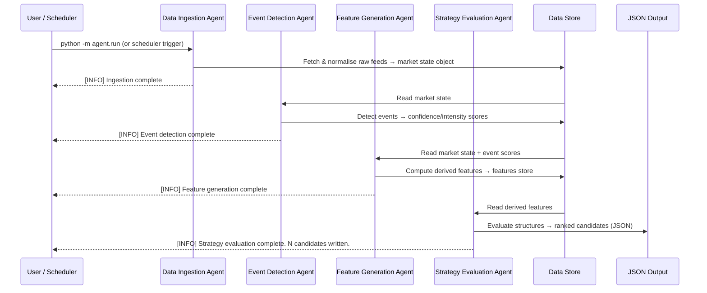

# Energy Options Opportunity Agent — User Guide

> **Version 1.0 · March 2026**
> This guide walks you through installing, configuring, and running the full pipeline end-to-end, and interpreting its output.

---

## Table of Contents

1. [Overview](#overview)
2. [Prerequisites](#prerequisites)
3. [Setup & Configuration](#setup--configuration)
4. [Running the Pipeline](#running-the-pipeline)
5. [Interpreting the Output](#interpreting-the-output)
6. [Troubleshooting](#troubleshooting)

---

## Overview

The **Energy Options Opportunity Agent** is a four-stage autonomous pipeline that detects options trading opportunities driven by oil market instability. It ingests market data, supply signals, geopolitical news, and alternative datasets, then produces a ranked list of candidate options strategies with full signal explainability.

### Pipeline Architecture

```mermaid
flowchart LR
    subgraph Ingestion ["① Data Ingestion Agent"]
        A1[Crude Prices\nAlpha Vantage / MetalpriceAPI]
        A2[ETF & Equity Prices\nYahoo Finance / yfinance]
        A3[Options Chains\nYahoo Finance / Polygon.io]
        A4[Supply & Inventory\nEIA API]
    end

    subgraph Events ["② Event Detection Agent"]
        B1[News & Geo Events\nGDELT / NewsAPI]
        B2[Shipping & Logistics\nMarineTraffic / VesselFinder]
        B3[Confidence & Intensity\nScoring]
    end

    subgraph Features ["③ Feature Generation Agent"]
        C1[Volatility Gap\nRealized vs Implied]
        C2[Futures Curve Steepness]
        C3[Sector Dispersion]
        C4[Insider Conviction Score\nSEC EDGAR / Quiver Quant]
        C5[Narrative Velocity\nReddit / Stocktwits]
        C6[Supply Shock Probability]
    end

    subgraph Strategy ["④ Strategy Evaluation Agent"]
        D1[Evaluate Option Structures]
        D2[Compute Edge Scores]
        D3[Ranked Candidates + Signals]
    end

    MS[(Market State\nObject)]
    FS[(Derived\nFeatures Store)]
    OUT[/JSON Output/]

    Ingestion --> MS
    MS --> Events
    Events --> MS
    MS --> Features
    Features --> FS
    FS --> Strategy
    Strategy --> OUT
```



### In-Scope Instruments & Structures

| Category | Items |
|---|---|
| **Crude futures** | Brent Crude, WTI |
| **ETFs** | USO, XLE |
| **Energy equities** | Exxon Mobil (XOM), Chevron (CVX) |
| **Option structures (MVP)** | Long straddles, call/put spreads, calendar spreads |

> **Advisory only.** The pipeline does **not** execute trades. All output is advisory.

---

## Prerequisites

### System Requirements

| Requirement | Minimum |
|---|---|
| **Python** | 3.10+ |
| **RAM** | 2 GB |
| **Disk** | 10 GB (6–12 months of historical data) |
| **OS** | Linux, macOS, or Windows (WSL2 recommended) |
| **Deployment target** | Local machine, single VM, or container |

### External API Accounts

You will need free-tier (or low-cost) accounts for the following services. Register before you configure the pipeline.

| Service | Used by | URL | Cost |
|---|---|---|---|
| Alpha Vantage or MetalpriceAPI | Crude prices | https://www.alphavantage.co | Free |
| Yahoo Finance / yfinance | ETF, equity, options data | via `yfinance` Python library | Free |
| Polygon.io | Options chains (fallback) | https://polygon.io | Free tier |
| EIA API | Supply & inventory | https://www.eia.gov/opendata | Free |
| GDELT | News & geopolitical events | https://www.gdeltproject.org | Free |
| NewsAPI | News headlines | https://newsapi.org | Free tier |
| SEC EDGAR | Insider activity | https://efts.sec.gov/LATEST/search-index | Free |
| Quiver Quant | Insider activity (enriched) | https://www.quiverquant.com | Free/Limited |
| MarineTraffic or VesselFinder | Tanker shipping flows | https://www.marinetraffic.com | Free tier |
| Reddit API | Narrative/sentiment | https://www.reddit.com/dev/api | Free |
| Stocktwits API | Narrative/sentiment | https://api.stocktwits.com | Free |

> **MVP note.** Phase 1 requires only Alpha Vantage (or MetalpriceAPI), yfinance, and Polygon.io. Remaining services are added in Phases 2–3. See [MVP Phasing](#mvp-phasing-reference) below.

### Python Dependencies

```bash
pip install -r requirements.txt
```

A minimal `requirements.txt` for Phase 1:

```text
yfinance>=0.2
requests>=2.31
pandas>=2.0
numpy>=1.26
python-dotenv>=1.0
```

---

## Setup & Configuration

### 1. Clone the Repository

```bash
git clone https://github.com/your-org/energy-options-agent.git
cd energy-options-agent
```

### 2. Create a Virtual Environment

```bash
python -m venv .venv
source .venv/bin/activate        # Linux / macOS
# .venv\Scripts\activate         # Windows PowerShell
pip install -r requirements.txt
```

### 3. Create the Environment File

Copy the provided template and populate your API keys:

```bash
cp .env.example .env
```

Open `.env` in your editor. All recognised environment variables are described in the table below.

### Environment Variables Reference

| Variable | Required | Default | Description |
|---|---|---|---|
| `ALPHA_VANTAGE_API_KEY` | Phase 1+ | — | API key for Alpha Vantage crude price feed |
| `METALPRICE_API_KEY` | Phase 1 (alt.) | — | Alternative to Alpha Vantage for crude prices |
| `POLYGON_API_KEY` | Phase 1+ | — | Polygon.io key for options chain data |
| `EIA_API_KEY` | Phase 2+ | — | EIA Open Data API key for inventory data |
| `NEWS_API_KEY` | Phase 2+ | — | NewsAPI key for headline ingestion |
| `GDELT_ENABLED` | Phase 2+ | `true` | Set `false` to disable GDELT event feed |
| `QUIVER_QUANT_API_KEY` | Phase 3+ | — | Quiver Quant key for insider activity |
| `REDDIT_CLIENT_ID` | Phase 3+ | — | Reddit OAuth client ID |
| `REDDIT_CLIENT_SECRET` | Phase 3+ | — | Reddit OAuth client secret |
| `REDDIT_USER_AGENT` | Phase 3+ | `energy-agent/1.0` | Reddit API user-agent string |
| `STOCKTWITS_API_KEY` | Phase 3+ | — | Stocktwits API key for sentiment feed |
| `MARINE_TRAFFIC_API_KEY` | Phase 3+ | — | MarineTraffic API key for tanker data |
| `DATA_RETENTION_DAYS` | All | `180` | Days of historical data to retain (180–365) |
| `MARKET_DATA_INTERVAL_MINUTES` | All | `5` | Polling cadence for minute-level market feeds |
| `SLOW_FEED_INTERVAL_HOURS` | All | `24` | Polling cadence for EIA, EDGAR (daily/weekly) |
| `OUTPUT_DIR` | All | `./output` | Directory where JSON candidate files are written |
| `LOG_LEVEL` | All | `INFO` | Logging verbosity: `DEBUG`, `INFO`, `WARNING`, `ERROR` |

#### Example `.env`

```dotenv
# === Core Market Data (Phase 1) ===
ALPHA_VANTAGE_API_KEY=your_alpha_vantage_key
POLYGON_API_KEY=your_polygon_key

# === Supply & Events (Phase 2) ===
EIA_API_KEY=your_eia_key
NEWS_API_KEY=your_newsapi_key
GDELT_ENABLED=true

# === Alternative Signals (Phase 3) ===
QUIVER_QUANT_API_KEY=your_quiver_key
REDDIT_CLIENT_ID=your_reddit_client_id
REDDIT_CLIENT_SECRET=your_reddit_secret
REDDIT_USER_AGENT=energy-options-agent/1.0
STOCKTWITS_API_KEY=your_stocktwits_key
MARINE_TRAFFIC_API_KEY=your_marinetraffic_key

# === Pipeline Settings ===
DATA_RETENTION_DAYS=180
MARKET_DATA_INTERVAL_MINUTES=5
SLOW_FEED_INTERVAL_HOURS=24
OUTPUT_DIR=./output
LOG_LEVEL=INFO
```

### 4. Initialise the Data Store

Run the initialisation script to create the local SQLite database and directory structure:

```bash
python -m agent.init_store
```

Expected output:

```
[INFO] Creating data directories: ./output, ./data/raw, ./data/derived
[INFO] Initialising historical store at ./data/agent.db
[INFO] Store initialised successfully.
```

---

## Running the Pipeline

### Pipeline Execution Flow



### Running All Four Agents (Full Pipeline)

```bash
python -m agent.run --all
```

This triggers the agents in sequence: ingestion → event detection → feature generation → strategy evaluation. Output is written to `OUTPUT_DIR`.

### Running Individual Agents

You can run any agent in isolation, provided its upstream dependencies are already in the data store.

```bash
# Step 1 – Data Ingestion Agent
python -m agent.run --agent ingestion

# Step 2 – Event Detection Agent
python -m agent.run --agent events

# Step 3 – Feature Generation Agent
python -m agent.run --agent features

# Step 4 – Strategy Evaluation Agent
python -m agent.run --agent strategy
```

### Common CLI Flags

| Flag | Description |
|---|---|
| `--all` | Run all four agents in sequence |
| `--agent <name>` | Run a single agent: `ingestion`, `events`, `features`, `strategy` |
| `--dry-run` | Execute without writing output; logs candidates to stdout |
| `--log-level DEBUG` | Override `LOG_LEVEL` for this run |
| `--output-dir <path>` | Override `OUTPUT_DIR` for this run |
| `--phase <1\|2\|3>` | Restrict to signals available in the specified MVP phase |

### Scheduled Execution

For continuous operation, use `cron` (Linux/macOS) or Task Scheduler (Windows).

**Example crontab — run the full pipeline every 5 minutes during market hours:**

```cron
*/5 9-16 * * 1-5 cd /opt/energy-options-agent && \
  /opt/energy-options-agent/.venv/bin/python -m agent.run --all >> /var/log/energy_agent.log 2>&1
```

**Or with Docker:**

```bash
docker build -t energy-options-agent .
docker run -d \
  --env-file .env \
  -v $(pwd)/output:/app/output \
  -v $(pwd)/data:/app/data \
  energy-options-agent
```

---

## Interpreting the Output

### Output Location

Each pipeline run appends one or more candidate objects to a JSON file in `OUTPUT_DIR`:

```
./output/
  candidates_2026-03-15T14:30:00Z.json
  candidates_2026-03-15T14:35:00Z.json
  ...
```

### Output Schema

Each candidate is a JSON object with the following fields:

| Field | Type | Description |
|---|---|---|
| `instrument` | `string` | Target instrument, e.g. `USO`, `XLE`, `CL=F` |
| `structure` | `enum` | `long_straddle` \| `call_spread` \| `put_spread` \| `calendar_spread` |
| `expiration` | `integer` | Target expiration in calendar days from the evaluation date |
| `edge_score` | `float [0.0–1.0]` | Composite opportunity score; higher = stronger signal confluence |
| `signals` | `object` | Map of contributing signals and their current state |
| `generated_at` | `ISO 8601 datetime` | UTC timestamp of candidate generation |

### Example Candidate

```json
{
  "instrument": "USO",
  "structure": "long_straddle",
  "expiration": 30,
  "edge_score": 0.47,
  "signals": {
    "tanker_disruption_index": "high",
    "volatility_gap": "positive",
    "narrative_velocity": "rising"
  },
  "generated_at": "2026-03-15T14:30:00Z"
}
```

### Reading the Edge Score

| Edge Score Range | Interpretation |
|---|---|
| `0.75 – 1.00` | Strong signal confluence — high-priority candidate |
| `0.50 – 0.74` | Moderate confluence — worth monitoring or sizing conservatively |
| `0.25 – 0.49` | Weak confluence — marginal opportunity; low conviction |
| `0.00 – 0.24` | Minimal confluence — unlikely to meet threshold for action |

> **Higher is stronger, not a guarantee.** Edge scores reflect the weight of contributing signals, not a probability of profit. Always apply your own risk assessment before acting on any candidate.

### Reading the Signals Map

The `signals` object documents which derived features contributed to the score and their current state. Signal keys and possible values:

| Signal Key | Possible Values | Source Agent |
|---|---|---|
| `volatility_gap` | `positive`, `negative`, `neutral` | Feature Generation |
| `futures_curve_steepness` | `steep`, `flat`, `inverted` | Feature Generation |
| `sector_dispersion` | `high`, `moderate`, `low` | Feature Generation |
| `insider_conviction_score` | `high`, `moderate`, `low` | Feature Generation |
| `narrative_velocity` | `rising`, `stable`, `falling` | Feature Generation |
| `supply_shock_probability` | `high`, `moderate`, `low` | Feature Generation |
| `tanker_disruption_index` | `high`, `moderate`, `low` | Event Detection |
| `geopolitical_event_score` | `high`, `moderate`, `low` | Event Detection |
| `eia_inventory_trend` | `drawing`, `building`, `flat` | Data Ingestion |

### Consuming Output in thinkorswim or a JSON Dashboard

The output files are JSON-compatible and can be loaded directly into any JSON-capable dashboard or scripted into thinkorswim's thinkScript watchlist via an intermediary script. A minimal Python loader:

```python
import json
from pathlib import Path

output_dir = Path("./output")
candidates = []