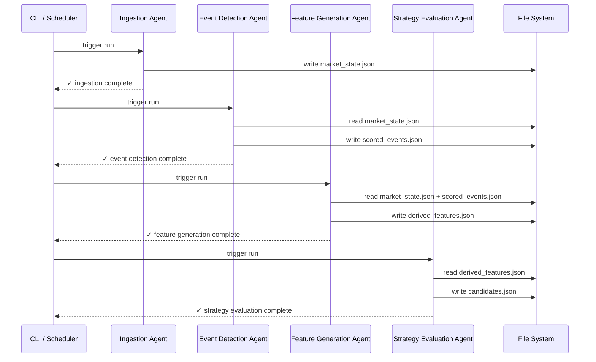

# Energy Options Opportunity Agent — User Guide

> **Version 1.0 • March 2026**
> This guide walks you through installing, configuring, and running the full pipeline, and explains how to interpret and act on its output. No prior knowledge of the project is assumed, but comfort with Python and the command line is expected.

---

## Table of Contents

1. [Overview](#overview)
2. [Prerequisites](#prerequisites)
3. [Setup & Configuration](#setup--configuration)
4. [Running the Pipeline](#running-the-pipeline)
5. [Interpreting the Output](#interpreting-the-output)
6. [Troubleshooting](#troubleshooting)

---

## Overview

The **Energy Options Opportunity Agent** is a modular, four-agent Python pipeline that identifies options trading opportunities driven by oil market instability. It ingests raw market data, supply/inventory signals, news and geopolitical events, and alternative datasets (shipping, insider activity, sentiment), then surfaces volatility mispricing and ranks candidate options strategies by a computed **edge score**.

### In-scope instruments

| Category | Instruments |
|---|---|
| Crude futures | Brent Crude, WTI (`CL=F`) |
| ETFs | USO, XLE |
| Energy equities | XOM (ExxonMobil), CVX (Chevron) |

### In-scope option structures (MVP)

| Structure | Enum value |
|---|---|
| Long straddle | `long_straddle` |
| Call spread | `call_spread` |
| Put spread | `put_spread` |
| Calendar spread | `calendar_spread` |

> **Advisory only.** The system produces ranked recommendations. No automated trade execution is performed in the MVP.

### Pipeline architecture

The four agents communicate via a shared **market state object** and a **derived features store**. Data flows strictly left-to-right; no agent writes back to an upstream agent.

```mermaid
flowchart LR
    subgraph Ingestion["① Data Ingestion Agent"]
        A1[Crude prices\nWTI · Brent]
        A2[ETF / Equity prices\nUSO · XLE · XOM · CVX]
        A3[Options chains\nIV · strike · expiry]
        A4[EIA inventory\nweekly]
    end

    subgraph Events["② Event Detection Agent"]
        B1[News & Geo feeds\nGDELT · NewsAPI]
        B2[Shipping data\nMarineTraffic]
        B3[Confidence &\nintensity scoring]
    end

    subgraph Features["③ Feature Generation Agent"]
        C1[Volatility gap\nrealised vs implied]
        C2[Futures curve\nsteepness]
        C3[Sector dispersion]
        C4[Insider conviction\nNarrative velocity\nSupply shock prob.]
    end

    subgraph Strategy["④ Strategy Evaluation Agent"]
        D1[Evaluate eligible\nstructures]
        D2[Compute edge score]
        D3[Ranked candidates\nJSON output]
    end

    Ingestion -->|market state object| Events
    Events -->|scored events| Features
    Features -->|derived features store| Strategy
    Strategy -->|candidates.json| Output[(Output / Dashboard)]
```



---

## Prerequisites

### System requirements

| Requirement | Minimum |
|---|---|
| Operating system | Linux, macOS, or Windows (WSL2 recommended) |
| Python | 3.10 or later |
| RAM | 2 GB |
| Disk | 5 GB free (for 6–12 months of historical data) |
| Network | Outbound HTTPS to data provider APIs |

### External accounts and API keys

All required data sources have free or free-tier plans. Register for each before proceeding.

| Service | Purpose | Sign-up URL |
|---|---|---|
| Alpha Vantage | WTI / Brent spot prices | <https://www.alphavantage.co/support/#api-key> |
| EIA Open Data | Inventory & refinery utilization | <https://www.eia.gov/opendata/register.php> |
| NewsAPI | News headlines & geopolitical events | <https://newsapi.org/register> |
| Polygon.io *(optional)* | Higher-resolution options chains | <https://polygon.io/dashboard/signup> |
| SEC EDGAR / Quiver Quant *(optional)* | Insider activity | <https://www.quiverquant.com/> |

> `yfinance`, `GDELT`, `MarineTraffic` (free tier), and `Stocktwits`/Reddit do not require an API key for basic access.

### Python dependencies

Install all dependencies from the project root:

```bash
pip install -r requirements.txt
```

The requirements file includes (but is not limited to):

```text
yfinance
requests
pandas
numpy
pydantic
python-dotenv
schedule
```

---

## Setup & Configuration

### 1. Clone the repository

```bash
git clone https://github.com/your-org/energy-options-agent.git
cd energy-options-agent
```

### 2. Create a virtual environment

```bash
python -m venv .venv
source .venv/bin/activate        # Linux / macOS
# .venv\Scripts\activate         # Windows PowerShell
```

### 3. Install dependencies

```bash
pip install --upgrade pip
pip install -r requirements.txt
```

### 4. Configure environment variables

Copy the example environment file and populate it with your credentials:

```bash
cp .env.example .env
```

Open `.env` in your editor and fill in the values described in the table below.

#### Environment variable reference

| Variable | Required | Default | Description |
|---|---|---|---|
| `ALPHA_VANTAGE_API_KEY` | **Yes** | — | API key for WTI / Brent crude price feed |
| `EIA_API_KEY` | **Yes** | — | API key for EIA inventory & refinery data |
| `NEWS_API_KEY` | **Yes** | — | API key for NewsAPI geopolitical headlines |
| `POLYGON_API_KEY` | No | — | Polygon.io key for higher-resolution options chains (falls back to `yfinance` if unset) |
| `QUIVER_API_KEY` | No | — | Quiver Quant key for insider conviction data (Phase 3) |
| `DATA_DIR` | No | `./data` | Root directory for persisted raw and derived data |
| `OUTPUT_DIR` | No | `./output` | Directory where `candidates.json` is written |
| `LOG_LEVEL` | No | `INFO` | Python logging level (`DEBUG`, `INFO`, `WARNING`, `ERROR`) |
| `HISTORY_DAYS` | No | `365` | Days of historical data to retain for backtesting (180–365 recommended) |
| `MARKET_REFRESH_INTERVAL_MINUTES` | No | `5` | How often the ingestion agent re-fetches minute-level market data |
| `SLOW_FEED_REFRESH_HOURS` | No | `24` | Refresh cadence for EIA, EDGAR, and other daily/weekly feeds |
| `EDGE_SCORE_THRESHOLD` | No | `0.30` | Minimum edge score for a candidate to appear in output |

#### Example `.env`

```dotenv
ALPHA_VANTAGE_API_KEY=YOUR_AV_KEY_HERE
EIA_API_KEY=YOUR_EIA_KEY_HERE
NEWS_API_KEY=YOUR_NEWS_API_KEY_HERE

# Optional
POLYGON_API_KEY=
QUIVER_API_KEY=

# Storage
DATA_DIR=./data
OUTPUT_DIR=./output

# Behaviour
LOG_LEVEL=INFO
HISTORY_DAYS=365
MARKET_REFRESH_INTERVAL_MINUTES=5
SLOW_FEED_REFRESH_HOURS=24
EDGE_SCORE_THRESHOLD=0.30
```

### 5. Initialise the data directory

Run the bootstrap script to create the required directory structure and perform an initial historical data fetch:

```bash
python scripts/bootstrap.py
```

Expected output:

```
[INFO] Creating data directories...
[INFO] Fetching initial crude price history (365 days)...
[INFO] Fetching initial options chain snapshots...
[INFO] Bootstrap complete. Run `python main.py` to start the pipeline.
```

---

## Running the Pipeline

### Full pipeline (single run)

Executes all four agents once in sequence and writes results to `OUTPUT_DIR`:

```bash
python main.py
```

### Full pipeline (continuous / scheduled)

Runs the pipeline on the configured refresh cadence. Market-level feeds refresh every `MARKET_REFRESH_INTERVAL_MINUTES`; slower feeds (EIA, EDGAR) refresh every `SLOW_FEED_REFRESH_HOURS`.

```bash
python main.py --mode continuous
```

Press `Ctrl+C` to stop.

### Run individual agents

You can run any agent in isolation for debugging or incremental development:

```bash
# Agent 1 — Data Ingestion
python -m agents.ingestion

# Agent 2 — Event Detection
python -m agents.event_detection

# Agent 3 — Feature Generation
python -m agents.feature_generation

# Agent 4 — Strategy Evaluation
python -m agents.strategy_evaluation
```

> **Dependency note:** Agents 2–4 read from the shared market state and features store written by upstream agents. Run them in order, or ensure the required data files already exist in `DATA_DIR`.

### Command-line flags

| Flag | Description |
|---|---|
| `--mode single` | Run once and exit (default) |
| `--mode continuous` | Run on the configured schedule indefinitely |
| `--output-dir PATH` | Override `OUTPUT_DIR` for this run |
| `--log-level LEVEL` | Override `LOG_LEVEL` for this run |
| `--phase {1,2,3}` | Restrict pipeline to signals available in the specified MVP phase |
| `--dry-run` | Execute all agents but do not write output files |

#### Example: run Phase 1 signals only, with debug logging

```bash
python main.py --phase 1 --log-level DEBUG
```

#### Example: override output directory for a one-off run

```bash
python main.py --output-dir /tmp/test_output --dry-run
```

### What happens during a run



---

## Interpreting the Output

### Output file

After a successful run, the strategy candidates are written to:

```
<OUTPUT_DIR>/candidates.json
```

### Output schema

Each candidate is a JSON object with the following fields:

| Field | Type | Description |
|---|---|---|
| `instrument` | `string` | Target instrument, e.g. `USO`, `XLE`, `CL=F` |
| `structure` | `enum` | Options structure: `long_straddle` · `call_spread` · `put_spread` · `calendar_spread` |
| `expiration` | `integer` | Target expiration in calendar days from evaluation date |
| `edge_score` | `float [0.0–1.0]` | Composite opportunity score; higher = stronger signal confluence |
| `signals` | `object` | Map of contributing signals and their current state |
| `generated_at` | `ISO 8601 datetime` | UTC timestamp of candidate generation |

### Example output

```json
{
  "candidates": [
    {
      "instrument": "USO",
      "structure": "long_straddle",
      "expiration": 30,
      "edge_score": 0.47,
      "signals": {
        "tanker_disruption_index": "high",
        "volatility_gap": "positive",
        "narrative_velocity": "rising"
      },
      "generated_at": "2026-03-15T14:32:00Z"
    },
    {
      "instrument": "XLE",
      "structure": "call_spread",
      "expiration": 21,
      "edge_score": 0.38,
      "signals": {
        "volatility_gap": "positive",
        "supply_shock_probability": "elevated",
        "sector_dispersion": "widening"
      },
      "generated_at": "2026-03-15T14:32:00Z"
    }
  ]
}
```

### Understanding the edge score

The `edge_score` is a composite float between `0.0` and `1.0` that reflects the degree of signal confluence supporting a given strategy. It is **not** a probability of profit.

| Score range | Interpretation |
|---|---|
| `0.00 – 0.29` | Weak confluence — filtered out by default (`EDGE_SCORE_THRESHOLD`) |
| `0.30 – 0.49` | Moderate confluence — worth monitoring; requires additional discretionary review |
| `0.50 – 0.69` | Strong confluence — multiple independent signals align |
| `0.70 – 1.00` | Very strong confluence — broad signal agreement across all layers |

### Understanding the signals map

Each key in the `signals` object corresponds to a derived feature computed by the Feature Generation Agent. Use these to understand *why* a candidate was ranked.

| Signal key | Source layer | What it measures |
|---|---|---|
| `volatility_gap` | Options chains + price history | Divergence between realised and implied volatility |
| `futures_curve_steepness` | Crude futures | Degree of contango or backwardation in the futures curve |
| `sector_dispersion` | ETF / equity prices | Spread of returns across energy sector constituents |
| `insider_conviction_score` | SEC EDGAR / Quiver Quant | Intensity and recency of executive insider trades |
| `narrative_velocity` | Reddit / Stocktwits / NewsAPI | Acceleration of energy-related headline and social volume |
| `supply_shock_probability` | EIA + event scores | Probability of near-term supply disruption |
| `tanker_disruption_index` | MarineTraffic / VesselFinder | Anomalies in tanker flows at key chokepoints |

### Consuming output in thinkorswim or a JSON dashboard

The `candidates.json` file is compatible with any JSON-capable tool. To load it in a custom thinkorswim thinkScript study or an external dashboard, point the tool at the file path configured in `OUTPUT_DIR`. The `generated_at` field can be used to detect stale data.

---

## Troubleshooting

### Common errors and fixes

| Symptom | Likely cause | Fix |
|---|---|---|
| `KeyError: ALPHA_VANTAGE_API_KEY` | `.env` file missing or not loaded | Confirm `.env` exists in the project root and `python-dotenv` is installed |
| `candidates.json` is empty | `EDGE_SCORE_THRESHOLD` is too high, or all agents produced no signals | Lower `EDGE_SCORE_THRESHOLD` or run with `--log-level DEBUG` to inspect individual agent output |
| `FileNotFoundError: market_state.json` | Ingestion agent did not complete successfully | Re-run `python -m agents.ingestion` and check logs for API errors |
| `RateLimitError` from Alpha Vantage | Free-tier rate limit exceeded (5 calls/min) | Increase `MARKET_REFRESH_INTERVAL_MINUTES` to `≥ 12` |
| Stale options data | `yfinance` options chains update once daily | This is expected; the pipeline tolerates delayed data by design |
| Pipeline exits silently with no output | An upstream agent wrote