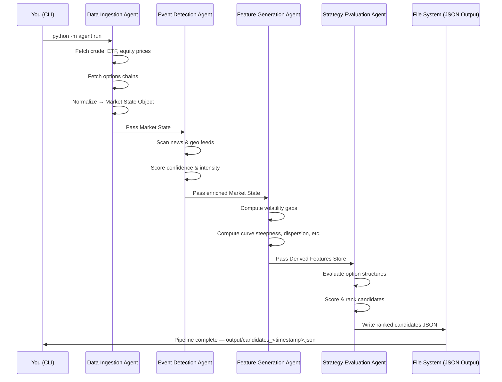

# Energy Options Opportunity Agent — User Guide

> **Version 1.0 · March 2026**
> This guide walks you through installing, configuring, and running the full pipeline from data ingestion through ranked strategy output.

---

## Table of Contents

1. [Overview](#overview)
2. [Prerequisites](#prerequisites)
3. [Setup & Configuration](#setup--configuration)
4. [Running the Pipeline](#running-the-pipeline)
5. [Interpreting the Output](#interpreting-the-output)
6. [Troubleshooting](#troubleshooting)

---

## Overview

The **Energy Options Opportunity Agent** is a four-stage autonomous pipeline that identifies options trading opportunities driven by oil market instability. It ingests market data, supply signals, news events, and alternative datasets, then produces structured, ranked candidate options strategies — each with a computed edge score and a full signal explanation.

### Pipeline Architecture

```mermaid
flowchart LR
    subgraph Ingest["① Data Ingestion Agent"]
        A1[Crude Prices\nAlpha Vantage / MetalpriceAPI]
        A2[ETF & Equity Prices\nyfinance / Yahoo Finance]
        A3[Options Chains\nYahoo Finance / Polygon.io]
        A4[Supply & Inventory\nEIA API]
        A5[Shipping / Logistics\nMarineTraffic / VesselFinder]
    end

    subgraph Event["② Event Detection Agent"]
        B1[News & Geo Events\nGDELT / NewsAPI]
        B2[Insider Activity\nSEC EDGAR / Quiver Quant]
        B3[Confidence & Intensity Scoring]
    end

    subgraph Feature["③ Feature Generation Agent"]
        C1[Volatility Gap\nRealized vs Implied]
        C2[Futures Curve Steepness]
        C3[Sector Dispersion]
        C4[Insider Conviction Score]
        C5[Narrative Velocity]
        C6[Supply Shock Probability]
    end

    subgraph Strategy["④ Strategy Evaluation Agent"]
        D1[Evaluate Option Structures]
        D2[Compute Edge Scores]
        D3[Rank Candidates]
    end

    MS[(Market State\nObject)]
    FS[(Derived Features\nStore)]
    OUT[📄 JSON Output\nRanked Candidates]

    Ingest --> MS
    Event  --> MS
    MS     --> Feature
    Feature --> FS
    FS      --> Strategy
    Strategy --> OUT
```



### In-Scope Instruments & Structures (MVP)

| Category | Items |
|---|---|
| Crude futures | Brent Crude, WTI (`CL=F`) |
| ETFs | USO, XLE |
| Energy equities | Exxon Mobil (XOM), Chevron (CVX) |
| Option structures | Long straddles, call/put spreads, calendar spreads |

> **Advisory only.** Automated trade execution is out of scope for the MVP. All output is informational.

---

## Prerequisites

### System Requirements

| Requirement | Minimum |
|---|---|
| Python | 3.10 or later |
| Memory | 2 GB RAM |
| Storage | 10 GB (for 6–12 months of historical data) |
| Deployment target | Local machine, single VM, or container |

### Python Dependencies

Install all required packages via the project's `requirements.txt`:

```bash
pip install -r requirements.txt
```

Key libraries the pipeline relies on:

| Library | Purpose |
|---|---|
| `yfinance` | ETF, equity, and options chain data |
| `requests` | REST calls to Alpha Vantage, EIA, GDELT, NewsAPI, SEC EDGAR |
| `pandas` / `numpy` | Data normalization and feature computation |
| `pydantic` | Market state object schema validation |
| `schedule` | Cadence management for multi-frequency polling |
| `loguru` | Structured pipeline logging |

### API Accounts

You must register for the following free (or free-tier) services before running the pipeline:

| Service | Used By | Registration URL |
|---|---|---|
| Alpha Vantage | Crude price feed | https://www.alphavantage.co/support/#api-key |
| MetalpriceAPI | Crude price fallback | https://metalpriceapi.com |
| Polygon.io | Options chains (free tier) | https://polygon.io |
| EIA Open Data | Supply & inventory data | https://www.eia.gov/opendata |
| NewsAPI | News & geo-event feed | https://newsapi.org |
| GDELT Project | Geo-event feed | No key required (public) |
| SEC EDGAR | Insider activity | No key required (public) |
| Quiver Quant | Insider activity enrichment | https://www.quiverquant.com |
| MarineTraffic | Tanker flow data (free tier) | https://www.marinetraffic.com/en/ais-api-services |

---

## Setup & Configuration

### 1. Clone the Repository

```bash
git clone https://github.com/your-org/energy-options-agent.git
cd energy-options-agent
```

### 2. Create a Virtual Environment

```bash
python -m venv .venv
source .venv/bin/activate      # macOS / Linux
.venv\Scripts\activate         # Windows
```

### 3. Install Dependencies

```bash
pip install --upgrade pip
pip install -r requirements.txt
```

### 4. Configure Environment Variables

Copy the example environment file and populate it with your API keys and preferences:

```bash
cp .env.example .env
```

Open `.env` in your editor and set every variable listed in the table below.

#### Full Environment Variable Reference

| Variable | Required | Description | Example Value |
|---|---|---|---|
| `ALPHA_VANTAGE_API_KEY` | ✅ | API key for Alpha Vantage crude price feed | `AV_XXXXXXXXXXXX` |
| `METALPRICE_API_KEY` | ✅ | API key for MetalpriceAPI (crude fallback) | `MP_XXXXXXXXXXXX` |
| `POLYGON_API_KEY` | ✅ | Polygon.io API key for options chain data | `PG_XXXXXXXXXXXX` |
| `EIA_API_KEY` | ✅ | EIA Open Data API key for supply/inventory | `EIA_XXXXXXXXXXX` |
| `NEWS_API_KEY` | ✅ | NewsAPI key for news & geo-event headlines | `NA_XXXXXXXXXXXX` |
| `QUIVER_API_KEY` | ⬜ Optional | Quiver Quant key for insider activity enrichment | `QQ_XXXXXXXXXXXX` |
| `MARINE_TRAFFIC_API_KEY` | ⬜ Optional | MarineTraffic API key for tanker flow data | `MT_XXXXXXXXXXXX` |
| `DATA_RETENTION_DAYS` | ✅ | Number of days of historical data to retain | `365` |
| `MARKET_DATA_INTERVAL_MINUTES` | ✅ | Polling cadence for minute-level market feeds | `5` |
| `EIA_POLL_INTERVAL_HOURS` | ✅ | Polling cadence for EIA weekly inventory feed | `24` |
| `EDGAR_POLL_INTERVAL_HOURS` | ✅ | Polling cadence for SEC EDGAR insider filings | `24` |
| `OUTPUT_DIR` | ✅ | Directory where JSON output files are written | `./output` |
| `LOG_LEVEL` | ✅ | Log verbosity: `DEBUG`, `INFO`, `WARNING`, `ERROR` | `INFO` |
| `ENABLE_SHIPPING_SIGNALS` | ⬜ Optional | Set to `true` to activate the MarineTraffic feed | `false` |
| `ENABLE_INSIDER_SIGNALS` | ⬜ Optional | Set to `true` to activate EDGAR / Quiver signals | `false` |
| `ENABLE_NARRATIVE_SIGNALS` | ⬜ Optional | Set to `true` to activate Reddit/Stocktwits feed | `false` |
| `MIN_EDGE_SCORE_THRESHOLD` | ✅ | Minimum edge score for a candidate to appear in output | `0.20` |

> **Tip:** Optional signals map to the MVP phasing plan. Phase 1 requires only the core market keys. Set optional keys and enable flags as you progress through Phases 2 and 3.

### 5. Initialise the Data Store

This command creates the local database schema and output directories:

```bash
python -m agent init
```

Expected output:

```
[INFO] Initialising data store at ./data ...
[INFO] Creating output directory at ./output ...
[INFO] Schema applied. Ready to run.
```

---

## Running the Pipeline

### Pipeline Execution Sequence



### Single Run (One-Shot)

Execute the full four-agent pipeline once and exit:

```bash
python -m agent run
```

This runs all four agents in sequence — Data Ingestion → Event Detection → Feature Generation → Strategy Evaluation — and writes results to `OUTPUT_DIR`.

### Continuous Mode (Scheduled)

Run the pipeline on its configured polling cadences indefinitely:

```bash
python -m agent run --continuous
```

Cadence behaviour in continuous mode:

| Feed type | Governed by |
|---|---|
| Crude prices, ETF/equity prices | `MARKET_DATA_INTERVAL_MINUTES` |
| EIA inventory & refinery data | `EIA_POLL_INTERVAL_HOURS` |
| SEC EDGAR insider filings | `EDGAR_POLL_INTERVAL_HOURS` |
| News / GDELT events | Continuous polling, internally managed |

Stop continuous mode with `Ctrl+C`. The pipeline will finish the current cycle before exiting cleanly.

### Running Individual Agents

You can run any agent in isolation for development or debugging:

```bash
# Data Ingestion only
python -m agent run --agent ingestion

# Event Detection only (reads existing Market State from store)
python -m agent run --agent event-detection

# Feature Generation only
python -m agent run --agent feature-generation

# Strategy Evaluation only
python -m agent run --agent strategy-evaluation
```

> Each agent reads its inputs from the shared market state store and writes its outputs back, so agents can be run and updated independently without disrupting the rest of the pipeline.

### Dry Run (No Output Written)

Validate configuration and connectivity without writing output files:

```bash
python -m agent run --dry-run
```

### Specifying a Phase

Restrict the pipeline to signals available in a given MVP phase:

```bash
python -m agent run --phase 1   # Core market signals & options only
python -m agent run --phase 2   # Adds supply & event augmentation
python -m agent run --phase 3   # Adds alternative / contextual signals
```

| Phase flag | Active agents / signals |
|---|---|
| `--phase 1` | Crude benchmarks, USO/XLE prices, options surface, long straddles, call/put spreads |
| `--phase 2` | Phase 1 + EIA inventory, GDELT/NewsAPI events, supply disruption index |
| `--phase 3` | Phase 2 + insider conviction, narrative velocity, shipping/tanker data |

---

## Interpreting the Output

### Output File Location

Each pipeline run writes a timestamped JSON file to `OUTPUT_DIR`:

```
output/
└── candidates_2026-03-15T14-32-00Z.json
```

### Output Schema

Every strategy candidate in the output array conforms to the following schema:

| Field | Type | Description |
|---|---|---|
| `instrument` | `string` | Target instrument, e.g. `USO`, `XLE`, `CL=F` |
| `structure` | `enum` | `long_straddle` \| `call_spread` \| `put_spread` \| `calendar_spread` |
| `expiration` | `integer` | Target expiration in calendar days from evaluation date |
| `edge_score` | `float [0.0–1.0]` | Composite opportunity score; higher = stronger signal confluence |
| `signals` | `object` | Map of contributing signals and their current state |
| `generated_at` | `ISO 8601 datetime` | UTC timestamp of candidate generation |

### Example Output File

```json
{
  "generated_at": "2026-03-15T14:32:00Z",
  "candidates": [
    {
      "instrument": "USO",
      "structure": "long_straddle",
      "expiration": 30,
      "edge_score": 0.47,
      "signals": {
        "tanker_disruption_index": "high",
        "volatility_gap": "positive",
        "narrative_velocity": "rising"
      },
      "generated_at": "2026-03-15T14:32:00Z"
    },
    {
      "instrument": "XOM",
      "structure": "call_spread",
      "expiration": 21,
      "edge_score": 0.31,
      "signals": {
        "volatility_gap": "positive",
        "supply_shock_probability": "elevated",
        "insider_conviction_score": "moderate"
      },
      "generated_at": "2026-03-15T14:32:00Z"
    }
  ]
}
```

### Reading the Edge Score

The `edge_score` is a composite float in `[0.0, 1.0]` reflecting the confluence of all active signals for that candidate.

| Edge Score Range | Interpretation |
|---|---|
| `0.00 – 0.19` | Filtered out by default (below `MIN_EDGE_SCORE_THRESHOLD`) |
| `0.20 – 0.39` | Weak signal confluence; monitor, do not act unilaterally |
| `0.40 – 0.59` | Moderate confluence; warrants further review |
| `0.60 – 0.79` | Strong confluence; high-priority candidate |
| `0.80 – 1.00` | Very strong confluence across multiple independent signals |

> **Edge scores are heuristic, not predictive.** They reflect signal alignment at the time of evaluation. Always review the `signals` map to understand *why* a candidate scored highly before making any trading decision.

### Understanding the Signals Map

Each key in the `signals` object corresponds to a derived feature computed by the Feature Generation Agent:

| Signal Key | Computed From | What It Tells You |
|---|---|---|
| `volatility_gap` | Realized IV vs. implied IV | Whether options appear cheap (`positive`) or expensive (`negative`) relative to recent realised vol |
| `futures_curve_steepness` | Crude futures curve shape | Degree of contango or backwardation; steep curves suggest supply stress |
| `sector_dispersion` | XOM / CVX vs. USO / XLE correlation | Unusual divergence between equities and ETFs may precede a move |
| `insider_conviction_score` | SEC EDGAR / Quiver Quant filings | Cluster of executive buying/selling signals directional conviction |
| `narrative_velocity` | Reddit / Stocktwits / NewsAPI headline rate | Accelerating coverage of an energy theme may front-run price moves |
| `supply_shock_probability` | EIA inventory + event detection score | Probability that a supply disruption