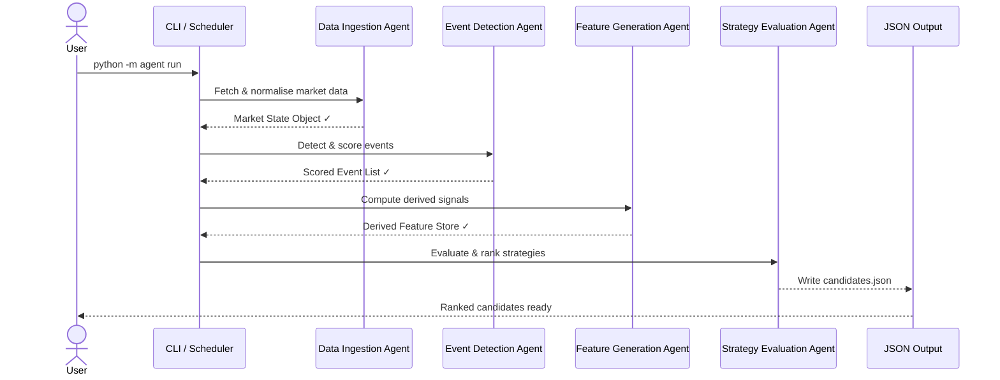

# Energy Options Opportunity Agent — User Guide

> **Version 1.0 • March 2026**
> This guide walks you through installing, configuring, and running the full pipeline end-to-end, then interpreting its output. It assumes you are comfortable with Python 3 and a Unix-style command line.

---

## Table of Contents

1. [Overview](#overview)
2. [Prerequisites](#prerequisites)
3. [Setup & Configuration](#setup--configuration)
4. [Running the Pipeline](#running-the-pipeline)
5. [Interpreting the Output](#interpreting-the-output)
6. [Troubleshooting](#troubleshooting)

---

## Overview

The **Energy Options Opportunity Agent** is a modular, four-agent Python pipeline that identifies options trading opportunities driven by oil market instability. It ingests live and near-live market data, scores supply and geopolitical events, derives volatility signals, and produces a ranked list of candidate options strategies — all without automated trade execution.

### Pipeline at a Glance

```mermaid
flowchart LR
    subgraph Ingestion["① Data Ingestion Agent"]
        A1[Crude Prices\nAlpha Vantage / MetalpriceAPI]
        A2[ETF & Equity Prices\nYahoo Finance / yfinance]
        A3[Options Chains\nYahoo Finance / Polygon.io]
        A4[Supply & Inventory\nEIA API]
        A5[Shipping & Sentiment\nMarineTraffic · Reddit · Stocktwits]
        A6[Insider Activity\nSEC EDGAR / Quiver Quant]
    end

    subgraph Events["② Event Detection Agent"]
        B1[News & Geo Feeds\nGDELT / NewsAPI]
        B2[Supply Disruption Scoring]
        B3[Confidence & Intensity Scores]
    end

    subgraph Features["③ Feature Generation Agent"]
        C1[Volatility Gap\nRealised vs. Implied]
        C2[Futures Curve Steepness]
        C3[Sector Dispersion]
        C4[Insider Conviction Score]
        C5[Narrative Velocity]
        C6[Supply Shock Probability]
    end

    subgraph Strategy["④ Strategy Evaluation Agent"]
        D1[Evaluate Eligible Structures]
        D2[Compute Edge Scores]
        D3[Rank Candidates]
    end

    OUT[(JSON Output\nRanked Candidates)]

    Ingestion -->|Market State Object| Events
    Ingestion -->|Market State Object| Features
    Events    -->|Scored Events| Features
    Features  -->|Derived Signal Store| Strategy
    Strategy  --> OUT
```



### In-Scope Instruments & Structures

| Category | Items |
|---|---|
| **Crude Futures** | Brent Crude, WTI (`CL=F`) |
| **ETFs** | USO, XLE |
| **Energy Equities** | Exxon Mobil (XOM), Chevron (CVX) |
| **Option Structures (MVP)** | Long straddles, call/put spreads, calendar spreads |

> **Advisory only.** The system produces recommendations; it does not execute trades.

---

## Prerequisites

### System Requirements

| Requirement | Minimum |
|---|---|
| Python | 3.10+ |
| RAM | 2 GB |
| Disk | 10 GB free (for 6–12 months of historical data) |
| OS | Linux, macOS, or Windows (WSL2 recommended) |
| Deployment target | Local machine, single VM, or container |

### Required Tools

```bash
# Verify Python version
python --version          # must be 3.10 or higher

# Verify pip
pip --version

# Optional but recommended: create a virtual environment
python -m venv .venv
source .venv/bin/activate   # Windows: .venv\Scripts\activate
```

### API Accounts

Obtain credentials (all free or free-tier) before configuration:

| Service | Purpose | Sign-up URL |
|---|---|---|
| Alpha Vantage **or** MetalpriceAPI | WTI / Brent spot & futures prices | https://www.alphavantage.co / https://metalpriceapi.com |
| Polygon.io | Options chains (alternative to Yahoo Finance) | https://polygon.io |
| EIA Open Data | Weekly supply & inventory data | https://www.eia.gov/opendata |
| NewsAPI | News & geopolitical events | https://newsapi.org |
| GDELT | Geopolitical event stream | No key required (public) |
| SEC EDGAR / Quiver Quant | Insider trading activity | https://efts.sec.gov / https://www.quiverquant.com |
| MarineTraffic **or** VesselFinder | Tanker flow data | https://www.marinetraffic.com / https://www.vesselfinder.com |

> Yahoo Finance (`yfinance`), Reddit, Stocktwits, and GDELT do not require API keys for basic access.

---

## Setup & Configuration

### 1. Clone & Install Dependencies

```bash
git clone https://github.com/your-org/energy-options-agent.git
cd energy-options-agent

pip install -r requirements.txt
```

### 2. Create the Environment File

Copy the provided template and fill in your credentials:

```bash
cp .env.example .env
```

Open `.env` in your editor and populate each variable (see the full reference table below).

### 3. Environment Variable Reference

All pipeline behaviour is controlled via environment variables. The `.env` file is loaded automatically at startup.

| Variable | Required | Default | Description |
|---|---|---|---|
| `ALPHA_VANTAGE_API_KEY` | Conditional¹ | — | API key for Alpha Vantage crude price feed |
| `METALPRICE_API_KEY` | Conditional¹ | — | API key for MetalpriceAPI crude price feed |
| `POLYGON_API_KEY` | Optional | — | API key for Polygon.io options chain data |
| `EIA_API_KEY` | Yes | — | API key for EIA inventory & utilization data |
| `NEWS_API_KEY` | Yes | — | API key for NewsAPI geopolitical/energy headlines |
| `QUIVER_QUANT_API_KEY` | Optional | — | API key for Quiver Quant insider data |
| `MARINE_TRAFFIC_API_KEY` | Optional | — | API key for MarineTraffic tanker flow data |
| `DATA_REFRESH_INTERVAL_MINUTES` | No | `5` | Cadence for market data polling (minutes-level) |
| `EIA_REFRESH_INTERVAL_HOURS` | No | `24` | Cadence for EIA inventory polling |
| `EDGAR_REFRESH_INTERVAL_HOURS` | No | `24` | Cadence for SEC EDGAR insider data polling |
| `HISTORICAL_RETENTION_DAYS` | No | `180` | Days of raw & derived data to retain (180–365 recommended) |
| `OUTPUT_PATH` | No | `./output/candidates.json` | File path for ranked candidate JSON output |
| `LOG_LEVEL` | No | `INFO` | Logging verbosity: `DEBUG`, `INFO`, `WARNING`, `ERROR` |
| `INSTRUMENTS` | No | `USO,XLE,XOM,CVX,CL=F,BZ=F` | Comma-separated list of instruments to monitor |
| `EDGE_SCORE_MIN_THRESHOLD` | No | `0.20` | Candidates below this edge score are suppressed from output |
| `MAX_CANDIDATES` | No | `20` | Maximum number of ranked candidates written per run |
| `ENABLE_SHIPPING_SIGNALS` | No | `false` | Set `true` to activate MarineTraffic/VesselFinder agent |
| `ENABLE_INSIDER_SIGNALS` | No | `false` | Set `true` to activate SEC EDGAR / Quiver Quant agent |
| `ENABLE_NARRATIVE_SIGNALS` | No | `true` | Set `false` to disable Reddit/Stocktwits sentiment agent |
| `DB_PATH` | No | `./data/market_state.db` | SQLite database path for historical storage |

> ¹ At least one of `ALPHA_VANTAGE_API_KEY` or `METALPRICE_API_KEY` must be provided.

### 4. Example `.env` File

```dotenv
# Crude price source (provide at least one)
ALPHA_VANTAGE_API_KEY=YOUR_AV_KEY_HERE
METALPRICE_API_KEY=

# Options data
POLYGON_API_KEY=YOUR_POLYGON_KEY_HERE

# Supply & inventory
EIA_API_KEY=YOUR_EIA_KEY_HERE

# News & events
NEWS_API_KEY=YOUR_NEWSAPI_KEY_HERE

# Optional alternative signals
QUIVER_QUANT_API_KEY=
MARINE_TRAFFIC_API_KEY=
ENABLE_SHIPPING_SIGNALS=false
ENABLE_INSIDER_SIGNALS=false
ENABLE_NARRATIVE_SIGNALS=true

# Data refresh cadences
DATA_REFRESH_INTERVAL_MINUTES=5
EIA_REFRESH_INTERVAL_HOURS=24
EDGAR_REFRESH_INTERVAL_HOURS=24

# Storage & output
HISTORICAL_RETENTION_DAYS=180
DB_PATH=./data/market_state.db
OUTPUT_PATH=./output/candidates.json

# Pipeline tuning
EDGE_SCORE_MIN_THRESHOLD=0.20
MAX_CANDIDATES=20
LOG_LEVEL=INFO
```

### 5. Initialise the Database

Run the schema migration once before your first pipeline execution:

```bash
python -m agent init-db
```

Expected output:

```
[INFO] Initialising database at ./data/market_state.db
[INFO] Schema applied successfully.
[INFO] Ready.
```

---

## Running the Pipeline

### Pipeline Execution Flow



### Single Run (One-Shot)

Execute the full four-agent pipeline once and write results to the configured output path:

```bash
python -m agent run
```

### Continuous Mode

Poll on the configured `DATA_REFRESH_INTERVAL_MINUTES` cadence, re-running the full pipeline each cycle:

```bash
python -m agent run --continuous
```

Press `Ctrl+C` to stop gracefully.

### Run Individual Agents

Each agent is independently deployable and can be invoked in isolation for testing or incremental development:

```bash
# Data Ingestion only
python -m agent run --agent ingestion

# Event Detection only
python -m agent run --agent events

# Feature Generation only
python -m agent run --agent features

# Strategy Evaluation only
python -m agent run --agent strategy
```

> When running agents individually, earlier stages must have already written their outputs to the shared state store.

### Override Configuration at Runtime

Any environment variable can be overridden inline without editing `.env`:

```bash
LOG_LEVEL=DEBUG EDGE_SCORE_MIN_THRESHOLD=0.30 python -m agent run
```

### Scheduling with Cron

To run once per hour on a Unix system:

```bash
# Edit crontab
crontab -e

# Add the following line (adjust paths as needed)
0 * * * * /path/to/.venv/bin/python -m agent run >> /var/log/energy-agent.log 2>&1
```

---

## Interpreting the Output

### Output File

Results are written to the path specified by `OUTPUT_PATH` (default: `./output/candidates.json`) as a JSON array, sorted descending by `edge_score`.

### Output Schema

Each element in the array is a **strategy candidate** object:

| Field | Type | Description |
|---|---|---|
| `instrument` | `string` | Target instrument, e.g. `USO`, `XLE`, `CL=F` |
| `structure` | `enum` | Options structure: `long_straddle` \| `call_spread` \| `put_spread` \| `calendar_spread` |
| `expiration` | `integer` (days) | Target expiration in calendar days from evaluation date |
| `edge_score` | `float` [0.0–1.0] | Composite opportunity score; higher = stronger signal confluence |
| `signals` | `object` | Map of contributing signals and their qualitative states |
| `generated_at` | ISO 8601 `datetime` | UTC timestamp of candidate generation |

### Example Output

```json
[
  {
    "instrument": "USO",
    "structure": "long_straddle",
    "expiration": 30,
    "edge_score": 0.47,
    "signals": {
      "tanker_disruption_index": "high",
      "volatility_gap": "positive",
      "narrative_velocity": "rising"
    },
    "generated_at": "2026-03-15T14:32:00Z"
  },
  {
    "instrument": "XLE",
    "structure": "call_spread",
    "expiration": 21,
    "edge_score": 0.31,
    "signals": {
      "volatility_gap": "positive",
      "supply_shock_probability": "elevated",
      "sector_dispersion": "widening"
    },
    "generated_at": "2026-03-15T14:32:00Z"
  }
]
```

### Reading the Edge Score

The `edge_score` is a composite float in the range 0.0–1.0. It reflects how many signals are aligned in support of a given strategy, weighted by their intensity.

| Edge Score Range | Interpretation |
|---|---|
| `0.00 – 0.19` | Weak / suppressed (filtered out by default) |
| `0.20 – 0.34` | Low conviction — monitor for confirmation |
| `0.35 – 0.49` | Moderate confluence — warrants closer review |
| `0.50 – 0.69` | Strong signal alignment — high-priority candidate |
| `0.70 – 1.00` | Very strong confluence — investigate immediately |

> The scoring function is intentionally heuristic in the MVP. Complexity and ML-based weighting are deferred to Phase 4.

### Understanding the `signals` Map

Each key in the `signals` object corresponds to a derived feature computed by the Feature Generation Agent. Use these to understand *why* a candidate was surfaced:

| Signal Key | Computed From | Possible Values |
|---|---|---|
| `volatility_gap` | Realised IV vs. implied IV | `positive`, `negative`, `neutral` |
| `futures_curve_steepness` | WTI/Brent futures curve shape | `steep`, `flat`, `inverted` |
| `sector_dispersion` | XOM vs. CVX vs. XLE spread | `widening`, `stable`, `narrowing` |
| `insider_conviction_score` | SEC EDGAR / Quiver Quant flows | `high`, `moderate`, `low` |
| `narrative_velocity` | Reddit / Stocktwits headline rate | `rising`, `stable`, `falling` |
| `supply_shock_probability` | EIA data + event detection | `elevated`, `moderate`, `low` |
| `tanker_disruption_index` | MarineTraffic / VesselFinder | `high`, `moderate`, `low` |

### Consuming Output in thinkorswim or Another Dashboard

The JSON output is compatible with any JSON-capable visualization tool. To import into thinkorswim or a custom dashboard:

1. Point your tool at the file path set in `OUTPUT_PATH`.
2. Refresh after each pipeline run (or after each cycle in continuous mode).
3. Sort or filter on `