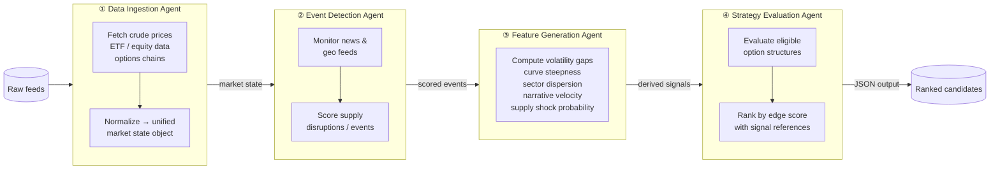
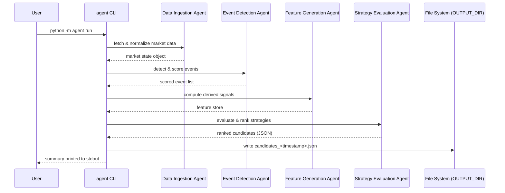

# Energy Options Opportunity Agent — User Guide

> **Version 1.0 • March 2026**
> Advisory only. The system produces ranked candidate opportunities; it does **not** execute trades automatically.

---

## Table of Contents

1. [Overview](#overview)
2. [Prerequisites](#prerequisites)
3. [Setup & Configuration](#setup--configuration)
4. [Running the Pipeline](#running-the-pipeline)
5. [Interpreting the Output](#interpreting-the-output)
6. [Troubleshooting](#troubleshooting)

---

## Overview

The **Energy Options Opportunity Agent** is a modular, four-agent Python pipeline that detects volatility mispricing in oil-related instruments and surfaces ranked options trading candidates.

### Pipeline architecture



Data flows **unidirectionally** through the four agents; each agent is independently deployable and can be updated without disrupting the rest of the pipeline.

### In-scope instruments

| Category | Instruments |
|---|---|
| Crude futures | Brent Crude, WTI (`CL=F`) |
| ETFs | USO, XLE |
| Energy equities | XOM (Exxon Mobil), CVX (Chevron) |

### MVP option structures

| Structure | Enum value |
|---|---|
| Long straddle | `long_straddle` |
| Call spread | `call_spread` |
| Put spread | `put_spread` |
| Calendar spread | `calendar_spread` |

---

## Prerequisites

| Requirement | Minimum version / notes |
|---|---|
| Python | 3.10+ |
| pip | 22+ (or use `pipx` / a virtual-env manager) |
| Git | Any recent version |
| Internet access | Required for all live data feeds |
| Local storage | ≥ 5 GB recommended for 6–12 months of historical data |
| OS | Linux, macOS, or Windows (WSL2 recommended on Windows) |

> **Optional:** A Docker / container runtime if you prefer containerised deployment on a single VM.

You will also need **free API keys** from the following services before running the pipeline:

| Service | Used for | Sign-up URL |
|---|---|---|
| Alpha Vantage | WTI / Brent spot & futures prices | <https://www.alphavantage.co/support/#api-key> |
| Polygon.io | Options chains (IV, strike, expiry, volume) | <https://polygon.io> |
| EIA Open Data | Inventory & refinery utilization | <https://www.eia.gov/opendata/> |
| NewsAPI | Energy news & geopolitical events | <https://newsapi.org> |
| SEC EDGAR | Insider activity filings | No key required (public API) |

> `yfinance`, `GDELT`, `MarineTraffic` free tier, and `Reddit` / `Stocktwits` public feeds do not require registration for basic access.

---

## Setup & Configuration

### 1. Clone the repository

```bash
git clone https://github.com/your-org/energy-options-agent.git
cd energy-options-agent
```

### 2. Create and activate a virtual environment

```bash
python -m venv .venv
source .venv/bin/activate        # macOS / Linux
# .venv\Scripts\activate         # Windows (PowerShell)
```

### 3. Install dependencies

```bash
pip install --upgrade pip
pip install -r requirements.txt
```

### 4. Configure environment variables

Copy the provided template and populate it with your credentials:

```bash
cp .env.example .env
```

Open `.env` in your editor and fill in the values described in the table below.

#### Environment variable reference

| Variable | Required | Default | Description |
|---|---|---|---|
| `ALPHA_VANTAGE_API_KEY` | ✅ | — | API key for WTI / Brent crude price feed |
| `POLYGON_API_KEY` | ✅ | — | API key for options chain data |
| `EIA_API_KEY` | ✅ | — | API key for EIA inventory & refinery utilization feed |
| `NEWS_API_KEY` | ✅ | — | API key for NewsAPI geopolitical / energy news |
| `YFINANCE_ENABLED` | ❌ | `true` | Set `false` to disable Yahoo Finance ETF / equity fallback |
| `GDELT_ENABLED` | ❌ | `true` | Set `false` to disable GDELT continuous event feed |
| `MARINE_TRAFFIC_ENABLED` | ❌ | `true` | Set `false` to disable tanker/shipping data (free tier) |
| `REDDIT_ENABLED` | ❌ | `true` | Set `false` to disable Reddit narrative velocity feed |
| `STOCKTWITS_ENABLED` | ❌ | `true` | Set `false` to disable Stocktwits sentiment feed |
| `DATA_DIR` | ❌ | `./data` | Path for persisted raw and derived data |
| `OUTPUT_DIR` | ❌ | `./output` | Path where ranked JSON candidates are written |
| `HISTORY_MONTHS` | ❌ | `12` | Months of historical data to retain (minimum `6`) |
| `MARKET_DATA_INTERVAL_SECONDS` | ❌ | `60` | Polling cadence for minute-level market data feeds |
| `LOG_LEVEL` | ❌ | `INFO` | Logging verbosity: `DEBUG`, `INFO`, `WARNING`, `ERROR` |

Example `.env` file:

```dotenv
ALPHA_VANTAGE_API_KEY=YOUR_KEY_HERE
POLYGON_API_KEY=YOUR_KEY_HERE
EIA_API_KEY=YOUR_KEY_HERE
NEWS_API_KEY=YOUR_KEY_HERE

DATA_DIR=./data
OUTPUT_DIR=./output
HISTORY_MONTHS=12
MARKET_DATA_INTERVAL_SECONDS=60
LOG_LEVEL=INFO
```

### 5. Initialise local storage

```bash
python -m agent init
```

This creates the directories specified by `DATA_DIR` and `OUTPUT_DIR` and writes an empty schema-validated historical store.

---

## Running the Pipeline

### Pipeline sequence (setup reference)



### Run a single full-pipeline cycle

```bash
python -m agent run
```

The pipeline executes all four agents in sequence and writes a timestamped JSON file to `OUTPUT_DIR`.

### Run in continuous (scheduled) mode

```bash
python -m agent run --continuous
```

Market data agents refresh on the cadence set by `MARKET_DATA_INTERVAL_SECONDS`. Slower feeds (EIA, EDGAR) refresh daily or weekly automatically per their source schedule.

### Run a specific agent in isolation

Each agent can be invoked independently for testing or incremental development:

```bash
python -m agent run --agent ingestion    # Data Ingestion Agent only
python -m agent run --agent events       # Event Detection Agent only
python -m agent run --agent features     # Feature Generation Agent only
python -m agent run --agent strategy     # Strategy Evaluation Agent only
```

> **Note:** Running `strategy` in isolation requires a pre-populated feature store. Run `ingestion`, `events`, and `features` first, or use a previously persisted state.

### Useful CLI flags

| Flag | Description |
|---|---|
| `--continuous` | Run on a recurring schedule instead of once |
| `--agent <name>` | Run a single named agent (`ingestion`, `events`, `features`, `strategy`) |
| `--output-dir <path>` | Override `OUTPUT_DIR` for this run |
| `--log-level <level>` | Override `LOG_LEVEL` for this run |
| `--dry-run` | Execute pipeline but suppress file writes (useful for testing) |

---

## Interpreting the Output

### Output file location

Each pipeline run writes a file named:

```
<OUTPUT_DIR>/candidates_<ISO8601_timestamp>.json
```

Example:

```
./output/candidates_2026-03-15T14-32-00Z.json
```

### Output schema

Each element of the output array represents one ranked strategy candidate:

| Field | Type | Description |
|---|---|---|
| `instrument` | `string` | Target instrument, e.g. `USO`, `XLE`, `CL=F` |
| `structure` | `enum` | One of `long_straddle`, `call_spread`, `put_spread`, `calendar_spread` |
| `expiration` | `integer` (days) | Target expiration in calendar days from evaluation date |
| `edge_score` | `float` [0.0–1.0] | Composite opportunity score; **higher = stronger signal confluence** |
| `signals` | `object` | Contributing signal map used to explain the score |
| `generated_at` | ISO 8601 datetime | UTC timestamp of candidate generation |

### Example candidate

```json
{
  "instrument": "USO",
  "structure": "long_straddle",
  "expiration": 30,
  "edge_score": 0.47,
  "signals": {
    "tanker_disruption_index": "high",
    "volatility_gap": "positive",
    "narrative_velocity": "rising"
  },
  "generated_at": "2026-03-15T14:32:00Z"
}
```

### Understanding the `edge_score`

The `edge_score` is a composite float between `0.0` and `1.0` that reflects the confluence of active signals for a given candidate. Use it to **prioritise review**, not as a standalone buy/sell signal.

| Score range | Suggested interpretation |
|---|---|
| `0.75 – 1.00` | Strong signal confluence — highest priority for manual review |
| `0.50 – 0.74` | Moderate confluence — worth investigating |
| `0.25 – 0.49` | Weak confluence — monitor but low priority |
| `0.00 – 0.24` | Minimal confluence — typically not actionable |

### Understanding the `signals` map

The `signals` object identifies **which derived signals contributed** to the `edge_score`, providing full explainability for each recommendation.

| Signal key | What it measures |
|---|---|
| `volatility_gap` | Spread between realized and implied volatility |
| `futures_curve_steepness` | Degree of contango or backwardation in the futures curve |
| `sector_dispersion` | Cross-sector correlation divergence |
| `insider_conviction_score` | Strength of recent executive insider trading activity |
| `narrative_velocity` | Acceleration of energy-related headline volume |
| `supply_shock_probability` | Modelled likelihood of a near-term supply disruption |
| `tanker_disruption_index` | Shipping flow anomaly score from tanker/logistics feeds |

### Using the output with thinkorswim

The output is JSON-compatible and can be loaded into thinkorswim or any JSON-capable dashboard. Import the candidates file or pipe it to your preferred visualization tool:

```bash
# Pretty-print the most recent candidates file
cat $(ls -t ./output/candidates_*.json | head -1) | python -m json.tool
```

---

## Troubleshooting

### Common errors and fixes

| Symptom | Likely cause | Resolution |
|---|---|---|
| `KeyError: 'ALPHA_VANTAGE_API_KEY'` | Missing environment variable | Verify `.env` is populated and loaded; run `python -m agent check-env` |
| `HTTP 429 – Too Many Requests` | API rate limit exceeded | Increase `MARKET_DATA_INTERVAL_SECONDS`; check the rate limits for the affected service |
| `No candidates generated` | All edge scores below threshold, or empty feature store | Run with `--log-level DEBUG` to inspect signal values; confirm data feeds are returning data |
| Pipeline stalls at `ingestion` stage | Network timeout or feed unavailable | The pipeline is designed to tolerate missing data; check logs for `WARN` messages about skipped feeds |
| `FileNotFoundError` for `DATA_DIR` or `OUTPUT_DIR` | Storage not initialised | Run `python -m agent init` before the first `run` |
| Old or stale candidates in output | Pipeline not re-run after market close | Confirm `--continuous` mode is active, or re-run manually |
| `json.decoder.JSONDecodeError` in output file | Partial write from interrupted run | Delete the malformed file; re-run the pipeline |

### Verifying your environment

```bash
python -m agent check-env
```

This command validates that all required environment variables are set and that each configured API key returns a successful test response.

### Enabling debug logging

```bash
python -m agent run --log-level DEBUG
```

Debug output includes the raw market state object, per-event confidence scores, all computed feature values, and the full signal map for each evaluated candidate. Redirect to a file for easier inspection:

```bash
python -m agent run --log-level DEBUG 2>&1 | tee debug_$(date +%Y%m%dT%H%M%S).log
```

### Data feed status and resilience

The pipeline is designed to **tolerate delayed or missing data without failing**. If a feed is unavailable:

- The affected signal is marked as `unavailable` in the candidate's `signals` map.
- The `edge_score` is computed from the remaining available signals.
- A `WARNING` is emitted to the log with the name of the skipped source.

To disable a feed explicitly (e.g., during testing), set the corresponding `*_ENABLED` variable to `false` in your `.env` file.

### Data retention

By default, the pipeline retains 12 months of raw and derived data (configurable via `HISTORY_MONTHS`). If your storage fills unexpectedly:

```bash
# Check current storage usage
du -sh ./data

# Reduce retention window (minimum supported: 6 months)
# Edit .env: HISTORY_MONTHS=6
python -m agent prune
```

### Getting help

- Review the [System Design Document](./docs/system_design.md) for authoritative architecture details.
- Open an issue on the project repository with the relevant log excerpt and your `.env` configuration (credentials redacted).

---

> **Reminder:** This system is **advisory only**. Automated trade execution is out of scope for the current version. Always apply independent judgment before acting on any generated candidate.