# Energy Options Opportunity Agent — User Guide

> **Version 1.0 · March 2026**
> This guide walks you through installing, configuring, and running the full pipeline end-to-end, then interpreting the structured output it produces.

---

## Table of Contents

1. [Overview](#overview)
2. [Prerequisites](#prerequisites)
3. [Setup & Configuration](#setup--configuration)
4. [Running the Pipeline](#running-the-pipeline)
5. [Interpreting the Output](#interpreting-the-output)
6. [Troubleshooting](#troubleshooting)

---

## Overview

The **Energy Options Opportunity Agent** is an autonomous, modular Python pipeline that identifies options trading opportunities driven by oil market instability. It ingests market data, supply signals, news events, and alternative datasets, then produces structured, ranked candidate options strategies.

The system is **advisory only** — it makes no trades. Output is a JSON-compatible list of candidate strategies, each carrying an `edge_score` and a map of the signals that contributed to it.

### Four-Agent Pipeline

Data flows unidirectionally through four loosely coupled agents that share a common market state object and a derived features store.

```mermaid
flowchart LR
    subgraph Ingestion ["① Data Ingestion Agent"]
        A1[Crude Prices\nWTI · Brent]
        A2[ETF / Equity Prices\nUSO · XLE · XOM · CVX]
        A3[Options Chains\nStrike · Expiry · IV · Volume]
    end

    subgraph Events ["② Event Detection Agent"]
        B1[News & Geo Feeds\nGDELT · NewsAPI]
        B2[Supply / Inventory\nEIA API]
        B3[Shipping\nMarineTraffic]
        B4[Confidence & Intensity\nScoring]
    end

    subgraph Features ["③ Feature Generation Agent"]
        C1[Volatility Gap\nRealized vs Implied]
        C2[Futures Curve Steepness]
        C3[Sector Dispersion]
        C4[Insider Conviction Score]
        C5[Narrative Velocity]
        C6[Supply Shock Probability]
    end

    subgraph Strategy ["④ Strategy Evaluation Agent"]
        D1[Evaluate Eligible Structures\nStraddles · Spreads · Calendars]
        D2[Compute Edge Scores]
        D3[Ranked JSON Output]
    end

    Ingestion -->|Market State Object| Events
    Events    -->|Scored Events| Features
    Features  -->|Derived Signals| Strategy
    Strategy  -->|candidates.json| Output[(Downstream\nDashboard /\nthinkorswim)]
```



### In-Scope Instruments & Structures

| Category | Items |
|---|---|
| Crude futures | Brent Crude, WTI |
| ETFs | USO, XLE |
| Energy equities | XOM (ExxonMobil), CVX (Chevron) |
| Option structures (MVP) | Long straddle, call spread, put spread, calendar spread |

---

## Prerequisites

| Requirement | Minimum version / notes |
|---|---|
| Python | 3.10 or later |
| pip | 23+ (ships with Python 3.10+) |
| Git | Any recent version |
| Operating system | Linux, macOS, or Windows (WSL2 recommended on Windows) |
| Hardware | Single modest VM or laptop; no GPU required |
| API keys | See [Setup & Configuration](#setup--configuration) |

Install Python dependencies into a virtual environment:

```bash
git clone https://github.com/your-org/energy-options-agent.git
cd energy-options-agent

python -m venv .venv
source .venv/bin/activate          # Windows: .venv\Scripts\activate

pip install --upgrade pip
pip install -r requirements.txt
```

---

## Setup & Configuration

All runtime behaviour is controlled through environment variables. Copy the provided template and fill in your values:

```bash
cp .env.example .env
```

Then open `.env` in your editor.

### Environment Variables

| Variable | Required | Default | Description |
|---|---|---|---|
| `ALPHA_VANTAGE_API_KEY` | Yes | — | API key for Alpha Vantage crude price feed (WTI, Brent) |
| `POLYGON_API_KEY` | No | — | Polygon.io key for options chain data (falls back to yfinance if unset) |
| `NEWS_API_KEY` | No | — | NewsAPI.org key for headline ingestion |
| `EIA_API_KEY` | Yes | — | U.S. Energy Information Administration API key (free, register at eia.gov) |
| `MARINE_TRAFFIC_API_KEY` | No | — | MarineTraffic API key for tanker flow data (free tier supported) |
| `QUIVER_QUANT_API_KEY` | No | — | Quiver Quantitative key for insider trade data |
| `DATA_DIR` | No | `./data` | Directory for raw and derived historical data storage |
| `OUTPUT_DIR` | No | `./output` | Directory where ranked `candidates.json` files are written |
| `LOG_LEVEL` | No | `INFO` | Python logging level (`DEBUG`, `INFO`, `WARNING`, `ERROR`) |
| `MARKET_REFRESH_INTERVAL_SECONDS` | No | `60` | Cadence for market data polling (minutes-level recommended) |
| `EIA_REFRESH_INTERVAL_HOURS` | No | `24` | Cadence for EIA inventory/refinery data polling |
| `HISTORY_RETENTION_DAYS` | No | `365` | Days of raw and derived data to retain for backtesting (180–365 recommended) |
| `GDELT_ENABLED` | No | `true` | Set to `false` to disable GDELT geo-event ingestion |
| `REDDIT_ENABLED` | No | `true` | Set to `false` to disable Reddit/Stocktwits sentiment ingestion |
| `EDGE_SCORE_THRESHOLD` | No | `0.20` | Candidates with an edge score below this value are omitted from output |
| `MAX_EXPIRATION_DAYS` | No | `90` | Maximum days-to-expiration considered when evaluating structures |

> **Tip:** Variables marked *No* under Required are optional for MVP Phase 1. You can run a functional pipeline with only `ALPHA_VANTAGE_API_KEY` and `EIA_API_KEY` set.

### Verifying Data-Source Connectivity

Run the built-in connectivity check before your first full pipeline run:

```bash
python -m agent check-sources
```

Expected output when all configured sources are reachable:

```
[OK]  alpha_vantage       — crude prices (WTI, Brent)
[OK]  yfinance            — ETF/equity prices (USO, XLE, XOM, CVX)
[OK]  yfinance            — options chains (fallback active)
[OK]  eia                 — supply/inventory data
[SKIP] polygon            — POLYGON_API_KEY not set; using yfinance fallback
[SKIP] marine_traffic     — MARINE_TRAFFIC_API_KEY not set
[SKIP] quiver_quant       — QUIVER_QUANT_API_KEY not set
[OK]  gdelt               — geo/news events
[OK]  reddit              — narrative sentiment
```

`[SKIP]` entries are non-fatal; those signal layers will be absent from edge score computation but will not stop the pipeline.

---

## Running the Pipeline

### Full Pipeline (All Four Agents)

The standard entry point runs all agents in sequence and writes ranked candidates to `$OUTPUT_DIR`.

```bash
python -m agent run
```

To override configuration inline without editing `.env`:

```bash
EDGE_SCORE_THRESHOLD=0.30 python -m agent run
```

### Run a Single Agent

Each agent can be invoked independently for testing or incremental development.

```bash
# Agent 1 — fetch and normalise market data only
python -m agent run --agent ingestion

# Agent 2 — event detection (requires market state from Agent 1)
python -m agent run --agent events

# Agent 3 — feature generation (requires market state + scored events)
python -m agent run --agent features

# Agent 4 — strategy evaluation and ranking (requires derived features)
python -m agent run --agent strategy
```

### Scheduled / Continuous Mode

To keep the pipeline running on its configured refresh cadence, use the `--loop` flag:

```bash
python -m agent run --loop
```

In loop mode the pipeline respects `MARKET_REFRESH_INTERVAL_SECONDS` for price/options data and `EIA_REFRESH_INTERVAL_HOURS` for slower supply feeds. Press `Ctrl+C` to stop gracefully.

For production-style scheduling, use cron or a process supervisor:

```cron
# crontab example — run every 5 minutes during trading hours (UTC)
*/5 13-21 * * 1-5 cd /opt/energy-options-agent && .venv/bin/python -m agent run >> logs/pipeline.log 2>&1
```

### Verbose / Debug Run

```bash
LOG_LEVEL=DEBUG python -m agent run
```

### Output Location

After each successful run a timestamped file is written to `$OUTPUT_DIR`:

```
output/
└── candidates_2026-03-15T14:32:00Z.json
```

The most recent run is also symlinked as `output/candidates_latest.json`.

---

## Interpreting the Output

### Output Schema

Each element in the output array represents one ranked strategy candidate.

| Field | Type | Description |
|---|---|---|
| `instrument` | `string` | Target instrument ticker, e.g. `USO`, `XLE`, `CL=F` |
| `structure` | `enum` | One of `long_straddle`, `call_spread`, `put_spread`, `calendar_spread` |
| `expiration` | `integer` | Target expiration in calendar days from the evaluation date |
| `edge_score` | `float [0.0–1.0]` | Composite opportunity score — higher = stronger signal confluence |
| `signals` | `object` | Key/value map of contributing signals and their assessed states |
| `generated_at` | `ISO 8601 datetime` | UTC timestamp of candidate generation |

### Example Output

```json
[
  {
    "instrument": "USO",
    "structure": "long_straddle",
    "expiration": 30,
    "edge_score": 0.47,
    "signals": {
      "tanker_disruption_index": "high",
      "volatility_gap": "positive",
      "narrative_velocity": "rising"
    },
    "generated_at": "2026-03-15T14:32:00Z"
  },
  {
    "instrument": "XLE",
    "structure": "call_spread",
    "expiration": 45,
    "edge_score": 0.31,
    "signals": {
      "supply_shock_probability": "elevated",
      "volatility_gap": "positive",
      "sector_dispersion": "widening"
    },
    "generated_at": "2026-03-15T14:32:00Z"
  }
]
```

### Reading the Edge Score

| Edge Score Range | Interpretation |
|---|---|
| `0.00 – 0.19` | Weak confluence; filtered out by default (`EDGE_SCORE_THRESHOLD`) |
| `0.20 – 0.39` | Moderate signal alignment; worth monitoring |
| `0.40 – 0.59` | Strong signal confluence; primary candidates for further review |
| `0.60 – 1.00` | Very strong confluence; highest priority for manual analysis |

> **Important:** A high `edge_score` reflects signal confluence, not a guaranteed profitable trade. Always apply your own risk assessment before entering any position.

### Signal Reference

| Signal Key | What it Measures |
|---|---|
| `volatility_gap` | Spread between realized and implied volatility; `positive` means IV is low relative to realized vol |
| `futures_curve_steepness` | Degree of contango or backwardation in the WTI/Brent curve |
| `sector_dispersion` | Divergence between energy sub-sectors (e.g. XOM vs. XLE) |
| `insider_conviction_score` | Aggregated intensity of recent insider buying/selling activity |
| `narrative_velocity` | Acceleration of energy-related headlines and social mentions |
| `supply_shock_probability` | Model probability of a near-term supply disruption event |
| `tanker_disruption_index` | Shipping anomaly score derived from AIS/MarineTraffic data |

### Consuming Output in thinkorswim or a Dashboard

The JSON output is self-contained and can be loaded directly into any JSON-capable tool. For thinkorswim, import `candidates_latest.json` via the platform's **Scan** or custom scripting interface, mapping `instrument` → watchlist symbol and `edge_score` → sort column.

---

## Troubleshooting

### Pipeline Fails to Start

| Symptom | Likely Cause | Fix |
|---|---|---|
| `KeyError: ALPHA_VANTAGE_API_KEY` | Missing required env var | Ensure `.env` is populated and the shell has loaded it (`source .env` or use a tool like `direnv`) |
| `ModuleNotFoundError` | Dependencies not installed | Confirm the virtual environment is active and `pip install -r requirements.txt` completed without errors |
| `Permission denied: ./data` | `DATA_DIR` not writable | `mkdir -p data output && chmod 755 data output` |

### Data Source Errors

| Symptom | Likely Cause | Fix |
|---|---|---|
| `[WARN] alpha_vantage: rate limit exceeded` | Free-tier API limit hit | Increase `MARKET_REFRESH_INTERVAL_SECONDS` to `300` (5 min) or obtain a paid key |
| `[WARN] eia: HTTP 403` | Invalid or expired EIA key | Regenerate key at [eia.gov/opendata](https://www.eia.gov/opendata/) |
| `[WARN] yfinance: no options data for XOM` | Options chain temporarily unavailable | The pipeline tolerates missing data; the affected instrument is skipped for that run and retried on the next cycle |
| `[WARN] gdelt: timeout` | GDELT endpoint unreachable | Set `GDELT_ENABLED=false` temporarily; geo-event signals will be absent but pipeline will continue |

### Output is Empty or All Candidates Filtered

```bash
# Check what was generated before threshold filtering
LOG_LEVEL=DEBUG python -m agent run --agent strategy
```

If the debug log shows candidates being discarded, your `EDGE_SCORE_THRESHOLD` may be too high for current market conditions.

```bash
# Lower the threshold for a single exploratory run
EDGE_SCORE_THRESHOLD=0.10 python -m agent run
```

### Stale Output Timestamps

If `generated_at` in the output is not advancing, the pipeline may be writing to a cached state. Clear the derived features store and re-run:

```bash
python -m agent clear-cache --features
python -m agent run
```

> **Note:** `--features` clears only the derived signals cache. Raw historical price data in `$DATA_DIR` is not affected.

### Data Retention and Storage Growth

Historical raw and derived data defaults to 365 days (`HISTORY_RETENTION_DAYS`). If disk space is a concern, reduce this value:

```bash
HISTORY_RETENTION_DAYS=180 python -m agent run
```

The pipeline automatically purges records older than `HISTORY_RETENTION_DAYS` at the start of each run. A minimum of 180 days is recommended to support meaningful volatility and curve calculations.

---

> **Disclaimer:** The Energy Options Opportunity Agent is an informational tool only. It does not execute trades and does not constitute financial advice. All output should be reviewed by a qualified individual before any trading decision is made.