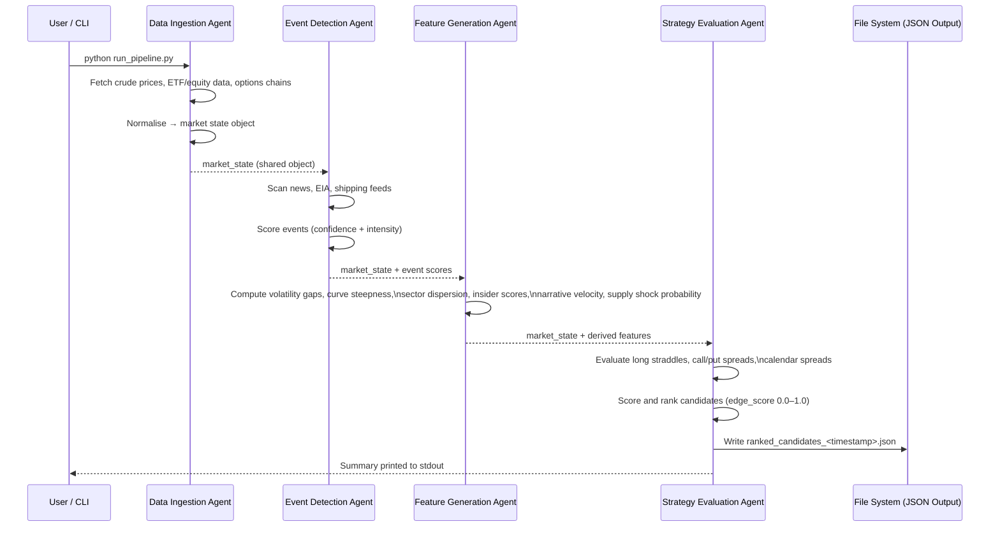

# Energy Options Opportunity Agent — User Guide

> **Version 1.0 • March 2026**
> This guide covers the full pipeline: setup, configuration, execution, output interpretation, and troubleshooting.

---

## Table of Contents

1. [Overview](#overview)
2. [Prerequisites](#prerequisites)
3. [Setup & Configuration](#setup--configuration)
4. [Running the Pipeline](#running-the-pipeline)
5. [Interpreting the Output](#interpreting-the-output)
6. [Troubleshooting](#troubleshooting)

---

## Overview

The **Energy Options Opportunity Agent** is an autonomous, modular Python pipeline that identifies options trading opportunities driven by oil market instability. It ingests market data, supply signals, news events, and alternative datasets, then produces structured, ranked candidate options strategies with full signal explainability.

### Pipeline Architecture

The system is composed of four loosely coupled agents that communicate through a shared **market state object** and a **derived features store**. Data flows strictly left-to-right — each agent consumes the output of the previous stage and passes enriched state downstream.

```mermaid
flowchart LR
    subgraph Ingestion["① Data Ingestion Agent"]
        A1[Crude Prices\nAlpha Vantage / MetalpriceAPI]
        A2[ETF & Equity Prices\nyfinance / Yahoo Finance]
        A3[Options Chains\nYahoo Finance / Polygon.io]
    end

    subgraph Event["② Event Detection Agent"]
        B1[News & Geo Events\nGDELT / NewsAPI]
        B2[Supply & Inventory\nEIA API]
        B3[Shipping & Logistics\nMarineTraffic / VesselFinder]
    end

    subgraph Features["③ Feature Generation Agent"]
        C1[Volatility Gap\nRealized vs Implied]
        C2[Futures Curve Steepness]
        C3[Supply Shock Probability]
        C4[Narrative Velocity]
        C5[Insider Conviction Score]
        C6[Sector Dispersion]
    end

    subgraph Strategy["④ Strategy Evaluation Agent"]
        D1[Long Straddle]
        D2[Call / Put Spread]
        D3[Calendar Spread]
    end

    RAW[(Market State\nObject)]
    OUT[(Ranked Candidates\nJSON Output)]

    Ingestion --> RAW
    RAW --> Event
    Event --> Features
    Features --> Strategy
    Strategy --> OUT
```



### In-Scope Instruments & Structures

| Category | Items |
|---|---|
| **Crude Futures** | Brent Crude, WTI (`CL=F`) |
| **ETFs** | USO, XLE |
| **Energy Equities** | Exxon Mobil (XOM), Chevron (CVX) |
| **Option Structures (MVP)** | Long straddles, call/put spreads, calendar spreads |

> **Advisory only.** The MVP does not include automated trade execution. All output is for informational and analytical purposes.

---

## Prerequisites

### System Requirements

| Requirement | Minimum |
|---|---|
| Python | 3.10 or later |
| Operating System | Linux, macOS, or Windows (WSL2 recommended) |
| RAM | 2 GB |
| Disk | 5 GB free (for 6–12 months of historical data) |
| Network | Outbound HTTPS access to all data source APIs |

### Python Dependencies

The pipeline uses the following key packages. Install all dependencies via `requirements.txt` (see [Setup & Configuration](#setup--configuration)).

| Package | Purpose |
|---|---|
| `yfinance` | Yahoo Finance ETF, equity, and options data |
| `requests` | HTTP calls to EIA, GDELT, NewsAPI, EDGAR |
| `pandas` / `numpy` | Data normalisation and feature computation |
| `schedule` | Cadence-based refresh scheduling |
| `python-dotenv` | Loading environment variables from `.env` |

### API Accounts

All required data sources are free or low-cost. Obtain credentials before proceeding.

| Source | Registration URL | Notes |
|---|---|---|
| Alpha Vantage | https://www.alphavantage.co/support/#api-key | Free tier; WTI/Brent prices |
| EIA API | https://www.eia.gov/opendata/ | Free; inventory & refinery utilisation |
| NewsAPI | https://newsapi.org/register | Free tier; energy headline feeds |
| GDELT | No key required | Public dataset; geo/event signals |
| Polygon.io | https://polygon.io/ | Free tier; options chains supplement |
| SEC EDGAR | No key required | Insider activity filings |
| Quiver Quant | https://www.quiverquant.com/ | Free/limited; insider conviction layer |
| MarineTraffic | https://www.marinetraffic.com/en/p/api-services | Free tier; tanker flow data |

---

## Setup & Configuration

### 1. Clone the Repository

```bash
git clone https://github.com/your-org/energy-options-agent.git
cd energy-options-agent
```

### 2. Create and Activate a Virtual Environment

```bash
python3 -m venv .venv
source .venv/bin/activate        # Linux / macOS
# .venv\Scripts\activate         # Windows PowerShell
```

### 3. Install Dependencies

```bash
pip install --upgrade pip
pip install -r requirements.txt
```

### 4. Configure Environment Variables

Copy the provided template and populate each value.

```bash
cp .env.example .env
```

Open `.env` in your editor and fill in the values described in the table below.

```dotenv
# .env — Energy Options Opportunity Agent

# --- Data Ingestion ---
ALPHA_VANTAGE_API_KEY=your_key_here
POLYGON_API_KEY=your_key_here

# --- Event Detection ---
EIA_API_KEY=your_key_here
NEWS_API_KEY=your_key_here
MARINE_TRAFFIC_API_KEY=your_key_here

# --- Alternative / Contextual Signals ---
QUIVER_QUANT_API_KEY=your_key_here

# --- Pipeline Behaviour ---
DATA_REFRESH_INTERVAL_MINUTES=5
HISTORICAL_RETENTION_DAYS=365
OUTPUT_DIR=./output
LOG_LEVEL=INFO
```

#### Environment Variable Reference

| Variable | Required | Default | Description |
|---|---|---|---|
| `ALPHA_VANTAGE_API_KEY` | Yes | — | API key for WTI/Brent spot and futures prices |
| `POLYGON_API_KEY` | Phase 1+ | — | Supplemental options chain data from Polygon.io |
| `EIA_API_KEY` | Phase 2+ | — | Weekly inventory and refinery utilisation data |
| `NEWS_API_KEY` | Phase 2+ | — | Headline news feed for geopolitical event detection |
| `MARINE_TRAFFIC_API_KEY` | Phase 3+ | — | Tanker flow and chokepoint monitoring |
| `QUIVER_QUANT_API_KEY` | Phase 3+ | — | Insider trade conviction scoring |
| `DATA_REFRESH_INTERVAL_MINUTES` | No | `5` | Cadence for market data refresh (minutes-level) |
| `HISTORICAL_RETENTION_DAYS` | No | `365` | Days of raw and derived data to retain on disk |
| `OUTPUT_DIR` | No | `./output` | Directory where JSON candidate files are written |
| `LOG_LEVEL` | No | `INFO` | Logging verbosity: `DEBUG`, `INFO`, `WARNING`, `ERROR` |

> **Note on phased keys.** Keys marked *Phase 2+* or *Phase 3+* are not required for an MVP Phase 1 run. The pipeline will emit a warning and skip the corresponding agent module if a key is absent, rather than failing.

### 5. Initialise the Data Store

Run the initialisation script once to create the local SQLite database and directory structure used for historical data retention.

```bash
python scripts/init_db.py
```

Expected output:

```
[INFO] Creating database at ./data/market_state.db
[INFO] Schema applied — tables: raw_prices, options_chains, events, features, candidates
[INFO] Output directory confirmed: ./output
[INFO] Initialisation complete.
```

---

## Running the Pipeline

### Pipeline Execution Flow



### Running a Single Pipeline Pass

Execute one complete cycle of all four agents:

```bash
python run_pipeline.py
```

This will:
1. Refresh market data for all in-scope instruments.
2. Detect and score any new supply disruption or geopolitical events.
3. Compute all derived signals.
4. Evaluate and rank candidate options strategies.
5. Write output to `$OUTPUT_DIR/ranked_candidates_<ISO8601_timestamp>.json`.

### Running the Pipeline on a Schedule

To keep the pipeline running continuously with automatic refresh:

```bash
python run_pipeline.py --schedule
```

The scheduler uses `DATA_REFRESH_INTERVAL_MINUTES` from `.env`. Market-price agents run at that cadence; slower feeds (EIA, EDGAR) update on their native daily/weekly schedules and are not re-fetched on every cycle.

| Feed type | Effective refresh cadence |
|---|---|
| Crude prices (Alpha Vantage) | Every `DATA_REFRESH_INTERVAL_MINUTES` minutes |
| ETF / equity prices (yfinance) | Every `DATA_REFRESH_INTERVAL_MINUTES` minutes |
| Options chains (Yahoo / Polygon) | Daily |
| EIA inventory & refinery data | Weekly |
| News / GDELT events | Continuous / daily |
| Insider activity (EDGAR / Quiver) | Daily |
| Shipping / tanker data | Continuous (free-tier polling) |
| Narrative / sentiment (Reddit, Stocktwits) | Continuous |

### Running a Specific Agent in Isolation

Each agent can be run independently for debugging or incremental development:

```bash
# Run only the Data Ingestion Agent
python -m agents.data_ingestion

# Run only the Event Detection Agent
python -m agents.event_detection

# Run only the Feature Generation Agent
python -m agents.feature_generation

# Run only the Strategy Evaluation Agent
python -m agents.strategy_evaluation
```

> When running an agent in isolation, ensure the market state database (`./data/market_state.db`) is populated with sufficiently recent data from upstream agents. Each agent reads from and writes back to this shared store.

### Restricting Instruments or Phase

```bash
# Run the pipeline for a single instrument only
python run_pipeline.py --instruments USO XLE

# Run Phase 1 signals only (no EIA, events, or alternative data)
python run_pipeline.py --phase 1
```

---

## Interpreting the Output

### Output File Location

Each pipeline run writes a time-stamped JSON file:

```
./output/ranked_candidates_2026-03-15T14:32:00Z.json
```

The file contains an array of candidate objects sorted by `edge_score` in descending order (strongest opportunity first).

### Output Schema

| Field | Type | Description |
|---|---|---|
| `instrument` | `string` | Target instrument, e.g. `"USO"`, `"XLE"`, `"CL=F"` |
| `structure` | `enum` | `long_straddle` \| `call_spread` \| `put_spread` \| `calendar_spread` |
| `expiration` | `integer` (days) | Target expiration in calendar days from evaluation date |
| `edge_score` | `float` [0.0–1.0] | Composite opportunity score; higher = stronger signal confluence |
| `signals` | `object` | Map of contributing signals and their states |
| `generated_at` | ISO 8601 datetime | UTC timestamp of candidate generation |

### Example Output

```json
[
  {
    "instrument": "USO",
    "structure": "long_straddle",
    "expiration": 30,
    "edge_score": 0.47,
    "signals": {
      "tanker_disruption_index": "high",
      "volatility_gap": "positive",
      "narrative_velocity": "rising"
    },
    "generated_at": "2026-03-15T14:32:00Z"
  },
  {
    "instrument": "XOM",
    "structure": "call_spread",
    "expiration": 21,
    "edge_score": 0.31,
    "signals": {
      "volatility_gap": "positive",
      "supply_shock_probability": "elevated",
      "insider_conviction_score": "moderate"
    },
    "generated_at": "2026-03-15T14:32:00Z"
  }
]
```

### Understanding the Edge Score

The `edge_score` is a composite value in the range `[0.0, 1.0]` that reflects the confluence of active signals for a given candidate. It is not a probability of profit.

| Edge Score Range | Interpretation |
|---|---|
| `0.70 – 1.00` | Strong signal confluence — multiple independent signals aligned |
| `0.40 – 0.69` | Moderate confluence — worth monitoring; consider position sizing carefully |
| `0.20 – 0.39` | Weak confluence — few signals active; low conviction |
| `0.00 – 0.19` | Minimal signal — candidate included for completeness only |

### Understanding the Signals Map

The `signals` object keys map directly to the derived features computed by the **Feature Generation Agent**. Use this map to understand *why* a candidate was ranked.

| Signal Key | Source | Meaning |
|---|---|---|
| `volatility_gap` | Realized vs. implied IV comparison | `"positive"` = implied IV is lower than realized; potential underpricing |
| `futures_curve_steepness` | WTI/Brent futures term structure | `"steep"` = contango or backwardation inflection detected |
| `supply_shock_probability` | EIA data + event scores | `"elevated"` = inventory drawdown + geopolitical event active |
| `tanker_disruption_index` | MarineTraffic / VesselFinder | `"high"` = significant chokepoint congestion or rerouting detected |
| `narrative_velocity` | Reddit / Stocktwits sentiment | `"rising"` = headline acceleration above rolling baseline |
| `insider_conviction_score` | SEC EDGAR / Quiver Quant | `"high"` = cluster of executive buys in the instrument's sector |
| `sector_dispersion` | Cross-equity correlation | `"wide"` = energy equities diverging from crude benchmark |

### Using Output with thinkorswim

The JSON output is designed to be compatible with thinkorswim's watchlist and study import tools. You can also pipe the output to any JSON-capable dashboard. The `instrument` field uses ticker symbols recognised by thinkorswim (e.g., `CL=F` for WTI futures).

---

## Troubleshooting

### Common Errors and Fixes

| Symptom | Likely Cause | Resolution |
|---|---|---|
| `KeyError: 'ALPHA_VANTAGE_API_KEY'` | `.env`