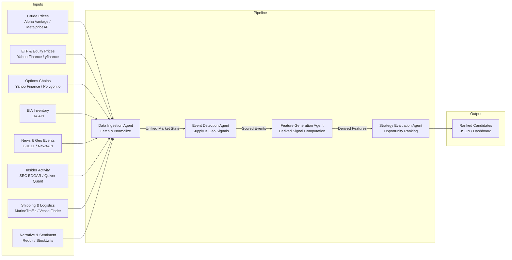

# Energy Options Opportunity Agent — User Guide

> **Version 1.0 · March 2026**
> This guide walks a developer through setting up, configuring, and running the full four-agent pipeline end-to-end.

---

## Table of Contents

1. [Overview](#overview)
2. [Prerequisites](#prerequisites)
3. [Setup & Configuration](#setup--configuration)
4. [Running the Pipeline](#running-the-pipeline)
5. [Interpreting the Output](#interpreting-the-output)
6. [Troubleshooting](#troubleshooting)

---

## Overview

The **Energy Options Opportunity Agent** is an autonomous, modular Python pipeline that identifies options trading opportunities driven by oil market instability. It ingests market data, supply signals, news events, and alternative datasets, then produces structured, ranked candidate options strategies with full signal explainability.

### Pipeline Architecture

Data flows unidirectionally through four loosely coupled agents that share a common market state object and a derived features store.



### Agent Responsibilities

| Agent | Role | Key Outputs |
|---|---|---|
| **Data Ingestion Agent** | Fetch & Normalize | Unified market state object; historical data store |
| **Event Detection Agent** | Supply & Geo Signals | Detected events with confidence and intensity scores |
| **Feature Generation Agent** | Derived Signal Computation | Volatility gaps, curve steepness, narrative velocity, supply shock probability, etc. |
| **Strategy Evaluation Agent** | Opportunity Ranking | Ranked candidate list with edge scores and signal references |

### In-Scope Instruments (MVP)

| Category | Instruments |
|---|---|
| Crude Futures | Brent Crude, WTI (`CL=F`) |
| ETFs | USO, XLE |
| Energy Equities | Exxon Mobil (XOM), Chevron (CVX) |

### In-Scope Option Structures (MVP)

| Structure | Enum Value |
|---|---|
| Long Straddle | `long_straddle` |
| Call Spread | `call_spread` |
| Put Spread | `put_spread` |
| Calendar Spread | `calendar_spread` |

> **Advisory only.** The system produces recommendations; it does **not** execute trades automatically.

---

## Prerequisites

### System Requirements

| Requirement | Minimum |
|---|---|
| Python | 3.10 or later |
| Operating System | Linux, macOS, or Windows (WSL2 recommended) |
| RAM | 2 GB |
| Disk | 10 GB free (for 6–12 months of historical data) |
| Network | Outbound HTTPS to all data source APIs |

### Required Tools

```bash
# Verify Python version
python --version   # must be 3.10+

# Verify pip
pip --version

# Recommended: create an isolated virtual environment
python -m venv .venv
source .venv/bin/activate   # Windows: .venv\Scripts\activate
```

### API Accounts

You need free (or free-tier) accounts for the following services before configuring the pipeline. All sources are free or low-cost.

| Service | Used By | Registration URL |
|---|---|---|
| Alpha Vantage | Crude prices (WTI, Brent) | <https://www.alphavantage.co/support/#api-key> |
| MetalpriceAPI | Crude prices (fallback) | <https://metalpriceapi.com> |
| Polygon.io | Options chains | <https://polygon.io> |
| EIA Open Data | Supply & inventory | <https://www.eia.gov/opendata/> |
| NewsAPI | News & geopolitical events | <https://newsapi.org> |
| Quiver Quant | Insider activity | <https://www.quiverquant.com> |
| MarineTraffic | Tanker / shipping data | <https://www.marinetraffic.com/en/online-services/plans> |

> **Note:** Yahoo Finance (via `yfinance`), GDELT, SEC EDGAR, Stocktwits, and Reddit require no API key for free-tier access.

---

## Setup & Configuration

### 1. Clone the Repository

```bash
git clone https://github.com/your-org/energy-options-agent.git
cd energy-options-agent
```

### 2. Install Dependencies

```bash
pip install -r requirements.txt
```

### 3. Create the Environment File

Copy the provided template and populate it with your credentials:

```bash
cp .env.example .env
```

Then open `.env` in your editor and fill in each value (see the full reference table below).

### Environment Variable Reference

All configuration is supplied via environment variables. The pipeline reads these at startup; no value is hard-coded in source.

| Variable | Required | Default | Description |
|---|---|---|---|
| `ALPHA_VANTAGE_API_KEY` | ✅ | — | API key for Alpha Vantage crude price feed |
| `METALPRICE_API_KEY` | ⬜ | — | API key for MetalpriceAPI (fallback crude feed) |
| `POLYGON_API_KEY` | ✅ | — | API key for Polygon.io options chain data |
| `EIA_API_KEY` | ✅ | — | API key for EIA Open Data (inventory, refinery utilization) |
| `NEWS_API_KEY` | ✅ | — | API key for NewsAPI geopolitical/energy news |
| `QUIVER_QUANT_API_KEY` | ⬜ | — | API key for Quiver Quant insider activity |
| `MARINE_TRAFFIC_API_KEY` | ⬜ | — | API key for MarineTraffic tanker flow data |
| `DATA_REFRESH_INTERVAL_MINUTES` | ⬜ | `5` | Cadence for market data refresh (minutes-level feeds) |
| `EIA_REFRESH_INTERVAL_HOURS` | ⬜ | `24` | Cadence for EIA inventory refresh |
| `EDGAR_REFRESH_INTERVAL_HOURS` | ⬜ | `24` | Cadence for SEC EDGAR insider data refresh |
| `HISTORY_RETENTION_DAYS` | ⬜ | `180` | Days of historical data to retain (180–365 recommended) |
| `OUTPUT_DIR` | ⬜ | `./output` | Directory where JSON candidate files are written |
| `LOG_LEVEL` | ⬜ | `INFO` | Logging verbosity: `DEBUG`, `INFO`, `WARNING`, `ERROR` |
| `EDGE_SCORE_THRESHOLD` | ⬜ | `0.30` | Minimum edge score for a candidate to appear in output |
| `MAX_CANDIDATES` | ⬜ | `20` | Maximum number of ranked candidates returned per run |
| `PIPELINE_PHASE` | ⬜ | `1` | Active MVP phase: `1`, `2`, or `3` (controls which agents and signals are enabled) |

> **Security:** Never commit `.env` to source control. It is listed in `.gitignore` by default.

#### Example `.env`

```dotenv
# --- Required ---
ALPHA_VANTAGE_API_KEY=your_alpha_vantage_key
POLYGON_API_KEY=your_polygon_key
EIA_API_KEY=your_eia_key
NEWS_API_KEY=your_newsapi_key

# --- Optional fallback / alternative signals ---
METALPRICE_API_KEY=your_metalprice_key
QUIVER_QUANT_API_KEY=your_quiverquant_key
MARINE_TRAFFIC_API_KEY=your_marinetraffic_key

# --- Pipeline behaviour ---
DATA_REFRESH_INTERVAL_MINUTES=5
EIA_REFRESH_INTERVAL_HOURS=24
EDGAR_REFRESH_INTERVAL_HOURS=24
HISTORY_RETENTION_DAYS=180
OUTPUT_DIR=./output
LOG_LEVEL=INFO
EDGE_SCORE_THRESHOLD=0.30
MAX_CANDIDATES=20
PIPELINE_PHASE=1
```

### 4. Initialise the Data Store

Run the one-time initialisation script to create the local database schema and seed historical data:

```bash
python scripts/init_db.py
```

Expected output:

```
[INFO] Creating schema ... done
[INFO] Seeding 180 days of historical close prices ... done
[INFO] Data store ready at ./data/market_state.db
```

---

## Running the Pipeline

### Pipeline Phase Overview

The pipeline supports incremental activation of agents and signals via the `PIPELINE_PHASE` environment variable.

| Phase | Name | Agents Active | Key Signals |
|---|---|---|---|
| `1` | Core Market Signals & Options | Ingestion, Strategy Evaluation | IV surface, strike distribution; long straddles, call/put spreads |
| `2` | Supply & Event Augmentation | + Event Detection | EIA inventory, refinery utilization, GDELT/NewsAPI event scoring |
| `3` | Alternative / Contextual Signals | + Full Feature Generation | Insider trades, narrative velocity, shipping data, cross-sector correlation |

Set `PIPELINE_PHASE=1` (or `2`, `3`) in your `.env` before running.

---

### Single Run (One-Shot)

Execute the full pipeline once and write results to `OUTPUT_DIR`:

```bash
python -m agent.pipeline --run-once
```

The pipeline executes each agent in sequence, then exits.

```
[INFO] [DataIngestionAgent]    Fetching crude prices (WTI, Brent) ... ok
[INFO] [DataIngestionAgent]    Fetching ETF/equity prices (USO, XLE, XOM, CVX) ... ok
[INFO] [DataIngestionAgent]    Fetching options chains ... ok
[INFO] [EventDetectionAgent]   Scanning news feeds ... 3 events detected
[INFO] [FeatureGenerationAgent] Computing volatility gap, curve steepness, narrative velocity ... ok
[INFO] [StrategyEvaluationAgent] Evaluating structures ... 7 candidates generated
[INFO] Output written to ./output/candidates_20260315T143022Z.json
```

---

### Continuous Mode (Scheduled)

Run the pipeline on a recurring cadence defined by `DATA_REFRESH_INTERVAL_MINUTES`:

```bash
python -m agent.pipeline --continuous
```

The scheduler wakes the pipeline at the configured interval, refreshes market feeds, recomputes features, and appends new candidate files to `OUTPUT_DIR`. Press `Ctrl+C` to stop.

---

### Running Individual Agents

Each agent can be invoked independently for testing or debugging:

```bash
# Data Ingestion only
python -m agent.ingestion

# Event Detection only (reads existing market state)
python -m agent.event_detection

# Feature Generation only (reads existing market state + events)
python -m agent.feature_generation

# Strategy Evaluation only (reads existing features)
python -m agent.strategy_evaluation
```

---

### Command-Line Options

```bash
python -m agent.pipeline --help
```

```
Usage: pipeline [OPTIONS]

Options:
  --run-once          Execute the pipeline once and exit.
  --continuous        Run on a recurring schedule (see DATA_REFRESH_INTERVAL_MINUTES).
  --phase INTEGER     Override PIPELINE_PHASE for this run only (1, 2, or 3).
  --output-dir PATH   Override OUTPUT_DIR for this run only.
  --log-level TEXT    Override LOG_LEVEL for this run only.
  --help              Show this message and exit.
```

---

### Docker (Optional)

A `Dockerfile` is provided for single-container deployment on a local machine or low-cost VM:

```bash
# Build
docker build -t energy-options-agent:latest .

# Run (mount .env and output directory)
docker run --rm \
  --env-file .env \
  -v "$(pwd)/output:/app/output" \
  -v "$(pwd)/data:/app/data" \
  energy-options-agent:latest \
  python -m agent.pipeline --continuous
```

---

## Interpreting the Output

### Output File Location

Each pipeline run writes a timestamped JSON file to `OUTPUT_DIR` (default `./output`):

```
output/
└── candidates_20260315T143022Z.json
```

### Output Schema

Each file contains a JSON array of candidate objects. Every candidate includes the following fields:

| Field | Type | Description |
|---|---|---|
| `instrument` | `string` | Target instrument, e.g. `"USO"`, `"XLE"`, `"CL=F"` |
| `structure` | `enum` | Options structure: `long_straddle`, `call_spread`, `put_spread`, `calendar_spread` |
| `expiration` | `integer` | Target expiration in calendar days from the evaluation date |
| `edge_score` | `float [0.0–1.0]` | Composite opportunity score; higher = stronger signal confluence |
| `signals` | `object` | Map of contributing signals and their qualitative values |
| `generated_at` | `ISO 8601 datetime` | UTC timestamp of candidate generation |

### Example Output File

```json
[
  {
    "instrument": "USO",
    "structure": "long_straddle",
    "expiration": 30,
    "edge_score": 0.47,
    "signals": {
      "tanker_disruption_index": "high",
      "volatility_gap": "positive",
      "narrative_velocity": "rising"
    },
    "generated_at": "2026-03-15T14:30:22Z"
  },
  {
    "instrument": "XLE",
    "structure": "call_spread",
    "expiration": 45,
    "edge_score": 0.38,
    "signals": {
      "volatility_gap": "positive",
      "supply_shock_probability": "elevated",
      "sector_dispersion": "widening"
    },
    "generated_at": "2026-03-15T14:30:22Z"
  }
]
```

### Reading the Edge Score

The `edge_score` is a composite float in `[0.0, 1.0]` representing signal confluence. Use it to prioritise which candidates to investigate further.

| Edge Score Range | Interpretation |
|---|---|
| `0.70 – 1.00` | Strong confluence — multiple high-conviction signals aligned |
| `0.50 – 0.69` | Moderate confluence — worth detailed review |
| `0.30 – 0.49` | Weak confluence — marginal opportunity; apply additional judgement |
| `< 0.30` | Below threshold — filtered out by default (`EDGE_SCORE_THRESHOLD`) |

> **Adjusting the threshold:** Lower `EDGE_SCORE_THRESHOLD` to surface more candidates; raise it to reduce noise.

### Reading the Signals Map

Each key in `signals` corresponds to a derived feature computed by the Feature Generation Agent. Common values:

| Signal Key | Possible Values | Meaning |
|---|---|---|
| `volatility_gap` | `positive`, `negative`, `neutral