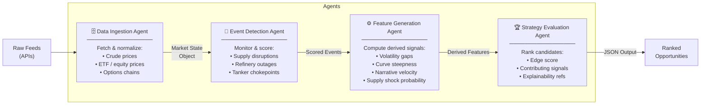
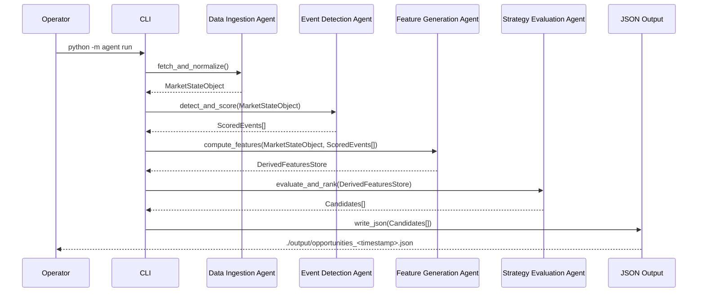

# Energy Options Opportunity Agent — User Guide

> **Version 1.0 • March 2026**
> This guide walks you through installing, configuring, and running the full pipeline end-to-end, then interpreting the ranked output it produces.

---

## Table of Contents

1. [Overview](#overview)
2. [Prerequisites](#prerequisites)
3. [Setup & Configuration](#setup--configuration)
4. [Running the Pipeline](#running-the-pipeline)
5. [Interpreting the Output](#interpreting-the-output)
6. [Troubleshooting](#troubleshooting)

---

## Overview

The **Energy Options Opportunity Agent** is a four-agent Python pipeline that identifies options trading opportunities driven by oil market instability. It ingests market data, supply signals, news events, and alternative datasets, then produces a ranked list of candidate options strategies with full explainability.

### Pipeline architecture



Data flows **unidirectionally**: raw feeds → normalized market state → scored events → derived features → ranked strategies. No agent writes back upstream. Output is a JSON-compatible structure suitable for thinkorswim or any JSON-capable dashboard.

### In-scope instruments (MVP)

| Category | Instruments |
|---|---|
| Crude futures | WTI (`CL=F`), Brent Crude |
| ETFs | USO, XLE |
| Energy equities | Exxon Mobil (XOM), Chevron (CVX) |

### In-scope option structures (MVP)

| Structure | Enum value |
|---|---|
| Long straddle | `long_straddle` |
| Call spread | `call_spread` |
| Put spread | `put_spread` |
| Calendar spread | `calendar_spread` |

> **Advisory only.** Automated trade execution is out of scope. The system surfaces opportunities; all trading decisions remain with the operator.

---

## Prerequisites

### System requirements

| Requirement | Minimum |
|---|---|
| Python | 3.10+ |
| RAM | 2 GB |
| Disk | 10 GB (for 6–12 months of historical data) |
| OS | Linux, macOS, or Windows (WSL2 recommended) |
| Deployment target | Local machine, single VM, or container |

### Required Python packages

The pipeline depends on the following libraries (install via `requirements.txt` — see [Setup](#setup--configuration)):

| Package | Purpose |
|---|---|
| `yfinance` | ETF/equity prices and options chains (Yahoo Finance) |
| `requests` | HTTP calls to Alpha Vantage, EIA, GDELT, EDGAR APIs |
| `pandas` | Data normalization and historical storage |
| `numpy` | Volatility and feature calculations |
| `pydantic` | Market state object schema validation |
| `python-dotenv` | Loading environment variables from `.env` |
| `schedule` | Cadence-based pipeline scheduling |

### API keys required

The following external services are used. All have free tiers sufficient for MVP operation.

| Service | Used by | Registration URL |
|---|---|---|
| Alpha Vantage | Crude spot/futures prices | https://www.alphavantage.co/support/#api-key |
| EIA Open Data | Supply/inventory data | https://www.eia.gov/opendata/ |
| NewsAPI | News & geopolitical events | https://newsapi.org/register |
| GDELT | Geopolitical event stream | No key required (public) |
| Polygon.io *(optional)* | Higher-quality options chains | https://polygon.io/ |
| SEC EDGAR | Insider activity | No key required (public) |
| Quiver Quant *(optional)* | Enriched insider data | https://www.quiverquant.com/ |

> **Note:** Yahoo Finance (via `yfinance`) and SEC EDGAR require no API key. GDELT is publicly accessible without authentication. For MVP, Polygon.io and Quiver Quant are optional enhancements.

---

## Setup & Configuration

### 1 — Clone the repository

```bash
git clone https://github.com/your-org/energy-options-agent.git
cd energy-options-agent
```

### 2 — Create and activate a virtual environment

```bash
python -m venv .venv

# Linux / macOS
source .venv/bin/activate

# Windows (PowerShell)
.venv\Scripts\Activate.ps1
```

### 3 — Install dependencies

```bash
pip install --upgrade pip
pip install -r requirements.txt
```

### 4 — Create the `.env` file

Copy the provided template and populate your API keys:

```bash
cp .env.example .env
```

Then open `.env` and fill in your values:

```dotenv
# ── Data Ingestion ────────────────────────────────────────────────────────────
ALPHA_VANTAGE_API_KEY=your_alpha_vantage_key_here
POLYGON_API_KEY=your_polygon_key_here          # optional; leave blank to use yfinance
YAHOO_FINANCE_ENABLED=true                     # true | false

# ── Supply & Inventory ────────────────────────────────────────────────────────
EIA_API_KEY=your_eia_key_here

# ── News & Geopolitical Events ────────────────────────────────────────────────
NEWSAPI_KEY=your_newsapi_key_here
GDELT_ENABLED=true                             # true | false (no key required)

# ── Insider Activity ──────────────────────────────────────────────────────────
EDGAR_ENABLED=true                             # true | false (no key required)
QUIVER_QUANT_API_KEY=your_quiver_key_here      # optional

# ── Narrative / Sentiment ─────────────────────────────────────────────────────
REDDIT_CLIENT_ID=your_reddit_client_id
REDDIT_CLIENT_SECRET=your_reddit_client_secret
STOCKTWITS_ENABLED=true                        # true | false (no key required)

# ── Pipeline Behaviour ────────────────────────────────────────────────────────
MARKET_DATA_REFRESH_MINUTES=5                  # cadence for price feeds
EIA_REFRESH_HOURS=24                           # cadence for EIA inventory data
HISTORY_RETENTION_DAYS=365                     # 180–365 recommended
OUTPUT_DIR=./output                            # directory for JSON output files

# ── Logging ───────────────────────────────────────────────────────────────────
LOG_LEVEL=INFO                                 # DEBUG | INFO | WARNING | ERROR
```

### Environment variable reference

| Variable | Required | Default | Description |
|---|---|---|---|
| `ALPHA_VANTAGE_API_KEY` | Yes | — | API key for WTI/Brent spot and futures prices |
| `POLYGON_API_KEY` | No | — | Optional higher-quality options chain data |
| `YAHOO_FINANCE_ENABLED` | No | `true` | Enable yfinance as fallback/primary for ETF and equity prices |
| `EIA_API_KEY` | Yes (Phase 2+) | — | Free EIA Open Data key for inventory and refinery utilization |
| `NEWSAPI_KEY` | Yes (Phase 2+) | — | NewsAPI key for energy disruption headlines |
| `GDELT_ENABLED` | No | `true` | Enable GDELT geopolitical event stream (no key required) |
| `EDGAR_ENABLED` | No | `true` | Enable SEC EDGAR insider trade polling (no key required) |
| `QUIVER_QUANT_API_KEY` | No | — | Optional enriched insider conviction data |
| `REDDIT_CLIENT_ID` | No | — | Reddit API client ID for narrative velocity signals |
| `REDDIT_CLIENT_SECRET` | No | — | Reddit API client secret |
| `STOCKTWITS_ENABLED` | No | `true` | Enable Stocktwits sentiment feed |
| `MARKET_DATA_REFRESH_MINUTES` | No | `5` | Polling interval for price and options data |
| `EIA_REFRESH_HOURS` | No | `24` | Polling interval for EIA inventory data |
| `HISTORY_RETENTION_DAYS` | No | `365` | Days of historical data to retain for backtesting |
| `OUTPUT_DIR` | No | `./output` | Directory where JSON opportunity files are written |
| `LOG_LEVEL` | No | `INFO` | Python logging verbosity |

### 5 — Initialise the data store

Run the one-time initialisation command to create the local SQLite database and directory structure:

```bash
python -m agent init
```

Expected output:

```
[INFO] Initialising data store at ./data/market_state.db ...
[INFO] Creating output directory ./output ...
[INFO] Schema applied. Ready to run.
```

---

## Running the Pipeline

### Pipeline execution sequence



### Single run (one-shot)

Execute the full pipeline once and write results to `OUTPUT_DIR`:

```bash
python -m agent run
```

### Continuous scheduled mode

Run the pipeline on the cadence defined by `MARKET_DATA_REFRESH_MINUTES`:

```bash
python -m agent run --schedule
```

> Press `Ctrl+C` to stop the scheduler gracefully. Slower feeds (EIA, EDGAR) respect their own longer cadences regardless of the main refresh interval.

### Running individual agents

Each agent can be invoked independently for debugging or incremental development:

```bash
# Data Ingestion Agent only
python -m agent run --agent ingestion

# Event Detection Agent only
python -m agent run --agent events

# Feature Generation Agent only
python -m agent run --agent features

# Strategy Evaluation Agent only
python -m agent run --agent strategy
```

### Dry run (no output written)

Validate configuration and data connectivity without writing any output files:

```bash
python -m agent run --dry-run
```

### Specifying a custom config path

```bash
python -m agent run --env /path/to/custom.env
```

### Useful flags summary

| Flag | Description |
|---|---|
| `--schedule` | Run continuously on the configured refresh cadence |
| `--agent <name>` | Run a single named agent only |
| `--dry-run` | Execute pipeline without writing output files |
| `--env <path>` | Load environment from a non-default `.env` file |
| `--log-level DEBUG` | Override log verbosity for this run |

---

## Interpreting the Output

### Output location

Each pipeline run writes a timestamped JSON file to `OUTPUT_DIR`:

```
./output/opportunities_2026-03-15T14:32:00Z.json
```

### Output schema

Each file contains an array of candidate objects. One candidate represents one ranked opportunity:

| Field | Type | Description |
|---|---|---|
| `instrument` | string | Target instrument, e.g. `USO`, `XLE`, `CL=F` |
| `structure` | enum | `long_straddle` \| `call_spread` \| `put_spread` \| `calendar_spread` |
| `expiration` | integer (days) | Target expiration in calendar days from evaluation date |
| `edge_score` | float [0.0–1.0] | Composite opportunity score; higher = stronger signal confluence |
| `signals` | object | Map of contributing signals with qualitative values |
| `generated_at` | ISO 8601 datetime | UTC timestamp of candidate generation |

### Example output file

```json
[
  {
    "instrument": "USO",
    "structure": "long_straddle",
    "expiration": 30,
    "edge_score": 0.47,
    "signals": {
      "tanker_disruption_index": "high",
      "volatility_gap": "positive",
      "narrative_velocity": "rising"
    },
    "generated_at": "2026-03-15T14:32:00Z"
  },
  {
    "instrument": "XOM",
    "structure": "call_spread",
    "expiration": 45,
    "edge_score": 0.31,
    "signals": {
      "volatility_gap": "positive",
      "insider_conviction": "elevated",
      "supply_shock_probability": "moderate"
    },
    "generated_at": "2026-03-15T14:32:00Z"
  }
]
```

### Understanding `edge_score`

The `edge_score` is a composite float in the range **0.0–1.0** that reflects the confluence of active signals for a given candidate. It is the primary sort key — the pipeline returns candidates in descending order.

| Score range | Interpretation |
|---|---|
| 0.70 – 1.00 | Strong signal confluence; multiple independent signals aligned |
| 0.40 – 0.69 | Moderate confluence; worth monitoring and further review |
| 0.10 – 0.39 | Weak or single-signal basis; low confidence |
| 0.00 – 0.09 | Noise; typically filtered from default output |

> **Important:** `edge_score` is a heuristic ranking aid, not a probability of profit. It reflects signal alignment as detected by the pipeline, not a back-tested win rate. Always apply independent judgment before trading.

### Understanding the `signals` map

The `signals` field explains *why* a candidate was surfaced. Each key is a named derived signal and each value is a qualitative level:

| Signal key | Produced by | Qualitative values |
|---|---|---|
| `volatility_gap` | Feature Generation Agent | `positive` / `negative` / `neutral` |
| `futures_curve_steepness` | Feature Generation Agent | `steep` / `flat` / `inverted` |
| `sector_dispersion` | Feature Generation Agent | `high` / `moderate` / `low` |
| `insider_conviction` | Feature Generation Agent | `elevated` / `normal` / `low` |
| `narrative_velocity` | Feature Generation Agent | `rising` / `stable` / `falling` |
| `supply_shock_probability` | Feature Generation Agent | `high` / `moderate` / `low` |
| `tanker_disruption_index` | Event Detection Agent | `high` / `moderate` / `low` |
| `refinery_outage_score` | Event Detection Agent | `high` / `moderate` / `low` |
| `geopolitical_event_intensity` | Event Detection Agent | `high` / `moderate` / `low` |

### Consuming output in thinkorswim

The JSON output is compatible with t