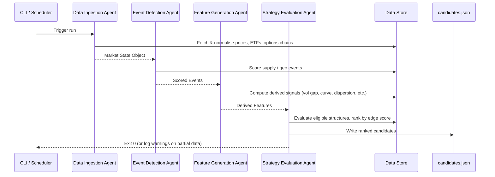

# Energy Options Opportunity Agent — User Guide

> **Version 1.0 · March 2026**
> Advisory only. The system produces ranked option strategy candidates; it does **not** execute trades.

---

## Table of Contents

1. [Overview](#overview)
2. [Prerequisites](#prerequisites)
3. [Setup & Configuration](#setup--configuration)
4. [Running the Pipeline](#running-the-pipeline)
5. [Interpreting the Output](#interpreting-the-output)
6. [Troubleshooting](#troubleshooting)

---

## Overview

The **Energy Options Opportunity Agent** is a modular Python pipeline that detects volatility mispricing in oil-related instruments and surfaces ranked options trading opportunities. It ingests market data, supply signals, news events, and alternative datasets, then scores and ranks candidate strategies using a composite edge score.

### Four-Agent Architecture

Data flows in one direction through four loosely coupled agents, each communicating via a shared market state object and a derived features store.

```mermaid
flowchart LR
    subgraph Ingestion ["① Data Ingestion Agent"]
        A1[Crude Prices\nWTI · Brent]
        A2[ETF / Equity\nUSO · XLE · XOM · CVX]
        A3[Options Chains\nStrike · IV · Volume]
    end

    subgraph Events ["② Event Detection Agent"]
        B1[News & Geo Feeds\nGDELT · NewsAPI]
        B2[Supply Signals\nEIA · MarineTraffic]
        B3[Confidence &\nIntensity Scoring]
    end

    subgraph Features ["③ Feature Generation Agent"]
        C1[Volatility Gap\nRealised vs Implied]
        C2[Futures Curve\nSteepness]
        C3[Sector Dispersion\nInsider Conviction\nNarrative Velocity\nSupply Shock Prob.]
    end

    subgraph Strategy ["④ Strategy Evaluation Agent"]
        D1[Eligible Structures\nStraddles · Spreads\nCalendar Spreads]
        D2[Edge Score\n0.0 – 1.0]
        D3[Ranked JSON\nOutput]
    end

    Ingestion --> |Market State Object| Events
    Events    --> |Scored Events| Features
    Features  --> |Derived Signals| Strategy
    Strategy  --> |candidates.json| Output[(Downstream\nDashboard /\nthinkorswim)]
```



### In-Scope Instruments & Structures

| Category | Items |
|---|---|
| Crude futures | Brent Crude, WTI (`CL=F`) |
| ETFs | USO, XLE |
| Energy equities | Exxon Mobil (`XOM`), Chevron (`CVX`) |
| Option structures (MVP) | Long straddles, call spreads, put spreads, calendar spreads |

### What the System Does Not Do

- Execute trades automatically.
- Price exotic or multi-legged structures (iron condors, butterflies, etc.).
- Ingest regional refined product pricing (OPIS).

---

## Prerequisites

### Runtime Requirements

| Requirement | Minimum version / notes |
|---|---|
| Python | 3.10 or later |
| pip | 23.0 or later |
| Git | Any recent version |
| OS | Linux, macOS, or Windows (WSL2 recommended on Windows) |
| Hardware | Single VM or local machine; no GPU required |

### External API Accounts

Register for the following free-tier accounts before configuring the pipeline. All sources listed here are free or low-cost.

| Data Layer | Source | Registration URL | Cost |
|---|---|---|---|
| Crude prices | Alpha Vantage | `https://www.alphavantage.co/support/#api-key` | Free |
| ETF / equity prices | Yahoo Finance (`yfinance`) | No key required | Free |
| Options chains | Polygon.io | `https://polygon.io` | Free / Limited |
| Supply & inventory | EIA API | `https://www.eia.gov/opendata/` | Free |
| News & geo events | NewsAPI | `https://newsapi.org/register` | Free tier |
| News & geo events | GDELT | No key required | Free |
| Insider activity | SEC EDGAR | No key required | Free |
| Insider activity | Quiver Quant | `https://www.quiverquant.com` | Free / Limited |
| Shipping / logistics | MarineTraffic | `https://www.marinetraffic.com/en/ais-api-services` | Free tier |
| Narrative / sentiment | Reddit API | `https://www.reddit.com/prefs/apps` | Free |
| Narrative / sentiment | Stocktwits | No key required for public feed | Free |

> **Tip:** For the MVP (Phase 1), only **Alpha Vantage**, **yfinance**, and **Polygon.io** are strictly required. You can add the remaining keys incrementally as you progress through phases.

---

## Setup & Configuration

### 1. Clone the Repository

```bash
git clone https://github.com/your-org/energy-options-agent.git
cd energy-options-agent
```

### 2. Create and Activate a Virtual Environment

```bash
python -m venv .venv

# Linux / macOS
source .venv/bin/activate

# Windows (PowerShell)
.venv\Scripts\Activate.ps1
```

### 3. Install Dependencies

```bash
pip install --upgrade pip
pip install -r requirements.txt
```

### 4. Configure Environment Variables

The pipeline reads all secrets and tunable parameters from environment variables. Copy the provided template and fill in your values:

```bash
cp .env.example .env
```

Open `.env` in your editor and populate the following variables:

#### API Keys & Credentials

| Variable | Required | Description |
|---|---|---|
| `ALPHA_VANTAGE_API_KEY` | Yes | Alpha Vantage key for WTI / Brent spot and futures prices |
| `POLYGON_API_KEY` | Yes | Polygon.io key for options chain data (strike, expiry, IV, volume) |
| `EIA_API_KEY` | Phase 2+ | EIA Open Data key for weekly inventory and refinery utilization |
| `NEWSAPI_KEY` | Phase 2+ | NewsAPI key for energy disruption headlines |
| `QUIVER_API_KEY` | Phase 3+ | Quiver Quant key for insider trade data |
| `MARINETRAFFIC_API_KEY` | Phase 3+ | MarineTraffic key for tanker flow data |
| `REDDIT_CLIENT_ID` | Phase 3+ | Reddit OAuth client ID for sentiment feeds |
| `REDDIT_CLIENT_SECRET` | Phase 3+ | Reddit OAuth client secret |

#### Pipeline Behaviour

| Variable | Default | Description |
|---|---|---|
| `PIPELINE_CADENCE_MINUTES` | `5` | How often the full pipeline runs (market-data refresh cadence) |
| `OUTPUT_PATH` | `./output/candidates.json` | File path for the JSON output written after each run |
| `LOG_LEVEL` | `INFO` | Logging verbosity: `DEBUG`, `INFO`, `WARNING`, `ERROR` |
| `HISTORY_RETENTION_DAYS` | `180` | Days of raw and derived data to retain for backtesting (180–365 recommended) |
| `EDGE_SCORE_THRESHOLD` | `0.25` | Minimum edge score a candidate must exceed to appear in output |
| `MAX_CANDIDATES` | `10` | Maximum number of ranked candidates emitted per run |

#### Target Instruments (comma-separated overrides)

| Variable | Default | Description |
|---|---|---|
| `INSTRUMENTS_FUTURES` | `CL=F,BZ=F` | Crude futures symbols |
| `INSTRUMENTS_ETFS` | `USO,XLE` | ETF symbols |
| `INSTRUMENTS_EQUITIES` | `XOM,CVX` | Energy equity symbols |

#### Example `.env` File

```dotenv
# --- API Keys ---
ALPHA_VANTAGE_API_KEY=YOUR_AV_KEY_HERE
POLYGON_API_KEY=YOUR_POLYGON_KEY_HERE
EIA_API_KEY=
NEWSAPI_KEY=
QUIVER_API_KEY=
MARINETRAFFIC_API_KEY=
REDDIT_CLIENT_ID=
REDDIT_CLIENT_SECRET=

# --- Pipeline Behaviour ---
PIPELINE_CADENCE_MINUTES=5
OUTPUT_PATH=./output/candidates.json
LOG_LEVEL=INFO
HISTORY_RETENTION_DAYS=180
EDGE_SCORE_THRESHOLD=0.25
MAX_CANDIDATES=10

# --- Instruments ---
INSTRUMENTS_FUTURES=CL=F,BZ=F
INSTRUMENTS_ETFS=USO,XLE
INSTRUMENTS_EQUITIES=XOM,CVX
```

### 5. Initialise the Data Store

Run the one-time initialisation command to create the local SQLite database and directory structure used for historical storage:

```bash
python -m agent init
```

Expected output:

```
[INFO] Initialising data store at ./data/market_state.db
[INFO] Creating output directory ./output
[INFO] Schema applied successfully.
[INFO] Ready. Run `python -m agent run` to start the pipeline.
```

---

## Running the Pipeline

### Pipeline Execution Flow



### Single Run

Execute one complete pass of all four agents:

```bash
python -m agent run
```

The command exits when all agents have completed. Output is written to the path configured in `OUTPUT_PATH`.

### Continuous Mode (Scheduled Loop)

Run the pipeline on the cadence defined by `PIPELINE_CADENCE_MINUTES`:

```bash
python -m agent run --loop
```

Press `Ctrl+C` to stop gracefully.

### Run a Single Agent in Isolation

Each agent can be invoked independently for debugging or incremental development:

```bash
# Data Ingestion only
python -m agent run --agent ingestion

# Event Detection only
python -m agent run --agent events

# Feature Generation only
python -m agent run --agent features

# Strategy Evaluation only
python -m agent run --agent strategy
```

> **Note:** Running an agent in isolation reads from whatever state is currently in the data store. Ensure upstream agents have been run first, or the downstream agent will operate on stale data and will log a warning.

### Dry Run (No Output Written)

Validate configuration and data source connectivity without writing any output:

```bash
python -m agent run --dry-run
```

### Verbose Logging

Override `LOG_LEVEL` at runtime:

```bash
LOG_LEVEL=DEBUG python -m agent run
```

---

## Interpreting the Output

### Output File Location

After each run, candidates are written to the file specified by `OUTPUT_PATH` (default: `./output/candidates.json`).

### Output Schema

Each element in the top-level array is a **strategy candidate** with the following fields:

| Field | Type | Description |
|---|---|---|
| `instrument` | `string` | Target instrument symbol, e.g. `USO`, `XLE`, `CL=F` |
| `structure` | `enum` | Options structure: `long_straddle`, `call_spread`, `put_spread`, `calendar_spread` |
| `expiration` | `integer` | Target expiration in calendar days from the evaluation date |
| `edge_score` | `float [0.0–1.0]` | Composite opportunity score; higher = stronger signal confluence |
| `signals` | `object` | Map of contributing signals and their assessed level |
| `generated_at` | `ISO 8601 datetime` | UTC timestamp of candidate generation |

### Example Output

```json
[
  {
    "instrument": "USO",
    "structure": "long_straddle",
    "expiration": 30,
    "edge_score": 0.47,
    "signals": {
      "tanker_disruption_index": "high",
      "volatility_gap": "positive",
      "narrative_velocity": "rising"
    },
    "generated_at": "2026-03-15T14:32:00Z"
  },
  {
    "instrument": "XLE",
    "structure": "call_spread",
    "expiration": 45,
    "edge_score": 0.31,
    "signals": {
      "volatility_gap": "positive",
      "supply_shock_probability": "elevated",
      "sector_dispersion": "widening"
    },
    "generated_at": "2026-03-15T14:32:00Z"
  }
]
```

### Reading the Edge Score

| Edge Score Range | Interpretation |
|---|---|
| `0.70 – 1.00` | Strong signal confluence; multiple independent signals align |
| `0.50 – 0.69` | Moderate confluence; worth monitoring closely |
| `0.25 – 0.49` | Weak-to-moderate signal; use as supplementary context |
| `< 0.25` | Below threshold; filtered from output by default |

> The edge score is a **heuristic composite** of the contributing signals. It is not a probability of profit. Always apply your own risk management before acting on any candidate.

### Signal Reference

| Signal Key | What It Measures |
|---|---|
| `volatility_gap` | Spread between realised volatility and implied volatility |
| `futures_curve_steepness` | Degree of contango or backwardation in the crude curve |
| `sector_dispersion` | Divergence in returns across energy sub-sectors |
| `insider_conviction_score` | Aggregated directional signal from executive insider filings |
| `narrative_velocity` | Acceleration of energy-related headline volume (Reddit, Stocktwits) |
| `supply_shock_probability` | Model-estimated probability of a near-term supply disruption |
| `tanker_disruption_index` | Chokepoint stress derived from shipping and logistics data |

### Loading Output in a Dashboard

The JSON output is compatible with any JSON-capable tool. For **thinkorswim**, import the file via the platform's scripting/thinkScript interface or use the watchlist import feature. For a quick local view:

```bash
# Pretty-print with Python
python -m json.tool ./output/candidates.json

# Or with jq
jq '.' ./output/candidates.json
```

---

## Troubleshooting

### Common Errors

| Symptom | Likely Cause | Resolution |
|---|---|---|
| `KeyError: ALPHA_VANTAGE_API_KEY` | `.env` file not loaded or key missing | Confirm `.env` exists in the project root and the variable is set |
| `[WARNING] Options chain unavailable for XOM` | Polygon.io free-tier rate limit or missing key | Verify `POLYGON_API_KEY`; reduce `PIPELINE_CADENCE_MINUTES` to avoid rate-limit exhaustion |
| `[WARNING] EIA data stale — last update > 7 days` | EIA API key missing or service outage | Set `EIA_API_KEY` in `.env`; check `https://www.eia.gov/opendata/` status |
| `Output file not written` | Output directory does not exist | Run `python -m agent init` or create the directory manually: `mkdir -p ./output` |
| `edge_score` always `0.0` | Upstream agents have no data in the store | Run agents in order: `ingestion` → `events` → `features` → `strategy` |
| Pipeline exits immediately with no output | `EDGE_SCORE_THRESHOLD` set too high | Lower `EDGE_SCORE_THRESHOLD` in `.env` (default is