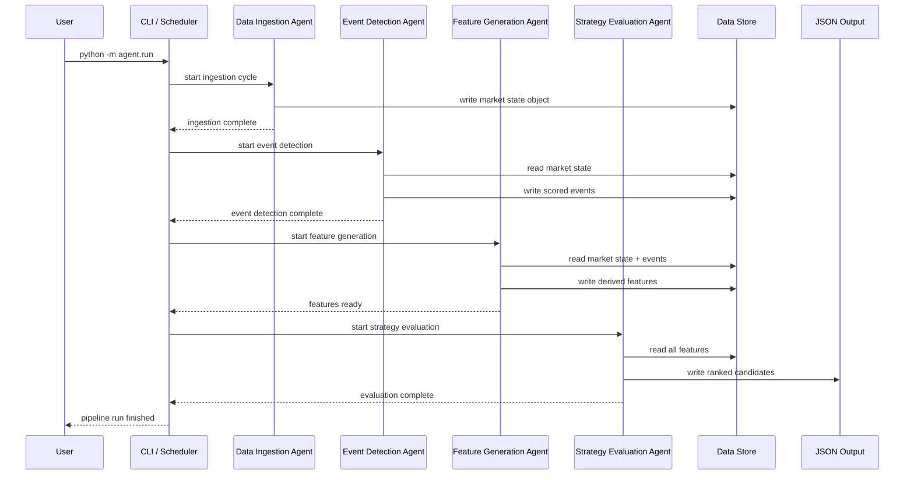

# Energy Options Opportunity Agent — User Guide

> **Version 1.0 · March 2026**
> This guide walks you through installing, configuring, and running the full four-agent pipeline end-to-end, and explains how to interpret the ranked output it produces.

---

## Table of Contents

1. [Overview](#overview)
2. [Prerequisites](#prerequisites)
3. [Setup & Configuration](#setup--configuration)
4. [Running the Pipeline](#running-the-pipeline)
5. [Interpreting the Output](#interpreting-the-output)
6. [Troubleshooting](#troubleshooting)

---

## Overview

The **Energy Options Opportunity Agent** is an autonomous, modular Python pipeline that identifies options trading opportunities driven by oil market instability. It ingests market data, supply signals, news events, and alternative datasets, then surfaces volatility mispricing in oil-related instruments and ranks candidate strategies by a computed **edge score**.

The system is **advisory only** — it does not execute trades.

### Pipeline Architecture

Data flows unidirectionally through four loosely coupled agents that communicate via a shared **market state object** and a **derived features store**.

```mermaid
flowchart LR
    subgraph Sources["External Data Sources"]
        S1["Crude Prices\n(Alpha Vantage / MetalpriceAPI)"]
        S2["ETF / Equity Prices\n(Yahoo Finance / yfinance)"]
        S3["Options Chains\n(Yahoo Finance / Polygon.io)"]
        S4["Supply & Inventory\n(EIA API)"]
        S5["News & Geo Events\n(GDELT / NewsAPI)"]
        S6["Insider Activity\n(SEC EDGAR / Quiver Quant)"]
        S7["Shipping / Logistics\n(MarineTraffic / VesselFinder)"]
        S8["Narrative / Sentiment\n(Reddit / Stocktwits)"]
    end

    subgraph Agent1["① Data Ingestion Agent"]
        A1["Fetch & Normalize\n→ Market State Object"]
    end

    subgraph Agent2["② Event Detection Agent"]
        A2["Supply & Geo Signals\n→ Confidence / Intensity Scores"]
    end

    subgraph Agent3["③ Feature Generation Agent"]
        A3["Derived Signal Computation\n→ Features Store"]
    end

    subgraph Agent4["④ Strategy Evaluation Agent"]
        A4["Opportunity Ranking\n→ Edge-Scored Candidates"]
    end

    OUT["JSON Output\n(ranked candidates)"]

    Sources --> Agent1
    Agent1 --> Agent2
    Agent2 --> Agent3
    Agent3 --> Agent4
    Agent4 --> OUT
```



### In-Scope Instruments

| Category | Instruments |
|---|---|
| Crude Futures | Brent Crude, WTI (`CL=F`) |
| ETFs | USO, XLE |
| Energy Equities | Exxon Mobil (XOM), Chevron (CVX) |

### In-Scope Option Structures (MVP)

| Structure | Enum value |
|---|---|
| Long Straddle | `long_straddle` |
| Call Spread | `call_spread` |
| Put Spread | `put_spread` |
| Calendar Spread | `calendar_spread` |

> **Out of scope for MVP:** exotic / multi-legged structures, regional refined product pricing (OPIS), and automated trade execution.

---

## Prerequisites

### System Requirements

| Requirement | Minimum |
|---|---|
| Python | 3.10 or later |
| OS | Linux, macOS, or Windows (WSL2 recommended) |
| RAM | 2 GB |
| Disk | 5 GB (for 6–12 months of historical data) |
| Network | Outbound HTTPS access to all data source APIs |

### Required Tools

```bash
# Verify Python version
python --version   # must be >= 3.10

# Verify pip
pip --version

# (Optional but recommended) Verify Docker if running containerised
docker --version
```

### API Accounts

You will need free-tier (or limited) accounts for the following services before configuring the pipeline:

| Service | Purpose | Tier needed | Sign-up URL |
|---|---|---|---|
| Alpha Vantage | WTI / Brent spot & futures | Free | https://www.alphavantage.co |
| Polygon.io | Options chains (strike, expiry, IV, volume) | Free / Limited | https://polygon.io |
| EIA API | Inventory & refinery utilization | Free | https://www.eia.gov/opendata |
| NewsAPI | News & geopolitical events | Free | https://newsapi.org |
| GDELT | Geopolitical event stream | Free | https://www.gdeltproject.org |
| SEC EDGAR | Insider activity | Free | https://efts.sec.gov/LATEST/search-index |
| Quiver Quant | Insider activity (supplemental) | Free / Limited | https://www.quiverquant.com |
| MarineTraffic | Tanker / shipping flows | Free tier | https://www.marinetraffic.com |
| Reddit API | Narrative / sentiment | Free | https://www.reddit.com/dev/api |
| Stocktwits | Narrative / sentiment | Free | https://api.stocktwits.com |

> `yfinance` (Yahoo Finance) does not require an API key. GDELT is publicly accessible without registration.

---

## Setup & Configuration

### 1. Clone the Repository

```bash
git clone https://github.com/your-org/energy-options-agent.git
cd energy-options-agent
```

### 2. Create and Activate a Virtual Environment

```bash
python -m venv .venv
source .venv/bin/activate        # Linux / macOS
# .venv\Scripts\activate         # Windows PowerShell
```

### 3. Install Dependencies

```bash
pip install --upgrade pip
pip install -r requirements.txt
```

### 4. Configure Environment Variables

Copy the provided template and populate it with your credentials:

```bash
cp .env.example .env
```

Open `.env` in your editor and fill in every value. The table below documents all recognised environment variables.

#### Environment Variables Reference

| Variable | Required | Default | Description |
|---|---|---|---|
| `ALPHA_VANTAGE_API_KEY` | Yes | — | API key for crude price feeds (WTI, Brent) |
| `POLYGON_API_KEY` | Yes | — | API key for options chain data |
| `EIA_API_KEY` | Yes | — | API key for EIA supply / inventory data |
| `NEWS_API_KEY` | Yes | — | API key for NewsAPI news & geo events |
| `QUIVER_QUANT_API_KEY` | No | — | API key for Quiver Quant insider data (Phase 3) |
| `MARINE_TRAFFIC_API_KEY` | No | — | API key for MarineTraffic tanker flows (Phase 3) |
| `REDDIT_CLIENT_ID` | No | — | Reddit OAuth client ID (Phase 3) |
| `REDDIT_CLIENT_SECRET` | No | — | Reddit OAuth client secret (Phase 3) |
| `STOCKTWITS_ACCESS_TOKEN` | No | — | Stocktwits API access token (Phase 3) |
| `DATA_STORE_PATH` | No | `./data` | Local path for persisted raw and derived data |
| `OUTPUT_PATH` | No | `./output` | Directory where JSON candidate files are written |
| `LOG_LEVEL` | No | `INFO` | Logging verbosity: `DEBUG`, `INFO`, `WARNING`, `ERROR` |
| `MARKET_DATA_REFRESH_INTERVAL` | No | `60` | Minutes-level polling interval (seconds) for market data |
| `HISTORICAL_RETENTION_DAYS` | No | `365` | Days of historical data to retain (180–365 recommended) |
| `PHASE` | No | `1` | Active MVP phase: `1`, `2`, or `3` (controls which agents are enabled) |

> Variables marked **No** are only required when running the corresponding MVP phase. The pipeline will log a warning and skip that data source if a key is absent, without failing.

#### Example `.env`

```dotenv
# --- Required ---
ALPHA_VANTAGE_API_KEY=YOUR_AV_KEY_HERE
POLYGON_API_KEY=YOUR_POLYGON_KEY_HERE
EIA_API_KEY=YOUR_EIA_KEY_HERE
NEWS_API_KEY=YOUR_NEWSAPI_KEY_HERE

# --- Phase 3 (optional) ---
QUIVER_QUANT_API_KEY=
MARINE_TRAFFIC_API_KEY=
REDDIT_CLIENT_ID=
REDDIT_CLIENT_SECRET=
STOCKTWITS_ACCESS_TOKEN=

# --- Pipeline settings ---
DATA_STORE_PATH=./data
OUTPUT_PATH=./output
LOG_LEVEL=INFO
MARKET_DATA_REFRESH_INTERVAL=60
HISTORICAL_RETENTION_DAYS=365
PHASE=1
```

### 5. Initialise the Data Store

Run the initialisation script to create the local directory structure and seed the historical data store:

```bash
python -m agent.init_store
```

Expected output:

```
[INFO] Data store initialised at ./data
[INFO] Output directory created at ./output
[INFO] Historical retention set to 365 days
```

---

## Running the Pipeline

### Pipeline Execution Sequence



### Running a Single Full Pipeline Pass

Execute all four agents in sequence for one evaluation cycle:

```bash
python -m agent.run
```

This command:
1. Runs the **Data Ingestion Agent** — fetches and normalises all configured feeds.
2. Runs the **Event Detection Agent** — scores supply and geopolitical events.
3. Runs the **Feature Generation Agent** — computes all derived signals.
4. Runs the **Strategy Evaluation Agent** — ranks candidate opportunities.

Output is written to `$OUTPUT_PATH/candidates_<ISO8601_timestamp>.json`.

### Running in Continuous Mode

To run the pipeline on a recurring cadence (respecting `MARKET_DATA_REFRESH_INTERVAL`):

```bash
python -m agent.run --continuous
```

The pipeline will loop indefinitely, sleeping between cycles. Press `Ctrl+C` to stop gracefully.

### Running Individual Agents

Each agent can be invoked independently for debugging or incremental development:

```bash
# Data Ingestion Agent only
python -m agent.ingestion

# Event Detection Agent only (requires a valid market state in the store)
python -m agent.events

# Feature Generation Agent only (requires market state + events)
python -m agent.features

# Strategy Evaluation Agent only (requires features store to be populated)
python -m agent.strategy
```

### Running with Docker

```bash
# Build the image
docker build -t energy-options-agent:latest .

# Run a single pass, mounting local data and output directories
docker run --rm \
  --env-file .env \
  -v "$(pwd)/data:/app/data" \
  -v "$(pwd)/output:/app/output" \
  energy-options-agent:latest

# Run in continuous mode
docker run --rm \
  --env-file .env \
  -v "$(pwd)/data:/app/data" \
  -v "$(pwd)/output:/app/output" \
  energy-options-agent:latest --continuous
```

### Selecting the Active MVP Phase

Set `PHASE` in `.env` to control which data sources and scoring layers are active:

| `PHASE` value | Active capabilities |
|---|---|
| `1` | Crude benchmarks (WTI, Brent), USO/XLE prices, options surface analysis, long straddles and call/put spreads |
| `2` | Phase 1 + EIA inventory/refinery data, GDELT/NewsAPI event detection, supply disruption indices |
| `3` | Phase 2 + insider trades (EDGAR/Quiver), narrative velocity (Reddit/Stocktwits), shipping data (MarineTraffic), full edge scoring |

---

## Interpreting the Output

### Output File Location

Each pipeline run writes one JSON file to `$OUTPUT_PATH`:

```
./output/candidates_2026-03-15T14:32:00Z.json
```

### Output Schema

Each file contains a JSON array of **strategy candidate objects**. Every candidate has the following fields:

| Field | Type | Description |
|---|---|---|
| `instrument` | `string` | Target instrument, e.g. `"USO"`, `"XLE"`, `"CL=F"` |
| `structure` | `enum` | Option structure: `long_straddle` · `call_spread` · `put_spread` · `calendar_spread` |
| `expiration` | `integer` (days) | Target expiration in calendar days from the evaluation date |
| `edge_score` | `float` [0.0–1.0] | Composite opportunity score; higher = stronger signal confluence |
| `signals` | `object` | Map of contributing signals and their current values |
| `generated_at` | ISO 8601 datetime | UTC timestamp of candidate generation |

### Example Output

```json
[
  {
    "instrument": "USO",
    "structure": "long_straddle",
    "expiration": 30,
    "edge_score": 0.47,
    "signals": {
      "tanker_disruption_index": "high",
      "volatility_gap": "positive",
      "narrative_velocity": "rising"
    },
    "generated_at": "2026-03-15T14:32:00Z"
  },
  {
    "instrument": "XLE",
    "structure": "call_spread",
    "expiration": 45,
    "edge_score": 0.31,
    "signals": {
      "volatility_gap": "positive",
      "supply_shock_probability": "elevated",
      "sector_dispersion": "widening"
    },
    "generated_at": "2026-03-15T14:32:00Z"
  }
]
```

### Reading the Edge Score

| `edge_score` range | Suggested interpretation |
|---|---|
| 0.70 – 1.00 | Strong signal confluence — worth close review |
| 0.45 – 0.69 | Moderate confluence — monitor for confirmation |
| 0.20 – 0.44 | Weak signal — low priority |
| 0.00 – 0.19 | Minimal confluence — likely noise |

> The edge score is a composite heuristic, not a probability of profit. Always validate candidates against your own market view before acting.

### Signal Keys Reference

| Signal key | Source agent | What it measures |
|---|---|---|
| `volatility_gap` | Feature Generation | Realized vs. implied volatility divergence (positive = IV underpriced) |
| `futures_curve_steepness` | Feature Generation | Degree of contango or backwardation in the crude futures curve |
| `sector_dispersion` | Feature Generation | Price divergence across energy equities and ETFs |
| `insider_conviction_score` | Feature Generation | Aggregated insider buying/selling intensity (EDGAR/Quiver) |
| `narrative_velocity` | Feature Generation | Rate of acceleration in energy-related headlines and retail posts |
| `supply_shock_probability` | Feature Generation | Composite probability of an imminent supply disruption |
| `tanker_disruption_index` | Event Detection | Severity of detected tanker route or