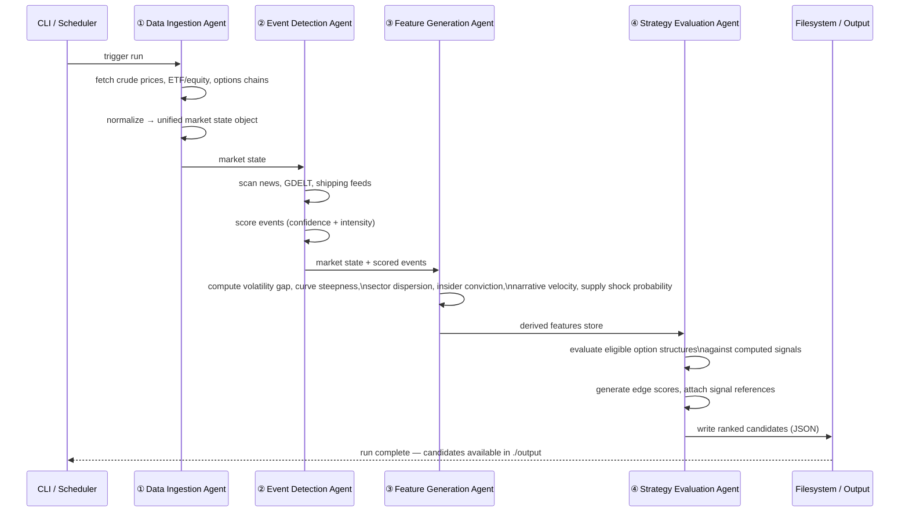

# Energy Options Opportunity Agent — User Guide

> **Version 1.0 · March 2026**
> This guide covers the full pipeline: setup, configuration, execution, output interpretation, and troubleshooting.

---

## Table of Contents

1. [Overview](#overview)
2. [Prerequisites](#prerequisites)
3. [Setup & Configuration](#setup--configuration)
4. [Running the Pipeline](#running-the-pipeline)
5. [Interpreting the Output](#interpreting-the-output)
6. [Troubleshooting](#troubleshooting)

---

## Overview

The **Energy Options Opportunity Agent** is an autonomous, modular Python pipeline that identifies options trading opportunities driven by oil market instability. It ingests market data, supply signals, news events, and alternative datasets to produce structured, ranked candidate options strategies.

### What the pipeline does

```mermaid
flowchart LR
    subgraph Inputs
        A1[Crude Prices\nAlpha Vantage / MetalpriceAPI]
        A2[ETF & Equity Prices\nyfinance / Yahoo Finance]
        A3[Options Chains\nYahoo Finance / Polygon.io]
        A4[Supply & Inventory\nEIA API]
        A5[News & Geo Events\nGDELT / NewsAPI]
        A6[Insider Activity\nSEC EDGAR / Quiver Quant]
        A7[Shipping & Logistics\nMarineTraffic / VesselFinder]
        A8[Narrative & Sentiment\nReddit / Stocktwits]
    end

    subgraph Pipeline
        direction TB
        B1["① Data Ingestion Agent\nFetch & Normalize"]
        B2["② Event Detection Agent\nSupply & Geo Signals"]
        B3["③ Feature Generation Agent\nDerived Signal Computation"]
        B4["④ Strategy Evaluation Agent\nOpportunity Ranking"]
    end

    subgraph Output
        C1[Ranked Candidates\nJSON / Dashboard]
    end

    Inputs --> B1
    B1 -->|Unified Market State| B2
    B2 -->|Scored Events| B3
    B3 -->|Derived Features| B4
    B4 --> C1
```



### In-scope instruments

| Category | Instruments |
|---|---|
| Crude futures | Brent Crude, WTI (`CL=F`) |
| ETFs | USO, XLE |
| Energy equities | Exxon Mobil (XOM), Chevron (CVX) |

### In-scope option structures (MVP)

| Structure | Enum value |
|---|---|
| Long straddle | `long_straddle` |
| Call spread | `call_spread` |
| Put spread | `put_spread` |
| Calendar spread | `calendar_spread` |

> **Advisory only.** Automated trade execution is explicitly out of scope. All output is for informational and analytical purposes.

---

## Prerequisites

### System requirements

| Requirement | Minimum |
|---|---|
| Python | 3.10+ |
| RAM | 2 GB |
| Disk | 10 GB (for 6–12 months of historical data) |
| OS | Linux, macOS, or Windows (WSL2 recommended) |
| Deployment target | Local machine, single VM, or container |

### Required Python packages

Install dependencies from the project root:

```bash
pip install -r requirements.txt
```

Key dependencies include:

```text
yfinance
requests
pandas
numpy
python-dotenv
schedule
```

### External API accounts

Obtain free-tier credentials for each data source before configuring the pipeline.

| Service | URL | Cost | Used for |
|---|---|---|---|
| Alpha Vantage | https://www.alphavantage.co | Free | WTI / Brent spot and futures |
| EIA API | https://www.eia.gov/opendata | Free | Inventory and refinery utilization |
| NewsAPI | https://newsapi.org | Free tier | News and geopolitical events |
| GDELT | https://www.gdeltproject.org | Free | Geopolitical event stream |
| Polygon.io | https://polygon.io | Free/Limited | Options chains |
| SEC EDGAR | https://www.sec.gov/developer | Free | Insider filing data |
| Quiver Quant | https://www.quiverquant.com | Free/Limited | Parsed insider trades |
| MarineTraffic | https://www.marinetraffic.com | Free tier | Tanker flow data |

> **Tip:** `yfinance` (Yahoo Finance) requires no API key and is used as the primary fallback for equity, ETF, and options chain data.

---

## Setup & Configuration

### 1. Clone the repository

```bash
git clone https://github.com/your-org/energy-options-agent.git
cd energy-options-agent
```

### 2. Create a virtual environment

```bash
python -m venv .venv
source .venv/bin/activate        # Linux / macOS
# .venv\Scripts\activate         # Windows
```

### 3. Install dependencies

```bash
pip install -r requirements.txt
```

### 4. Create the environment file

Copy the provided template and populate it with your credentials:

```bash
cp .env.example .env
```

Then open `.env` in your editor and fill in each value:

```dotenv
# .env — Energy Options Opportunity Agent

# ── Data Ingestion ────────────────────────────────────────────
ALPHA_VANTAGE_API_KEY=your_alpha_vantage_key
EIA_API_KEY=your_eia_key
POLYGON_API_KEY=your_polygon_key

# ── Event Detection ───────────────────────────────────────────
NEWS_API_KEY=your_newsapi_key

# ── Alternative / Contextual Signals ─────────────────────────
QUIVER_QUANT_API_KEY=your_quiver_quant_key
MARINE_TRAFFIC_API_KEY=your_marinetraffic_key

# ── Output ────────────────────────────────────────────────────
OUTPUT_DIR=./output
OUTPUT_FORMAT=json

# ── Scheduling ────────────────────────────────────────────────
MARKET_DATA_INTERVAL_MINUTES=5
SLOW_FEED_INTERVAL_HOURS=24

# ── Data Retention ───────────────────────────────────────────
RETENTION_DAYS=365
```

### Environment variable reference

| Variable | Required | Default | Description |
|---|---|---|---|
| `ALPHA_VANTAGE_API_KEY` | Yes | — | API key for WTI and Brent crude prices |
| `EIA_API_KEY` | Yes | — | API key for EIA inventory and refinery data |
| `POLYGON_API_KEY` | No | — | API key for options chain data (falls back to yfinance) |
| `NEWS_API_KEY` | Yes | — | API key for NewsAPI geopolitical and energy news |
| `QUIVER_QUANT_API_KEY` | No | — | API key for parsed SEC insider trade data |
| `MARINE_TRAFFIC_API_KEY` | No | — | API key for tanker flow and shipping data |
| `OUTPUT_DIR` | No | `./output` | Directory where JSON candidate files are written |
| `OUTPUT_FORMAT` | No | `json` | Output format; currently `json` is supported |
| `MARKET_DATA_INTERVAL_MINUTES` | No | `5` | Polling cadence for market data (prices, options) |
| `SLOW_FEED_INTERVAL_HOURS` | No | `24` | Polling cadence for slow feeds (EIA, EDGAR) |
| `RETENTION_DAYS` | No | `365` | Number of days of historical data to retain on disk |

> **Optional keys:** If `POLYGON_API_KEY`, `QUIVER_QUANT_API_KEY`, or `MARINE_TRAFFIC_API_KEY` are absent, the pipeline will fall back to available free sources or skip those signals gracefully. The pipeline will not fail due to a missing optional key.

### 5. Verify the setup

Run the built-in configuration check before starting the pipeline:

```bash
python -m agent check-config
```

Expected output:

```
[OK] Alpha Vantage         reachable
[OK] EIA API               reachable
[OK] NewsAPI               reachable
[OK] yfinance              available (no key required)
[WARN] Polygon.io          key not set — falling back to yfinance for options
[WARN] MarineTraffic       key not set — shipping signals disabled
[OK] Output directory      ./output exists
Configuration check complete. 2 warning(s), 0 error(s).
```

---

## Running the Pipeline

### Pipeline execution sequence



### Run once (manual)

Execute a single end-to-end pipeline run:

```bash
python -m agent run
```

This triggers all four agents in sequence and writes the output to `OUTPUT_DIR`.

### Run on a schedule (continuous mode)

Start the pipeline in continuous mode. Market data is polled at the cadence set by `MARKET_DATA_INTERVAL_MINUTES`; slow feeds (EIA, EDGAR) refresh at `SLOW_FEED_INTERVAL_HOURS`:

```bash
python -m agent run --continuous
```

### Run a specific agent only

Each agent can be executed independently, which is useful during development or when debugging a single stage:

```bash
# Run only the Data Ingestion Agent
python -m agent run --agent ingestion

# Run only the Event Detection Agent
python -m agent run --agent events

# Run only the Feature Generation Agent
python -m agent run --agent features

# Run only the Strategy Evaluation Agent
python -m agent run --agent strategy
```

> **Dependency note:** Running `features` or `strategy` in isolation requires a valid market state object and event scores to already exist in the derived features store from a prior run of the upstream agents.

### Run with Docker

A `Dockerfile` and `docker-compose.yml` are provided for containerized deployment on a single VM:

```bash
# Build the image
docker build -t energy-options-agent .

# Run once
docker run --env-file .env -v $(pwd)/output:/app/output energy-options-agent

# Run continuously via docker-compose
docker-compose up -d
```

### CLI reference

| Command | Description |
|---|---|
| `python -m agent check-config` | Validate configuration and API connectivity |
| `python -m agent run` | Execute one full pipeline run |
| `python -m agent run --continuous` | Run pipeline on a repeating schedule |
| `python -m agent run --agent <name>` | Run a single agent (`ingestion`, `events`, `features`, `strategy`) |
| `python -m agent status` | Show last run timestamp and candidate count |
| `python -m agent clean --older-than <days>` | Purge output files older than `<days>` days |

---

## Interpreting the Output

### Output location

After each run, one or more JSON files are written to `OUTPUT_DIR` (default: `./output`):

```
./output/
└── candidates_2026-03-15T14:32:00Z.json
```

### Output schema

Each file contains an array of strategy candidate objects:

| Field | Type | Description |
|---|---|---|
| `instrument` | `string` | Target instrument, e.g. `"USO"`, `"XLE"`, `"CL=F"` |
| `structure` | `enum` | `long_straddle` \| `call_spread` \| `put_spread` \| `calendar_spread` |
| `expiration` | `integer` | Target expiration in calendar days from the evaluation date |
| `edge_score` | `float [0.0–1.0]` | Composite opportunity score; higher = stronger signal confluence |
| `signals` | `object` | Map of contributing signals and their current state |
| `generated_at` | `ISO 8601 datetime` | UTC timestamp of candidate generation |

### Example output

```json
[
  {
    "instrument": "USO",
    "structure": "long_straddle",
    "expiration": 30,
    "edge_score": 0.47,
    "signals": {
      "tanker_disruption_index": "high",
      "volatility_gap": "positive",
      "narrative_velocity": "rising"
    },
    "generated_at": "2026-03-15T14:32:00Z"
  },
  {
    "instrument": "XOM",
    "structure": "call_spread",
    "expiration": 45,
    "edge_score": 0.31,
    "signals": {
      "volatility_gap": "positive",
      "supply_shock_probability": "elevated",
      "insider_conviction_score": "moderate"
    },
    "generated_at": "2026-03-15T14:32:00Z"
  }
]
```

### Reading the edge score

The `edge_score` is a composite float between `0.0` and `1.0` reflecting the degree of signal confluence across all active layers.

| Edge score range | Interpretation |
|---|---|
| `0.70 – 1.00` | Strong confluence — multiple independent signals agree |
| `0.40 – 0.69` | Moderate confluence — worth monitoring; verify signals manually |
| `0.00 – 0.39` | Weak confluence — low signal agreement; treat with caution |

> **Important:** The edge score is a heuristic ranking tool, not a probability of profit. It indicates the relative strength of signal alignment, not a forecast of price direction or options premium outcome.

### Reading the signals map

The `signals` object provides the explainability layer for each candidate. Each key is a derived feature; each value describes its current state.

| Signal key | Description |
|---|---|
| `volatility_gap` | Relationship between realized and implied volatility (`positive` = IV underprices realized vol) |
| `futures_curve_steepness` | Degree of contango or backwardation in the crude futures curve |
| `sector_dispersion` | Cross-instrument divergence within energy equities and ETFs |
| `insider_conviction_score` | Aggregated signal from recent SEC EDGAR insider filings |
| `narrative_velocity` | Rate of headline acceleration from news and social feeds |
| `supply_shock_probability` | Derived probability of a near-term supply disruption event |
| `tanker_disruption_index` | Signal derived from shipping and logistics flow anomalies |

### Consuming the output in thinkorswim

The JSON output is compatible with any thinkorswim thinkScript import tool or third-party JSON-to-watchlist utility. Export the `instrument` and `structure` fields to build a prioritized watchlist sorted descending by `edge_score`.

---

## Troubleshooting

### General diagnostic steps

1. Run `python -m agent check-config` to confirm all reachable APIs and environment variables.
2. Check the log file at `./logs/agent.log` for timestamped error messages.
3. Confirm your virtual environment is activated and dependencies are installed.

### Common issues

| Symptom | Likely cause | Resolution |
|---|---|---|
| `KeyError: 'ALPHA_VANTAGE_API_KEY'` | `.env` file not loaded or key missing | Confirm `.env` exists in the project root and the variable is set; ensure `python-