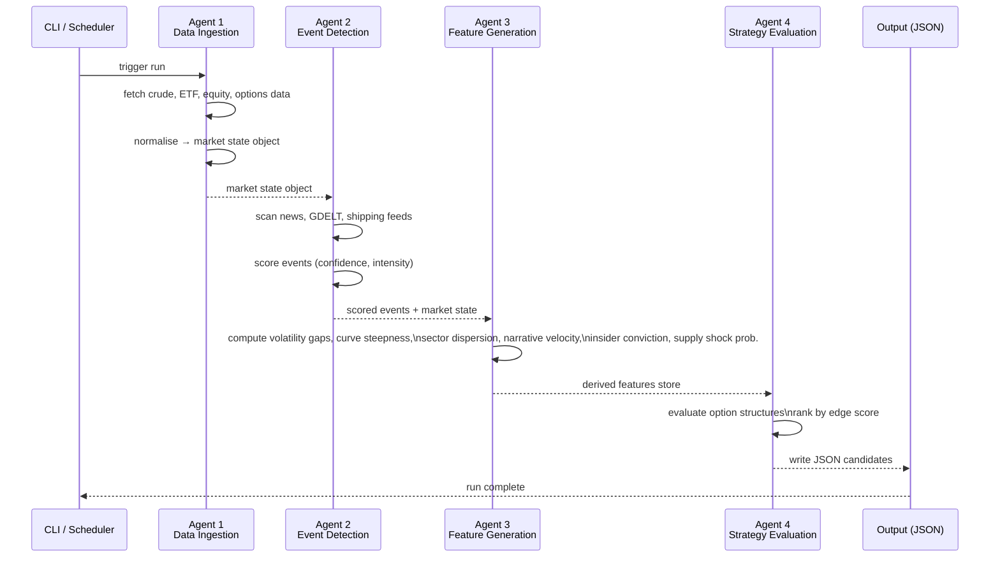

# Energy Options Opportunity Agent — User Guide

> **Version 1.0 • March 2026**
> This guide walks a developer through setting up, configuring, and running the full four-agent pipeline that identifies oil-market-driven options trading opportunities.

---

## Table of Contents

1. [Overview](#overview)
2. [Prerequisites](#prerequisites)
3. [Setup & Configuration](#setup--configuration)
4. [Running the Pipeline](#running-the-pipeline)
5. [Interpreting the Output](#interpreting-the-output)
6. [Troubleshooting](#troubleshooting)

---

## Overview

The **Energy Options Opportunity Agent** is an autonomous, modular Python pipeline composed of four loosely coupled agents. It ingests market data, geopolitical signals, news events, and alternative datasets to produce structured, ranked candidate options strategies for oil-related instruments.

### Pipeline Architecture

```mermaid
flowchart LR
    subgraph Inputs
        A1[Crude Prices\nAlpha Vantage / MetalpriceAPI]
        A2[ETF & Equity Prices\nyfinance]
        A3[Options Chains\nYahoo Finance / Polygon.io]
        A4[EIA Inventory\nEIA API]
        A5[News & Geo Events\nGDELT / NewsAPI]
        A6[Insider Activity\nEDGAR / Quiver Quant]
        A7[Shipping Data\nMarineTraffic]
        A8[Sentiment\nReddit / Stocktwits]
    end

    subgraph Agent_1 [" Agent 1 · Data Ingestion"]
        B[Fetch & Normalize\nMarket State Object]
    end

    subgraph Agent_2 [" Agent 2 · Event Detection"]
        C[Supply & Geo\nSignal Scoring]
    end

    subgraph Agent_3 [" Agent 3 · Feature Generation"]
        D[Derived Signal\nComputation]
    end

    subgraph Agent_4 [" Agent 4 · Strategy Evaluation"]
        E[Opportunity Ranking\nEdge Score Output]
    end

    Inputs --> Agent_1
    Agent_1 -->|market state object| Agent_2
    Agent_2 -->|scored events| Agent_3
    Agent_3 -->|derived features| Agent_4
    Agent_4 -->|JSON candidates| F[(Output / Dashboard)]
```



### In-Scope Instruments

| Category | Instruments |
|---|---|
| Crude Futures | Brent Crude, WTI (`CL=F`) |
| ETFs | USO, XLE |
| Energy Equities | Exxon Mobil (XOM), Chevron (CVX) |

### In-Scope Option Structures (MVP)

| Structure | Enum Value |
|---|---|
| Long Straddle | `long_straddle` |
| Call Spread | `call_spread` |
| Put Spread | `put_spread` |
| Calendar Spread | `calendar_spread` |

> **Advisory only.** Automated trade execution is explicitly out of scope. All output is for informational and analytical purposes.

---

## Prerequisites

### System Requirements

| Requirement | Minimum |
|---|---|
| Python | 3.10 or later |
| OS | Linux, macOS, or Windows (WSL recommended) |
| RAM | 2 GB |
| Disk | 10 GB (for 6–12 months of historical data) |
| Deployment target | Local machine, single VM, or container |

### Required Tools

```bash
# Verify Python version
python --version   # must be >= 3.10

# Verify pip
pip --version

# Recommended: create an isolated environment
python -m venv .venv
source .venv/bin/activate        # macOS / Linux
.venv\Scripts\activate           # Windows PowerShell
```

### External API Accounts

Obtain free-tier credentials from each provider before proceeding. All listed sources are free or low-cost.

| Data Layer | Provider | Registration URL | Notes |
|---|---|---|---|
| Crude Prices | Alpha Vantage | https://www.alphavantage.co | Free key; minutes cadence |
| Crude Prices (alt) | MetalpriceAPI | https://metalpriceapi.com | Free tier |
| ETF / Equity Prices | yfinance (Yahoo) | No key required | Library-level access |
| Options Chains | Polygon.io | https://polygon.io | Free tier; daily delay |
| Supply / Inventory | EIA API | https://www.eia.gov/opendata | Free; weekly updates |
| News & Geo Events | NewsAPI | https://newsapi.org | Free tier |
| News & Geo Events (alt) | GDELT | https://www.gdeltproject.org | No key; public dataset |
| Insider Activity | SEC EDGAR | https://efts.sec.gov/LATEST/search-index | No key required |
| Insider Activity (alt) | Quiver Quant | https://www.quiverquant.com | Free limited tier |
| Shipping / Logistics | MarineTraffic | https://www.marinetraffic.com | Free tier |
| Sentiment | Reddit (PRAW) | https://www.reddit.com/prefs/apps | Free OAuth app |
| Sentiment (alt) | Stocktwits | https://api.stocktwits.com | Free public API |

---

## Setup & Configuration

### 1. Clone the Repository

```bash
git clone https://github.com/your-org/energy-options-agent.git
cd energy-options-agent
```

### 2. Install Dependencies

```bash
pip install -r requirements.txt
```

### 3. Configure Environment Variables

All runtime configuration is supplied via environment variables. Copy the provided template and populate each value:

```bash
cp .env.example .env
```

Then edit `.env` with your credentials:

```bash
# .env
ALPHA_VANTAGE_API_KEY=your_alpha_vantage_key
METALPRICE_API_KEY=your_metalprice_key
POLYGON_API_KEY=your_polygon_key
EIA_API_KEY=your_eia_key
NEWS_API_KEY=your_newsapi_key
REDDIT_CLIENT_ID=your_reddit_client_id
REDDIT_CLIENT_SECRET=your_reddit_client_secret
REDDIT_USER_AGENT=energy-options-agent/1.0
QUIVER_QUANT_API_KEY=your_quiver_key
MARINE_TRAFFIC_API_KEY=your_marinetraffic_key
```

#### Full Environment Variable Reference

| Variable | Required | Default | Description |
|---|---|---|---|
| `ALPHA_VANTAGE_API_KEY` | Yes | — | API key for WTI/Brent spot and futures prices (minutes cadence) |
| `METALPRICE_API_KEY` | No | — | Alternative crude price source; used as fallback |
| `POLYGON_API_KEY` | Yes | — | Options chain data: strike, expiry, IV, volume (daily) |
| `EIA_API_KEY` | Yes | — | EIA inventory and refinery utilization data (weekly) |
| `NEWS_API_KEY` | Yes | — | NewsAPI key for energy disruption and geopolitical headlines |
| `GDELT_ENABLED` | No | `true` | Set to `false` to disable GDELT ingestion |
| `REDDIT_CLIENT_ID` | No | — | Reddit OAuth app client ID for sentiment ingestion |
| `REDDIT_CLIENT_SECRET` | No | — | Reddit OAuth app client secret |
| `REDDIT_USER_AGENT` | No | `energy-options-agent/1.0` | Reddit API user agent string |
| `QUIVER_QUANT_API_KEY` | No | — | Quiver Quant key for insider conviction data |
| `MARINE_TRAFFIC_API_KEY` | No | — | MarineTraffic free-tier key for tanker flow data |
| `OUTPUT_DIR` | No | `./output` | Directory where JSON candidate files are written |
| `HISTORICAL_DATA_DIR` | No | `./data` | Root directory for raw and derived historical data |
| `RETENTION_DAYS` | No | `365` | Days of historical data to retain (minimum 180 for backtesting) |
| `MARKET_DATA_POLL_INTERVAL_SECONDS` | No | `60` | Polling interval for minutes-cadence market data feeds |
| `LOG_LEVEL` | No | `INFO` | Logging verbosity: `DEBUG`, `INFO`, `WARNING`, `ERROR` |
| `PIPELINE_PHASE` | No | `1` | Active MVP phase (1–3). Controls which agents and signals are enabled |

> **Tip — missing optional keys:** The pipeline is designed to tolerate delayed or missing data without failing. If an optional key (e.g., `MARINE_TRAFFIC_API_KEY`) is absent, the corresponding signal layer is skipped and a warning is logged. Required keys will raise a `ConfigurationError` at startup.

### 4. Verify Configuration

```bash
python -m agent.cli verify-config
```

Expected output:

```
[OK]  ALPHA_VANTAGE_API_KEY  set
[OK]  POLYGON_API_KEY        set
[OK]  EIA_API_KEY            set
[OK]  NEWS_API_KEY           set
[WARN] MARINE_TRAFFIC_API_KEY not set — shipping signals disabled
[WARN] QUIVER_QUANT_API_KEY  not set — insider signals disabled
Configuration valid. Active phase: 1
```

### 5. Initialise the Data Store

Run the initialisation command to create the local directory structure and, if configured, seed the historical data store:

```bash
python -m agent.cli init
```

```
Creating data directories...
  ./data/raw/prices
  ./data/raw/options
  ./data/raw/events
  ./data/derived
  ./output
Initialisation complete.
```

---

## Running the Pipeline

### Pipeline Execution Flow



### Single Run (One-Shot)

Execute all four agents sequentially for a single evaluation cycle:

```bash
python -m agent.cli run
```

### Continuous Mode (Polling)

Run the pipeline on a repeating schedule. Market data refreshes at the interval defined by `MARKET_DATA_POLL_INTERVAL_SECONDS` (default: 60 s). Slower feeds (EIA, EDGAR) update on their own daily/weekly schedules:

```bash
python -m agent.cli run --continuous
```

To stop: `Ctrl+C`. The pipeline completes the current cycle before exiting.

### Run Individual Agents

Each agent can be run in isolation for development or debugging:

```bash
# Agent 1: Data Ingestion only
python -m agent.cli run --agent ingestion

# Agent 2: Event Detection only (requires existing market state)
python -m agent.cli run --agent event-detection

# Agent 3: Feature Generation only (requires market state + events)
python -m agent.cli run --agent feature-generation

# Agent 4: Strategy Evaluation only (requires derived features store)
python -m agent.cli run --agent strategy-evaluation
```

### Selecting a Pipeline Phase

Set `PIPELINE_PHASE` in `.env`, or override at runtime with the `--phase` flag:

```bash
# Phase 1: Core market signals + options (default)
python -m agent.cli run --phase 1

# Phase 2: Adds EIA supply data + GDELT/NewsAPI event detection
python -m agent.cli run --phase 2

# Phase 3: Adds insider, sentiment, and shipping signals
python -m agent.cli run --phase 3
```

| Phase | Name | Key Additions |
|---|---|---|
| 1 | Core Market Signals & Options | WTI/Brent prices, USO/XLE, IV surface, long straddles, call/put spreads |
| 2 | Supply & Event Augmentation | EIA inventory/refinery, GDELT/NewsAPI events, supply disruption indices |
| 3 | Alternative / Contextual Signals | Insider trades (EDGAR/Quiver), narrative velocity (Reddit/Stocktwits), tanker shipping data |
| 4 | High-Fidelity Enhancements | Deferred — exotic structures, automated execution (see [Future Considerations](#future-considerations)) |

### Logging

Logs are written to `stdout` and to `./logs/agent.log`. To increase verbosity:

```bash
LOG_LEVEL=DEBUG python -m agent.cli run
```

---

## Interpreting the Output

### Output Location

After each run, candidate files are written to `OUTPUT_DIR` (default: `./output`):

```
./output/
  candidates_2026-03-15T14:30:00Z.json
  candidates_2026-03-15T15:30:00Z.json
  ...
```

### Output Schema

Each JSON file contains an array of strategy candidates. Every candidate object has the following fields:

| Field | Type | Description |
|---|---|---|
| `instrument` | string | Target instrument, e.g. `USO`, `XLE`, `CL=F` |
| `structure` | enum string | One of `long_straddle`, `call_spread`, `put_spread`, `calendar_spread` |
| `expiration` | integer (days) | Calendar days from evaluation date to target expiration |
| `edge_score` | float [0.0–1.0] | Composite opportunity score; higher = stronger signal confluence |
| `signals` | object | Map of contributing signals and their qualitative state |
| `generated_at` | ISO 8601 datetime | UTC timestamp of candidate generation |

### Example Candidate

```json
{
  "instrument": "USO",
  "structure": "long_straddle",
  "expiration": 30,
  "edge_score": 0.47,
  "signals": {
    "tanker_disruption_index": "high",
    "volatility_gap": "positive",
    "narrative_velocity": "rising"
  },
  "generated_at": "2026-03-15T14:30:00Z"
}
```

### Reading the Edge Score

| Edge Score Range | Interpretation |
|---|---|
| `0.75 – 1.00` | Strong signal confluence — multiple independent signals aligned |
| `0.50 – 0.74` | Moderate confluence — worth monitoring; confirm with additional research |
| `0.25 – 0.49` | Weak confluence — early or thin signal; treat as a watch-list item |
| `0.00 – 0.24` | Low confluence — insufficient signal strength; generally not actionable |

> The edge score is a composite heuristic, not a probability of profit. It reflects the degree to which available signals agree that a mispricing opportunity may exist.

### Reading the Signals Map

Each key in the `signals` object corresponds to a derived feature computed by Agent 3. Common signals and their qualitative states are:

| Signal Key | Possible Values | What It Means |
|---|---|---|
| `volatility_gap` | `positive`, `neutral`, `negative` | Realized vol significantly above (`positive`) or below (`negative`) implied vol |
| `narrative_velocity` | `rising`, `stable`, `falling` | Rate of acceleration of energy-related headlines |
| `tanker_disruption_index` | `high`, `medium`, `low` | Severity of detected tanker chokepoint or shipping disruption events |
|