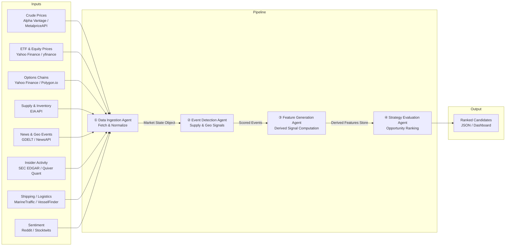

# Energy Options Opportunity Agent — User Guide

> **Version 1.0 • March 2026**
> This guide walks a developer through installing, configuring, and running the full Energy Options Opportunity Agent pipeline, and interpreting its output.

---

## Table of Contents

1. [Overview](#overview)
2. [Prerequisites](#prerequisites)
3. [Setup & Configuration](#setup--configuration)
4. [Running the Pipeline](#running-the-pipeline)
5. [Interpreting the Output](#interpreting-the-output)
6. [Troubleshooting](#troubleshooting)

---

## Overview

The Energy Options Opportunity Agent is a modular, four-agent Python pipeline that identifies options trading opportunities driven by oil market instability. It ingests market data, supply signals, news events, and alternative datasets, then surfaces volatility mispricing in oil-related instruments ranked by a computed **edge score**.

### Pipeline Architecture

Data flows unidirectionally through four loosely coupled agents that share a common market state object and a derived features store.



### Agent Responsibilities

| Agent | Role | Key Outputs |
|---|---|---|
| **Data Ingestion Agent** | Fetch & Normalize | Unified market state object; historical data store |
| **Event Detection Agent** | Supply & Geo Signals | Events with confidence and intensity scores |
| **Feature Generation Agent** | Derived Signal Computation | Volatility gaps, curve steepness, supply shock probability, etc. |
| **Strategy Evaluation Agent** | Opportunity Ranking | Ranked candidates with edge scores and signal references |

### In-Scope Instruments & Structures (MVP)

| Category | Items |
|---|---|
| **Crude futures** | Brent Crude, WTI (`CL=F`) |
| **ETFs** | USO, XLE |
| **Energy equities** | Exxon Mobil (XOM), Chevron (CVX) |
| **Option structures** | Long straddles, call/put spreads, calendar spreads |

> **Advisory only.** The system produces ranked recommendations. No automated trade execution occurs in the MVP.

---

## Prerequisites

### System Requirements

| Requirement | Minimum |
|---|---|
| Python | 3.10+ |
| Memory | 2 GB RAM |
| Disk | 10 GB free (for 6–12 months of historical data) |
| OS | Linux, macOS, or Windows (WSL2 recommended) |
| Deployment target | Local machine, single VM, or single container |

### Required Tooling

```bash
# Verify Python version
python --version   # must be 3.10+

# Verify pip
pip --version

# Recommended: create and activate a virtual environment
python -m venv .venv
source .venv/bin/activate        # Linux / macOS
.venv\Scripts\activate.bat       # Windows
```

### External API Accounts

You must register for the following free-tier accounts before the pipeline can run. All are free or have a free tier sufficient for MVP use.

| Data Source | Sign-up URL | Notes |
|---|---|---|
| Alpha Vantage | https://www.alphavantage.co/support/#api-key | Free key; WTI/Brent prices |
| MetalpriceAPI | https://metalpriceapi.com | Fallback crude price feed |
| Polygon.io | https://polygon.io | Free tier; options chains |
| EIA API | https://www.eia.gov/opendata | Free; inventory & refinery data |
| NewsAPI | https://newsapi.org | Free developer plan |
| GDELT | No key required | Public dataset; geo events |
| SEC EDGAR | No key required | Public EDGAR full-text search |
| Quiver Quant | https://www.quiverquant.com | Free limited tier; insider activity |
| MarineTraffic | https://www.marinetraffic.com/en/online-services/plans | Free tier; tanker data |

> **yfinance**, **Reddit (PRAW)**, and **Stocktwits** are also used. yfinance requires no key. Reddit requires a [Reddit API application](https://www.reddit.com/prefs/apps). Stocktwits has a public API endpoint that requires no key for read access.

---

## Setup & Configuration

### 1. Clone the Repository

```bash
git clone https://github.com/your-org/energy-options-agent.git
cd energy-options-agent
```

### 2. Install Dependencies

```bash
pip install -r requirements.txt
```

### 3. Create the Environment File

Copy the provided template and populate your API keys:

```bash
cp .env.example .env
```

Then open `.env` in your editor and fill in each value.

### 4. Environment Variables Reference

All pipeline configuration is driven by environment variables. The table below is the authoritative reference.

#### Data Source Credentials

| Variable | Required | Description |
|---|---|---|
| `ALPHA_VANTAGE_API_KEY` | Yes | API key for Alpha Vantage crude price feed |
| `METALPRICE_API_KEY` | Yes | API key for MetalpriceAPI fallback feed |
| `POLYGON_API_KEY` | Yes | API key for Polygon.io options chain data |
| `EIA_API_KEY` | Yes | API key for EIA supply and inventory data |
| `NEWS_API_KEY` | Yes | API key for NewsAPI geo/energy event headlines |
| `QUIVER_QUANT_API_KEY` | No | API key for Quiver Quant insider activity feed (Phase 3) |
| `MARINE_TRAFFIC_API_KEY` | No | API key for MarineTraffic shipping data (Phase 3) |
| `REDDIT_CLIENT_ID` | No | Reddit application client ID for PRAW (Phase 3) |
| `REDDIT_CLIENT_SECRET` | No | Reddit application client secret for PRAW (Phase 3) |
| `REDDIT_USER_AGENT` | No | Reddit PRAW user agent string, e.g. `energy-agent/1.0` |

#### Pipeline Behaviour

| Variable | Default | Description |
|---|---|---|
| `PIPELINE_PHASE` | `1` | MVP phase to activate (`1`–`4`). Controls which agents and data sources are enabled. |
| `MARKET_DATA_REFRESH_SECONDS` | `60` | How often (in seconds) the Data Ingestion Agent polls minute-level market feeds |
| `SLOW_FEED_REFRESH_HOURS` | `24` | Refresh interval for daily/weekly feeds (EIA, EDGAR) |
| `HISTORICAL_RETENTION_DAYS` | `180` | Days of raw and derived data to retain for backtesting (minimum 180) |
| `TOP_N_CANDIDATES` | `10` | Maximum number of ranked candidates to emit per pipeline run |
| `EDGE_SCORE_THRESHOLD` | `0.10` | Minimum edge score for a candidate to be included in output |

#### Output

| Variable | Default | Description |
|---|---|---|
| `OUTPUT_DIR` | `./output` | Directory where JSON output files are written |
| `OUTPUT_FORMAT` | `json` | Output format; `json` is the only supported value in MVP |
| `LOG_LEVEL` | `INFO` | Logging verbosity: `DEBUG`, `INFO`, `WARNING`, `ERROR` |

#### Storage

| Variable | Default | Description |
|---|---|---|
| `DATA_STORE_PATH` | `./data` | Root directory for the local historical data store |
| `MARKET_STATE_PATH` | `./data/market_state` | Path for the shared market state object persisted between agent runs |
| `FEATURES_STORE_PATH` | `./data/features` | Path for the derived features store |

### 5. Verify Configuration

Run the built-in configuration check before the first full pipeline run:

```bash
python -m agent check-config
```

Expected output when all required variables are set:

```
[OK] ALPHA_VANTAGE_API_KEY   set
[OK] METALPRICE_API_KEY      set
[OK] POLYGON_API_KEY         set
[OK] EIA_API_KEY             set
[OK] NEWS_API_KEY            set
[--] QUIVER_QUANT_API_KEY    not set (optional – Phase 3)
[--] MARINE_TRAFFIC_API_KEY  not set (optional – Phase 3)
[--] REDDIT_CLIENT_ID        not set (optional – Phase 3)
[--] REDDIT_CLIENT_SECRET    not set (optional – Phase 3)
Configuration valid for PIPELINE_PHASE=1.
```

---

## Running the Pipeline

### Pipeline Phases

The pipeline is designed for incremental activation. Set `PIPELINE_PHASE` in `.env` to the phase you want to run.

| Phase | Name | What it enables |
|---|---|---|
| `1` | Core Market Signals & Options | Crude prices (WTI, Brent), USO/XLE, options surface analysis, long straddles and call/put spreads |
| `2` | Supply & Event Augmentation | Adds EIA inventory, refinery utilization, GDELT/NewsAPI event detection, supply disruption indices |
| `3` | Alternative / Contextual Signals | Adds insider trades (EDGAR/Quiver), narrative velocity (Reddit/Stocktwits), shipping data (MarineTraffic), cross-sector correlation |
| `4` | High-Fidelity Enhancements | Adds OPIS/regional refined pricing, exotic option structures, execution integration scaffolding |

> Start with `PIPELINE_PHASE=1` until you have verified all Phase 1 credentials and output is healthy.

### Running Once (Single-Shot)

Execute a single end-to-end pipeline run and write results to `OUTPUT_DIR`:

```bash
python -m agent run
```

The four agents execute in sequence:

```
[1/4] Data Ingestion Agent    ... done  (14.2 s)
[2/4] Event Detection Agent   ... done  (3.8 s)
[3/4] Feature Generation Agent... done  (1.1 s)
[4/4] Strategy Evaluation Agent... done (0.4 s)
Output written to ./output/candidates_2026-03-15T14:32:00Z.json
```

### Running a Specific Agent in Isolation

Each agent can be invoked independently for debugging or incremental development:

```bash
# Run only the Data Ingestion Agent
python -m agent run --agent ingestion

# Run only the Event Detection Agent (uses existing market state)
python -m agent run --agent events

# Run only the Feature Generation Agent (uses existing market state + events)
python -m agent run --agent features

# Run only the Strategy Evaluation Agent (uses existing features store)
python -m agent run --agent strategy
```

### Running Continuously (Scheduler Mode)

To poll at the configured `MARKET_DATA_REFRESH_SECONDS` cadence, use scheduler mode:

```bash
python -m agent run --continuous
```

Slow feeds (EIA, EDGAR) are refreshed on their own `SLOW_FEED_REFRESH_HOURS` schedule automatically within this mode. Press `Ctrl+C` to stop gracefully.

### Running in a Container

A `Dockerfile` is included for containerised deployment on a single VM:

```bash
# Build the image
docker build -t energy-options-agent:1.0 .

# Run with your .env file mounted
docker run --env-file .env \
  -v $(pwd)/data:/app/data \
  -v $(pwd)/output:/app/output \
  energy-options-agent:1.0 python -m agent run --continuous
```

### CLI Reference

```
Usage: python -m agent [COMMAND] [OPTIONS]

Commands:
  run           Execute the pipeline (default: all agents, single-shot)
  check-config  Validate environment variable configuration
  backfill      Populate the historical data store from a given start date

Options for `run`:
  --agent TEXT       Run a single named agent: ingestion | events | features | strategy
  --continuous       Run in scheduler mode at the configured refresh cadence
  --phase INTEGER    Override PIPELINE_PHASE for this run only
  --top-n INTEGER    Override TOP_N_CANDIDATES for this run only
  --log-level TEXT   Override LOG_LEVEL for this run only

Options for `backfill`:
  --start-date TEXT  ISO 8601 date to backfill from, e.g. 2025-09-01
```

---

## Interpreting the Output

### Output File Location

Each run writes a timestamped JSON file to `OUTPUT_DIR`:

```
./output/
└── candidates_2026-03-15T14:32:00Z.json
```

### Output Schema

Each file contains a top-level array of strategy candidate objects. Every candidate has the following fields:

| Field | Type | Description |
|---|---|---|
| `instrument` | string | Target instrument, e.g. `USO`, `XLE`, `CL=F` |
| `structure` | enum | Option structure: `long_straddle` \| `call_spread` \| `put_spread` \| `calendar_spread` |
| `expiration` | integer (days) | Target expiration in calendar days from the evaluation date |
| `edge_score` | float [0.0–1.0] | Composite opportunity score; higher value = stronger signal confluence |
| `signals` | object | Map of contributing signals and their qualitative values |
| `generated_at` | ISO 8601 datetime | UTC timestamp of candidate generation |

### Example Output

```json
[
  {
    "instrument": "USO",
    "structure": "long_straddle",
    "expiration": 30,
    "edge_score": 0.47,
    "signals": {
      "tanker_disruption_index": "high",
      "volatility_gap": "positive",
      "narrative_velocity": "rising"
    },
    "generated_at": "2026-03-15T14:32:00Z"
  },
  {
    "instrument": "XLE",
    "structure": "call_spread",
    "expiration": 21,
    "edge_score": 0.31,
    "signals": {
      "volatility_gap": "positive",
      "eia_inventory_draw": "above_average",
      "sector_dispersion": "elevated"
    },
    "generated_at": "2026-03-15T14:32:00Z"
  }
]
```

### Reading the Edge Score

The `edge_score` is a composite float in `[0.0, 1.0]` reflecting signal confluence across all active pipeline phases. It is not a probability of profit.

| Score Range | Interpretation |
|---|---|
| `0.00 – 0.09` | Below threshold; filtered from output by default |
| `0.10 – 0.29` | Weak signal confluence; low priority |
| `0.30 – 0.49` | Moderate confluence; worth reviewing alongside your own analysis |
| `0.50 – 0.74` | Strong confluence across multiple independent signals |
| `0.75 – 1.00` | Very strong confluence; highest priority candidates |