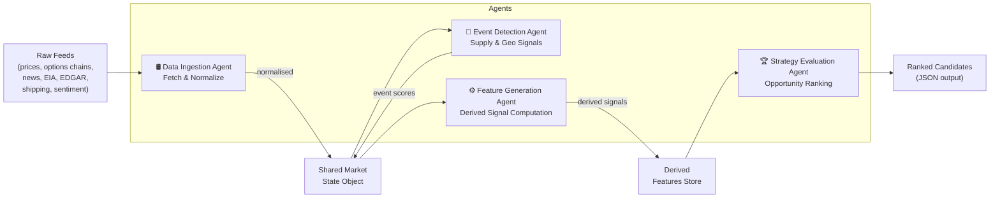
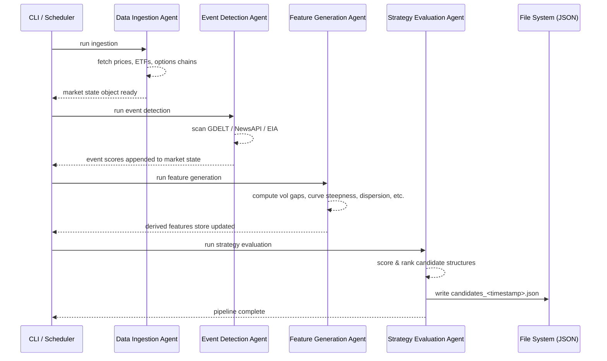

# Energy Options Opportunity Agent — User Guide

> **Version 1.0 • March 2026**
> This guide walks you through installing, configuring, and running the full pipeline from a clean environment to ranked options candidates.

---

## Table of Contents

1. [Overview](#overview)
2. [Prerequisites](#prerequisites)
3. [Setup & Configuration](#setup--configuration)
4. [Running the Pipeline](#running-the-pipeline)
5. [Interpreting the Output](#interpreting-the-output)
6. [Troubleshooting](#troubleshooting)

---

## Overview

The **Energy Options Opportunity Agent** is a four-agent Python pipeline that surfaces volatility mispricing in oil-related instruments and ranks candidate options strategies by a computed **edge score**.

### Pipeline Architecture



Data flows **unidirectionally**: raw feeds → normalised market state → event scores → derived features → ranked strategy candidates. Each agent is independently deployable, so you can update or replace any stage without disrupting the rest of the pipeline.

### In-Scope Instruments (MVP)

| Category | Instruments |
|---|---|
| Crude futures | Brent Crude, WTI (`CL=F`) |
| ETFs | USO, XLE |
| Energy equities | Exxon Mobil (XOM), Chevron (CVX) |

### In-Scope Option Structures (MVP)

`long_straddle` · `call_spread` · `put_spread` · `calendar_spread`

> **Advisory only.** The system produces recommendations; it does **not** execute trades automatically.

---

## Prerequisites

### Runtime Requirements

| Requirement | Minimum version | Notes |
|---|---|---|
| Python | 3.10+ | Tested on 3.11 |
| pip | 23+ | or use `pipenv` / `poetry` |
| Git | 2.x | for cloning the repo |
| Docker *(optional)* | 24+ | for containerised deployment |

### External API Accounts

Obtain free-tier credentials for each service before configuring the pipeline. All sources listed below have free or limited free tiers.

| Service | Used for | Sign-up URL |
|---|---|---|
| Alpha Vantage | WTI / Brent spot & futures prices | <https://www.alphavantage.co/support/#api-key> |
| Yahoo Finance / yfinance | ETF & equity prices, options chains | No key required (public) |
| Polygon.io *(optional)* | Higher-quality options data | <https://polygon.io> |
| EIA API | Inventory & refinery utilisation | <https://www.eia.gov/opendata/register.php> |
| GDELT | News & geopolitical events | No key required (public) |
| NewsAPI | News headlines | <https://newsapi.org/register> |
| SEC EDGAR | Insider trade filings | No key required (public) |
| Quiver Quant *(optional)* | Parsed insider conviction data | <https://www.quiverquant.com> |
| MarineTraffic / VesselFinder | Tanker flow data | Free tier; register at respective sites |
| Reddit API | Retail sentiment | <https://www.reddit.com/prefs/apps> |
| Stocktwits | Narrative velocity | <https://api.stocktwits.com/developers/apps/new> |

> **Tip:** Phase 1 (core market signals) only requires **Alpha Vantage** and **yfinance**. You can run a partial pipeline without the remaining keys by setting later-phase features to disabled (see [Setup & Configuration](#setup--configuration)).

---

## Setup & Configuration

### 1. Clone the Repository

```bash
git clone https://github.com/your-org/energy-options-agent.git
cd energy-options-agent
```

### 2. Create a Virtual Environment

```bash
python -m venv .venv
source .venv/bin/activate        # Linux / macOS
# .venv\Scripts\activate         # Windows PowerShell
```

### 3. Install Dependencies

```bash
pip install --upgrade pip
pip install -r requirements.txt
```

### 4. Configure Environment Variables

Copy the template and fill in your credentials:

```bash
cp .env.example .env
```

Open `.env` in your editor and set each variable. The full reference table is below.

#### Environment Variable Reference

| Variable | Required | Default | Description |
|---|---|---|---|
| `ALPHA_VANTAGE_API_KEY` | ✅ Phase 1 | — | API key for WTI / Brent price feed |
| `POLYGON_API_KEY` | ⬜ Optional | `""` | Polygon.io key for higher-fidelity options data |
| `EIA_API_KEY` | ✅ Phase 2 | — | EIA Open Data key for inventory & refinery data |
| `NEWSAPI_KEY` | ✅ Phase 2 | — | NewsAPI key for headline ingestion |
| `GDELT_ENABLED` | ⬜ Optional | `true` | Set `false` to skip GDELT event ingestion |
| `QUIVER_QUANT_API_KEY` | ⬜ Optional | `""` | Quiver Quant key for insider conviction scores |
| `REDDIT_CLIENT_ID` | ✅ Phase 3 | — | Reddit API OAuth client ID |
| `REDDIT_CLIENT_SECRET` | ✅ Phase 3 | — | Reddit API OAuth client secret |
| `REDDIT_USER_AGENT` | ✅ Phase 3 | `energy-agent/1.0` | Reddit API user-agent string |
| `STOCKTWITS_API_KEY` | ⬜ Optional | `""` | Stocktwits API key for narrative velocity |
| `MARINE_TRAFFIC_API_KEY` | ⬜ Optional | `""` | MarineTraffic free-tier key for tanker data |
| `DATA_RETENTION_DAYS` | ⬜ Optional | `180` | Days of historical data to retain (180–365 recommended) |
| `MARKET_DATA_INTERVAL_MINUTES` | ⬜ Optional | `5` | Polling cadence for minute-level market data feeds |
| `OUTPUT_DIR` | ⬜ Optional | `./output` | Directory where JSON output files are written |
| `LOG_LEVEL` | ⬜ Optional | `INFO` | Logging verbosity: `DEBUG`, `INFO`, `WARNING`, `ERROR` |
| `PIPELINE_PHASE` | ⬜ Optional | `1` | Active phase (`1`–`3`); controls which agents & signals are enabled |

#### Minimal `.env` for Phase 1

```dotenv
ALPHA_VANTAGE_API_KEY=your_alpha_vantage_key
PIPELINE_PHASE=1
OUTPUT_DIR=./output
LOG_LEVEL=INFO
```

#### Full `.env` for Phase 3

```dotenv
ALPHA_VANTAGE_API_KEY=your_alpha_vantage_key
EIA_API_KEY=your_eia_key
NEWSAPI_KEY=your_newsapi_key
GDELT_ENABLED=true
QUIVER_QUANT_API_KEY=your_quiver_key
REDDIT_CLIENT_ID=your_reddit_client_id
REDDIT_CLIENT_SECRET=your_reddit_secret
REDDIT_USER_AGENT=energy-agent/1.0
STOCKTWITS_API_KEY=your_stocktwits_key
MARINE_TRAFFIC_API_KEY=your_marinetraffic_key
DATA_RETENTION_DAYS=365
MARKET_DATA_INTERVAL_MINUTES=5
OUTPUT_DIR=./output
LOG_LEVEL=INFO
PIPELINE_PHASE=3
```

### 5. Initialise the Data Store

Run the initialisation script to create the local SQLite database and required directory structure:

```bash
python -m agent.init_store
```

Expected output:

```
[INFO] Creating data directory: ./data
[INFO] Initialising historical store (retention: 180 days)
[INFO] Store initialised successfully.
```

---

## Running the Pipeline

### Pipeline Execution Flow



### Running the Full Pipeline (Single Execution)

```bash
python -m agent.pipeline run
```

This executes all four agents in sequence and writes a timestamped JSON file to `OUTPUT_DIR`.

### Running Individual Agents

You can invoke any agent in isolation for development or debugging:

```bash
# Data Ingestion only
python -m agent.pipeline run --stage ingest

# Event Detection only
python -m agent.pipeline run --stage events

# Feature Generation only
python -m agent.pipeline run --stage features

# Strategy Evaluation only
python -m agent.pipeline run --stage evaluate
```

### Scheduling Continuous Execution

For production use, run the pipeline on a recurring schedule. The market data layer refreshes on a **minutes-level cadence**; slower feeds (EIA, EDGAR) update **daily or weekly**.

#### Using cron (Linux / macOS)

```bash
crontab -e
```

Add the following entries:

```cron
# Full pipeline every 5 minutes during market hours (Mon–Fri, 09:00–17:00 ET)
*/5 9-17 * * 1-5 cd /path/to/energy-options-agent && .venv/bin/python -m agent.pipeline run >> logs/pipeline.log 2>&1

# EIA/EDGAR slow-feed refresh — daily at 06:00
0 6 * * 1-5 cd /path/to/energy-options-agent && .venv/bin/python -m agent.pipeline run --stage ingest --feeds slow >> logs/slow_ingest.log 2>&1
```

#### Using Docker

```bash
# Build the image
docker build -t energy-options-agent:1.0 .

# Run a single pipeline execution
docker run --rm --env-file .env energy-options-agent:1.0

# Run continuously with a 5-minute internal loop
docker run -d --env-file .env \
  -v "$(pwd)/output:/app/output" \
  -v "$(pwd)/data:/app/data" \
  energy-options-agent:1.0 --loop --interval 300
```

### Useful CLI Flags

| Flag | Description |
|---|---|
| `--stage <name>` | Run a single agent stage: `ingest`, `events`, `features`, `evaluate` |
| `--feeds slow` | Restrict ingestion to daily/weekly feeds (EIA, EDGAR) only |
| `--dry-run` | Execute pipeline without writing output files |
| `--loop` | Run continuously (Docker / daemon mode) |
| `--interval <seconds>` | Polling interval when `--loop` is active (default: `300`) |
| `--log-level DEBUG` | Override `LOG_LEVEL` for this run |

---

## Interpreting the Output

### Output Location

Each pipeline run writes a file to `OUTPUT_DIR` (default `./output`):

```
output/
└── candidates_2026-03-15T14:32:07Z.json
```

The latest run is also symlinked as `output/candidates_latest.json`.

### Output Schema

Each file contains a JSON array of strategy candidates, one object per ranked opportunity.

| Field | Type | Description |
|---|---|---|
| `instrument` | `string` | Target instrument, e.g. `"USO"`, `"XLE"`, `"CL=F"` |
| `structure` | `enum` | `long_straddle` · `call_spread` · `put_spread` · `calendar_spread` |
| `expiration` | `integer` | Target expiration in calendar days from evaluation date |
| `edge_score` | `float [0.0–1.0]` | Composite opportunity score; higher = stronger signal confluence |
| `signals` | `object` | Map of contributing signals and their current values |
| `generated_at` | `ISO 8601 datetime` | UTC timestamp of candidate generation |

### Example Output

```json
[
  {
    "instrument": "USO",
    "structure": "long_straddle",
    "expiration": 30,
    "edge_score": 0.47,
    "signals": {
      "tanker_disruption_index": "high",
      "volatility_gap": "positive",
      "narrative_velocity": "rising"
    },
    "generated_at": "2026-03-15T14:32:07Z"
  },
  {
    "instrument": "XOM",
    "structure": "call_spread",
    "expiration": 45,
    "edge_score": 0.31,
    "signals": {
      "volatility_gap": "positive",
      "insider_conviction": "elevated",
      "futures_curve_steepness": "backwardated"
    },
    "generated_at": "2026-03-15T14:32:07Z"
  }
]
```

### Reading the Edge Score

| `edge_score` range | Interpretation |
|---|---|
| `0.70 – 1.00` | Strong signal confluence — high-priority candidate |
| `0.40 – 0.69` | Moderate confluence — worth monitoring |
| `0.20 – 0.39` | Weak signal — low conviction; use with caution |
| `0.00 – 0.19` | Minimal signal — typically filtered from default output |

> The edge score is a composite heuristic and **does not constitute financial advice**. Always apply independent judgement and risk management before acting on any candidate.

### Signal Reference

The `signals` object can contain any of the following keys, populated by the Feature Generation Agent:

| Signal key | Source agent | What it measures |
|---|---|---|
| `volatility_gap` | Feature Generation | Realized vs. implied volatility divergence |
| `futures_curve_steepness` | Feature Generation | Contango / backwardation in the crude futures curve |
| `sector_dispersion` | Feature Generation | Cross-sector correlation breakdown |
| `insider_conviction` | Feature Generation | Weighted score of recent executive trades (EDGAR) |
| `narrative_velocity` | Feature Generation | Headline acceleration from Reddit / Stocktwits / news |
| `supply_shock_probability` | Feature Generation | Modelled probability of near-term supply disruption |
| `tanker_disruption_index` | Event Detection | Shipping flow anomalies (MarineTraffic / VesselFinder) |
| `refinery_utilization` | Event Detection | EIA refinery utilisation delta |
| `geopolitical_intensity` | Event Detection | GDELT/NewsAPI event confidence × intensity score |

### Consuming Output in thinkorsw