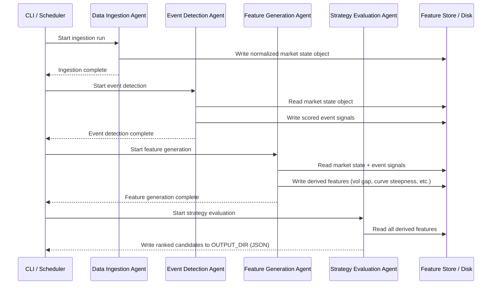

# Energy Options Opportunity Agent — User Guide

> **Version 1.0 • March 2026**
> This guide walks a developer through setting up, configuring, and running the full four-agent pipeline end-to-end.

---

## Table of Contents

1. [Overview](#overview)
2. [Prerequisites](#prerequisites)
3. [Setup & Configuration](#setup--configuration)
4. [Running the Pipeline](#running-the-pipeline)
5. [Interpreting the Output](#interpreting-the-output)
6. [Troubleshooting](#troubleshooting)

---

## Overview

The **Energy Options Opportunity Agent** is an autonomous, modular Python pipeline that identifies options trading opportunities driven by oil market instability. It ingests market data, supply signals, news events, and alternative datasets to produce structured, ranked candidate options strategies.

The pipeline is composed of **four loosely coupled agents** that pass data through a shared market state object and a derived features store:


### Agent Responsibilities

| Agent | Role | Key Outputs |
|---|---|---|
| **Data Ingestion Agent** | Fetch & Normalize | Unified market state object; historical data store |
| **Event Detection Agent** | Supply & Geo Signals | Scored supply disruptions, refinery outages, chokepoint events |
| **Feature Generation Agent** | Derived Signal Computation | Volatility gaps, curve steepness, sector dispersion, narrative velocity, supply shock probability |
| **Strategy Evaluation Agent** | Opportunity Ranking | Ranked strategy candidates with edge scores and signal references |

### In-Scope Instruments (MVP)

| Category | Instruments |
|---|---|
| Crude Futures | Brent Crude, WTI (`CL=F`) |
| ETFs | USO, XLE |
| Energy Equities | Exxon Mobil (XOM), Chevron (CVX) |

### In-Scope Option Structures (MVP)

| Structure | Enum Value |
|---|---|
| Long Straddle | `long_straddle` |
| Call Spread | `call_spread` |
| Put Spread | `put_spread` |
| Calendar Spread | `calendar_spread` |

> **Note:** Automated trade execution is explicitly **out of scope**. The system is advisory only.

---

## Prerequisites

### System Requirements

| Requirement | Minimum |
|---|---|
| Python | 3.10 or later |
| Operating System | Linux, macOS, or Windows (WSL2 recommended) |
| RAM | 2 GB available |
| Disk | 10 GB free (for 6–12 months of historical data) |
| Network | Outbound HTTPS to external APIs |

### Required Tooling

Verify each tool is available before proceeding:

```bash
python --version      # 3.10+
pip --version
git --version
```

### External API Accounts

The pipeline uses free or low-cost data sources. Obtain credentials for the services you intend to use before configuration.

| Service | Registration URL | Cost | Required By Phase |
|---|---|---|---|
| Alpha Vantage | https://www.alphavantage.co/support/#api-key | Free | Phase 1 |
| Yahoo Finance / `yfinance` | No key required | Free | Phase 1 |
| Polygon.io | https://polygon.io | Free tier | Phase 1 |
| EIA API | https://www.eia.gov/opendata/ | Free | Phase 2 |
| NewsAPI | https://newsapi.org | Free tier | Phase 2 |
| GDELT | No key required | Free | Phase 2 |
| SEC EDGAR | No key required | Free | Phase 3 |
| Quiver Quant | https://www.quiverquant.com | Free/Limited | Phase 3 |
| MarineTraffic | https://www.marinetraffic.com/en/p/api | Free tier | Phase 3 |
| VesselFinder | https://www.vesselfinder.com | Free tier | Phase 3 |
| Reddit API | https://www.reddit.com/prefs/apps | Free | Phase 3 |
| Stocktwits | https://api.stocktwits.com | Free | Phase 3 |

---

## Setup & Configuration

### 1. Clone the Repository

```bash
git clone https://github.com/your-org/energy-options-agent.git
cd energy-options-agent
```

### 2. Create and Activate a Virtual Environment

```bash
python -m venv .venv

# Linux / macOS
source .venv/bin/activate

# Windows (PowerShell)
.venv\Scripts\Activate.ps1
```

### 3. Install Dependencies

```bash
pip install --upgrade pip
pip install -r requirements.txt
```

### 4. Configure Environment Variables

Copy the provided template and populate it with your credentials:

```bash
cp .env.example .env
```

Open `.env` in your editor and set values for the sources you are using. All variables are optional for phases beyond your current deployment phase, but the pipeline will log a warning and skip any agent that lacks required credentials.

#### Environment Variable Reference

| Variable | Required By Phase | Description | Example Value |
|---|---|---|---|
| `ALPHA_VANTAGE_API_KEY` | Phase 1 | API key for crude price feed (WTI, Brent spot/futures) | `ABC123XYZ` |
| `POLYGON_API_KEY` | Phase 1 | API key for options chain data (strike, expiry, IV, volume) | `pK_abc123` |
| `EIA_API_KEY` | Phase 2 | API key for EIA weekly inventory and refinery utilization data | `eia_abc123` |
| `NEWS_API_KEY` | Phase 2 | API key for NewsAPI energy disruption headlines | `napi_abc123` |
| `GDELT_ENABLED` | Phase 2 | Enable GDELT geopolitical event feed (`true`/`false`; no key needed) | `true` |
| `QUIVER_QUANT_API_KEY` | Phase 3 | API key for insider conviction data from Quiver Quant | `qq_abc123` |
| `MARINE_TRAFFIC_API_KEY` | Phase 3 | API key for tanker flow data from MarineTraffic | `mt_abc123` |
| `VESSEL_FINDER_API_KEY` | Phase 3 | API key for tanker flow data from VesselFinder | `vf_abc123` |
| `REDDIT_CLIENT_ID` | Phase 3 | Reddit app client ID for narrative/sentiment velocity | `reddit_id` |
| `REDDIT_CLIENT_SECRET` | Phase 3 | Reddit app client secret | `reddit_secret` |
| `REDDIT_USER_AGENT` | Phase 3 | Reddit API user agent string | `energy-agent/1.0` |
| `STOCKTWITS_API_KEY` | Phase 3 | API key for Stocktwits sentiment feed | `st_abc123` |
| `DATA_RETENTION_DAYS` | All | Days of historical data to retain (recommended: `180`–`365`) | `180` |
| `OUTPUT_DIR` | All | Directory where JSON output files are written | `./output` |
| `LOG_LEVEL` | All | Logging verbosity: `DEBUG`, `INFO`, `WARNING`, `ERROR` | `INFO` |
| `PIPELINE_PHASE` | All | Active MVP phase (`1`, `2`, or `3`). Controls which agents activate | `1` |

> **Tip:** `yfinance` (Yahoo Finance) requires no API key. It is automatically used for ETF/equity prices (USO, XLE, XOM, CVX) and as a fallback options chain source without additional configuration.

### 5. Verify Configuration

Run the built-in configuration check to confirm all required variables for your active phase are present and reachable:

```bash
python -m agent.cli check-config
```

Expected output for a valid Phase 1 configuration:

```
[INFO] Pipeline phase : 1
[INFO] ALPHA_VANTAGE_API_KEY : OK
[INFO] POLYGON_API_KEY       : OK
[INFO] yfinance (no key)     : OK
[INFO] OUTPUT_DIR            : ./output (created)
[INFO] Configuration check passed. Ready to run.
```

---

## Running the Pipeline

### Pipeline Execution Flow



### Running the Full Pipeline (Single Pass)

Execute all four agents in sequence with a single command:

```bash
python -m agent.cli run --phase 1
```

Override the phase without changing `.env`:

```bash
python -m agent.cli run --phase 2
```

Force a full data refresh (bypass any cached state):

```bash
python -m agent.cli run --phase 1 --refresh
```

### Running Individual Agents

Each agent can be invoked independently, which is useful for debugging or incremental updates:

```bash
# Step 1 — Fetch and normalize market data
python -m agent.cli run-agent ingestion

# Step 2 — Detect and score supply/geo events
python -m agent.cli run-agent event-detection

# Step 3 — Compute derived features
python -m agent.cli run-agent feature-generation

# Step 4 — Evaluate and rank strategy candidates
python -m agent.cli run-agent strategy-evaluation
```

> **Note:** Agents depend on outputs from previous steps. Always run them in order unless you are re-running a later stage against an existing feature store snapshot.

### Scheduled / Recurring Execution

Market data refreshes on a minutes-level cadence; slower feeds (EIA, EDGAR) run daily or weekly. A recommended `cron` schedule:

```cron
# Full pipeline — every 5 minutes during market hours (Mon–Fri, 09:00–17:00 ET)
*/5 9-17 * * 1-5  cd /opt/energy-options-agent && .venv/bin/python -m agent.cli run --phase 1

# EIA + event detection refresh — daily at 06:00 ET
0 6 * * 1-5  cd /opt/energy-options-agent && .venv/bin/python -m agent.cli run-agent ingestion --source eia
0 6 * * 1-5  cd /opt/energy-options-agent && .venv/bin/python -m agent.cli run-agent event-detection
```

For containerised deployments, pass environment variables via your orchestrator (Docker, Kubernetes) rather than a `.env` file.

```bash
docker run --rm \
  --env-file .env \
  -v $(pwd)/output:/app/output \
  energy-options-agent:latest \
  python -m agent.cli run --phase 1
```

---

## Interpreting the Output

### Output Location

After each pipeline run, ranked candidate files are written to the directory specified by `OUTPUT_DIR` (default: `./output`):

```
output/
└── candidates_2026-03-15T14-32-00Z.json
```

### Output Schema

Each file contains a JSON array of candidate objects. Every candidate includes the following fields:

| Field | Type | Description |
|---|---|---|
| `instrument` | `string` | Target instrument, e.g. `USO`, `XLE`, `CL=F` |
| `structure` | `enum` | One of: `long_straddle`, `call_spread`, `put_spread`, `calendar_spread` |
| `expiration` | `integer` | Target expiration in calendar days from the evaluation date |
| `edge_score` | `float [0.0–1.0]` | Composite opportunity score. Higher = stronger signal confluence |
| `signals` | `object` | Map of contributing signals and their observed states |
| `generated_at` | `ISO 8601 datetime` | UTC timestamp of candidate generation |

### Example Candidate

```json
{
  "instrument": "USO",
  "structure": "long_straddle",
  "expiration": 30,
  "edge_score": 0.47,
  "signals": {
    "tanker_disruption_index": "high",
    "volatility_gap": "positive",
    "narrative_velocity": "rising"
  },
  "generated_at": "2026-03-15T14:32:00Z"
}
```

### Understanding the `edge_score`

The edge score is a composite float on **[0.0, 1.0]** representing the strength of signal confluence for a given candidate. Use it to prioritise your review:

| Edge Score Range | Interpretation |
|---|---|
| `0.75 – 1.00` | Strong confluence — multiple high-confidence signals align |
| `0.50 – 0.74` | Moderate confluence — worth investigating further |
| `0.25 – 0.49` | Weak confluence — signals present but limited confirmation |
| `0.00 – 0.24` | Minimal signal — low-priority or noise |

### Understanding the `signals` Map

The `signals` object maps each contributing derived feature to its observed state. Use these entries to understand **why** a candidate was surfaced and to exercise your own judgment before acting.

| Signal Key | Possible Values | Source Agent |
|---|---|---|
| `volatility_gap` | `positive`, `negative`, `neutral` | Feature Generation Agent |
| `futures_curve_steepness` | `steep`, `flat`, `inverted` | Feature Generation Agent |
| `sector_dispersion` | `high`, `moderate`, `low` | Feature Generation Agent |
| `insider_conviction_score` | `high`, `moderate`, `low` | Feature Generation Agent |
| `narrative_velocity` | `rising`, `stable`, `falling` | Feature Generation Agent |
| `supply_shock_probability` | `high`, `moderate`, `low` | Feature Generation Agent |
| `tanker_disruption_index` | `high`, `moderate`, `low` | Event Detection Agent |
| `refinery_outage_flag` | `true`, `false` | Event Detection Agent |
| `geopolitical_event_score` | `high`, `moderate`, `low` | Event Detection Agent |

> **Advisory only:** The system does not execute trades. All candidates are recommendations for human review.

###