# Energy Options Opportunity Agent — User Guide

> **Version 1.0 • March 2026**
> This guide walks you through setting up, configuring, and running the full Energy Options Opportunity Agent pipeline, then interpreting its output. It is written for developers who are comfortable with Python and the command line but are new to this project.

---

## Table of Contents

1. [Overview](#overview)
2. [Prerequisites](#prerequisites)
3. [Setup & Configuration](#setup--configuration)
4. [Running the Pipeline](#running-the-pipeline)
5. [Interpreting the Output](#interpreting-the-output)
6. [Troubleshooting](#troubleshooting)

---

## Overview

The Energy Options Opportunity Agent is an autonomous, modular pipeline that identifies options trading opportunities driven by oil market instability. It ingests market data, supply signals, news events, and alternative datasets, then produces structured, ranked candidate options strategies with full explainability.

### What the pipeline does

```mermaid
flowchart LR
    subgraph Ingestion ["① Data Ingestion Agent"]
        A1[Crude prices\nWTI · Brent]
        A2[ETF / Equity prices\nUSO · XLE · XOM · CVX]
        A3[Options chains\nIV · strike · expiry]
    end

    subgraph Events ["② Event Detection Agent"]
        B1[News & geo feeds\nGDELT · NewsAPI]
        B2[Supply / inventory\nEIA API]
        B3[Shipping & logistics\nMarineTraffic]
    end

    subgraph Features ["③ Feature Generation Agent"]
        C1[Volatility gap\nrealized vs implied]
        C2[Futures curve steepness]
        C3[Sector dispersion]
        C4[Insider conviction score]
        C5[Narrative velocity]
        C6[Supply shock probability]
    end

    subgraph Strategy ["④ Strategy Evaluation Agent"]
        D1[Rank candidates\nby edge score]
        D2[Explainability map\ncontributing signals]
    end

    RAW[(Raw market\nstate object)] --> Events
    Ingestion --> RAW
    RAW --> Features
    Events --> Features
    Features --> FEATS[(Derived\nfeatures store)]
    FEATS --> Strategy
    Strategy --> OUT[(JSON output\ncandidates)]
```



### In-scope instruments

| Category | Instruments |
|---|---|
| Crude futures | Brent Crude, WTI (`CL=F`) |
| ETFs | USO, XLE |
| Energy equities | Exxon Mobil (XOM), Chevron (CVX) |

### In-scope option structures (MVP)

| Structure | Enum value |
|---|---|
| Long straddle | `long_straddle` |
| Call spread | `call_spread` |
| Put spread | `put_spread` |
| Calendar spread | `calendar_spread` |

> **Note:** Automated trade execution is out of scope. The system is **advisory only**.

---

## Prerequisites

### System requirements

| Requirement | Minimum |
|---|---|
| Python | 3.10 or later |
| Operating system | Linux, macOS, or Windows (WSL recommended) |
| RAM | 2 GB |
| Disk | 10 GB free (for 6–12 months of historical data) |
| Network | Outbound HTTPS to external APIs |

### Python dependencies

Install dependencies from the project root:

```bash
pip install -r requirements.txt
```

Key packages the pipeline relies on:

| Package | Purpose |
|---|---|
| `yfinance` | ETF, equity, and options chain data |
| `requests` | REST calls to EIA, GDELT, NewsAPI, Alpha Vantage |
| `pandas` / `numpy` | Data normalization and feature computation |
| `schedule` (or `APScheduler`) | Cadence management for multi-frequency feeds |
| `pydantic` | Schema validation of the market state object and output |

### API credentials

You will need free-tier accounts and API keys for the following services before running the pipeline:

| Service | What it provides | Sign-up URL |
|---|---|---|
| Alpha Vantage | WTI / Brent spot & futures prices | <https://www.alphavantage.co/support/#api-key> |
| NewsAPI | Energy news headlines | <https://newsapi.org/register> |
| EIA Open Data | Inventory & refinery utilization | <https://www.eia.gov/opendata/register.php> |
| Polygon.io *(optional)* | Higher-fidelity options chains | <https://polygon.io> |
| Quiver Quant *(optional)* | Insider trade signals | <https://www.quiverquant.com> |

> `yfinance`, GDELT, SEC EDGAR, MarineTraffic free tier, and Reddit/Stocktwits do not require API keys for basic access.

---

## Setup & Configuration

### 1. Clone the repository

```bash
git clone https://github.com/your-org/energy-options-agent.git
cd energy-options-agent
```

### 2. Create and activate a virtual environment

```bash
python -m venv .venv
source .venv/bin/activate        # macOS / Linux
# .venv\Scripts\activate         # Windows
```

### 3. Install dependencies

```bash
pip install -r requirements.txt
```

### 4. Configure environment variables

Copy the example environment file and fill in your credentials:

```bash
cp .env.example .env
```

Open `.env` in your editor and set the values described in the table below.

#### Environment variable reference

| Variable | Required | Default | Description |
|---|---|---|---|
| `ALPHA_VANTAGE_API_KEY` | ✅ | — | API key for crude price feeds (WTI, Brent) |
| `NEWS_API_KEY` | ✅ | — | API key for NewsAPI energy headline feed |
| `EIA_API_KEY` | ✅ | — | API key for EIA inventory & refinery data |
| `POLYGON_API_KEY` | ⬜ | — | Polygon.io key for higher-fidelity options chains |
| `QUIVER_QUANT_API_KEY` | ⬜ | — | Quiver Quant key for insider conviction signals |
| `DATA_STORE_PATH` | ⬜ | `./data` | Local directory for raw and derived historical data |
| `OUTPUT_PATH` | ⬜ | `./output` | Directory where JSON candidate files are written |
| `MARKET_DATA_INTERVAL_MINUTES` | ⬜ | `5` | Polling cadence for minute-level market feeds |
| `EIA_POLL_SCHEDULE` | ⬜ | `weekly` | Cadence for EIA inventory pulls (`daily` or `weekly`) |
| `EDGAR_POLL_SCHEDULE` | ⬜ | `daily` | Cadence for SEC EDGAR insider trade pulls |
| `HISTORICAL_RETENTION_DAYS` | ⬜ | `180` | Number of days of historical data to retain on disk |
| `MIN_EDGE_SCORE` | ⬜ | `0.20` | Candidates below this edge score are excluded from output |
| `LOG_LEVEL` | ⬜ | `INFO` | Python logging level (`DEBUG`, `INFO`, `WARNING`, `ERROR`) |

Example `.env` file:

```dotenv
# Required
ALPHA_VANTAGE_API_KEY=YOUR_KEY_HERE
NEWS_API_KEY=YOUR_KEY_HERE
EIA_API_KEY=YOUR_KEY_HERE

# Optional — leave blank to disable
POLYGON_API_KEY=
QUIVER_QUANT_API_KEY=

# Storage
DATA_STORE_PATH=./data
OUTPUT_PATH=./output

# Scheduler
MARKET_DATA_INTERVAL_MINUTES=5
EIA_POLL_SCHEDULE=weekly
EDGAR_POLL_SCHEDULE=daily
HISTORICAL_RETENTION_DAYS=180

# Scoring
MIN_EDGE_SCORE=0.20

# Logging
LOG_LEVEL=INFO
```

### 5. Initialise the data store

Run the initialisation script to create local directories and seed schema files:

```bash
python -m agent.init_store
```

Expected output:

```
[INFO] Created data directory: ./data/raw
[INFO] Created data directory: ./data/derived
[INFO] Created output directory: ./output
[INFO] Store initialisation complete.
```

---

## Running the Pipeline

### Pipeline execution modes

The pipeline supports two modes:

| Mode | Command | Use case |
|---|---|---|
| **Single run** | `python -m agent.run --once` | Ad-hoc evaluation; runs each agent once and exits |
| **Continuous** | `python -m agent.run` | Scheduled daemon; respects cadence settings in `.env` |

### Single run (recommended for first-time setup)

```bash
python -m agent.run --once
```

This executes all four agents in sequence:

```
[INFO] [1/4] Data Ingestion Agent — fetching market state...
[INFO] [2/4] Event Detection Agent — scanning news and supply feeds...
[INFO] [3/4] Feature Generation Agent — computing derived signals...
[INFO] [4/4] Strategy Evaluation Agent — ranking candidates...
[INFO] Output written to: ./output/candidates_2026-03-15T14:32:00Z.json
```

### Continuous / scheduled run

```bash
python -m agent.run
```

The scheduler honours the cadence settings from `.env`:

| Feed layer | Default cadence |
|---|---|
| Crude prices, ETF / equity prices | Every 5 minutes |
| Options chains | Daily |
| EIA inventory | Weekly |
| SEC EDGAR insider activity | Daily |
| GDELT / NewsAPI | Continuous / daily |
| Shipping / narrative sentiment | Continuous |

Press `Ctrl+C` to stop the daemon gracefully.

### Running individual agents

Each agent can be run independently for development or debugging:

```bash
# Data Ingestion Agent only
python -m agent.ingestion

# Event Detection Agent only
python -m agent.events

# Feature Generation Agent only
python -m agent.features

# Strategy Evaluation Agent only
python -m agent.strategy
```

> **Dependency note:** Each agent reads from the shared market state object written by the preceding agent. Run them out of order only when a valid state file already exists in `DATA_STORE_PATH`.

### Targeting a specific MVP phase

Pass the `--phase` flag to limit which signal layers are active:

```bash
python -m agent.run --once --phase 1   # Core market signals and options only
python -m agent.run --once --phase 2   # Adds EIA supply and event detection
python -m agent.run --once --phase 3   # Adds insider, narrative, and shipping
```

Phase 4 enhancements (OPIS pricing, exotic structures, automated execution) are not yet implemented in the MVP.

---

## Interpreting the Output

### Output location

Each pipeline run writes one JSON file to `OUTPUT_PATH`:

```
./output/candidates_2026-03-15T14:32:00Z.json
```

### Output schema

Each file contains an array of candidate objects. The fields are:

| Field | Type | Description |
|---|---|---|
| `instrument` | `string` | Target instrument, e.g. `USO`, `XLE`, `CL=F` |
| `structure` | `enum` | One of `long_straddle`, `call_spread`, `put_spread`, `calendar_spread` |
| `expiration` | `integer` | Target expiration in calendar days from evaluation date |
| `edge_score` | `float [0.0–1.0]` | Composite opportunity score; higher = stronger signal confluence |
| `signals` | `object` | Map of contributing signals and their observed state |
| `generated_at` | `ISO 8601 datetime` | UTC timestamp of candidate generation |

### Example output

```json
[
  {
    "instrument": "USO",
    "structure": "long_straddle",
    "expiration": 30,
    "edge_score": 0.47,
    "signals": {
      "tanker_disruption_index": "high",
      "volatility_gap": "positive",
      "narrative_velocity": "rising"
    },
    "generated_at": "2026-03-15T14:32:00Z"
  },
  {
    "instrument": "XLE",
    "structure": "call_spread",
    "expiration": 45,
    "edge_score": 0.31,
    "signals": {
      "volatility_gap": "positive",
      "supply_shock_probability": "elevated",
      "sector_dispersion": "high"
    },
    "generated_at": "2026-03-15T14:32:00Z"
  }
]
```

### Reading the edge score

| Edge score range | Interpretation |
|---|---|
| `0.70 – 1.00` | Strong signal confluence — high-priority candidate |
| `0.45 – 0.69` | Moderate confluence — worth monitoring |
| `0.20 – 0.44` | Weak confluence — low priority |
| `< 0.20` | Below threshold — excluded from output by default |

The `MIN_EDGE_SCORE` environment variable controls the exclusion threshold.

### Reading the signals map

Each key in the `signals` object corresponds to a derived feature computed by the Feature Generation Agent:

| Signal key | Source agent | What it means |
|---|---|---|
| `volatility_gap` | Feature Generation | Realized vol exceeds (`positive`) or trails (`negative`) implied vol |
| `futures_curve_steepness` | Feature Generation | Degree of contango or backwardation in the crude curve |
| `sector_dispersion` | Feature Generation | Spread between energy sub-sector returns |
| `insider_conviction_score` | Feature Generation | Aggregated insider buying/selling intensity from EDGAR |
| `narrative_velocity` | Feature Generation | Acceleration of energy-related headlines and social mentions |
| `supply_shock_probability` | Feature Generation | Composite probability of a near-term supply disruption |
| `tanker_disruption_index` | Event Detection | Severity of detected shipping chokepoint events |
| `refinery_outage_flag` | Event Detection | Active refinery outage detected (`true` / `false`) |
| `geopolitical_intensity` | Event Detection | Confidence-weighted geopolitical event score |

### Consuming output downstream

The JSON format is compatible with any JSON-capable dashboard or tool. To load candidates into a thinkorswim-compatible workflow, point its watchlist import or custom script at the file path configured in `OUTPUT_PATH`.

---

## Troubleshooting

### Common errors and fixes

| Symptom | Likely cause | Fix |
|---|---|---|
| `KeyError: ALPHA_VANTAGE_API_KEY` | `.env` not loaded or variable missing | Confirm `.env` exists in the project root and contains the key; re-run `source .venv/bin/activate` |
| `HTTP 429 Too Many Requests` on Alpha Vantage | Free-tier rate limit exceeded | Increase `MARKET_DATA_INTERVAL_MINUTES` (e.g. to `15`) |
| `HTTP 401 Unauthorized` on any feed | Invalid or expired API key | Regenerate the key in the provider's dashboard and update `.env` |
| Options chain returns empty DataFrame | Yahoo Finance / Polygon outage or stale expiry | Run `--once` again after a few minutes; check provider status page |
| Pipeline exits with `DataStoreNotInitialised` | `init_store` was not run | Run `python -m agent.init_store` before the first pipeline run |
| All candidates have `edge_score < MIN_EDGE_SCORE` | Low volatility environment or missing signal layers | Lower `MIN_EDGE_SCORE` temporarily, or confirm Phase 2/3 feeds are active |
| `FileNotFoundError` writing output | `OUTPUT_PATH` directory does not exist | Run `python -m agent.init_store` or create the directory manually |
| Feature Generation Agent fails with `NaN` values | Delayed or missing upstream data | This is expected behaviour — the pipeline tolerates missing data and continues; check `LOG_LEVEL=DEBUG` for detail |
| Stale candidates (old `generated_at` timestamps) | Scheduler stopped or feed timeout | Restart with `python -m agent.run`; check network connectivity to API endpoints |

### Enabling debug