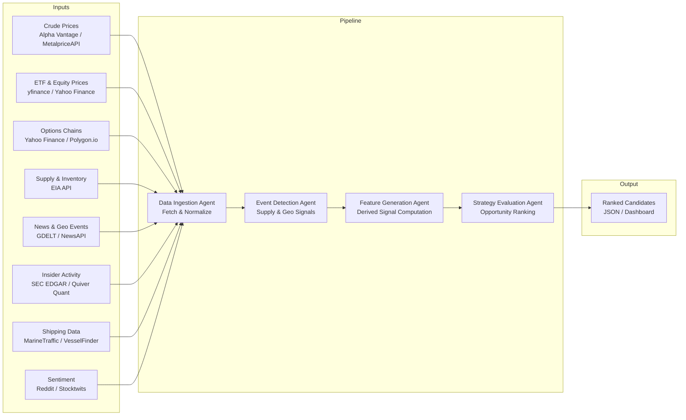
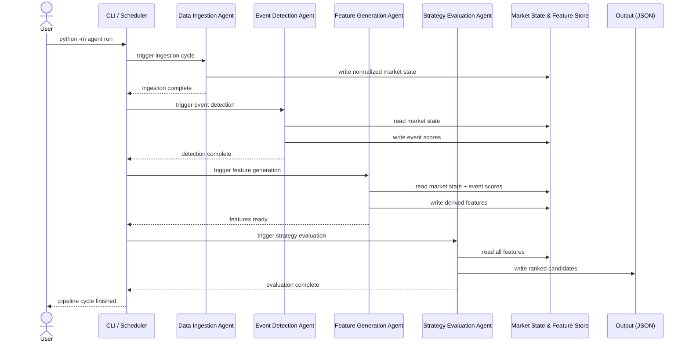

# Energy Options Opportunity Agent — User Guide

> **Version 1.0 • March 2026**
> This guide walks you through installing, configuring, and running the full Energy Options Opportunity Agent pipeline. It assumes you are comfortable with Python 3 and a Unix-style command line but are new to this project.

---

## Table of Contents

1. [Overview](#overview)
2. [Prerequisites](#prerequisites)
3. [Setup & Configuration](#setup--configuration)
4. [Running the Pipeline](#running-the-pipeline)
5. [Interpreting the Output](#interpreting-the-output)
6. [Troubleshooting](#troubleshooting)

---

## Overview

The **Energy Options Opportunity Agent** is an autonomous, modular Python pipeline that detects volatility mispricing in oil-related instruments and surfaces ranked options trading candidates. It is designed for a single contributor running on local hardware or a low-cost cloud VM.

### What the pipeline does

The system ingests raw market data, supply signals, news, and alternative datasets, then processes them through four loosely coupled agents that communicate via a shared **market state object** and a **derived features store**.



### In-scope instruments

| Category | Instruments |
|---|---|
| Crude futures | Brent Crude, WTI (`CL=F`) |
| ETFs | USO, XLE |
| Energy equities | Exxon Mobil (XOM), Chevron (CVX) |

### In-scope option structures (MVP)

| Structure | Enum value |
|---|---|
| Long straddle | `long_straddle` |
| Call spread | `call_spread` |
| Put spread | `put_spread` |
| Calendar spread | `calendar_spread` |

> **Note:** Automated trade execution is explicitly out of scope. The system is **advisory only**.

---

## Prerequisites

### System requirements

| Requirement | Minimum |
|---|---|
| Python | 3.10+ |
| RAM | 2 GB |
| Disk | 10 GB (for 6–12 months of historical data) |
| OS | Linux, macOS, or Windows (WSL2 recommended) |
| Network | Outbound HTTPS to data provider APIs |

### Python dependencies

Install dependencies from the project's `requirements.txt`:

```bash
pip install -r requirements.txt
```

Key packages used by the pipeline include:

| Package | Purpose |
|---|---|
| `yfinance` | ETF, equity, and options data |
| `requests` | Generic HTTP calls to EIA, GDELT, NewsAPI, etc. |
| `pandas` / `numpy` | Data normalization and feature computation |
| `pydantic` | Market state and output schema validation |
| `apscheduler` | Scheduling cadenced data refreshes |
| `python-dotenv` | Loading environment variables from `.env` |

### External API accounts

All required data sources are free or free-tier. Obtain credentials before proceeding:

| Source | Sign-up URL | Notes |
|---|---|---|
| Alpha Vantage | `https://www.alphavantage.co/support/#api-key` | Free tier, rate-limited |
| MetalpriceAPI | `https://metalpriceapi.com/` | Alternative crude price feed |
| Polygon.io | `https://polygon.io/` | Free tier for options data |
| EIA API | `https://www.eia.gov/opendata/` | No account needed; API key via registration |
| NewsAPI | `https://newsapi.org/register` | Free tier (100 req/day) |
| SEC EDGAR | No key required | Public endpoint |
| Quiver Quant | `https://www.quiverquant.com/` | Free/limited tier |
| GDELT | No key required | Public dataset |
| MarineTraffic / VesselFinder | `https://www.marinetraffic.com/` | Free tier |
| Reddit API | `https://www.reddit.com/prefs/apps` | OAuth2 credentials |
| Stocktwits | `https://api.stocktwits.com/developers` | Free public API |

---

## Setup & Configuration

### 1. Clone the repository

```bash
git clone https://github.com/your-org/energy-options-agent.git
cd energy-options-agent
```

### 2. Create and activate a virtual environment

```bash
python -m venv .venv
source .venv/bin/activate        # macOS / Linux
# .venv\Scripts\activate.bat     # Windows cmd
# .venv\Scripts\Activate.ps1     # Windows PowerShell
```

### 3. Install dependencies

```bash
pip install --upgrade pip
pip install -r requirements.txt
```

### 4. Configure environment variables

Copy the provided template and populate it with your credentials:

```bash
cp .env.example .env
```

Open `.env` in your editor and fill in each value. The full set of supported variables is listed below.

#### Environment variable reference

| Variable | Required | Description | Example value |
|---|---|---|---|
| `ALPHA_VANTAGE_API_KEY` | Yes (Phase 1) | API key for Alpha Vantage crude price feed | `ABCDEF123456` |
| `METALPRICE_API_KEY` | Optional | Fallback crude price feed | `xyz987` |
| `POLYGON_API_KEY` | Yes (Phase 1) | Polygon.io key for options chain data | `pqr456` |
| `EIA_API_KEY` | Yes (Phase 2) | EIA API key for inventory/refinery data | `abc123def456` |
| `NEWS_API_KEY` | Yes (Phase 2) | NewsAPI key for geo/event headlines | `newskey789` |
| `QUIVER_API_KEY` | Optional (Phase 3) | Quiver Quant key for insider activity | `qvr111` |
| `REDDIT_CLIENT_ID` | Optional (Phase 3) | Reddit OAuth2 client ID | `rdt_client_id` |
| `REDDIT_CLIENT_SECRET` | Optional (Phase 3) | Reddit OAuth2 client secret | `rdt_secret` |
| `REDDIT_USER_AGENT` | Optional (Phase 3) | Reddit API user agent string | `energy-agent/1.0` |
| `MARINE_TRAFFIC_API_KEY` | Optional (Phase 3) | MarineTraffic free-tier key | `mt_key_abc` |
| `DATA_DIR` | Yes | Local path for persistent raw and derived data storage | `./data` |
| `OUTPUT_DIR` | Yes | Directory where ranked candidate JSON files are written | `./output` |
| `LOG_LEVEL` | No | Logging verbosity (`DEBUG`, `INFO`, `WARNING`, `ERROR`) | `INFO` |
| `MARKET_DATA_REFRESH_MINUTES` | No | Cadence (minutes) for market data ingestion | `5` |
| `SLOW_FEED_REFRESH_HOURS` | No | Cadence (hours) for EIA / EDGAR feeds | `24` |
| `HISTORY_RETENTION_DAYS` | No | Days of historical data to retain (180–365 recommended) | `365` |
| `EDGE_SCORE_THRESHOLD` | No | Minimum edge score to include a candidate in output (0.0–1.0) | `0.20` |

> **Tip:** Variables marked **Optional (Phase 3)** are only consumed once you have integrated Phase 3 alternative signals. The pipeline tolerates missing optional keys gracefully and disables the corresponding data source rather than failing.

#### Minimal `.env` for a Phase 1 run

```dotenv
ALPHA_VANTAGE_API_KEY=your_alpha_vantage_key
POLYGON_API_KEY=your_polygon_key
DATA_DIR=./data
OUTPUT_DIR=./output
LOG_LEVEL=INFO
MARKET_DATA_REFRESH_MINUTES=5
HISTORY_RETENTION_DAYS=365
EDGE_SCORE_THRESHOLD=0.20
```

### 5. Initialise the data directory

Run the bootstrap command to create local storage directories and verify connectivity to enabled data sources:

```bash
python -m agent bootstrap
```

Expected output:

```
[INFO] Creating data directories at ./data ...
[INFO] Creating output directory at ./output ...
[INFO] Checking Alpha Vantage connectivity ... OK
[INFO] Checking Polygon.io connectivity     ... OK
[INFO] EIA API key not set — supply feed disabled.
[INFO] Bootstrap complete.
```

---

## Running the Pipeline

### Pipeline execution flow



### Single pipeline run (one-shot)

Execute the full four-agent pipeline once and write results to `OUTPUT_DIR`:

```bash
python -m agent run
```

To override the output directory for a single run:

```bash
python -m agent run --output-dir /tmp/agent_results
```

### Running individual agents

Each agent can be invoked independently, which is useful for debugging or partial refreshes:

```bash
# Step 1 — ingest and normalize market data
python -m agent run --agent ingestion

# Step 2 — detect supply and geopolitical events
python -m agent run --agent events

# Step 3 — compute derived features
python -m agent run --agent features

# Step 4 — evaluate and rank strategies
python -m agent run --agent strategy
```

> **Note:** Agents read from and write to the shared feature store. Running `strategy` in isolation without a prior `ingestion` → `events` → `features` sequence will use the most recently persisted state.

### Continuous / scheduled mode

To run the pipeline on a cadenced schedule (driven by `MARKET_DATA_REFRESH_MINUTES`):

```bash
python -m agent schedule
```

The scheduler will:

1. Refresh market data (crude prices, ETF/equity, options chains) on the minutes cadence defined by `MARKET_DATA_REFRESH_MINUTES`.
2. Refresh slow feeds (EIA, EDGAR) according to `SLOW_FEED_REFRESH_HOURS`.
3. Re-run event detection, feature generation, and strategy evaluation after each data refresh.

To run the scheduler as a background process:

```bash
nohup python -m agent schedule > logs/agent.log 2>&1 &
```

Or with Docker (if a `Dockerfile` is provided):

```bash
docker build -t energy-options-agent .
docker run -d \
  --env-file .env \
  -v $(pwd)/data:/app/data \
  -v $(pwd)/output:/app/output \
  energy-options-agent
```

### Dry-run mode

Runs the full pipeline but suppresses writing to `OUTPUT_DIR`. Useful for validating configuration:

```bash
python -m agent run --dry-run
```

### Logging

Logs are written to stdout and to `logs/agent.log`. Adjust verbosity via the `LOG_LEVEL` environment variable or the `--log-level` flag:

```bash
python -m agent run --log-level DEBUG
```

---

## Interpreting the Output

### Output location

After each pipeline cycle, ranked candidate files are written to `OUTPUT_DIR` as newline-delimited JSON (`.jsonl`):

```
output/
└── candidates_2026-03-15T14:32:00Z.jsonl
```

Each line in the file is a single strategy candidate object.

### Output schema

| Field | Type | Description |
|---|---|---|
| `instrument` | `string` | Target instrument, e.g. `USO`, `XLE`, `CL=F` |
| `structure` | `enum` | `long_straddle` \| `call_spread` \| `put_spread` \| `calendar_spread` |
| `expiration` | `integer` (days) | Target expiration in calendar days from evaluation date |
| `edge_score` | `float` [0.0–1.0] | Composite opportunity score; higher = stronger signal confluence |
| `signals` | `object` | Map of contributing signals and their qualitative values |
| `generated_at` | ISO 8601 datetime | UTC timestamp of candidate generation |

### Example candidate

```json
{
  "instrument": "USO",
  "structure": "long_straddle",
  "expiration": 30,
  "edge_score": 0.47,
  "signals": {
    "tanker_disruption_index": "high",
    "volatility_gap": "positive",
    "narrative_velocity": "rising"
  },
  "generated_at": "2026-03-15T14:32:00Z"
}
```

### Reading the edge score

| `edge_score` range | Interpretation |
|---|---|
| 0.00 – 0.19 | Weak / below threshold (filtered out by default) |
| 0.20 – 0.39 | Low confluence; monitor only |
| 0.40 – 0.59 | Moderate confluence; worth further review |
| 0.60 – 0.79 | Strong confluence; primary candidates |
| 0.80 – 1.00 | Very strong; highest-priority candidates |

> The default `EDGE_SCORE_THRESHOLD` of `0.20` suppresses candidates below that floor. Lower the threshold to see more candidates; raise it to reduce noise.

### Understanding the signals map

The `signals` object explains **why** a candidate was generated. Each key is a derived feature computed by the Feature Generation Agent:

| Signal key | Source agent | What a non-neutral value means |
|---|---|---|
| `volatility_gap` | Feature Generation | Implied volatility is higher (`positive`) or lower (`negative`) than realized vol; `positive` suggests the market is pricing in more risk than has been observed |
| `futures_curve_steepness` | Feature Generation | Degree of contango or backwardation in the crude futures curve |
| `supply_shock_probability` | Feature Generation | Estimated probability of a near-term supply disruption |
| `sector_dispersion` | Feature Generation | Spread between energy sub-sector returns; high dispersion can signal rotational stress |
| `insider_conviction_score` | Feature Generation | Aggregated insider buy/sell activity in covered equities |
| `narrative_velocity` | Feature Generation | Rate of change in news/social headline volume around energy events |
| `tanker_disruption_index