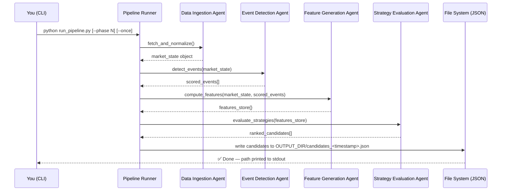

# Energy Options Opportunity Agent — User Guide

> **Version 1.0 · March 2026**
> This guide walks you through installing, configuring, and running the full pipeline end-to-end. It assumes familiarity with Python (3.10+) and standard CLI tools but no prior knowledge of this project.

---

## Table of Contents

1. [Overview](#overview)
2. [Prerequisites](#prerequisites)
3. [Setup & Configuration](#setup--configuration)
4. [Running the Pipeline](#running-the-pipeline)
5. [Interpreting the Output](#interpreting-the-output)
6. [Troubleshooting](#troubleshooting)

---

## Overview

The **Energy Options Opportunity Agent** is an autonomous, modular Python pipeline that surfaces options trading opportunities driven by oil market instability. It ingests market data, supply signals, news events, and alternative datasets, then produces structured, ranked candidate option strategies — all without executing any trades.

### How the pipeline works

The system is composed of four loosely coupled agents that communicate through a shared **market state object** and a **derived features store**. Data flows in one direction only:


| Agent | Role | Key Outputs |
|---|---|---|
| **Data Ingestion** | Fetch & normalize raw feeds | Unified market state object |
| **Event Detection** | Monitor news & geo signals | Confidence/intensity-scored events |
| **Feature Generation** | Compute derived signals | Volatility gaps, curve steepness, narrative velocity, etc. |
| **Strategy Evaluation** | Rank opportunity candidates | Edge-scored, explainable strategy recommendations |

### In-scope instruments (MVP)

| Category | Instruments |
|---|---|
| Crude futures | Brent Crude, WTI (`CL=F`) |
| ETFs | USO, XLE |
| Energy equities | Exxon Mobil (XOM), Chevron (CVX) |

### In-scope option structures (MVP)

`long_straddle` · `call_spread` · `put_spread` · `calendar_spread`

> ⚠️ **Advisory only.** The system does not execute trades. All output is for informational and analytical purposes.

---

## Prerequisites

### System requirements

| Requirement | Minimum |
|---|---|
| Python | 3.10 or later |
| Operating system | Linux, macOS, or Windows (WSL2 recommended) |
| RAM | 2 GB (4 GB recommended for full feature set) |
| Disk | 5 GB free (for 6–12 months of historical data) |
| Network | Outbound HTTPS access to data provider APIs |

### Required tools

```bash
# Verify your Python version
python --version        # must be 3.10+

# Verify pip
pip --version

# Optional but recommended: virtual environment tooling
python -m venv --help
```

### API accounts

You will need free-tier accounts for the following services before running the pipeline. All are zero-cost at the access levels required by MVP phases 1–3.

| Service | Used For | Sign-up URL | Required Phase |
|---|---|---|---|
| Alpha Vantage or MetalpriceAPI | WTI / Brent spot & futures prices | `alphavantage.co` | Phase 1 |
| Yahoo Finance (`yfinance`) | ETF / equity prices & options chains | No key required | Phase 1 |
| Polygon.io | Options chains (supplementary) | `polygon.io` | Phase 1 |
| EIA API | Inventory & refinery utilization | `eia.gov/opendata` | Phase 2 |
| NewsAPI | News & geopolitical events | `newsapi.org` | Phase 2 |
| GDELT | Geopolitical event data | No key required | Phase 2 |
| SEC EDGAR | Insider activity | No key required | Phase 3 |
| Quiver Quant | Insider conviction scores | `quiverquant.com` | Phase 3 |
| MarineTraffic or VesselFinder | Tanker / shipping flows | `marinetraffic.com` | Phase 3 |

---

## Setup & Configuration

### 1. Clone the repository

```bash
git clone https://github.com/your-org/energy-options-agent.git
cd energy-options-agent
```

### 2. Create and activate a virtual environment

```bash
python -m venv .venv

# macOS / Linux
source .venv/bin/activate

# Windows (PowerShell)
.venv\Scripts\Activate.ps1
```

### 3. Install dependencies

```bash
pip install --upgrade pip
pip install -r requirements.txt
```

### 4. Configure environment variables

The pipeline reads all secrets and tunable parameters from environment variables. Copy the provided template and fill in your values:

```bash
cp .env.example .env
```

Then open `.env` in your editor and populate each variable. The full reference table is below.

#### Environment variable reference

| Variable | Required | Default | Description |
|---|---|---|---|
| `ALPHA_VANTAGE_API_KEY` | Phase 1 | — | API key for Alpha Vantage crude price feed |
| `METALPRICE_API_KEY` | Phase 1† | — | Alternative to Alpha Vantage for spot prices |
| `POLYGON_API_KEY` | Phase 1 | — | Polygon.io key for supplementary options chain data |
| `EIA_API_KEY` | Phase 2 | — | EIA Open Data API key for inventory & refinery data |
| `NEWS_API_KEY` | Phase 2 | — | NewsAPI.org key for news and geo-event ingestion |
| `QUIVER_QUANT_API_KEY` | Phase 3 | — | Quiver Quant key for insider conviction scores |
| `MARINETRAFFIC_API_KEY` | Phase 3 | — | MarineTraffic key for tanker flow data |
| `PIPELINE_PHASE` | No | `1` | Active MVP phase (`1`, `2`, or `3`). Controls which agents and data sources are enabled. |
| `OUTPUT_DIR` | No | `./output` | Directory where JSON candidate files are written |
| `HISTORY_DIR` | No | `./data/history` | Directory for persisted raw and derived historical data |
| `RETENTION_DAYS` | No | `365` | Days of historical data to retain (180–365 recommended) |
| `MARKET_DATA_INTERVAL_MINUTES` | No | `5` | Polling cadence for minute-level market data feeds |
| `SLOW_FEED_INTERVAL_HOURS` | No | `24` | Polling cadence for daily/weekly feeds (EIA, EDGAR) |
| `LOG_LEVEL` | No | `INFO` | Logging verbosity: `DEBUG`, `INFO`, `WARNING`, `ERROR` |
| `TZ` | No | `UTC` | Timezone for all timestamps. Keep as `UTC` unless you have a specific reason to change it. |

> † Use either `ALPHA_VANTAGE_API_KEY` **or** `METALPRICE_API_KEY` for crude prices, not both.

#### Example `.env` file

```dotenv
# --- Crude prices (choose one) ---
ALPHA_VANTAGE_API_KEY=your_alpha_vantage_key_here

# --- Options chains ---
POLYGON_API_KEY=your_polygon_key_here

# --- Phase 2: Supply & events ---
EIA_API_KEY=your_eia_key_here
NEWS_API_KEY=your_newsapi_key_here

# --- Phase 3: Alternative signals ---
QUIVER_QUANT_API_KEY=your_quiver_key_here
MARINETRAFFIC_API_KEY=your_marinetraffic_key_here

# --- Pipeline behaviour ---
PIPELINE_PHASE=1
OUTPUT_DIR=./output
HISTORY_DIR=./data/history
RETENTION_DAYS=365
MARKET_DATA_INTERVAL_MINUTES=5
SLOW_FEED_INTERVAL_HOURS=24
LOG_LEVEL=INFO
TZ=UTC
```

### 5. Initialise the data directories

```bash
python scripts/init_storage.py
```

This creates the `OUTPUT_DIR` and `HISTORY_DIR` paths and validates that all required environment variables for the configured `PIPELINE_PHASE` are present. Errors are reported before the pipeline attempts to start.

---

## Running the Pipeline

### Pipeline execution sequence



### One-shot run (recommended for first use)

Run the pipeline once, write output, and exit:

```bash
python run_pipeline.py --once
```

### Continuous polling mode

Run the pipeline on the configured cadence until stopped:

```bash
python run_pipeline.py
```

> Stop with `Ctrl+C`. The pipeline handles `SIGINT` gracefully and flushes any in-progress state before exiting.

### Override the active phase at runtime

You can override `PIPELINE_PHASE` at the command line without editing `.env`:

```bash
# Run with Phase 2 signals enabled
python run_pipeline.py --once --phase 2
```

### Run a single agent in isolation

Each agent exposes a standalone entry point, useful for debugging or incremental development:

```bash
# Data Ingestion only
python -m agents.data_ingestion

# Event Detection only (requires a cached market state)
python -m agents.event_detection

# Feature Generation only (requires cached market state + events)
python -m agents.feature_generation

# Strategy Evaluation only (requires a cached features store)
python -m agents.strategy_evaluation
```

### Docker (optional)

A `Dockerfile` is included for running the pipeline in a container. Build and run:

```bash
# Build image
docker build -t energy-options-agent:latest .

# Run one-shot with environment variables from .env
docker run --env-file .env energy-options-agent:latest python run_pipeline.py --once

# Run in continuous polling mode, mount output directory
docker run --env-file .env \
  -v "$(pwd)/output:/app/output" \
  -v "$(pwd)/data:/app/data" \
  energy-options-agent:latest
```

---

## Interpreting the Output

### Output file location and naming

Each completed pipeline run writes one JSON file to `OUTPUT_DIR`:

```
output/
└── candidates_2026-03-15T14:32:00Z.json
```

### Output schema

Each file contains an array of strategy candidate objects. Every field is always present; `signals` keys vary depending on which pipeline phase generated the candidate.

| Field | Type | Description |
|---|---|---|
| `instrument` | `string` | Target instrument, e.g. `"USO"`, `"XLE"`, `"CL=F"` |
| `structure` | `enum` | `long_straddle` · `call_spread` · `put_spread` · `calendar_spread` |
| `expiration` | `integer` (days) | Calendar days from evaluation date to target expiration |
| `edge_score` | `float` [0.0–1.0] | Composite opportunity score. Higher = stronger signal confluence. |
| `signals` | `object` | Map of contributing signal names to qualitative values |
| `generated_at` | ISO 8601 datetime | UTC timestamp of candidate generation |

### Example output

```json
[
  {
    "instrument": "USO",
    "structure": "long_straddle",
    "expiration": 30,
    "edge_score": 0.47,
    "signals": {
      "tanker_disruption_index": "high",
      "volatility_gap": "positive",
      "narrative_velocity": "rising"
    },
    "generated_at": "2026-03-15T14:32:00Z"
  },
  {
    "instrument": "XLE",
    "structure": "call_spread",
    "expiration": 21,
    "edge_score": 0.61,
    "signals": {
      "volatility_gap": "positive",
      "futures_curve_steepness": "steep",
      "supply_shock_probability": "elevated"
    },
    "generated_at": "2026-03-15T14:32:00Z"
  }
]
```

### Understanding the edge score

The `edge_score` is a composite float between `0.0` and `1.0` that reflects the confluence of active signals for a given candidate. Use it to prioritise which candidates to investigate further — it is **not** a probability of profit.

| Score range | Suggested interpretation |
|---|---|
| `0.00 – 0.29` | Weak signal confluence; low priority |
| `0.30 – 0.49` | Moderate signal confluence; worth monitoring |
| `0.50 – 0.69` | Strong signal confluence; elevated opportunity |
| `0.70 – 1.00` | Very strong signal confluence; high priority review |

### Signal key reference

The following signal keys may appear in the `signals` object, depending on the active pipeline phase:

| Signal key | Source agent | Phase | Description |
|---|---|---|---|
| `volatility_gap` | Feature Generation | 1 | Realized vs. implied volatility divergence |
| `futures_curve_steepness` | Feature Generation | 1 | Steepness of the oil futures term structure |
| `sector_dispersion` | Feature Generation | 1 | Cross-instrument volatility dispersion in energy sector |
| `supply_shock_probability` | Feature Generation | 2 | Probability of a near-term supply disruption |
| `tanker_disruption_index` | Event Detection | 2–3 | Severity of detected tanker / chokepoint disruptions |
| `narrative_velocity` | Feature Generation | 3 | Rate of acceleration in energy-related news headlines |
| `insider_conviction_score` | Feature Generation | 3 | Strength and recency of insider trading signals |

### Consuming output downstream

The JSON output is compatible with any tool that can read JSON files, including:

- **thinkorswim** thinkScript or custom watchlist import (convert to CSV with `scripts/to_csv.py`)
- Any JSON-capable dashboard (Grafana, custom web UI)
- Direct Python consumption:

```python
import json
from pathlib import Path

candidates = json.loads(Path("output/candidates_2026-03-15T14:32:00Z.json").read_text())

# Filter to candidates with edge_score >= 0.5, sorted descending
top_candidates = sorted(
    [c for c in candidates if c["edge_score"] >= 0.5],
    key=lambda c: c["edge_score"],
    reverse=True,
)

for c in top_candidates