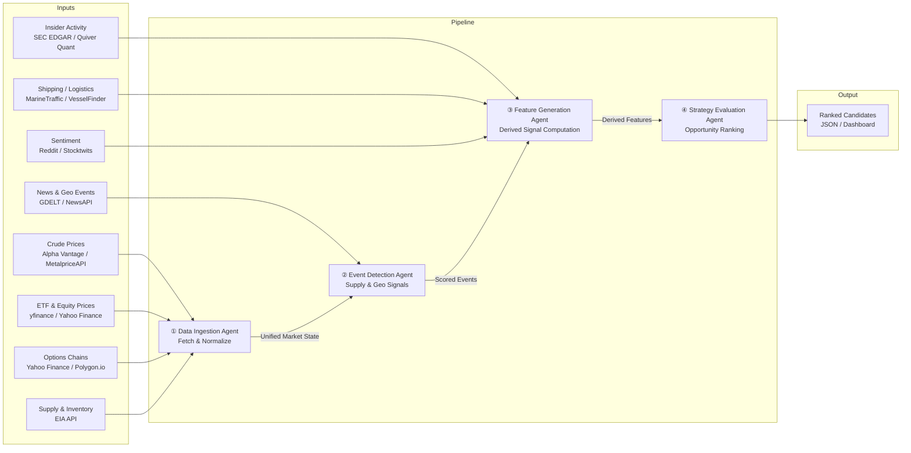
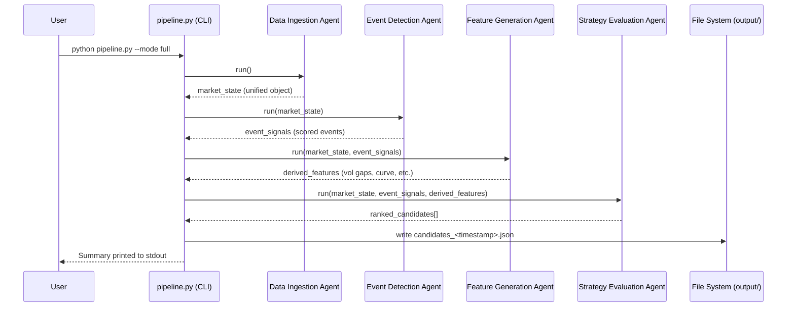

# Energy Options Opportunity Agent — User Guide

> **Version 1.0 • March 2026**
> This guide covers the full pipeline: setup, configuration, execution, output interpretation, and troubleshooting.

---

## Table of Contents

1. [Overview](#overview)
2. [Prerequisites](#prerequisites)
3. [Setup & Configuration](#setup--configuration)
4. [Running the Pipeline](#running-the-pipeline)
5. [Interpreting the Output](#interpreting-the-output)
6. [Troubleshooting](#troubleshooting)

---

## Overview

The **Energy Options Opportunity Agent** is a modular, autonomous Python pipeline that identifies options trading opportunities driven by oil market instability. It consumes market data, supply signals, news events, and alternative datasets, then produces structured, ranked candidate options strategies with full signal explainability.

### Pipeline Architecture

The system is composed of four loosely coupled agents. Data flows **unidirectionally** through the pipeline:



### Agents at a Glance

| Agent | Role | Key Outputs |
|---|---|---|
| **Data Ingestion** | Fetch & Normalize | Unified market state object; historical store |
| **Event Detection** | Supply & Geo Signals | Events with confidence and intensity scores |
| **Feature Generation** | Derived Signal Computation | Volatility gaps, curve steepness, narrative velocity, etc. |
| **Strategy Evaluation** | Opportunity Ranking | Ranked candidates with edge scores and signal references |

### In-Scope Instruments (MVP)

| Category | Instruments |
|---|---|
| Crude Futures | Brent Crude, WTI (`CL=F`) |
| ETFs | USO, XLE |
| Energy Equities | Exxon Mobil (XOM), Chevron (CVX) |

### In-Scope Option Structures (MVP)

- Long straddles
- Call / put spreads
- Calendar spreads

> **Advisory only.** Automated trade execution is explicitly out of scope for the MVP. All output is intended for human review.

---

## Prerequisites

### System Requirements

| Requirement | Minimum |
|---|---|
| Python | 3.10 or later |
| Operating System | Linux, macOS, or Windows (WSL2 recommended) |
| RAM | 2 GB |
| Disk | 5 GB (for 6–12 months of historical data) |
| Network | Outbound HTTPS access to all data source APIs |

### Required Knowledge

- Comfortable running Python scripts and CLI commands
- Familiarity with virtual environments (`venv` or `conda`)
- Basic understanding of options terminology (implied volatility, strikes, expiration)

### API Accounts

You must obtain API keys or free-tier access for the following services before running the pipeline. All sources are free or low-cost.

| Data Layer | Source | Sign-up URL | Cost |
|---|---|---|---|
| Crude Prices | Alpha Vantage | https://www.alphavantage.co | Free |
| Crude Prices (alt) | MetalpriceAPI | https://metalpriceapi.com | Free |
| ETF / Equity | yfinance (Yahoo Finance) | No key required | Free |
| Options Chains | Polygon.io | https://polygon.io | Free / Limited |
| Supply & Inventory | EIA API | https://www.eia.gov/opendata | Free |
| News & Geo Events | NewsAPI | https://newsapi.org | Free |
| News & Geo Events (alt) | GDELT | https://www.gdeltproject.org | Free |
| Insider Activity | SEC EDGAR | https://efts.sec.gov/LATEST/search-index | Free |
| Insider Activity (alt) | Quiver Quant | https://www.quiverquant.com | Free / Limited |
| Shipping / Logistics | MarineTraffic | https://www.marinetraffic.com | Free tier |
| Sentiment | Reddit (PRAW) | https://www.reddit.com/prefs/apps | Free |
| Sentiment (alt) | Stocktwits | https://api.stocktwits.com/developers | Free |

---

## Setup & Configuration

### 1. Clone the Repository

```bash
git clone https://github.com/your-org/energy-options-agent.git
cd energy-options-agent
```

### 2. Create and Activate a Virtual Environment

```bash
python3 -m venv .venv
source .venv/bin/activate        # Linux / macOS
# .venv\Scripts\activate         # Windows (PowerShell)
```

### 3. Install Dependencies

```bash
pip install --upgrade pip
pip install -r requirements.txt
```

### 4. Configure Environment Variables

All runtime configuration is provided through environment variables. Copy the example file and populate it with your credentials:

```bash
cp .env.example .env
```

Then open `.env` in your editor and fill in the values described in the table below.

#### Environment Variable Reference

| Variable | Required | Default | Description |
|---|---|---|---|
| `ALPHA_VANTAGE_API_KEY` | Yes | — | API key for Alpha Vantage crude price feed |
| `METALPRICE_API_KEY` | No | — | API key for MetalpriceAPI (fallback crude feed) |
| `POLYGON_API_KEY` | No | — | API key for Polygon.io options chain data |
| `EIA_API_KEY` | Yes | — | API key for EIA supply and inventory data |
| `NEWS_API_KEY` | Yes | — | API key for NewsAPI geopolitical/news events |
| `QUIVER_QUANT_API_KEY` | No | — | API key for Quiver Quant insider activity |
| `MARINETRAFFIC_API_KEY` | No | — | API key for MarineTraffic shipping data |
| `REDDIT_CLIENT_ID` | No | — | Reddit PRAW application client ID |
| `REDDIT_CLIENT_SECRET` | No | — | Reddit PRAW application client secret |
| `REDDIT_USER_AGENT` | No | `energy-agent/1.0` | Reddit PRAW user agent string |
| `STOCKTWITS_API_KEY` | No | — | Stocktwits API key for sentiment feed |
| `DATA_DIR` | No | `./data` | Root directory for raw and derived data storage |
| `OUTPUT_DIR` | No | `./output` | Directory where ranked JSON candidates are written |
| `HISTORY_DAYS` | No | `365` | Days of historical data to retain (180–365 recommended) |
| `MARKET_DATA_INTERVAL_SECONDS` | No | `60` | Polling cadence for minute-level market data feeds |
| `LOG_LEVEL` | No | `INFO` | Logging verbosity: `DEBUG`, `INFO`, `WARNING`, `ERROR` |
| `PIPELINE_MODE` | No | `full` | Run mode: `full`, `ingest_only`, `features_only`, `evaluate_only` |
| `MIN_EDGE_SCORE` | No | `0.30` | Minimum edge score threshold for a candidate to appear in output |
| `MAX_CANDIDATES` | No | `20` | Maximum number of ranked candidates written per run |

> **Tip:** Variables marked **No** under *Required* activate optional data layers (shipping, insider, sentiment). The pipeline degrades gracefully when these keys are absent — see [Troubleshooting](#troubleshooting).

#### Example `.env` File

```dotenv
# Core credentials (required)
ALPHA_VANTAGE_API_KEY=YOUR_AV_KEY_HERE
EIA_API_KEY=YOUR_EIA_KEY_HERE
NEWS_API_KEY=YOUR_NEWSAPI_KEY_HERE

# Optional enrichment layers
POLYGON_API_KEY=YOUR_POLYGON_KEY_HERE
QUIVER_QUANT_API_KEY=YOUR_QUIVER_KEY_HERE
MARINETRAFFIC_API_KEY=YOUR_MT_KEY_HERE
REDDIT_CLIENT_ID=YOUR_REDDIT_CLIENT_ID
REDDIT_CLIENT_SECRET=YOUR_REDDIT_SECRET
REDDIT_USER_AGENT=energy-agent/1.0

# Runtime settings
DATA_DIR=./data
OUTPUT_DIR=./output
HISTORY_DAYS=365
MARKET_DATA_INTERVAL_SECONDS=60
LOG_LEVEL=INFO
PIPELINE_MODE=full
MIN_EDGE_SCORE=0.30
MAX_CANDIDATES=20
```

### 5. Initialise the Data Directory

Create the storage structure required for historical raw and derived data:

```bash
python scripts/init_storage.py
```

Expected output:

```
[INFO] Created directory: ./data/raw
[INFO] Created directory: ./data/derived
[INFO] Created directory: ./output
[INFO] Storage initialised successfully.
```

---

## Running the Pipeline

### Pipeline Execution Flow



### Full Pipeline Run

Run all four agents in sequence:

```bash
python pipeline.py --mode full
```

### Partial / Single-Agent Runs

Use `--mode` to run only a subset of the pipeline. This is useful for debugging or when feeding pre-computed intermediate data.

```bash
# Re-ingest raw market data only
python pipeline.py --mode ingest_only

# Regenerate features from cached market state
python pipeline.py --mode features_only

# Re-evaluate strategies using the latest cached features
python pipeline.py --mode evaluate_only
```

### Scheduled Continuous Execution

For production use, drive the pipeline on a regular cadence using `cron` (Linux/macOS) or Task Scheduler (Windows):

```bash
# Example: run the full pipeline every 5 minutes during market hours
crontab -e
```

```cron
*/5 9-17 * * 1-5 /path/to/.venv/bin/python /path/to/pipeline.py --mode full >> /var/log/energy-agent.log 2>&1
```

> **Note:** Market data refreshes on a minutes-level cadence. Slower feeds (EIA inventory, EDGAR insider filings) update daily or weekly; the pipeline applies the appropriate polling frequency per source automatically.

### Verbose / Debug Mode

```bash
python pipeline.py --mode full --log-level DEBUG
```

Or set `LOG_LEVEL=DEBUG` in your `.env` file for persistent debug output.

### Running Inside Docker

A `Dockerfile` and `docker-compose.yml` are provided for containerised deployment on a single VM or local machine:

```bash
# Build the image
docker build -t energy-options-agent:latest .

# Run with your .env file mounted
docker run --env-file .env \
  -v $(pwd)/data:/app/data \
  -v $(pwd)/output:/app/output \
  energy-options-agent:latest
```

---

## Interpreting the Output

### Output Location

After each run, candidates are written to the directory specified by `OUTPUT_DIR` (default: `./output`):

```
output/
└── candidates_2026-03-15T14:32:00Z.json
```

A `candidates_latest.json` symlink is also updated to always point to the most recent file.

### Output Schema

Each ranked candidate is a JSON object with the following fields:

| Field | Type | Description |
|---|---|---|
| `instrument` | `string` | Target instrument, e.g. `USO`, `XLE`, `CL=F` |
| `structure` | `enum` | Option structure: `long_straddle` \| `call_spread` \| `put_spread` \| `calendar_spread` |
| `expiration` | `integer` | Target expiration in calendar days from the evaluation date |
| `edge_score` | `float [0.0–1.0]` | Composite opportunity score; higher = stronger signal confluence |
| `signals` | `object` | Map of contributing signals and their current values |
| `generated_at` | `ISO 8601 datetime` | UTC timestamp of candidate generation |

### Example Candidate

```json
{
  "instrument": "USO",
  "structure": "long_straddle",
  "expiration": 30,
  "edge_score": 0.47,
  "signals": {
    "tanker_disruption_index": "high",
    "volatility_gap": "positive",
    "narrative_velocity": "rising"
  },
  "generated_at": "2026-03-15T14:32:00Z"
}
```

### Reading the Edge Score

The `edge_score` is the primary ranking signal. It is a composite of all contributing derived features, normalised to `[0.0, 1.0]`.

| Edge Score Range | Interpretation |
|---|---|
| `0.70 – 1.00` | Strong signal confluence — high-priority candidate |
| `0.50 – 0.69` | Moderate signal confluence — worth monitoring |
| `0.30 – 0.49` | Weak confluence — lower conviction, proceed with caution |
| `< 0.30` | Below threshold — filtered out by default (`MIN_EDGE_SCORE`) |

> Candidates are ordered by `edge_score` descending. Review the `signals` object for every candidate to understand **why** the score was assigned before acting on any recommendation.

### Contributing Signals Reference

The `signals` object may contain any of the following keys, depending on which data layers are active:

| Signal Key | Source Layer | Possible Values |
|---|---|---|
| `volatility_gap` | Feature Generation | `positive`, `negative`, `neutral` |
| `futures_curve_steepness` | Feature Generation | `contango`, `backwardation`, `flat` |
| `sector_dispersion` | Feature Generation | `high`, `moderate`, `low` |
| `insider_conviction_score` | Alternative Signals | `high`, `moderate`, `low` |
| `narrative_velocity` | Alternative Signals | `rising`, `stable`, `falling` |
| `supply_shock_probability` | Event Detection | `high`, `moderate`, `low` |
| `tanker_disruption_index` | Event Detection | `high`, `moderate`, `low` |
| `eia_inventory_surprise` | Event Detection | `bullish`, `bearish`, `neutral` |

###