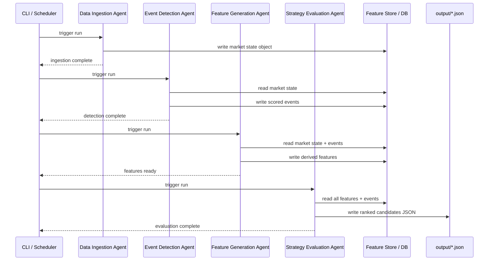

[Energy Options Opportunity Agent — User Guide]

Version: 1.0 — Mocked artifact (generated locally)

This developer-focused guide explains how to set up, configure, and run the Energy Options Opportunity Agent pipeline locally and in CI. It is a mocked output used for documentation and testing purposes — do not treat it as authoritative for production configuration. Use `scripts/run_doc_generation.py` to regenerate with the LLM when an API key is available.

---

## Table of contents

- Overview
- Prerequisites
- Setup & configuration
- Running the pipeline
- Output schema: `strategy_candidates`
- Troubleshooting & QA
- Regenerating this guide

---

## Overview

The Energy Options Opportunity Agent is a modular pipeline that ingests price, options, news, and supply signals, computes derived features and signals, and produces ranked candidate options strategies (Phase 1: long straddles, call spreads, put spreads). The pipeline is advisory only and does not execute trades.

Key pipeline agents (logical components):

- Data ingestion — fetches and normalizes feeds (prices, options, news, EIA, EDGAR).
- Event detection — surface supply/news events and assign confidence scores.
- Feature generation — compute volatility gaps, curve shape, and other derived signals.
- Strategy evaluation — score and rank `StrategyCandidate` objects and persist them.

## Prerequisites

- Python 3.10 or later
- Git and network access for external APIs
- Optional: Docker (for CI/integration tests)
- A working virtual environment (recommended)

Install runtime dependencies:

```bash
python -m venv .venv
.
source .venv/bin/activate  # macOS / Linux
# .venv\\Scripts\\activate   # Windows PowerShell
pip install -r requirements.txt
```

## Setup & configuration

1. Copy the example environment file and edit credentials:

```bash
cp .env.example .env
```

2. Minimum environment variables (example):

| Name | Required | Notes |
|---|---:|---|
| `ALPHA_VANTAGE_API_KEY` | ✅ | Crude price feed (or use an alternative) |
| `EIA_API_KEY` | ✅ | EIA supply & inventory data |
| `NEWS_API_KEY` | ✅ | Headline ingestion |
| `POLYGON_API_KEY` | ⬜ | Optional: improved options chains |

3. For doc-generation with the real LLM set `ANTHROPIC_API_KEY` (or chosen provider) in the environment before running `scripts/run_doc_generation.py`.

## Running the pipeline (developer mode)

Run the pipeline entrypoint or agent runner (examples depend on local CLI wiring in this repo):

```bash
# run a single evaluation cycle (development)
python -m agent.run --run-once

# run strategy evaluation unit (local)
python -m src.agents.strategy_evaluation.strategy_evaluation_agent
```

For CI/integration tests that rely on an ephemeral Postgres, set `CI=1` in the workflow and use the provided `.github` job definitions.

## Output schema: `strategy_candidates`

Phase 1 output schema (persisted to Postgres table `strategy_candidates`):

| Column | Type | Notes |
|---|---|---|
| `id` | BIGSERIAL PRIMARY KEY | Auto-increment ID |
| `instrument` | TEXT NOT NULL | e.g. `USO` |
| `structure` | TEXT NOT NULL | Enum: `long_straddle`, `call_spread`, `put_spread` |
| `expiration` | INTEGER NOT NULL | Unix timestamp or epoch day for expiry (see code comments) |
| `edge_score` | NUMERIC(5,4) NOT NULL | 0..1 normalized score |
| `signals` | JSONB NOT NULL | Signal breakdown used to compute the edge score |
| `generated_at` | TIMESTAMPTZ NOT NULL | UTC timestamp of candidate generation |

The repository includes an idempotent DDL at `db/schema.sql` which creates `strategy_candidates` with an index on `(generated_at DESC, edge_score DESC)`.

## Troubleshooting & QA

- No candidates produced: confirm API keys and `EDGE_SCORE_THRESHOLD` in `.env`.
- `HTTP 401` from feed: rotate/regenerate API key; never commit keys to Git.
- Integration tests failing locally: run with `CI=1` or use the workflow service containers defined in `.github/workflows`.

## Regenerating this guide (safe dev flow)

To regenerate using the project's doc-generation agent (requires an LLM key):

```bash
export ANTHROPIC_API_KEY="<your_key>"
export PYTHONPATH=.
python scripts/run_doc_generation.py --subject "full pipeline"
```

On Windows PowerShell:

```powershell
$env:ANTHROPIC_API_KEY = "<your_key>"
$env:PYTHONPATH = "."
python scripts/run_doc_generation.py --subject "full pipeline"
```

The script writes Markdown artifacts to `docs/generated/` by default.

---

Security note: this mocked guide intentionally includes no real secrets. Do not paste API keys, tokens, or private credentials into docs files.

If you'd like, I can (a) run the real generator once you export `ANTHROPIC_API_KEY` here, or (b) open a PR replacing the generated file with this mocked content. Which would you prefer?

This sets up tables for raw ingested data, derived features, detected events, and strategy candidates. Historical data is retained for the period defined by `HISTORICAL_RETENTION_DAYS`.

---

## Running the Pipeline

<<<<<<< HEAD
### Pipeline execution sequence



### Running a single full pipeline pass

Execute all four agents once in sequence:

```bash
python -m agent.cli run --once
```

You should see per-agent log lines followed by a summary:

```
2026-03-15T09:00:01Z [INFO] DataIngestionAgent  — fetched WTI=82.41, Brent=85.17
2026-03-15T09:00:03Z [INFO] DataIngestionAgent  — options chains loaded for USO, XLE, XOM, CVX
2026-03-15T09:00:04Z [INFO] EventDetectionAgent — 3 events detected (max intensity: 0.74)
2026-03-15T09:00:05Z [INFO] FeatureGenerationAgent — volatility_gap=positive, curve_steepness=contango
2026-03-15T09:00:06Z [INFO] StrategyEvaluationAgent — 5 candidates generated, top edge_score=0.71
2026-03-15T09:00:06Z [INFO] Output written → ./output/candidates_20260315T090006Z.json
```

### Running the pipeline continuously (scheduled mode)

Start the scheduler to refresh market data every `PIPELINE_CADENCE_MINUTES` minutes:

```bash
python -m agent.cli run --continuous
```

The scheduler runs the fast data cycle (prices, options) at the configured minutes-level cadence and the slow cycle (EIA, EDGAR) once every `SLOW_FEED_CADENCE_HOURS` hours. Press `Ctrl+C` to stop.

### Running individual agents

You can run any single agent in isolation for debugging or incremental testing:

```bash
# Data Ingestion only
python -m agent.cli run-agent ingestion

# Event Detection only (reads existing market state)
python -m agent.cli run-agent event-detection

# Feature Generation only (reads existing market state + events)
python -m agent.cli run-agent features

# Strategy Evaluation only (reads existing features)
python -m agent.cli run-agent strategy
```

### Running with Docker

A `Dockerfile` and `docker-compose.yml` are provided for container deployment:

```bash
# Build the image
docker build -t energy-options-agent:latest .

# Run with your .env file mounted
docker run --rm \
  --env-file .env \
  -v "$(pwd)/output:/app/output" \
  -v "$(pwd)/data:/app/data" \
  energy-options-agent:latest \
  python -m agent.cli run --continuous
```

Or use Compose:

```bash
docker compose up
```

### Phased activation

The pipeline supports four development phases. Enable phases progressively by setting the `PIPELINE_PHASE` variable:

```bash
# .env
PIPELINE_PHASE=2   # 1 | 2 | 3 | 4
```

| Phase | Name | Activated signals |
|---|---|---|
| `1` | Core Market Signals & Options | WTI/Brent prices, USO/XLE options surface, IV, long straddles, call/put spreads |
| `2` | Supply & Event Augmentation | + EIA inventory/refinery utilization, GDELT/NewsAPI event detection, supply disruption index |
| `3` | Alternative / Contextual Signals | + Insider trades (EDGAR/Quiver), narrative velocity (Reddit/Stocktwits), shipping data (MarineTraffic), cross-sector correlation |
| `4` | High-Fidelity Enhancements | + OPIS/regional pricing, exotic multi-legged structures *(deferred; see future roadmap)* |
=======
### Pipeline execution modes

The pipeline supports two modes:

| Mode | Command | Use case |
|---|---|---|
| **Single run** | `python -m agent.run --once` | Ad-hoc evaluation; runs each agent once and exits |
| **Continuous** | `python -m agent.run` | Scheduled daemon; respects cadence settings in `.env` |

### Single run (recommended for first-time setup)

```bash
python -m agent.run --once
```

This executes all four agents in sequence:

```
[INFO] [1/4] Data Ingestion Agent — fetching market state...
[INFO] [2/4] Event Detection Agent — scanning news and supply feeds...
[INFO] [3/4] Feature Generation Agent — computing derived signals...
[INFO] [4/4] Strategy Evaluation Agent — ranking candidates...
[INFO] Output written to: ./output/candidates_2026-03-15T14:32:00Z.json
```

### Continuous / scheduled run

```bash
python -m agent.run
```

The scheduler honours the cadence settings from `.env`:

| Feed layer | Default cadence |
|---|---|
| Crude prices, ETF / equity prices | Every 5 minutes |
| Options chains | Daily |
| EIA inventory | Weekly |
| SEC EDGAR insider activity | Daily |
| GDELT / NewsAPI | Continuous / daily |
| Shipping / narrative sentiment | Continuous |

Press `Ctrl+C` to stop the daemon gracefully.

### Running individual agents

Each agent can be run independently for development or debugging:

```bash
# Data Ingestion Agent only
python -m agent.ingestion

# Event Detection Agent only
python -m agent.events

# Feature Generation Agent only
python -m agent.features

# Strategy Evaluation Agent only
python -m agent.strategy
```

> **Dependency note:** Each agent reads from the shared market state object written by the preceding agent. Run them out of order only when a valid state file already exists in `DATA_STORE_PATH`.

### Targeting a specific MVP phase

Pass the `--phase` flag to limit which signal layers are active:

```bash
python -m agent.run --once --phase 1   # Core market signals and options only
python -m agent.run --once --phase 2   # Adds EIA supply and event detection
python -m agent.run --once --phase 3   # Adds insider, narrative, and shipping
```

Phase 4 enhancements (OPIS pricing, exotic structures, automated execution) are not yet implemented in the MVP.
>>>>>>> fix/19-pr-87-hygiene-temp

---

## Interpreting the Output

### Output location

<<<<<<< HEAD
Each pipeline run writes a timestamped JSON file to `OUTPUT_DIR` (default `./output`):

```
output/
└── candidates_20260315T090006Z.json
```

The file contains an array of ranked strategy candidates sorted by `edge_score` descending.

### Output schema

| Field | Type | Description |
|---|---|---|
| `instrument` | string | Target instrument (e.g. `USO`, `XLE`, `CL=F`) |
| `structure` | enum | Options structure: `long_straddle` · `call_spread` · `put_spread` · `calendar_spread` |
| `expiration` | integer (days) | Target expiration in calendar days from the evaluation date |
| `edge_score` | float [0.0–1.0] | Composite opportunity score — higher = stronger signal confluence |
| `signals` | object | Map of contributing signals and their assessed values |
| `generated_at` | ISO 8601 datetime | UTC timestamp of candidate generation |

### Example output file
=======
Each pipeline run writes one JSON file to `OUTPUT_PATH`:

```
./output/candidates_2026-03-15T14:32:00Z.json
```

### Output schema

Each file contains an array of candidate objects. The fields are:

| Field | Type | Description |
|---|---|---|
| `instrument` | `string` | Target instrument, e.g. `USO`, `XLE`, `CL=F` |
| `structure` | `enum` | One of `long_straddle`, `call_spread`, `put_spread`, `calendar_spread` |
| `expiration` | `integer` | Target expiration in calendar days from evaluation date |
| `edge_score` | `float [0.0–1.0]` | Composite opportunity score; higher = stronger signal confluence |
| `signals` | `object` | Map of contributing signals and their observed state |
| `generated_at` | `ISO 8601 datetime` | UTC timestamp of candidate generation |

### Example output
>>>>>>> fix/19-pr-87-hygiene-temp

```json
[
  {
    "instrument": "USO",
    "structure": "long_straddle",
    "expiration": 30,
    "edge_score": 0.71,
    "signals": {
      "tanker_disruption_index": "high",
      "volatility_gap": "positive",
      "narrative_velocity": "rising",
      "supply_shock_probability": "elevated"
    },
    "generated_at": "2026-03-15T09:00:06Z"
  },
  {
    "instrument": "XLE",
    "structure": "call_spread",
    "expiration": 45,
<<<<<<< HEAD
    "edge_score": 0.47,
    "signals": {
      "volatility_gap": "positive",
      "sector_dispersion": "high",
      "narrative_velocity": "stable"
=======
    "edge_score": 0.31,
    "signals": {
      "volatility_gap": "positive",
      "supply_shock_probability": "elevated",
      "sector_dispersion": "high"
>>>>>>> fix/19-pr-87-hygiene-temp
    },
    "generated_at": "2026-03-15T09:00:06Z"
  }
]
```

<<<<<<< HEAD
### Understanding the edge score

The `edge_score` is a composite float on the `[0.0, 1.0]` scale. It reflects the **confluence of contributing signals** — no single signal drives the score in isolation.

| Score range | Interpretation |
|---|---|
| `0.00 – 0.29` | Weak — below default threshold; not emitted unless threshold lowered |
| `0.30 – 0.49` | Moderate — some signal alignment; worth monitoring |
| `0.50 – 0.69` | Strong — meaningful signal confluence; higher-priority candidate |
| `0.70 – 1.00` | Very strong — high signal confluence; top-priority candidate |

>
=======
### Reading the edge score

| Edge score range | Interpretation |
|---|---|
| `0.70 – 1.00` | Strong signal confluence — high-priority candidate |
| `0.45 – 0.69` | Moderate confluence — worth monitoring |
| `0.20 – 0.44` | Weak confluence — low priority |
| `< 0.20` | Below threshold — excluded from output by default |

The `MIN_EDGE_SCORE` environment variable controls the exclusion threshold.

### Reading the signals map

Each key in the `signals` object corresponds to a derived feature computed by the Feature Generation Agent:

| Signal key | Source agent | What it means |
|---|---|---|
| `volatility_gap` | Feature Generation | Realized vol exceeds (`positive`) or trails (`negative`) implied vol |
| `futures_curve_steepness` | Feature Generation | Degree of contango or backwardation in the crude curve |
| `sector_dispersion` | Feature Generation | Spread between energy sub-sector returns |
| `insider_conviction_score` | Feature Generation | Aggregated insider buying/selling intensity from EDGAR |
| `narrative_velocity` | Feature Generation | Acceleration of energy-related headlines and social mentions |
| `supply_shock_probability` | Feature Generation | Composite probability of a near-term supply disruption |
| `tanker_disruption_index` | Event Detection | Severity of detected shipping chokepoint events |
| `refinery_outage_flag` | Event Detection | Active refinery outage detected (`true` / `false`) |
| `geopolitical_intensity` | Event Detection | Confidence-weighted geopolitical event score |

### Consuming output downstream

The JSON format is compatible with any JSON-capable dashboard or tool. To load candidates into a thinkorswim-compatible workflow, point its watchlist import or custom script at the file path configured in `OUTPUT_PATH`.

---

## Troubleshooting

### Common errors and fixes

| Symptom | Likely cause | Fix |
|---|---|---|
| `KeyError: ALPHA_VANTAGE_API_KEY` | `.env` not loaded or variable missing | Confirm `.env` exists in the project root and contains the key; re-run `source .venv/bin/activate` |
| `HTTP 429 Too Many Requests` on Alpha Vantage | Free-tier rate limit exceeded | Increase `MARKET_DATA_INTERVAL_MINUTES` (e.g. to `15`) |
| `HTTP 401 Unauthorized` on any feed | Invalid or expired API key | Regenerate the key in the provider's dashboard and update `.env` |
| Options chain returns empty DataFrame | Yahoo Finance / Polygon outage or stale expiry | Run `--once` again after a few minutes; check provider status page |
| Pipeline exits with `DataStoreNotInitialised` | `init_store` was not run | Run `python -m agent.init_store` before the first pipeline run |
| All candidates have `edge_score < MIN_EDGE_SCORE` | Low volatility environment or missing signal layers | Lower `MIN_EDGE_SCORE` temporarily, or confirm Phase 2/3 feeds are active |
| `FileNotFoundError` writing output | `OUTPUT_PATH` directory does not exist | Run `python -m agent.init_store` or create the directory manually |
| Feature Generation Agent fails with `NaN` values | Delayed or missing upstream data | This is expected behaviour — the pipeline tolerates missing data and continues; check `LOG_LEVEL=DEBUG` for detail |
| Stale candidates (old `generated_at` timestamps) | Scheduler stopped or feed timeout | Restart with `python -m agent.run`; check network connectivity to API endpoints |

### Enabling debug
>>>>>>> fix/19-pr-87-hygiene-temp
