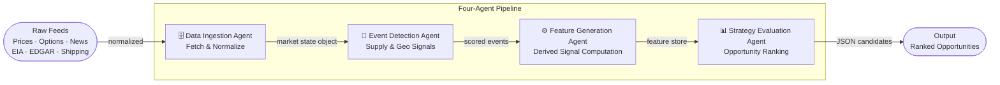
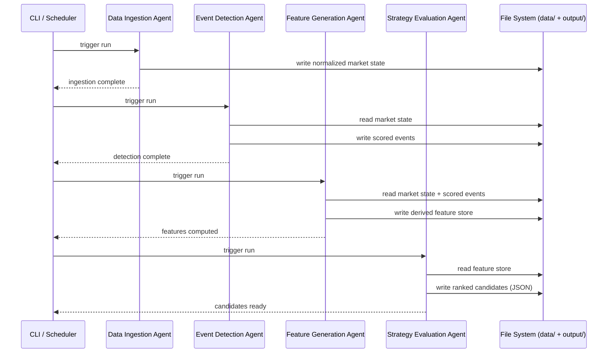

# Energy Options Opportunity Agent — User Guide

> **Version 1.0 · March 2026**
> Advisory system only. No automated trade execution is performed.

---

## Table of Contents

1. [Overview](#overview)
2. [Prerequisites](#prerequisites)
3. [Setup & Configuration](#setup--configuration)
4. [Running the Pipeline](#running-the-pipeline)
5. [Interpreting the Output](#interpreting-the-output)
6. [Troubleshooting](#troubleshooting)

---

## Overview

The **Energy Options Opportunity Agent** is a four-stage Python pipeline that identifies options trading opportunities driven by oil market instability. It ingests market data, supply signals, news events, and alternative datasets, then produces structured, ranked candidate options strategies with full signal explainability.

### Pipeline Architecture



Data flows **unidirectionally** through the four agents. Each agent is independently deployable and communicates via a shared market state object and a derived features store.

### In-Scope Instruments

| Category | Instruments |
|---|---|
| Crude Futures | Brent Crude, WTI (`CL=F`) |
| ETFs | USO, XLE |
| Energy Equities | Exxon Mobil (XOM), Chevron (CVX) |

### In-Scope Option Structures (MVP)

| Structure | Enum Value |
|---|---|
| Long Straddle | `long_straddle` |
| Call Spread | `call_spread` |
| Put Spread | `put_spread` |
| Calendar Spread | `calendar_spread` |

> **Out of scope for MVP:** exotic/multi-legged strategies, OPIS regional pricing, automated execution.

---

## Prerequisites

### System Requirements

| Requirement | Minimum |
|---|---|
| Python | 3.10 or later |
| RAM | 2 GB |
| Disk | 10 GB free (for 6–12 months of historical data) |
| Deployment target | Local machine, single VM, or container |

### Required Tools

```bash
# Verify your Python version
python --version   # must be >= 3.10

# Verify pip
pip --version

# Recommended: create and activate a virtual environment
python -m venv .venv
source .venv/bin/activate        # macOS / Linux
.venv\Scripts\activate           # Windows
```

### API Accounts

Obtain credentials for the following free or low-cost services before running the pipeline. All accounts are free-tier unless noted.

| Service | Used By | Sign-up URL | Notes |
|---|---|---|---|
| Alpha Vantage | Data Ingestion | https://www.alphavantage.co | WTI / Brent spot & futures |
| Yahoo Finance (`yfinance`) | Data Ingestion | No key required | USO, XLE, XOM, CVX, options chains |
| Polygon.io | Data Ingestion | https://polygon.io | Options data; free tier limited |
| EIA Open Data | Event Detection | https://www.eia.gov/opendata | Inventories, refinery utilization |
| GDELT Project | Event Detection | No key required | Geopolitical / energy news |
| NewsAPI | Event Detection | https://newsapi.org | Daily energy headlines |
| SEC EDGAR | Feature Generation | No key required | Insider trade filings |
| Quiver Quant | Feature Generation | https://www.quiverquant.com | Insider conviction; free tier limited |
| MarineTraffic | Feature Generation | https://www.marinetraffic.com | Tanker flows; free tier limited |
| VesselFinder | Feature Generation | https://www.vesselfinder.com | Tanker flows alternative |
| Reddit API | Feature Generation | https://www.reddit.com/prefs/apps | Retail sentiment |
| Stocktwits | Feature Generation | https://api.stocktwits.com | Narrative velocity |

---

## Setup & Configuration

### 1. Clone the Repository

```bash
git clone https://github.com/your-org/energy-options-agent.git
cd energy-options-agent
```

### 2. Install Dependencies

```bash
pip install -r requirements.txt
```

### 3. Configure Environment Variables

All runtime configuration is provided through environment variables. Copy the example file and populate it with your credentials:

```bash
cp .env.example .env
```

Then edit `.env`:

```dotenv
# ── Data Ingestion ──────────────────────────────────────────────
ALPHA_VANTAGE_API_KEY=your_alpha_vantage_key
POLYGON_API_KEY=your_polygon_key

# ── Event Detection ─────────────────────────────────────────────
EIA_API_KEY=your_eia_key
NEWS_API_KEY=your_newsapi_key
# GDELT requires no key

# ── Feature Generation ──────────────────────────────────────────
QUIVER_QUANT_API_KEY=your_quiverquant_key
MARINE_TRAFFIC_API_KEY=your_marinetraffic_key
REDDIT_CLIENT_ID=your_reddit_client_id
REDDIT_CLIENT_SECRET=your_reddit_client_secret
REDDIT_USER_AGENT=energy-options-agent/1.0

# ── Storage ─────────────────────────────────────────────────────
DATA_DIR=./data
OUTPUT_DIR=./output
HISTORY_RETENTION_DAYS=365

# ── Pipeline Behaviour ──────────────────────────────────────────
MARKET_DATA_REFRESH_MINUTES=5
SLOW_FEED_REFRESH_HOURS=24
LOG_LEVEL=INFO
```

#### Full Environment Variable Reference

| Variable | Required | Default | Description |
|---|---|---|---|
| `ALPHA_VANTAGE_API_KEY` | Yes | — | Crude price feed (WTI, Brent) |
| `POLYGON_API_KEY` | No | — | Options chain data; falls back to `yfinance` if absent |
| `EIA_API_KEY` | Yes (Phase 2+) | — | Weekly inventory and refinery utilization |
| `NEWS_API_KEY` | Yes (Phase 2+) | — | Daily energy headline feed |
| `QUIVER_QUANT_API_KEY` | No | — | Insider conviction scores (Phase 3+) |
| `MARINE_TRAFFIC_API_KEY` | No | — | Tanker flow data (Phase 3+) |
| `REDDIT_CLIENT_ID` | No | — | Reddit API OAuth client ID (Phase 3+) |
| `REDDIT_CLIENT_SECRET` | No | — | Reddit API OAuth client secret (Phase 3+) |
| `REDDIT_USER_AGENT` | No | `energy-options-agent/1.0` | Reddit API user-agent string |
| `DATA_DIR` | No | `./data` | Root directory for raw and derived historical data |
| `OUTPUT_DIR` | No | `./output` | Directory where JSON candidate files are written |
| `HISTORY_RETENTION_DAYS` | No | `365` | Days of historical data to retain (minimum 180 recommended) |
| `MARKET_DATA_REFRESH_MINUTES` | No | `5` | Polling cadence for price and options feeds |
| `SLOW_FEED_REFRESH_HOURS` | No | `24` | Polling cadence for EIA, EDGAR, and other daily feeds |
| `LOG_LEVEL` | No | `INFO` | Python logging level (`DEBUG`, `INFO`, `WARNING`, `ERROR`) |

> **Tip:** Variables for Phase 3 data sources (Quiver Quant, MarineTraffic, Reddit, Stocktwits) are optional. The pipeline tolerates missing credentials and continues with reduced signal coverage — it will **never fail hard** due to a missing or delayed feed.

### 4. Initialise the Data Directory

```bash
python -m agent init
```

This creates the directory structure under `DATA_DIR`:

```
data/
├── raw/
│   ├── prices/
│   ├── options/
│   ├── eia/
│   ├── events/
│   ├── insider/
│   └── shipping/
└── derived/
    └── features/
output/
```

---

## Running the Pipeline

### Pipeline Execution Flow



### Running the Full Pipeline (Single Pass)

```bash
python -m agent run
```

This executes all four agents in sequence: Data Ingestion → Event Detection → Feature Generation → Strategy Evaluation. Ranked candidates are written to `OUTPUT_DIR/candidates_<ISO8601_timestamp>.json`.

### Running Individual Agents

You can run any single agent in isolation. Each agent reads from and writes to the shared data store, so outputs from previous stages must already exist.

```bash
# Stage 1 — fetch and normalize all market feeds
python -m agent run --stage ingest

# Stage 2 — detect and score supply/geopolitical events
python -m agent run --stage detect

# Stage 3 — compute derived signals and feature store
python -m agent run --stage features

# Stage 4 — evaluate strategies and emit ranked candidates
python -m agent run --stage evaluate
```

### Continuous / Scheduled Mode

For ongoing operation, run the pipeline on a schedule. The built-in scheduler respects the `MARKET_DATA_REFRESH_MINUTES` and `SLOW_FEED_REFRESH_HOURS` settings:

```bash
# Run continuously with the configured refresh cadences
python -m agent run --continuous
```

Alternatively, use `cron` (macOS / Linux):

```cron
# Full pipeline every 5 minutes during market hours (Mon–Fri, 09:00–17:00 ET)
*/5 9-17 * * 1-5  cd /path/to/energy-options-agent && .venv/bin/python -m agent run
```

Or a `systemd` timer / Docker `CMD` for cloud deployments — the process is stateless between runs.

### Useful CLI Flags

| Flag | Description |
|---|---|
| `--stage <name>` | Run a single agent stage (`ingest`, `detect`, `features`, `evaluate`) |
| `--continuous` | Run in polling loop using configured refresh cadences |
| `--output <path>` | Override `OUTPUT_DIR` for this run |
| `--log-level <level>` | Override `LOG_LEVEL` for this run |
| `--dry-run` | Execute all stages but do not write output files |

---

## Interpreting the Output

### Output File Location

Each pipeline run writes one JSON file to `OUTPUT_DIR`:

```
output/candidates_2026-03-15T14:32:00Z.json
```

### Output Schema

Each element in the output array represents a single ranked strategy candidate.

| Field | Type | Description |
|---|---|---|
| `instrument` | `string` | Target instrument — e.g. `"USO"`, `"XLE"`, `"CL=F"` |
| `structure` | `enum` | Options structure: `long_straddle` · `call_spread` · `put_spread` · `calendar_spread` |
| `expiration` | `integer` | Target expiration in **calendar days** from the evaluation date |
| `edge_score` | `float [0.0–1.0]` | Composite opportunity score; higher = stronger signal confluence |
| `signals` | `object` | Map of contributing signals and their observed state |
| `generated_at` | `ISO 8601 datetime` | UTC timestamp of candidate generation |

### Example Candidate

```json
{
  "instrument": "USO",
  "structure": "long_straddle",
  "expiration": 30,
  "edge_score": 0.47,
  "signals": {
    "tanker_disruption_index": "high",
    "volatility_gap": "positive",
    "narrative_velocity": "rising"
  },
  "generated_at": "2026-03-15T14:32:00Z"
}
```

### Understanding `edge_score`

The edge score is a composite \[0.0–1.0\] measure of signal confluence. Use the following as a practical guide:

| Score Range | Interpretation | Suggested Action |
|---|---|---|
| `0.00 – 0.25` | Weak confluence; few signals aligned | Monitor only |
| `0.26 – 0.50` | Moderate confluence; some supporting signals | Review contributing signals before acting |
| `0.51 – 0.75` | Strong confluence; multiple independent signals aligned | Warrants detailed manual review |
| `0.76 – 1.00` | Very strong confluence; broad signal agreement | High-priority review |

> The edge score is an **advisory signal**. It reflects the number and strength of aligned indicators, not a guarantee of profitability. Always perform your own due diligence before trading.

### Understanding `signals`

Each key in the `signals` object corresponds to a derived feature computed by the Feature Generation Agent:

| Signal Key | Source Layer | Description |
|---|---|---|
| `volatility_gap` | Options chains | Realized vs. implied volatility spread. `positive` = IV underpriced relative to realised vol |
| `futures_curve_steepness` | Crude futures | Degree of contango or backwardation in the WTI/Brent curve |
| `sector_dispersion` | ETF / equity prices | Divergence in returns across USO, XLE, XOM, CVX |
| `insider_conviction` | SEC EDGAR / Quiver Quant | Directional signal from recent executive trades |
| `narrative_velocity` | Reddit / Stocktwits | Rate of change in energy-related headline and social volume |
| `supply_shock_probability` | EIA + event detection | Probability estimate of a near-term supply disruption |
| `tanker_disruption_index` | MarineTraffic / VesselFinder | Anomaly score for tanker routing around key chokepoints |

### Viewing Output in thinkorswim or a Dashboard

The JSON output is compatible with any tool that accepts JSON input. To load candidates into thinkorswim or a custom dashboard:

```bash
# Pretty-print the latest output file
cat output/candidates_2026-03-15T14:32:00Z.json | python -m json.tool

# Filter for candidates with edge_score > 0.5
python - <<'EOF'
import json, glob, os

latest = max(glob.glob("output/candidates_*.json"), key=os.path.getmtime)
with open(latest) as f:
    candidates = json.load(f)

strong = [c for c in candidates if c["edge_score"] > 0.5]
print(json.dumps(strong, indent=2))
EOF
```

---

## Troubleshooting

### General Diagnostic Steps

```bash
# Run with debug logging to see per-agent detail
python -m agent run --log-level DEBUG

# Validate your environment configuration
python -m