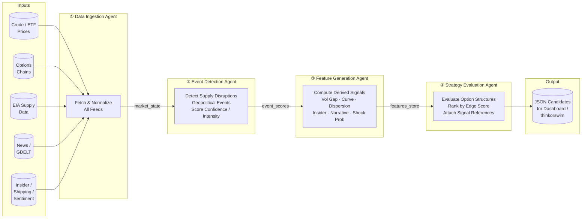
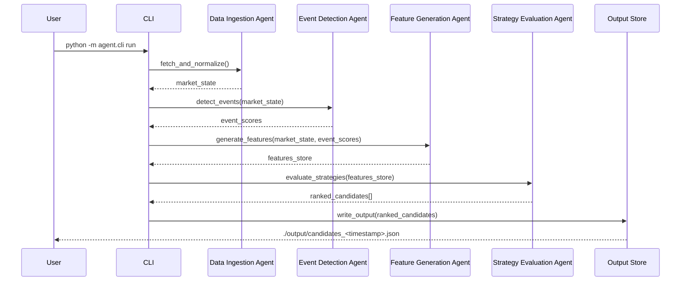

# Energy Options Opportunity Agent — User Guide

> **Version 1.0 · March 2026**
> This guide walks you through configuring, running, and interpreting results from the full four-agent pipeline. It assumes you are comfortable with Python and the command line but are new to this project.

---

## Table of Contents

1. [Overview](#overview)
2. [Prerequisites](#prerequisites)
3. [Setup & Configuration](#setup--configuration)
4. [Running the Pipeline](#running-the-pipeline)
5. [Interpreting the Output](#interpreting-the-output)
6. [Troubleshooting](#troubleshooting)

---

## Overview

The **Energy Options Opportunity Agent** is an autonomous, modular Python pipeline that identifies options trading opportunities driven by oil market instability. It ingests market data, supply signals, news events, and alternative datasets, then produces structured, ranked candidate options strategies.

### What the pipeline does

| Stage | Agent | Output |
|---|---|---|
| **1 · Ingest** | Data Ingestion Agent | Unified market state object |
| **2 · Detect** | Event Detection Agent | Scored supply / geopolitical events |
| **3 · Derive** | Feature Generation Agent | Volatility gaps, curve metrics, shock probabilities |
| **4 · Rank** | Strategy Evaluation Agent | Ranked opportunities with edge scores |

### In-scope instruments (MVP)

| Class | Symbols |
|---|---|
| Crude futures | Brent, WTI (`CL=F`) |
| ETFs | USO, XLE |
| Energy equities | XOM, CVX |

### In-scope option structures (MVP)

`long_straddle` · `call_spread` · `put_spread` · `calendar_spread`

> **Advisory only.** The system produces ranked recommendations; it does **not** execute trades automatically.

---

### Pipeline Architecture



Data flows **unidirectionally**. Each agent is independently deployable; a failure in one agent degrades output quality but does not crash the pipeline.

---

## Prerequisites

### System requirements

| Requirement | Minimum |
|---|---|
| Python | 3.10 or later |
| RAM | 2 GB available |
| Disk | 5 GB free (grows with retained history) |
| OS | Linux, macOS, or Windows (WSL2 recommended) |
| Deployment target | Local machine, single VM, or Docker container |

### External accounts & API keys

All primary data sources are free or have a usable free tier.

| Source | Used for | Sign-up URL |
|---|---|---|
| Alpha Vantage | WTI / Brent spot prices | <https://www.alphavantage.co/support/#api-key> |
| yfinance / Yahoo Finance | ETF & equity prices, options chains | No key required |
| Polygon.io *(optional)* | Higher-quality options data | <https://polygon.io> |
| EIA API | Inventory & refinery utilization | <https://www.eia.gov/opendata/> |
| GDELT | News & geopolitical events | No key required |
| NewsAPI *(optional)* | Supplemental news feed | <https://newsapi.org> |
| SEC EDGAR | Insider activity | No key required |
| Quiver Quant *(optional)* | Parsed insider trades | <https://www.quiverquant.com> |
| MarineTraffic / VesselFinder | Tanker flow data | Free tier at respective sites |
| Reddit | Retail sentiment | No key required (public API) |
| Stocktwits | Narrative velocity | No key required (public API) |

### Python dependencies

```bash
pip install -r requirements.txt
```

Core libraries expected in `requirements.txt`:

```text
yfinance>=0.2
requests>=2.31
pandas>=2.0
numpy>=1.26
python-dotenv>=1.0
schedule>=1.2
```

---

## Setup & Configuration

### 1 · Clone the repository

```bash
git clone https://github.com/your-org/energy-options-agent.git
cd energy-options-agent
```

### 2 · Create a virtual environment

```bash
python -m venv .venv
source .venv/bin/activate        # Linux / macOS
# .venv\Scripts\activate         # Windows PowerShell
pip install -r requirements.txt
```

### 3 · Create the environment file

Copy the provided template and fill in your values:

```bash
cp .env.example .env
```

Then open `.env` in your editor and populate each variable (see table below).

### 4 · Environment variables reference

| Variable | Required | Default | Description |
|---|---|---|---|
| `ALPHA_VANTAGE_API_KEY` | **Yes** | — | API key for crude price feeds |
| `EIA_API_KEY` | **Yes** | — | API key for EIA inventory & refinery data |
| `POLYGON_API_KEY` | No | — | Higher-quality options chain data (falls back to yfinance if unset) |
| `NEWS_API_KEY` | No | — | NewsAPI key for supplemental news (GDELT used if unset) |
| `QUIVER_QUANT_API_KEY` | No | — | Parsed insider trade data (falls back to raw EDGAR if unset) |
| `MARINE_TRAFFIC_API_KEY` | No | — | Tanker flow data from MarineTraffic |
| `DATA_REFRESH_INTERVAL_MINUTES` | No | `5` | Cadence for market data polling (minutes) |
| `EIA_REFRESH_INTERVAL_HOURS` | No | `24` | Cadence for EIA data polling (hours) |
| `EDGAR_REFRESH_INTERVAL_HOURS` | No | `24` | Cadence for insider data polling (hours) |
| `HISTORY_RETENTION_DAYS` | No | `180` | Days of raw and derived history to retain (180–365 recommended) |
| `OUTPUT_DIR` | No | `./output` | Directory where JSON candidate files are written |
| `LOG_LEVEL` | No | `INFO` | Python logging level (`DEBUG`, `INFO`, `WARNING`, `ERROR`) |
| `INSTRUMENTS` | No | `USO,XLE,XOM,CVX,CL=F` | Comma-separated list of instruments to monitor |
| `EDGE_SCORE_THRESHOLD` | No | `0.30` | Minimum edge score for a candidate to be included in output |

**Example `.env`:**

```dotenv
ALPHA_VANTAGE_API_KEY=your_alpha_vantage_key_here
EIA_API_KEY=your_eia_key_here

# Optional — remove or leave blank to use free fallbacks
POLYGON_API_KEY=
NEWS_API_KEY=
QUIVER_QUANT_API_KEY=
MARINE_TRAFFIC_API_KEY=

# Tuning
DATA_REFRESH_INTERVAL_MINUTES=5
EIA_REFRESH_INTERVAL_HOURS=24
EDGAR_REFRESH_INTERVAL_HOURS=24
HISTORY_RETENTION_DAYS=180
OUTPUT_DIR=./output
LOG_LEVEL=INFO
INSTRUMENTS=USO,XLE,XOM,CVX,CL=F
EDGE_SCORE_THRESHOLD=0.30
```

### 5 · Verify configuration

```bash
python -m agent.cli check-config
```

Expected output:

```
[✓] ALPHA_VANTAGE_API_KEY  — set
[✓] EIA_API_KEY            — set
[!] POLYGON_API_KEY        — not set (fallback: yfinance)
[!] NEWS_API_KEY           — not set (fallback: GDELT)
[!] QUIVER_QUANT_API_KEY   — not set (fallback: EDGAR)
[!] MARINE_TRAFFIC_API_KEY — not set (fallback: disabled)
Configuration valid. Ready to run.
```

Items marked `[!]` are optional; the pipeline continues with free fallbacks.

### 6 · Initialise the data store

Run the one-time bootstrap to create local storage directories and seed historical data:

```bash
python -m agent.cli bootstrap
```

This may take several minutes on first run as it fetches historical prices required for volatility and curve calculations.

---

## Running the Pipeline

### Pipeline flow (setup sequence)



### Single pipeline run

Execute one complete pass through all four agents and write results to `OUTPUT_DIR`:

```bash
python -m agent.cli run
```

### Continuous (scheduled) run

Run the pipeline on a recurring schedule driven by `DATA_REFRESH_INTERVAL_MINUTES`:

```bash
python -m agent.cli run --continuous
```

Stop with **Ctrl + C**. The scheduler respects the slower cadences configured for EIA and EDGAR feeds automatically.

### Run a single agent in isolation

Each agent can be invoked independently for testing or debugging:

```bash
# Run only the Data Ingestion Agent
python -m agent.cli run --agent ingestion

# Run only the Event Detection Agent (requires existing market_state)
python -m agent.cli run --agent events

# Run only the Feature Generation Agent (requires market_state + event_scores)
python -m agent.cli run --agent features

# Run only the Strategy Evaluation Agent (requires features_store)
python -m agent.cli run --agent strategy
```

### Command reference

| Command | Description |
|---|---|
| `check-config` | Validate environment variables and API key reachability |
| `bootstrap` | Initialise data store and seed historical data (run once) |
| `run` | Execute a single pipeline pass |
| `run --continuous` | Execute on a repeating schedule |
| `run --agent <name>` | Execute a single agent in isolation |
| `run --dry-run` | Run all agents but suppress writing output files |
| `run --instruments XOM,CVX` | Override `INSTRUMENTS` for this run only |
| `run --log-level DEBUG` | Override `LOG_LEVEL` for this run only |

---

## Interpreting the Output

### Output location

Each pipeline run writes a timestamped JSON file to `OUTPUT_DIR` (default `./output`):

```
./output/
  candidates_2026-03-15T14:32:00Z.json
  candidates_2026-03-15T14:37:00Z.json
  ...
```

### Output schema

Each file contains an array of **candidate objects**. Every candidate has the following fields:

| Field | Type | Description |
|---|---|---|
| `instrument` | string | Target instrument, e.g. `USO`, `XLE`, `CL=F` |
| `structure` | enum | `long_straddle` · `call_spread` · `put_spread` · `calendar_spread` |
| `expiration` | integer (days) | Target expiration in calendar days from the evaluation date |
| `edge_score` | float `[0.0 – 1.0]` | Composite opportunity score; **higher = stronger signal confluence** |
| `signals` | object | Map of contributing signals and their qualitative levels |
| `generated_at` | ISO 8601 datetime | UTC timestamp of candidate generation |

### Example output file

```json
[
  {
    "instrument": "USO",
    "structure": "long_straddle",
    "expiration": 30,
    "edge_score": 0.47,
    "signals": {
      "tanker_disruption_index": "high",
      "volatility_gap": "positive",
      "narrative_velocity": "rising"
    },
    "generated_at": "2026-03-15T14:32:00Z"
  },
  {
    "instrument": "XLE",
    "structure": "call_spread",
    "expiration": 45,
    "edge_score": 0.38,
    "signals": {
      "supply_shock_probability": "elevated",
      "futures_curve_steepness": "steep",
      "sector_dispersion": "high"
    },
    "generated_at": "2026-03-15T14:32:00Z"
  }
]
```

### Reading the `edge_score`

| Score range | Interpretation | Suggested action |
|---|---|---|
| `0.70 – 1.00` | Strong signal confluence | High priority for review |
| `0.50 – 0.69` | Moderate confluence | Worth evaluating with additional context |
| `0.30 – 0.49` | Weak but notable signal | Monitor; revisit on next run |
| `< 0.30` | Below threshold | Filtered out by default (see `EDGE_SCORE_THRESHOLD`) |

> **Note:** Edge scores are computed from heuristic functions in the MVP. They indicate relative opportunity strength within this run; they are **not** a guarantee of profitability.

### Reading the `signals` map

Each key in the `signals` object corresponds to a derived feature computed by the Feature Generation Agent. Qualitative values indicate direction or intensity:

| Signal key | What it measures | Values |
|---|---|---|
| `volatility_gap` | Realized vs. implied volatility divergence | `positive` · `negative` · `neutral` |
| `futures_curve_steepness` | Steepness of the WTI / Brent futures curve | `steep` · `flat` · `inverted` |
| `sector_dispersion` | Cross-sector price correlation breakdown | `high` · `moderate` · `low` |
| `insider_conviction` | Aggregated insider trade signal | `strong` · `moderate` · `weak` |
| `narrative_velocity` | Rate of change in energy news headlines | `rising` · `stable` · `falling` |
| `supply_shock_probability` | Modelled probability of a supply disruption | `elevated` · `moderate` · `low` |
| `tanker_disruption_index` | Shipping flow anomalies at key chokepoints | `high` · `moderate` · `low` |

### Consuming output in thinkorswim or a custom dashboard

The JSON output is compatible with any JSON-capable dashboard. To load candidates into thinkorswim or a spreadsheet tool, you can transform the output with the included helper:

```bash
python -m agent.cli export --format csv --input ./output/candidates_2026-03-15T14:32:00Z.json
```

This