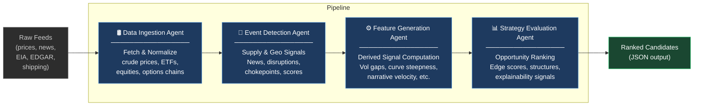

# Energy Options Opportunity Agent — User Guide

> **Version 1.0 · March 2026**
> This guide walks you through installing, configuring, and running the full Energy Options Opportunity Agent pipeline from the command line.

---

## Table of Contents

1. [Overview](#overview)
2. [Prerequisites](#prerequisites)
3. [Setup & Configuration](#setup--configuration)
4. [Running the Pipeline](#running-the-pipeline)
5. [Interpreting the Output](#interpreting-the-output)
6. [Troubleshooting](#troubleshooting)

---

## Overview

The Energy Options Opportunity Agent is a modular, autonomous Python pipeline that identifies options trading opportunities driven by oil market instability. It ingests market data, supply signals, geopolitical events, and alternative datasets, then produces **structured, ranked candidate options strategies**.

The system is composed of **four loosely coupled agents** that execute in a fixed, unidirectional sequence:



Each agent communicates through a **shared market state object** and a **derived features store**. Agents are independently deployable, so you can update or re-run any single stage without disrupting the rest of the pipeline.

### In-scope instruments (MVP)

| Category | Instruments |
|---|---|
| Crude futures | Brent Crude, WTI (`CL=F`) |
| ETFs | USO, XLE |
| Energy equities | Exxon Mobil (XOM), Chevron (CVX) |

### In-scope option structures (MVP)

| Structure | Enum value |
|---|---|
| Long straddle | `long_straddle` |
| Call spread | `call_spread` |
| Put spread | `put_spread` |
| Calendar spread | `calendar_spread` |

> **Advisory only.** The system does not execute trades. All output is informational.

---

## Prerequisites

Before running the pipeline, ensure the following are in place.

### System requirements

| Requirement | Minimum |
|---|---|
| OS | Linux, macOS, or Windows (WSL2 recommended) |
| Python | 3.10 or later |
| RAM | 2 GB |
| Disk | 10 GB free (for 6–12 months of historical data) |
| Network | Outbound HTTPS access to all data source APIs |

### Python dependencies

Install dependencies from the project root:

```bash
pip install -r requirements.txt
```

Key packages the pipeline depends on include:

| Package | Purpose |
|---|---|
| `yfinance` | ETF and equity price data (Yahoo Finance) |
| `requests` | HTTP calls to Alpha Vantage, EIA, GDELT, EDGAR, NewsAPI |
| `pandas` / `numpy` | Data normalization and feature computation |
| `pydantic` | Market state and output schema validation |
| `schedule` | Cadenced refresh loops |
| `python-dotenv` | Loading environment variables from `.env` |

### API accounts

All required data sources are **free or low-cost**. Register for API keys before proceeding.

| Source | Sign-up URL | Cost | Used by |
|---|---|---|---|
| Alpha Vantage | https://www.alphavantage.co/support/#api-key | Free | Crude prices |
| NewsAPI | https://newsapi.org/register | Free tier | News & geo events |
| Polygon.io | https://polygon.io | Free/Limited | Options chains |
| EIA API | https://www.eia.gov/opendata/ | Free | Supply/inventory data |
| SEC EDGAR | https://efts.sec.gov/LATEST/search-index | Free | Insider activity |
| Quiver Quant | https://www.quiverquant.com | Free/Limited | Insider conviction |
| MarineTraffic | https://www.marinetraffic.com/en/online-services/plans | Free tier | Tanker/shipping flows |

> **Note:** `yfinance`, GDELT, Reddit (`praw`), and Stocktwits do not require API keys for basic access.

---

## Setup & Configuration

### 1. Clone the repository

```bash
git clone https://github.com/your-org/energy-options-agent.git
cd energy-options-agent
```

### 2. Create and activate a virtual environment

```bash
python -m venv .venv
source .venv/bin/activate        # Linux / macOS
# .venv\Scripts\activate         # Windows
```

### 3. Install dependencies

```bash
pip install -r requirements.txt
```

### 4. Configure environment variables

Copy the provided template and populate your credentials:

```bash
cp .env.example .env
```

Open `.env` in your editor and fill in the values described in the table below.

#### Environment variable reference

| Variable | Required | Description | Example |
|---|---|---|---|
| `ALPHA_VANTAGE_API_KEY` | ✅ | API key for crude price feeds (WTI, Brent) | `ABC123XYZ` |
| `NEWSAPI_KEY` | ✅ | API key for news and geopolitical event feeds | `abc123def456` |
| `POLYGON_API_KEY` | ✅ | API key for options chain data (strike, expiry, IV, volume) | `abc123...` |
| `EIA_API_KEY` | ✅ | API key for EIA inventory and refinery utilization feeds | `abc123...` |
| `QUIVER_QUANT_API_KEY` | ⬜ | API key for insider trade conviction scores (optional in Phase 1) | `qv_abc123` |
| `MARINE_TRAFFIC_API_KEY` | ⬜ | API key for tanker and shipping flow data (optional in Phase 1–2) | `mt_abc123` |
| `OUTPUT_DIR` | ✅ | Directory where ranked candidate JSON files are written | `./output` |
| `HISTORICAL_DATA_DIR` | ✅ | Directory for persisted raw and derived historical data | `./data/historical` |
| `HISTORICAL_RETENTION_DAYS` | ⬜ | Days of historical data to retain (default: `365`) | `180` |
| `MARKET_DATA_REFRESH_INTERVAL_SECONDS` | ⬜ | Refresh cadence for real-time price feeds (default: `60`) | `120` |
| `LOG_LEVEL` | ⬜ | Logging verbosity: `DEBUG`, `INFO`, `WARNING`, `ERROR` (default: `INFO`) | `DEBUG` |
| `PIPELINE_PHASE` | ⬜ | Active MVP phase: `1`, `2`, `3` (default: `1`) | `2` |

A minimal `.env` for Phase 1 looks like this:

```dotenv
ALPHA_VANTAGE_API_KEY=your_key_here
NEWSAPI_KEY=your_key_here
POLYGON_API_KEY=your_key_here
EIA_API_KEY=your_key_here

OUTPUT_DIR=./output
HISTORICAL_DATA_DIR=./data/historical
LOG_LEVEL=INFO
PIPELINE_PHASE=1
```

### 5. Initialise data directories

```bash
mkdir -p ./output ./data/historical
```

### 6. Verify configuration

Run the built-in configuration check before the first full pipeline run:

```bash
python -m agent check-config
```

Expected output on success:

```
[✓] ALPHA_VANTAGE_API_KEY — reachable
[✓] NEWSAPI_KEY — reachable
[✓] POLYGON_API_KEY — reachable
[✓] EIA_API_KEY — reachable
[✓] OUTPUT_DIR — writable
[✓] HISTORICAL_DATA_DIR — writable
Configuration OK. Pipeline phase: 1
```

---

## Running the Pipeline

### Pipeline execution flow

The four agents execute in strict sequence. Data flows unidirectionally — the output of each stage is the input of the next:

```mermaid
sequenceDiagram
    autonumber
    participant CLI as CLI / Scheduler
    participant DI as Data Ingestion Agent
    participant ED as Event Detection Agent
    participant FG as Feature Generation Agent
    participant SE as Strategy Evaluation Agent
    participant FS as Features Store
    participant OUT as JSON Output

    CLI->>DI: Trigger run
    DI->>DI: Fetch crude prices, ETFs,\nequities, options chains
    DI->>FS: Write unified market state object
    DI->>ED: Handoff (market state ready)

    ED->>FS: Read market state
    ED->>ED: Monitor news/geo feeds;\nassign confidence + intensity scores
    ED->>FS: Write detected events

    FG->>FS: Read market state + events
    FG->>FG: Compute vol gaps, curve steepness,\nsector dispersion, narrative velocity,\ninsider conviction, supply shock prob
    FG->>FS: Write derived features

    SE->>FS: Read all derived features
    SE->>SE: Evaluate eligible option structures;\ncompute edge scores;\nattach contributing signals
    SE->>OUT: Write ranked candidates (JSON)
    OUT-->>CLI: Return results
```

### Run modes

#### Single run (one-shot)

Executes the full four-agent pipeline once and writes results to `OUTPUT_DIR`.

```bash
python -m agent run
```

#### Continuous mode (scheduled)

Runs the pipeline on a repeating cadence. Market data is refreshed at the interval defined by `MARKET_DATA_REFRESH_INTERVAL_SECONDS`; slower feeds (EIA, EDGAR) refresh daily or weekly automatically.

```bash
python -m agent run --continuous
```

#### Run a single agent in isolation

Each agent can be invoked independently for debugging or incremental updates. The agent reads from and writes to the shared features store.

```bash
# Re-run only the Data Ingestion Agent
python -m agent run --agent ingestion

# Re-run only the Event Detection Agent
python -m agent run --agent event-detection

# Re-run only the Feature Generation Agent
python -m agent run --agent feature-generation

# Re-run only the Strategy Evaluation Agent
python -m agent run --agent strategy-evaluation
```

#### Run a specific MVP phase

Override the configured phase at runtime:

```bash
python -m agent run --phase 2
```

| Phase | Name | What is active |
|---|---|---|
| `1` | Core Market Signals & Options | Crude benchmarks, USO/XLE prices, options surface analysis, long straddles and call/put spreads |
| `2` | Supply & Event Augmentation | Phase 1 + EIA inventory, refinery utilization, GDELT/NewsAPI event detection, supply disruption indices |
| `3` | Alternative / Contextual Signals | Phase 2 + EDGAR/Quiver insider trades, Reddit/Stocktwits narrative velocity, MarineTraffic shipping data, full cross-sector correlation |

#### Common flags

| Flag | Description |
|---|---|
| `--phase <1\|2\|3>` | Override active MVP phase |
| `--continuous` | Run pipeline on a repeating schedule |
| `--agent <name>` | Run a single named agent only |
| `--output-dir <path>` | Override `OUTPUT_DIR` for this run |
| `--log-level <level>` | Override `LOG_LEVEL` for this run |
| `--dry-run` | Execute all pipeline logic but do not write output files |

---

## Interpreting the Output

### Output location

Each pipeline run writes one JSON file to `OUTPUT_DIR`, named with a UTC timestamp:

```
./output/candidates_2026-03-15T14:30:00Z.json
```

The file contains an array of **strategy candidate objects**, ranked in descending order of `edge_score`.

### Output schema

| Field | Type | Description |
|---|---|---|
| `instrument` | `string` | Target instrument, e.g. `USO`, `XLE`, `CL=F` |
| `structure` | `enum` | Options structure: `long_straddle` \| `call_spread` \| `put_spread` \| `calendar_spread` |
| `expiration` | `integer` (days) | Target expiration in calendar days from evaluation date |
| `edge_score` | `float [0.0–1.0]` | Composite opportunity score; **higher = stronger signal confluence** |
| `signals` | `object` | Map of contributing signals and their states, for explainability |
| `generated_at` | ISO 8601 datetime | UTC timestamp of candidate generation |

### Example output file

```json
[
  {
    "instrument": "USO",
    "structure": "long_straddle",
    "expiration": 30,
    "edge_score": 0.47,
    "signals": {
      "tanker_disruption_index": "high",
      "volatility_gap": "positive",
      "narrative_velocity": "rising"
    },
    "generated_at": "2026-03-15T14:30:00Z"
  },
  {
    "instrument": "XLE",
    "structure": "call_spread",
    "expiration": 45,
    "edge_score": 0.31,
    "signals": {
      "volatility_gap": "positive",
      "supply_shock_probability": "elevated",
      "sector_dispersion": "widening"
    },
    "generated_at": "2026-03-15T14:30:00Z"
  }
]
```

### Understanding `edge_score`

The `edge_score` is a composite float in the range `[0.0, 1.0]` that reflects the degree to which multiple independent signals align to suggest a mispricing opportunity.

| Score range | Interpretation |
|---|---|
| `0.00 – 0.20` | Weak or single-signal confluence; low conviction |
| `0.21 – 0.40` | Moderate confluence; worth monitoring |
| `0.41 – 0.60` | Strong multi-signal alignment; primary candidates for review |
| `0.61 – 1.00` | Very strong confluence; highest-priority candidates |

> **Important:** `edge_score` reflects signal alignment, not a prediction of profitability. All output is advisory. No automated trade execution occurs.

### Understanding the `signals` map

Each key in the `signals` object corresponds to a derived feature computed by the Feature Generation Agent. Common signal keys and their possible states are listed below.

| Signal key | Possible states | Source agent |
|---|---|---|
| `volatility_gap` | `positive`, `negative`, `neutral` | Feature Generation |
| `futures_curve_steepness` | `steep`, `flat`, `inverted` | Feature Generation |
| `sector_dispersion` | `widening`, `narrowing`, `stable` | Feature Generation |
| `insider_conviction_score` | `high`, `moderate`, `low` | Feature Generation |
| `narrative_velocity` | `rising`, `stable`, `falling` | Feature Generation |
| `supply_shock_probability` | `elevated`,