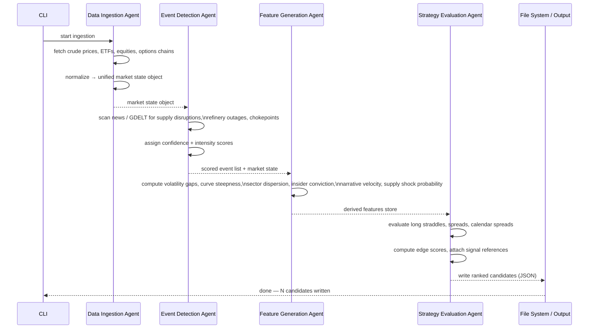

# Energy Options Opportunity Agent — User Guide

> **Version 1.0 · March 2026**
> Advisory system only. No automated trade execution is performed.

---

## Table of Contents

1. [Overview](#overview)
2. [Prerequisites](#prerequisites)
3. [Setup & Configuration](#setup--configuration)
4. [Running the Pipeline](#running-the-pipeline)
5. [Interpreting the Output](#interpreting-the-output)
6. [Troubleshooting](#troubleshooting)

---

## Overview

The **Energy Options Opportunity Agent** is a modular Python pipeline that identifies options trading opportunities driven by oil market instability. It ingests market data, supply signals, news events, and alternative datasets, then produces structured, ranked candidate options strategies with full explainability.

### What the pipeline does

```mermaid
flowchart LR
    subgraph Inputs
        A1[Crude Prices\nAlpha Vantage / MetalpriceAPI]
        A2[ETF & Equity Prices\nyfinance / Yahoo Finance]
        A3[Options Chains\nYahoo Finance / Polygon.io]
        A4[Supply & Inventory\nEIA API]
        A5[News & Geo Events\nGDELT / NewsAPI]
        A6[Insider Activity\nEDGAR / Quiver Quant]
        A7[Shipping & Logistics\nMarineTraffic / VesselFinder]
        A8[Narrative & Sentiment\nReddit / Stocktwits]
    end

    subgraph Pipeline ["Four-Agent Pipeline"]
        direction TB
        B1["① Data Ingestion Agent\nFetch & Normalize"]
        B2["② Event Detection Agent\nSupply & Geo Signals"]
        B3["③ Feature Generation Agent\nDerived Signal Computation"]
        B4["④ Strategy Evaluation Agent\nOpportunity Ranking"]
    end

    subgraph Output
        C1[Ranked Candidates\nJSON / Dashboard]
    end

    Inputs --> B1
    B1 -->|Unified Market State Object| B2
    B2 -->|Scored Events| B3
    B3 -->|Derived Features Store| B4
    B4 --> C1
```



### In-scope instruments

| Category | Instruments |
|---|---|
| Crude Futures | Brent Crude, WTI (`CL=F`) |
| ETFs | USO, XLE |
| Energy Equities | Exxon Mobil (XOM), Chevron (CVX) |

### In-scope option structures (MVP)

| Structure | Description |
|---|---|
| `long_straddle` | Long call + long put at the same strike/expiry |
| `call_spread` | Bull or bear vertical call spread |
| `put_spread` | Bull or bear vertical put spread |
| `calendar_spread` | Same strike, different expirations |

> **Out of scope for MVP:** exotic/multi-legged structures, OPIS regional pricing, automated execution.

---

## Prerequisites

### System requirements

| Requirement | Minimum |
|---|---|
| Python | 3.10 or later |
| Operating system | Linux, macOS, or Windows (WSL2 recommended) |
| RAM | 2 GB |
| Disk | 10 GB free (for 6–12 months of historical data) |
| Network | Outbound HTTPS access to all data-source APIs |

### Required tools

```bash
# Verify Python version
python --version   # must be 3.10+

# Verify pip
pip --version

# Recommended: use a virtual environment manager
python -m venv --help
```

### API accounts you need to create

Obtain free-tier credentials from each provider before configuring the pipeline.

| Data layer | Provider | Sign-up URL | Cost |
|---|---|---|---|
| Crude prices | Alpha Vantage | https://www.alphavantage.co/support/#api-key | Free |
| Crude prices (alt) | MetalpriceAPI | https://metalpriceapi.com | Free |
| Options chains | Polygon.io | https://polygon.io | Free / limited |
| News & geo events | NewsAPI | https://newsapi.org | Free |
| News & geo events (alt) | GDELT | No key required | Free |
| Supply & inventory | EIA API | https://www.eia.gov/opendata/ | Free |
| Insider activity | Quiver Quant | https://www.quiverquant.com | Free / limited |
| Shipping & logistics | MarineTraffic | https://www.marinetraffic.com/en/ais-api-services | Free tier |
| Narrative sentiment | Reddit (PRAW) | https://www.reddit.com/prefs/apps | Free |

> **Note:** `yfinance`, GDELT, and SEC EDGAR do not require API keys.

---

## Setup & Configuration

### 1. Clone the repository

```bash
git clone https://github.com/your-org/energy-options-agent.git
cd energy-options-agent
```

### 2. Create and activate a virtual environment

```bash
python -m venv .venv

# Linux / macOS
source .venv/bin/activate

# Windows (PowerShell)
.\.venv\Scripts\Activate.ps1
```

### 3. Install dependencies

```bash
pip install --upgrade pip
pip install -r requirements.txt
```

### 4. Configure environment variables

All runtime credentials and tuneable parameters are supplied through environment variables. Copy the provided template and populate it with your values:

```bash
cp .env.example .env
```

Then edit `.env`:

```bash
# Open with your preferred editor
nano .env
```

#### Complete environment variable reference

| Variable | Required | Default | Description |
|---|---|---|---|
| `ALPHA_VANTAGE_API_KEY` | Yes | — | API key for crude price feeds (WTI, Brent) |
| `METALPRICE_API_KEY` | Optional | — | Fallback crude price source |
| `POLYGON_API_KEY` | Yes | — | Options chain data (strike, expiry, IV, volume) |
| `NEWSAPI_KEY` | Yes | — | News and geopolitical event feed |
| `EIA_API_KEY` | Yes | — | EIA supply/inventory and refinery utilization |
| `QUIVER_QUANT_API_KEY` | Optional | — | Insider conviction scores via Quiver Quant |
| `MARINE_TRAFFIC_API_KEY` | Optional | — | Tanker flow data |
| `REDDIT_CLIENT_ID` | Optional | — | Reddit PRAW app client ID (narrative velocity) |
| `REDDIT_CLIENT_SECRET` | Optional | — | Reddit PRAW app client secret |
| `REDDIT_USER_AGENT` | Optional | `energy-agent/1.0` | Reddit PRAW user agent string |
| `OUTPUT_DIR` | No | `./output` | Directory where JSON candidate files are written |
| `DATA_STORE_DIR` | No | `./data` | Root directory for historical raw and derived data |
| `RETENTION_DAYS` | No | `365` | Days of historical data to retain (180–365 recommended) |
| `MARKET_DATA_INTERVAL_MINUTES` | No | `5` | Polling cadence for minute-level market data feeds |
| `SLOW_FEED_INTERVAL_HOURS` | No | `24` | Polling cadence for EIA/EDGAR (daily/weekly sources) |
| `MIN_EDGE_SCORE` | No | `0.30` | Minimum edge score threshold; candidates below this are suppressed |
| `LOG_LEVEL` | No | `INFO` | Logging verbosity: `DEBUG`, `INFO`, `WARNING`, `ERROR` |

> **Tip:** Variables marked **Optional** govern Phase 2 and Phase 3 data sources. The pipeline gracefully skips any agent whose credentials are absent, so you can start with Phase 1 sources and add the rest incrementally.

### 5. Verify the configuration

```bash
python -m agent.cli verify-config
```

Expected output:

```
[OK] ALPHA_VANTAGE_API_KEY     set
[OK] POLYGON_API_KEY           set
[OK] NEWSAPI_KEY               set
[OK] EIA_API_KEY               set
[--] QUIVER_QUANT_API_KEY      not set  (Phase 3 — optional)
[--] MARINE_TRAFFIC_API_KEY    not set  (Phase 3 — optional)
[--] REDDIT_CLIENT_ID          not set  (Phase 3 — optional)
Configuration check complete. Pipeline can start.
```

---

## Running the Pipeline

### Pipeline execution modes

| Mode | Command | Use case |
|---|---|---|
| Single run (one-shot) | `python -m agent.cli run` | Manual trigger; evaluate once and exit |
| Continuous (daemon) | `python -m agent.cli run --continuous` | Background polling on configured cadences |
| Single agent only | `python -m agent.cli run --agent <name>` | Debug or re-run one stage in isolation |
| Dry run | `python -m agent.cli run --dry-run` | Validates config and data fetch without writing output |

### Running a full single-pass evaluation

```bash
python -m agent.cli run
```

The pipeline executes the four agents in sequence:



### Running in continuous mode

```bash
python -m agent.cli run --continuous
```

The daemon respects the cadences set in your environment:

- **Market data** (prices, options): every `MARKET_DATA_INTERVAL_MINUTES` minutes
- **Slow feeds** (EIA, EDGAR): every `SLOW_FEED_INTERVAL_HOURS` hours

Stop the daemon with `Ctrl+C`.

### Running a single agent in isolation

Useful when debugging a specific stage without re-fetching all upstream data.

```bash
# Re-run only the Feature Generation Agent against cached state
python -m agent.cli run --agent feature_generation

# Re-run only the Strategy Evaluation Agent
python -m agent.cli run --agent strategy_evaluation
```

Valid agent names: `data_ingestion`, `event_detection`, `feature_generation`, `strategy_evaluation`.

### Dry run (no output written)

```bash
python -m agent.cli run --dry-run
```

Fetches live data and runs all four agents but does not write any output files. Use this to confirm connectivity and configuration before your first real run.

### Controlling output location

```bash
# Override the output directory at runtime
OUTPUT_DIR=./my_candidates python -m agent.cli run
```

---

## Interpreting the Output

### Output location

Each pipeline run appends a timestamped file to `OUTPUT_DIR`:

```
output/
└── candidates_2026-03-15T14:32:00Z.json
```

### Output schema

Each candidate is a JSON object with the following fields:

| Field | Type | Description |
|---|---|---|
| `instrument` | `string` | Target instrument, e.g. `USO`, `XLE`, `CL=F` |
| `structure` | `enum` | `long_straddle`, `call_spread`, `put_spread`, or `calendar_spread` |
| `expiration` | `integer` | Calendar days from evaluation date to target expiry |
| `edge_score` | `float [0.0–1.0]` | Composite opportunity score; higher = stronger signal confluence |
| `signals` | `object` | Map of contributing signals and their qualitative levels |
| `generated_at` | `ISO 8601 datetime` | UTC timestamp of candidate generation |

### Example candidate

```json
{
  "instrument": "USO",
  "structure": "long_straddle",
  "expiration": 30,
  "edge_score": 0.47,
  "signals": {
    "tanker_disruption_index": "high",
    "volatility_gap": "positive",
    "narrative_velocity": "rising"
  },
  "generated_at": "2026-03-15T14:32:00Z"
}
```

### Reading the edge score

The `edge_score` is a composite \[0.0–1.0\] value representing signal confluence across all active data layers. Use it to prioritize candidates:

| Edge score range | Suggested interpretation |
|---|---|
| `0.70 – 1.00` | Strong confluence — high priority for further review |
| `0.50 – 0.69` | Moderate confluence — worth monitoring |
| `0.30 – 0.49` | Weak confluence — borderline; use judgment |
| `< 0.30` | Below threshold — suppressed by default (see `MIN_EDGE_SCORE`) |

> **Important:** The edge score is a ranked signal, not a probability of profit. Always perform your own risk assessment before placing a trade.

### Reading the signals map

Each key in `signals` corresponds to a derived feature computed by the Feature Generation Agent:

| Signal key | Source agent | What it measures |
|---|---|---|
| `volatility_gap` | Feature Generation | Realized vs. implied volatility divergence |
| `curve_steepness` | Feature Generation | Futures curve shape (contango / backwardation degree) |
| `sector_dispersion` | Feature Generation | Cross-equity correlation breakdown within energy sector |
| `insider_conviction` | Feature Generation | Aggregate insider buying/selling pressure (EDGAR/Quiver) |
| `narrative_velocity` | Feature Generation | Rate of headline/mention acceleration (Reddit, Stocktwits) |
| `supply_shock_probability` | Feature Generation | Modelled probability of a supply disruption event |
| `tanker_disruption_index` | Event Detection | Shipping-route disruption intensity score |
| `geo_event_confidence` | Event Detection | Confidence score for the highest-ranked geopolitical event |

### Consuming the output in thinkorswim or another dashboard

The JSON output is directly importable into any JSON-capable dashboard. For thinkorswim, export the file and use the platform's **Study Scripts** or **thinkScript** import facility to map fields. At minimum, filter on `edge_score` and `expiration` to surface actionable candidates.

---

## Troubleshooting

### Common issues

| Symptom | Likely cause | Resolution |
|---|---|---|
| `ConfigurationError: ALPHA_VANTAGE_API_KEY not set` | Missing environment variable | Add the key to `.env` and re-run |
| `HTTPError 429` from any data source | Rate limit exceeded on free tier | Increase `MARKET_DATA_INTERVAL_MINUTES` or add a fallback key |
| Pipeline completes but `output/` is empty | All candidates below `MIN_EDGE_SCORE` | Lower `MIN_EDGE_SCORE` in `.env` or check that signals are being computed |
| `KeyError: 'impliedVolatility'` in feature generation | Options chain returned no IV data | Yahoo Finance / Polygon free tier may have delayed options data; retry after market open |
| Agent exits with `DataUnavailableWarning` | Delayed or missing feed (e.g., EIA not yet published) | Expected behavior — pipeline continues with available data; check logs |
| Historical data growing unbounded | `RETENTION_DAYS` not enforced | Confirm the value is set; run `python -m agent.cli prune-data` manually |
| `ModuleNotFoundError` on startup | Dependencies not installed in active venv |