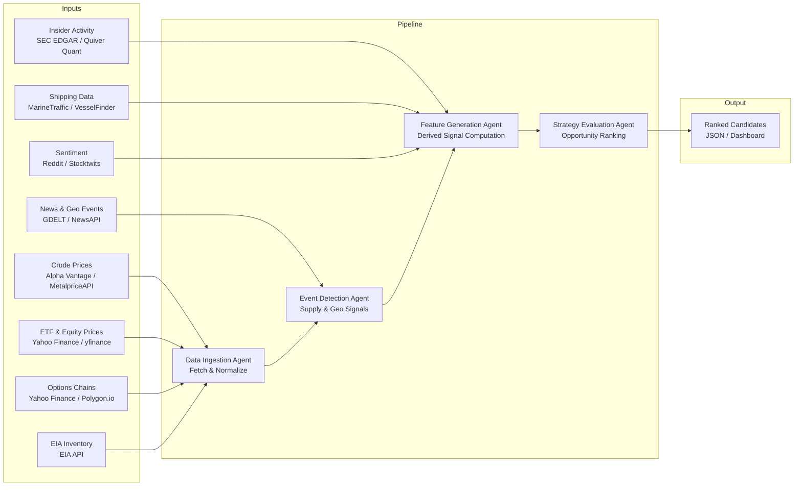
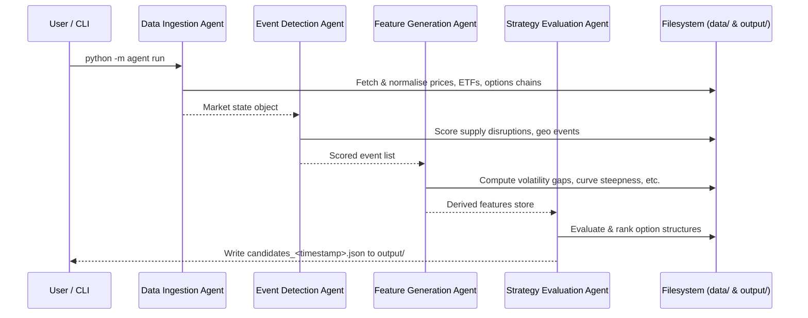

# Energy Options Opportunity Agent — User Guide

> **Version 1.0 · March 2026**
> This guide covers the full pipeline: setup, configuration, execution, output interpretation, and troubleshooting.

---

## Table of Contents

1. [Overview](#overview)
2. [Prerequisites](#prerequisites)
3. [Setup & Configuration](#setup--configuration)
4. [Running the Pipeline](#running-the-pipeline)
5. [Interpreting the Output](#interpreting-the-output)
6. [Troubleshooting](#troubleshooting)

---

## Overview

The **Energy Options Opportunity Agent** is an autonomous, modular Python pipeline that identifies options trading opportunities driven by oil market instability. It ingests market data, supply signals, news events, and alternative datasets to produce structured, ranked candidate options strategies.

The system is composed of four loosely coupled agents that communicate through a shared **market state object** and a **derived features store**. Data flows unidirectionally through the pipeline:



### The Four Agents

| Agent | Role | Key Responsibilities |
|---|---|---|
| **Data Ingestion Agent** | Fetch & Normalize | Pulls crude prices, ETF/equity data, and options chains; converts feeds into a unified market state object; stores historical data |
| **Event Detection Agent** | Supply & Geo Signals | Monitors news and geopolitical feeds; identifies supply disruptions, refinery outages, tanker chokepoints; assigns confidence/intensity scores |
| **Feature Generation Agent** | Derived Signal Computation | Computes volatility gaps, futures curve steepness, sector dispersion, insider conviction scores, narrative velocity, and supply shock probabilities |
| **Strategy Evaluation Agent** | Opportunity Ranking | Evaluates eligible option structures; generates ranked candidates with edge scores; includes contributing signals for explainability |

### In-Scope Instruments & Structures (MVP)

| Category | Items |
|---|---|
| **Futures** | Brent Crude, WTI (`CL=F`) |
| **ETFs** | USO, XLE |
| **Energy Equities** | Exxon Mobil (XOM), Chevron (CVX) |
| **Option Structures** | Long straddles, call/put spreads, calendar spreads |

> **Advisory only.** The system does not execute trades. All output is for informational and analytical purposes.

---

## Prerequisites

### System Requirements

| Requirement | Minimum |
|---|---|
| Python | 3.10 or later |
| OS | Linux, macOS, or Windows (WSL2 recommended) |
| RAM | 2 GB available |
| Disk | 10 GB free (for 6–12 months of historical data) |
| Deployment | Local hardware, single VM, or container |

### Required Tools

```bash
# Verify Python version
python --version   # expects 3.10+

# Verify pip
pip --version

# Optional: verify Docker if running containerised
docker --version
```

### API Accounts

You will need free-tier accounts for the following services. Register before proceeding.

| Service | Used By | Registration URL |
|---|---|---|
| Alpha Vantage | Crude prices | https://www.alphavantage.co/support/#api-key |
| Yahoo Finance / yfinance | ETF, equity, options data | No key required (public API) |
| Polygon.io *(optional)* | Options chains (enhanced) | https://polygon.io |
| EIA API | Inventory & refinery data | https://www.eia.gov/opendata/ |
| GDELT | News & geopolitical events | No key required (public dataset) |
| NewsAPI | News headlines | https://newsapi.org/register |
| SEC EDGAR | Insider activity | No key required (public) |
| Quiver Quant *(optional)* | Insider activity (enhanced) | https://www.quiverquant.com |
| MarineTraffic *(optional)* | Tanker / shipping data | https://www.marinetraffic.com |
| Reddit API | Retail sentiment | https://www.reddit.com/prefs/apps |
| Stocktwits *(optional)* | Retail sentiment | https://api.stocktwits.com |

---

## Setup & Configuration

### 1. Clone the Repository

```bash
git clone https://github.com/your-org/energy-options-agent.git
cd energy-options-agent
```

### 2. Create and Activate a Virtual Environment

```bash
python -m venv .venv

# macOS / Linux
source .venv/bin/activate

# Windows (PowerShell)
.venv\Scripts\Activate.ps1
```

### 3. Install Dependencies

```bash
pip install --upgrade pip
pip install -r requirements.txt
```

### 4. Configure Environment Variables

Copy the provided template and populate it with your credentials:

```bash
cp .env.example .env
```

Open `.env` in your editor and fill in each value. The full set of supported variables is described in the table below.

#### Environment Variable Reference

| Variable | Required | Default | Description |
|---|---|---|---|
| `ALPHA_VANTAGE_API_KEY` | Yes | — | API key for crude price feeds (WTI, Brent) |
| `POLYGON_API_KEY` | No | — | Polygon.io key for enhanced options chain data |
| `EIA_API_KEY` | Yes | — | EIA Open Data API key for inventory and refinery utilization |
| `NEWS_API_KEY` | Yes | — | NewsAPI key for energy headline ingestion |
| `REDDIT_CLIENT_ID` | No | — | Reddit OAuth client ID for sentiment feeds |
| `REDDIT_CLIENT_SECRET` | No | — | Reddit OAuth client secret |
| `REDDIT_USER_AGENT` | No | `energy-options-agent/1.0` | Reddit API user-agent string |
| `QUIVER_QUANT_API_KEY` | No | — | Quiver Quant key for enhanced insider activity data |
| `MARINE_TRAFFIC_API_KEY` | No | — | MarineTraffic key for tanker flow data |
| `STOCKTWITS_ACCESS_TOKEN` | No | — | Stocktwits access token for retail sentiment |
| `DATA_DIR` | Yes | `./data` | Root directory for raw and derived data storage |
| `OUTPUT_DIR` | Yes | `./output` | Directory where ranked candidate JSON files are written |
| `LOG_LEVEL` | No | `INFO` | Logging verbosity: `DEBUG`, `INFO`, `WARNING`, `ERROR` |
| `MARKET_DATA_INTERVAL_SECONDS` | No | `60` | Polling cadence for minute-level market data feeds |
| `EIA_REFRESH_SCHEDULE` | No | `weekly` | Refresh schedule for EIA data: `daily` or `weekly` |
| `HISTORICAL_RETENTION_DAYS` | No | `365` | Days of historical data to retain (180–365 recommended) |
| `MIN_EDGE_SCORE` | No | `0.30` | Minimum edge score threshold for a candidate to be emitted |
| `PIPELINE_PHASE` | No | `1` | Active MVP phase (1–3); controls which agents and signals are enabled |

#### Example `.env`

```dotenv
# --- Required ---
ALPHA_VANTAGE_API_KEY=YOUR_ALPHA_VANTAGE_KEY
EIA_API_KEY=YOUR_EIA_KEY
NEWS_API_KEY=YOUR_NEWS_API_KEY

# --- Data Storage ---
DATA_DIR=./data
OUTPUT_DIR=./output
HISTORICAL_RETENTION_DAYS=365

# --- Pipeline Behaviour ---
LOG_LEVEL=INFO
MARKET_DATA_INTERVAL_SECONDS=60
EIA_REFRESH_SCHEDULE=weekly
MIN_EDGE_SCORE=0.30
PIPELINE_PHASE=1

# --- Optional Enrichment ---
POLYGON_API_KEY=
REDDIT_CLIENT_ID=
REDDIT_CLIENT_SECRET=
REDDIT_USER_AGENT=energy-options-agent/1.0
QUIVER_QUANT_API_KEY=
MARINE_TRAFFIC_API_KEY=
STOCKTWITS_ACCESS_TOKEN=
```

> **Tip:** Variables left blank are gracefully skipped. The corresponding data source will be omitted and a warning will be logged; the pipeline will not fail.

### 5. Initialise the Data Directory

Run the initialisation script to create required subdirectories and validate your API credentials before the first full pipeline run:

```bash
python -m agent init
```

Expected output:

```
[INFO]  Creating data directories under ./data ...  OK
[INFO]  Creating output directory ./output ...      OK
[INFO]  Validating ALPHA_VANTAGE_API_KEY ...        OK
[INFO]  Validating EIA_API_KEY ...                  OK
[INFO]  Validating NEWS_API_KEY ...                 OK
[INFO]  Optional keys not configured: POLYGON_API_KEY, REDDIT_CLIENT_ID, MARINE_TRAFFIC_API_KEY
[INFO]  Initialisation complete. Run `python -m agent run` to start the pipeline.
```

---

## Running the Pipeline

### Pipeline Execution Flow



### Single Pipeline Run (One-Shot)

Execute the full four-agent pipeline once and write results to `OUTPUT_DIR`:

```bash
python -m agent run
```

### Continuous Mode

Run the pipeline on a recurring cadence (market data refreshes every `MARKET_DATA_INTERVAL_SECONDS`; slower feeds follow their own schedules):

```bash
python -m agent run --continuous
```

Press `Ctrl+C` to stop gracefully.

### Run a Single Agent

Each agent can be invoked independently for debugging or incremental development:

```bash
# Data Ingestion only
python -m agent run --agent ingestion

# Event Detection only (requires existing market state in DATA_DIR)
python -m agent run --agent events

# Feature Generation only
python -m agent run --agent features

# Strategy Evaluation only
python -m agent run --agent strategy
```

### Select a Pipeline Phase

Override the active phase without editing `.env`:

```bash
# Phase 1: Core market signals and options (default for MVP)
python -m agent run --phase 1

# Phase 2: Adds EIA supply/event augmentation
python -m agent run --phase 2

# Phase 3: Adds alternative signals (insider, shipping, sentiment)
python -m agent run --phase 3
```

| Phase | Name | What Is Active |
|---|---|---|
| 1 | Core Market Signals & Options | WTI/Brent prices, USO/XLE, options surface analysis, long straddles, call/put spreads |
| 2 | Supply & Event Augmentation | Phase 1 + EIA inventory, refinery utilization, GDELT/NewsAPI event detection, supply disruption indices |
| 3 | Alternative / Contextual Signals | Phase 2 + insider trades, narrative velocity, shipping data, cross-sector correlation |

### Useful Flags

| Flag | Description |
|---|---|
| `--phase <1|2|3>` | Override `PIPELINE_PHASE` from `.env` |
| `--agent <name>` | Run a single agent only |
| `--continuous` | Keep running on the configured cadence |
| `--output-dir <path>` | Override `OUTPUT_DIR` for this run |
| `--log-level <level>` | Override `LOG_LEVEL` for this run |
| `--dry-run` | Execute the pipeline without writing output files |

---

## Interpreting the Output

### Output Location

After each pipeline run, one or more JSON files are written to `OUTPUT_DIR` (default: `./output/`):

```
output/
└── candidates_2026-03-15T14:32:00Z.json
```

### Output Schema

Each file contains a JSON array of **strategy candidates**, one object per opportunity. Fields are defined below.

| Field | Type | Description |
|---|---|---|
| `instrument` | `string` | Target instrument, e.g. `"USO"`, `"XLE"`, `"CL=F"` |
| `structure` | `enum` | Options structure: `long_straddle` \| `call_spread` \| `put_spread` \| `calendar_spread` |
| `expiration` | `integer` (days) | Target expiration in calendar days from the evaluation date |
| `edge_score` | `float` [0.0–1.0] | Composite opportunity score — higher values indicate stronger signal confluence |
| `signals` | `object` | Map of contributing signals and their assessed levels |
| `generated_at` | ISO 8601 datetime | UTC timestamp of candidate generation |

### Example Output

```json
[
  {
    "instrument": "USO",
    "structure": "long_straddle",
    "expiration": 30,
    "edge_score": 0.47,
    "signals": {
      "tanker_disruption_index": "high",
      "volatility_gap": "positive",
      "narrative_velocity": "rising"
    },
    "generated_at": "2026-03-15T14:32:00Z"
  },
  {
    "instrument": "XOM",
    "structure": "call_spread",
    "expiration": 21,
    "edge_score": 0.38,
    "signals": {
      "volatility_gap": "positive",
      "supply_shock_probability": "elevated",
      "insider_conviction_score": "high"
    },
    "generated_at": "2026-03-15T14:32:00Z"
  }
]
```

### Reading the Edge Score

The `edge_score` is a composite float in the range `[0.0, 1.0]` that reflects the confluence of active signals for a given candidate.

| Edge Score Range | Interpretation |
|---|---|
| `0.00 – 0.29` | Weak signal; candidate suppressed by default (`MIN_EDGE_SCORE`) |
| `0.30 – 0.49` | Moderate confluence; worth monitoring |
| `0.50 – 0.69` | Strong confluence; primary candidates for further analysis |
| `0.70 – 1.00` | Very strong confluence; highest-priority candidates |

> **Note:** Edge score thresholds are heuristics for the MVP. Scoring functions are intentionally kept simple and will become more sophisticated in later iterations.

### Reading the