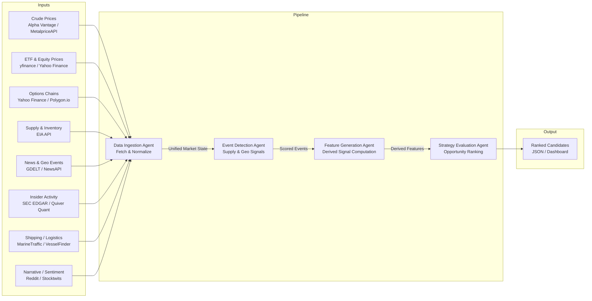
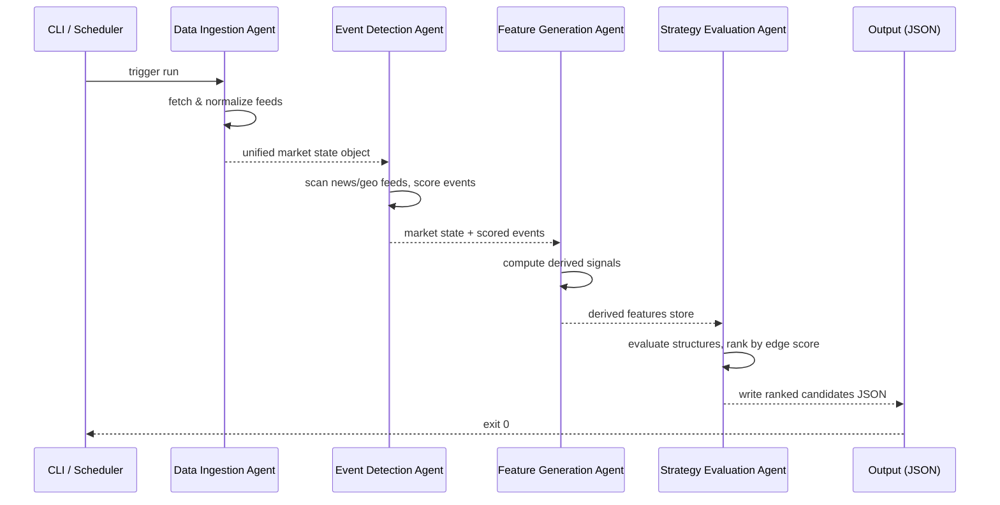

# Energy Options Opportunity Agent — User Guide

> **Version 1.0 • March 2026**
> This guide walks a developer through setting up, configuring, and running the full four-agent pipeline, and interpreting its output.

---

## Table of Contents

1. [Overview](#overview)
2. [Prerequisites](#prerequisites)
3. [Setup & Configuration](#setup--configuration)
4. [Running the Pipeline](#running-the-pipeline)
5. [Interpreting the Output](#interpreting-the-output)
6. [Troubleshooting](#troubleshooting)

---

## Overview

The **Energy Options Opportunity Agent** is an autonomous, modular Python pipeline that identifies options trading opportunities driven by oil market instability. It ingests market data, supply signals, news events, and alternative datasets, then produces structured, ranked candidate options strategies with full explainability.

### What the pipeline does



### Four-agent summary

| Agent | Role | Key outputs |
|---|---|---|
| **Data Ingestion Agent** | Fetch & Normalize | Unified market state object; historical data store |
| **Event Detection Agent** | Supply & Geo Signals | Confidence/intensity-scored event records |
| **Feature Generation Agent** | Derived Signal Computation | Volatility gaps, curve steepness, supply shock probability, etc. |
| **Strategy Evaluation Agent** | Opportunity Ranking | Ranked candidates with edge scores and signal references |

Data flows **unidirectionally**: raw feeds → events → features → strategies. No agent writes back upstream.

### In-scope instruments (MVP)

| Category | Instruments |
|---|---|
| Crude futures | Brent Crude, WTI (`CL=F`) |
| ETFs | USO, XLE |
| Energy equities | XOM (Exxon Mobil), CVX (Chevron) |

### In-scope option structures (MVP)

`long_straddle` · `call_spread` · `put_spread` · `calendar_spread`

> **Advisory only.** The system produces ranked recommendations. No automated trade execution occurs in the MVP.

---

## Prerequisites

### System requirements

| Requirement | Minimum | Notes |
|---|---|---|
| Python | 3.11+ | Earlier 3.x versions are untested |
| RAM | 2 GB | 4 GB recommended for local historical storage |
| Disk | 5 GB free | 6–12 months of raw + derived data |
| OS | Linux, macOS, or Windows (WSL2) | Single VM or container is sufficient |
| Network | Outbound HTTPS on port 443 | All data sources are REST/HTTP |

### External API accounts

You need free (or free-tier) accounts for each data source you intend to activate. Phase 1 is the minimum viable set.

| Phase | Source | Sign-up URL | Cost |
|---|---|---|---|
| 1 | Alpha Vantage | https://www.alphavantage.co/support/#api-key | Free |
| 1 | Yahoo Finance (`yfinance`) | No key required | Free |
| 1 | Polygon.io | https://polygon.io/dashboard/signup | Free tier |
| 2 | EIA API | https://www.eia.gov/opendata/register.php | Free |
| 2 | NewsAPI | https://newsapi.org/register | Free tier |
| 2 | GDELT | No key required | Free |
| 3 | SEC EDGAR | No key required | Free |
| 3 | Quiver Quant | https://www.quiverquant.com/quiverapi/ | Free/limited |
| 3 | MarineTraffic | https://www.marinetraffic.com/en/p/api-services | Free tier |
| 3 | Reddit API | https://www.reddit.com/prefs/apps | Free |
| 3 | Stocktwits | https://api.stocktwits.com/developers/docs | Free |

### Python dependencies

```bash
pip install -r requirements.txt
```

Core packages expected in `requirements.txt`:

```text
yfinance>=0.2
requests>=2.31
pandas>=2.1
numpy>=1.26
pydantic>=2.5
python-dotenv>=1.0
schedule>=1.2
```

---

## Setup & Configuration

### 1. Clone the repository

```bash
git clone https://github.com/your-org/energy-options-agent.git
cd energy-options-agent
```

### 2. Create and activate a virtual environment

```bash
python -m venv .venv
source .venv/bin/activate        # Linux / macOS
# .venv\Scripts\activate.bat     # Windows CMD
# .venv\Scripts\Activate.ps1     # Windows PowerShell
```

### 3. Install dependencies

```bash
pip install --upgrade pip
pip install -r requirements.txt
```

### 4. Create the environment file

Copy the provided template and populate your API keys:

```bash
cp .env.example .env
```

Then open `.env` in your editor and fill in each value (see the full variable reference below).

### Environment variable reference

All configuration is read from `.env` at startup via `python-dotenv`. No secrets should be hard-coded.

#### Data source credentials

| Variable | Required phase | Description | Example |
|---|---|---|---|
| `ALPHA_VANTAGE_API_KEY` | 1 | API key for Alpha Vantage crude price feed | `ABCDE12345` |
| `POLYGON_API_KEY` | 1 | API key for Polygon.io options chain data | `xyz_abc123` |
| `EIA_API_KEY` | 2 | API key for U.S. EIA inventory data | `a1b2c3d4e5f6` |
| `NEWSAPI_KEY` | 2 | API key for NewsAPI headline feed | `abc123def456` |
| `QUIVER_API_KEY` | 3 | API key for Quiver Quant insider data | `qv_xxx` |
| `MARINE_TRAFFIC_API_KEY` | 3 | API key for MarineTraffic/VesselFinder | `mt_xxx` |
| `REDDIT_CLIENT_ID` | 3 | Reddit OAuth app client ID | `AbCdEfGhIj` |
| `REDDIT_CLIENT_SECRET` | 3 | Reddit OAuth app client secret | `secret_xxx` |
| `STOCKTWITS_TOKEN` | 3 | Stocktwits bearer token (if required) | `st_xxx` |

#### Pipeline behaviour

| Variable | Default | Description |
|---|---|---|
| `PIPELINE_PHASE` | `1` | Active phase (`1`–`4`). Controls which agents and feeds are enabled. |
| `MARKET_DATA_INTERVAL_MINUTES` | `5` | How often the Data Ingestion Agent polls minute-level feeds |
| `SLOW_FEED_INTERVAL_HOURS` | `24` | Poll cadence for daily/weekly feeds (EIA, EDGAR) |
| `OUTPUT_PATH` | `./output/candidates.json` | File path for JSON output of ranked candidates |
| `LOG_LEVEL` | `INFO` | Python logging level: `DEBUG`, `INFO`, `WARNING`, `ERROR` |

#### Data retention

| Variable | Default | Description |
|---|---|---|
| `HISTORY_RETENTION_DAYS` | `365` | Days of raw and derived data to retain on disk (180–365 recommended) |
| `DATA_STORE_PATH` | `./data/` | Root directory for local historical data storage |

#### Strategy evaluation

| Variable | Default | Description |
|---|---|---|
| `EDGE_SCORE_MIN_THRESHOLD` | `0.30` | Candidates with an edge score below this value are suppressed from output |
| `MAX_CANDIDATES_RETURNED` | `20` | Maximum number of ranked candidates written per run |
| `TARGET_EXPIRATION_DAYS` | `30` | Default target expiration (calendar days) passed to the Strategy Evaluation Agent |

#### Example `.env` file (Phase 1 minimum)

```dotenv
# --- Data Sources ---
ALPHA_VANTAGE_API_KEY=YOUR_KEY_HERE
POLYGON_API_KEY=YOUR_KEY_HERE

# --- Pipeline ---
PIPELINE_PHASE=1
MARKET_DATA_INTERVAL_MINUTES=5
SLOW_FEED_INTERVAL_HOURS=24
OUTPUT_PATH=./output/candidates.json
LOG_LEVEL=INFO

# --- Retention ---
HISTORY_RETENTION_DAYS=365
DATA_STORE_PATH=./data/

# --- Strategy ---
EDGE_SCORE_MIN_THRESHOLD=0.30
MAX_CANDIDATES_RETURNED=20
TARGET_EXPIRATION_DAYS=30
```

### 5. Initialise the data store

This creates the required directory structure and, if run for the first time, performs an initial historical backfill:

```bash
python -m agent.cli init
```

Expected output:

```
[INFO] Data store initialised at ./data/
[INFO] Backfilling historical data for instruments: CL=F, BZ=F, USO, XLE, XOM, CVX
[INFO] Backfill complete. 365 days stored.
```

---

## Running the Pipeline

### Pipeline execution model



### Single run (on demand)

Run the full pipeline once and write output to `OUTPUT_PATH`:

```bash
python -m agent.cli run
```

To override the output path for this run only:

```bash
python -m agent.cli run --output ./output/my_run.json
```

To run only specific agents (useful for debugging):

```bash
python -m agent.cli run --agents ingestion feature_generation
```

### Continuous mode (scheduled)

Start the pipeline in scheduler mode. Market data feeds refresh every `MARKET_DATA_INTERVAL_MINUTES`; slow feeds (EIA, EDGAR) refresh on `SLOW_FEED_INTERVAL_HOURS`:

```bash
python -m agent.cli start
```

Stop the scheduler:

```bash
python -m agent.cli stop
```

### Running individual agents

Each agent can be invoked independently for testing or incremental development:

```bash
# Data Ingestion Agent only
python -m agent.ingestion.run

# Event Detection Agent only
python -m agent.event_detection.run

# Feature Generation Agent only
python -m agent.feature_generation.run

# Strategy Evaluation Agent only
python -m agent.strategy_evaluation.run
```

> **Note:** Agents after Data Ingestion read from the shared data store. Run agents in order if the data store is stale.

### Running with Docker

A single-container deployment is supported:

```bash
# Build the image
docker build -t energy-options-agent:latest .

# Run once
docker run --rm \
  --env-file .env \
  -v "$(pwd)/data:/app/data" \
  -v "$(pwd)/output:/app/output" \
  energy-options-agent:latest run

# Run in continuous mode
docker run -d \
  --name energy-agent \
  --env-file .env \
  -v "$(pwd)/data:/app/data" \
  -v "$(pwd)/output:/app/output" \
  energy-options-agent:latest start
```

### Phase activation

Set `PIPELINE_PHASE` in `.env` to control which signals are active:

| `PIPELINE_PHASE` | Active capabilities |
|---|---|
| `1` | Crude benchmarks, USO/XLE prices, options surface analysis, long straddles, call/put spreads |
| `2` | Phase 1 + EIA inventory, refinery utilisation, GDELT/NewsAPI event detection, supply disruption indices |
| `3` | Phase 2 + insider trades, narrative velocity (Reddit/Stocktwits), shipping data, cross-sector correlation |
| `4` | Phase 3 + OPIS pricing, exotic structures, execution integration (when available) |

---

## Interpreting the Output

### Output file

The pipeline writes to `OUTPUT_PATH` (default `./output/candidates.json`). The file contains a JSON array of ranked candidate objects, ordered by `edge_score` descending.

### Candidate schema

| Field | Type | Description |
|---|---|---|
| `instrument` | string | Target instrument, e.g. `USO`, `XLE`, `CL=F` |
| `structure` | enum string | `long_straddle` · `call_spread` · `put_spread` · `calendar_spread` |
| `expiration` | integer (days) | Target expiration in calendar days from evaluation date |
| `edge_score` | float [0.0–1.0] | Composite opportunity score; higher = stronger signal confluence |
| `signals` | object | Map of contributing signals and their qualitative state |
| `generated_at` | ISO 8601 datetime | UTC timestamp of candidate generation |

### Example output

```json
[
  {
    "instrument": "USO",
    "structure": "long_straddle",
    "expiration": 30,
    "edge_score": 0.47,
    "signals": {
      "tanker_disruption_index": "high",
      "volatility_gap": "positive",
      "narrative_velocity": "rising"
    },
    "generated_at": "2026-03-15T14:32:00Z"
  },
  {
    "instrument": "XLE",
    "structure": "call_spread",
    "expiration": 21,
    "edge_score": 0.38,
    "signals": {
      "volatility_gap": "positive",
      "supply_shock_probability": "elevated",
      "sector_dispersion": "high"
    },
    "generated_at": "2026-03-15T14:32:00Z"
  }
]
```

### Signal reference

The `signals` object keys map to the following derived features:

| Signal key | Source agent | What it measures |
|---|---|---|
| `volatility_gap` | Feature Generation | Realized vs. implied volatility spread; `positive` = IV underpricing realized vol |
| `futures_curve_steepness` | Feature Generation | Contango or backwardation in the crude futures curve |
| `sector_dispersion` | Feature Generation | Price divergence across energy equities; elevated = potential dislocation |
| `insider_conviction_score` | Feature Generation | Aggregated insider trade signal from EDGAR/Qu