# Energy Options Opportunity Agent — User Guide

> **Version 1.0 • March 2026**
> Advisory only. The system surfaces ranked options opportunities; it does **not** place trades automatically.

---

## Table of Contents

1. [Overview](#overview)
2. [Prerequisites](#prerequisites)
3. [Setup & Configuration](#setup--configuration)
4. [Running the Pipeline](#running-the-pipeline)
5. [Interpreting the Output](#interpreting-the-output)
6. [Troubleshooting](#troubleshooting)

---

## Overview

The **Energy Options Opportunity Agent** is a modular Python pipeline that identifies options trading opportunities driven by oil-market instability. It ingests market data, supply signals, news events, and alternative datasets, then produces a structured, ranked list of candidate options strategies.

The pipeline is composed of four loosely coupled agents that execute in sequence:

```mermaid
flowchart LR
    A([Raw Feeds]) --> B[Data Ingestion Agent\nFetch & Normalize]
    B -->|Market State Object| C[Event Detection Agent\nSupply & Geo Signals]
    C -->|Scored Events| D[Feature Generation Agent\nDerived Signal Computation]
    D -->|Feature Store| E[Strategy Evaluation Agent\nOpportunity Ranking]
    E --> F([JSON Output\nRanked Candidates])

    style A fill:#f5f5f5,stroke:#999
    style F fill:#f5f5f5,stroke:#999
    style B fill:#dbeafe,stroke:#3b82f6
    style C fill:#fef9c3,stroke:#ca8a04
    style D fill:#dcfce7,stroke:#16a34a
    style E fill:#fce7f3,stroke:#db2777
```



| Agent | Role | Key Output |
|---|---|---|
| **Data Ingestion Agent** | Fetch & normalize prices, ETF/equity data, and options chains | Unified market state object |
| **Event Detection Agent** | Monitor news and geopolitical feeds; score supply disruptions | Confidence- and intensity-scored event list |
| **Feature Generation Agent** | Compute volatility gaps, curve steepness, narrative velocity, etc. | Derived features store |
| **Strategy Evaluation Agent** | Evaluate eligible structures; rank by edge score | JSON array of ranked strategy candidates |

Data flows **unidirectionally** through the agents. Each agent can be deployed and updated independently without disrupting the rest of the pipeline.

### In-Scope Instruments (MVP)

| Category | Instruments |
|---|---|
| Crude futures | Brent Crude, WTI (`CL=F`) |
| ETFs | USO, XLE |
| Energy equities | Exxon Mobil (XOM), Chevron (CVX) |

### In-Scope Option Structures (MVP)

- Long straddles
- Call / put spreads
- Calendar spreads

---

## Prerequisites

### System Requirements

| Requirement | Minimum |
|---|---|
| Python | 3.10 or later |
| OS | Linux, macOS, or Windows (WSL2 recommended) |
| RAM | 2 GB |
| Disk | 10 GB free (for 6–12 months of historical data) |
| Network | Outbound HTTPS access to data provider endpoints |

### Required Tools

```bash
# Verify Python version
python --version   # must be >= 3.10

# Verify pip
pip --version

# (Recommended) Verify that venv is available
python -m venv --help
```

### API Keys & Accounts

You must obtain credentials for the following services before running the pipeline. All tiers listed are **free or low-cost**.

| Service | Used By | Sign-Up URL | Notes |
|---|---|---|---|
| Alpha Vantage | Crude prices (WTI, Brent) | <https://www.alphavantage.co/support/#api-key> | Free tier; rate-limited |
| Yahoo Finance / yfinance | ETF & equity prices, options chains | No key required | Public API |
| Polygon.io | Options data (fallback) | <https://polygon.io/> | Free tier available |
| EIA API | Supply & inventory data | <https://www.eia.gov/opendata/> | Free; weekly cadence |
| NewsAPI | News & geopolitical events | <https://newsapi.org/register> | Free developer tier |
| GDELT | Geopolitical events | No key required | Public dataset |
| SEC EDGAR | Insider activity | No key required | Public API |
| Quiver Quant | Insider conviction scores | <https://www.quiverquant.com/> | Free/limited tier |
| Reddit API | Narrative / sentiment | <https://www.reddit.com/prefs/apps> | Free; OAuth2 app required |
| Stocktwits | Narrative / sentiment | <https://api.stocktwits.com/> | Free public stream |
| MarineTraffic | Shipping / tanker flows | <https://www.marinetraffic.com/> | Free tier available |

> **Tip:** For the MVP (Phase 1), only **Alpha Vantage**, **yfinance**, and optionally **Polygon.io** are strictly required. Additional keys unlock Phase 2 and Phase 3 signals.

---

## Setup & Configuration

### 1. Clone the Repository

```bash
git clone https://github.com/your-org/energy-options-agent.git
cd energy-options-agent
```

### 2. Create and Activate a Virtual Environment

```bash
python -m venv .venv

# Linux / macOS
source .venv/bin/activate

# Windows (PowerShell)
.venv\Scripts\Activate.ps1
```

### 3. Install Dependencies

```bash
pip install --upgrade pip
pip install -r requirements.txt
```

### 4. Configure Environment Variables

Copy the provided template and populate it with your credentials:

```bash
cp .env.example .env
```

Open `.env` in your editor and fill in the values described in the table below.

#### Environment Variable Reference

| Variable | Required | Default | Description |
|---|---|---|---|
| `ALPHA_VANTAGE_API_KEY` | ✅ Phase 1 | — | API key for Alpha Vantage crude price feed |
| `POLYGON_API_KEY` | Optional | — | API key for Polygon.io options data fallback |
| `EIA_API_KEY` | ✅ Phase 2 | — | API key for EIA supply & inventory feed |
| `NEWS_API_KEY` | ✅ Phase 2 | — | API key for NewsAPI geopolitical/news feed |
| `QUIVER_QUANT_API_KEY` | Optional | — | API key for Quiver Quant insider data |
| `REDDIT_CLIENT_ID` | ✅ Phase 3 | — | Reddit OAuth2 application client ID |
| `REDDIT_CLIENT_SECRET` | ✅ Phase 3 | — | Reddit OAuth2 application client secret |
| `REDDIT_USER_AGENT` | ✅ Phase 3 | `energy-agent/1.0` | Reddit API user-agent string |
| `MARINETRAFFIC_API_KEY` | Optional | — | API key for MarineTraffic shipping feed |
| `DATA_REFRESH_INTERVAL_MINUTES` | No | `5` | Polling interval for market data feeds (minutes cadence) |
| `HISTORY_RETENTION_DAYS` | No | `365` | Days of historical data to retain for backtesting |
| `OUTPUT_DIR` | No | `./output` | Directory where JSON output files are written |
| `LOG_LEVEL` | No | `INFO` | Logging verbosity (`DEBUG`, `INFO`, `WARNING`, `ERROR`) |
| `PHASE` | No | `1` | Active pipeline phase (`1`–`3`); controls which agents and signals are enabled |

Example `.env` for a Phase 1 run:

```dotenv
# === Phase 1 — Core Market Signals ===
ALPHA_VANTAGE_API_KEY=your_alpha_vantage_key_here
POLYGON_API_KEY=                        # optional fallback
EIA_API_KEY=                            # required for Phase 2+
NEWS_API_KEY=                           # required for Phase 2+

PHASE=1
DATA_REFRESH_INTERVAL_MINUTES=5
HISTORY_RETENTION_DAYS=365
OUTPUT_DIR=./output
LOG_LEVEL=INFO
```

> **Security note:** Never commit `.env` to version control. The repository's `.gitignore` excludes it by default.

### 5. Initialise the Database

The pipeline stores historical raw and derived data locally (sized for 6–12 months of history):

```bash
python manage.py init-db
```

Expected output:

```
[INFO] Initialising database at ./data/market_state.db ...
[INFO] Schema applied. Historical data retention set to 365 days.
[INFO] Done.
```

---

## Running the Pipeline

### Pipeline Execution Flow

```mermaid
sequenceDiagram
    participant CLI as User / Scheduler
    participant DIA as Data Ingestion Agent
    participant EDA as Event Detection Agent
    participant FGA as Feature Generation Agent
    participant SEA as Strategy Evaluation Agent
    participant FS as File System (JSON Output)

    CLI->>DIA: python run_pipeline.py --phase 1
    DIA->>DIA: Fetch crude, ETF/equity prices & options chains
    DIA->>EDA: market_state object
    EDA->>EDA: Score news / geo events (confidence + intensity)
    EDA->>FGA: scored_events + market_state
    FGA->>FGA: Compute volatility gaps, curve steepness, etc.
    FGA->>SEA: derived_features store
    SEA->>SEA: Evaluate structures; rank by edge_score
    SEA->>FS: Write ranked_candidates_<timestamp>.json
    FS-->>CLI: Pipeline complete ✓
```

### Single Run

Execute one full pass of the pipeline:

```bash
python run_pipeline.py
```

To override the active phase without editing `.env`:

```bash
python run_pipeline.py --phase 2
```

To specify a custom output directory for this run:

```bash
python run_pipeline.py --output-dir /tmp/pipeline-out
```

### Continuous (Polling) Mode

Run the pipeline on the configured `DATA_REFRESH_INTERVAL_MINUTES` cadence:

```bash
python run_pipeline.py --continuous
```

Press `Ctrl+C` to stop. The pipeline will finish the current cycle before exiting cleanly.

### Running Individual Agents

Each agent can be executed independently for development or debugging:

```bash
# Data Ingestion only
python -m agents.data_ingestion

# Event Detection only (requires a saved market state)
python -m agents.event_detection --state ./output/market_state_latest.json

# Feature Generation only
python -m agents.feature_generation --state ./output/market_state_latest.json

# Strategy Evaluation only
python -m agents.strategy_evaluation --features ./output/features_latest.json
```

### Phase-by-Phase Feature Availability

| Phase | Name | Signals Enabled | Additional Keys Needed |
|---|---|---|---|
| 1 | Core Market Signals & Options | Crude prices, ETF/equity prices, IV surface, long straddles, call/put spreads | `ALPHA_VANTAGE_API_KEY` |
| 2 | Supply & Event Augmentation | + EIA inventory, refinery utilisation, GDELT/NewsAPI event detection, supply disruption indices | `EIA_API_KEY`, `NEWS_API_KEY` |
| 3 | Alternative / Contextual Signals | + Insider trades, narrative velocity (Reddit/Stocktwits), shipping data, cross-sector correlation | `REDDIT_CLIENT_ID/SECRET`, optionally `QUIVER_QUANT_API_KEY`, `MARINETRAFFIC_API_KEY` |

---

## Interpreting the Output

### Output File Location

After each pipeline run, a timestamped JSON file is written to `OUTPUT_DIR`:

```
./output/ranked_candidates_2026-03-15T14:32:00Z.json
```

A symlink `ranked_candidates_latest.json` always points to the most recent file.

### Output Schema

Each element in the output array represents one ranked strategy candidate:

| Field | Type | Description |
|---|---|---|
| `instrument` | `string` | Target instrument, e.g. `"USO"`, `"XLE"`, `"CL=F"` |
| `structure` | `enum` | Options structure: `long_straddle` \| `call_spread` \| `put_spread` \| `calendar_spread` |
| `expiration` | `integer` (days) | Target expiration in calendar days from the evaluation date |
| `edge_score` | `float` [0.0–1.0] | Composite opportunity score; **higher = stronger signal confluence** |
| `signals` | `object` | Map of contributing signals and their qualitative values |
| `generated_at` | ISO 8601 datetime | UTC timestamp of candidate generation |

### Example Output

```json
[
  {
    "instrument": "USO",
    "structure": "long_straddle",
    "expiration": 30,
    "edge_score": 0.47,
    "signals": {
      "tanker_disruption_index": "high",
      "volatility_gap": "positive",
      "narrative_velocity": "rising"
    },
    "generated_at": "2026-03-15T14:32:00Z"
  },
  {
    "instrument": "XOM",
    "structure": "call_spread",
    "expiration": 45,
    "edge_score": 0.31,
    "signals": {
      "volatility_gap": "positive",
      "supply_shock_probability": "elevated",
      "sector_dispersion": "high"
    },
    "generated_at": "2026-03-15T14:32:00Z"
  }
]
```

### Reading the Edge Score

| Edge Score Range | Interpretation | Suggested Action |
|---|---|---|
| 0.70 – 1.00 | Strong signal confluence | High-priority candidate; review signals carefully |
| 0.40 – 0.69 | Moderate confluence | Candidate worth monitoring; validate with additional research |
| 0.10 – 0.39 | Weak confluence | Low-conviction signal; treat as background noise unless a specific thesis supports it |
| 0.00 – 0.09 | Negligible | Discard |

> **Important:** The edge score is a heuristic composite, not a probability of profit. Always perform independent due diligence before placing any trade. The system is **advisory only**.

### Signal Reference

| Signal Key | Description | Source Agent |
|---|---|---|
| `volatility_gap` | Realised vs. implied volatility divergence | Feature Generation |
| `futures_curve_steepness` | Contango / backwardation gradient | Feature Generation |
| `sector_dispersion` | Spread between energy sub-sector moves | Feature Generation |
| `insider_conviction_score` | Aggregated insider trading signal | Feature Generation |
| `narrative_velocity` | Acceleration of energy-related headlines | Feature Generation |
| `supply_shock_probability` | Modelled probability of a supply disruption | Feature Generation |
| `tanker_disruption_index` | Shipping-flow anomaly score | Event Detection |
| `refinery_outage_score` | Refinery utilisation deviation | Event Detection |
| `geopolitical_intensity` | Geo-event confidence × intensity product | Event Detection |

### Visualisation

The JSON output is compatible with **thinkorswim** or any JSON-capable dashboard. To load the latest candidates directly:

```bash
cat ./output/ranked_candidates_latest.json | python -m json.tool
```

---

## Troubleshooting

### Common Issues

| Symptom | Likely Cause | Resolution |
|---|---|---|
| `KeyError: 'ALPHA_VANTAGE_API_KEY'` | `.env` not loaded or variable missing | Confirm `.env` exists in project root and contains the key; verify `python-dotenv` is installed |
| `RateLimitError` from Alpha Vantage | Free-tier rate limit exceeded | Increase `DATA_REFRESH_INTERVAL_MINUTES`; consider caching raw responses |
| Empty `ranked_candidates_*.json` | No candidates exceeded the minimum threshold | Check `LOG_LEVEL=DEBUG` output; verify market data was fetched